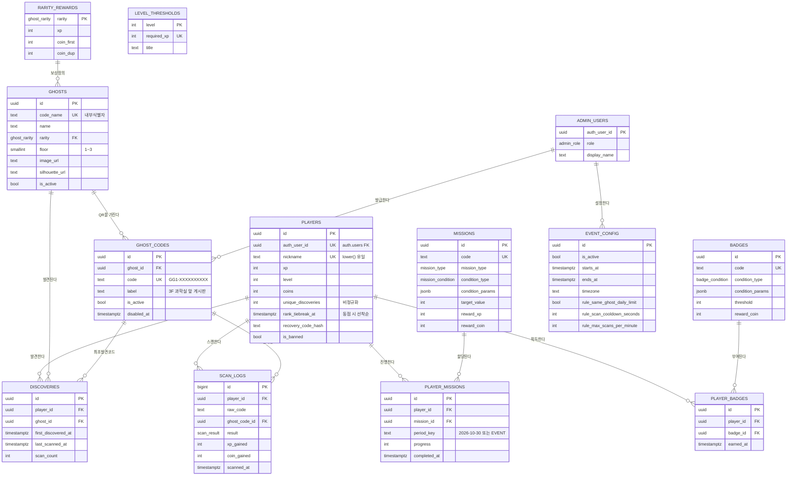

# 「고스트 GO」 기획 · 설계 문서

> ## ⛔ 먼저 읽으세요 — 이 문서는 일부가 무효화되었습니다
>
> 사용자 확정 답변(**행사 3일 · 500명 · 1~3층 · 마누스 에이전트 · Firebase 무료**)에 따라
> **`GHOST_GO_확정사항_v2_Firebase.md`** 가 상위 정본이 되었습니다.
>
> - **PART 3(데이터베이스) 전체**와 **PART 4 §1~3(기술 스택)** 은 **폐기**되었습니다.
>   Supabase/PostgreSQL 기준으로 작성되어 Firebase에 적용할 수 없습니다.
> - PART 1(기획) · PART 2(UX/화면) · PART 5(리스크) · PART 6(로드맵)은 유효합니다.
> - 우선순위: **v2 문서 > PART 0 > PART 1~6**


> 학교 건물 내부에서 진행하는 할로윈 이벤트용 QR 유령 수집 모바일 웹게임

| 항목 | 내용 |
|---|---|
| 문서 버전 | v1.0 (설계 확정 전 검토본) |
| 작성 방식 | 설계 6축 병렬 작성 → 적대적 레드팀 3렌즈 검증 → 완결성 크리틱 |
| 검증 규모 | 에이전트 10개 · 43분 · 서브에이전트 토큰 1,138,547 · 실패 0건 |
| 검증 결과 | 레드팀 지적 66건 (치명 15) · 축 간 모순 23건 · 누락 20건 |
| 개발 환경 | Node.js v24.20.0 · npm 11.19.0 · Git 2.55.0 (확인 완료) |
| 상태 | **PHASE 1 착수 전. 아래 "먼저 답이 필요한 5가지"에 답이 필요합니다.** |

---

## 이 문서를 읽는 법

이 문서는 6개 설계 축을 **서로 모르는 상태에서 독립적으로** 작성한 뒤, 충돌하는 지점을 적대적으로 찾아내는 방식으로 만들어졌습니다.
그 결과 축 사이에서 실제 모순이 다수 발견되었고, PART 0에 각 모순의 **확정 결론**을 정리했습니다.

> **[중요] 우선순위 규칙 — PART 1~6 본문과 PART 0의 결정이 충돌하면 언제나 PART 0이 정본입니다.**
> 본문은 각 축의 원본 설계 근거를 보존하기 위해 수정하지 않고 그대로 실었습니다.
> 구현 시에는 반드시 PART 0의 확정값을 따르십시오.

### 요청하신 10개 항목 매핑

| # | 요청 항목 | 수록 위치 |
|---|---|---|
| 1 | 전체 게임 기획 요약 | PART 1 |
| 2 | 사용자 UX Flow | PART 2 · 1절 |
| 3 | 전체 화면 목록 | PART 2 · 2절 |
| 4 | 각 화면의 UI 구성 | PART 2 · 3절 |
| 5 | 데이터베이스 ERD | PART 3 · 1~2절 |
| 6 | 기술 스택 | PART 4 · 1~3절 |
| 7 | 프로젝트 폴더 구조 | PART 4 · 4절 |
| 8 | MVP 개발 순서 | PART 6 |
| 9 | 예상되는 기술적 문제 | PART 5 |
| 10 | 해결 방법 | PART 5 (각 문제 항목 내 대응책) |

---

# PART 0. 확정 결정과 검증 결과 (정본)

## 0-1. 먼저 답이 필요한 5가지

아래 항목은 **답에 따라 설계가 크게 달라지므로** PHASE 1 착수 전에 확정되어야 합니다.

### Q1

행사 기간과 시간대가 정확히 어떻게 됩니까? 며칠간, 하루 몇 시부터 몇 시까지이며, 그 시간이 정규 수업 중(쉬는 시간·점심시간만 활용)인지 전교 행사로 수업이 없는 시간인지. — 문서가 3일(gamedesign: 등급 순차 해금, 일일 미션 5종×3일=1,200XP, 개근 배지, Mythic Day3 12:20~13:20 60분), 2일(db seed 10/30 09:00~10/31 17:00), 1일(roadmap 행사일 10/30 금)로 각각 다르게 전제하고 있습니다. 1일이면 일일 미션 3배 계산·LOGIN_DAY_COUNT 배지·등급 순차 해금·Mythic 시간 게이트가 전부 무효가 되어 XP 커브(Lv.20 도달 경로)와 미션 12종을 재설계해야 하고, 3일이면 관리자 화면에 일자별 활성 구간 편집 UI가 필수가 됩니다. 또 수업 중이라면 gamedesign의 '점심시간 세션 50분에 8~12종' 전제와 세션 길이 설계 전체가 바뀝니다.

### Q2

예상 참가 인원과 대상 학년(학교급)은 어떻게 됩니까? — db는 150명, risk는 200명을 가정하고 나머지 축은 명시가 없습니다. 인원은 (a) 학교 AP 동시접속 한계 및 시차 출발 그룹 수 (b) QR 카드 부착 장수와 대기열 병목(ux가 20명 대기 기준으로 연출 4.2초를 산출) (c) Supabase 무료 티어 유지 여부 (d) 대여 단말·보조배터리 수량을 전부 결정합니다. 학교급은 더 결정적입니다 — 초등이면 만 14세 미만 법정대리인 동의 요건(risk P-29가 '법률 자문 필요'로 남긴 항목), 연출 공포도 상한, 닉네임 정책, 스마트폰 소지율(2인 1조 비중), 개인정보 고지 문안이 모두 달라지고, 고등이면 risk P-21(DevTools XP 조작)·P-13(URL 추측)의 발생 확률이 '가능성'에서 '확정'으로 올라가 부정행위 방어 우선순위가 재조정됩니다.

### Q3

실제 학교 건물이 몇 층이며, 유령을 배치할 수 있는 구역과 행사 중 개방되는 구역은 어디입니까? — 현재 전 축이 '1~3층, 각 층 복도·특별실 앞' 가상 건물을 전제하고 db는 `ghosts.floor`에 `check (floor between 1 and 3)`을 하드코딩했습니다. 층이 4~5층이거나 별관이 있으면 이 check 제약, 층별 배치(1층 6 / 2층 7 / 3층 7), 배지 BDG_002~004(층 완주), 미션 MSN_E05(3층 6종), 힌트 상점의 '층 힌트' 상품이 전부 다시 계산돼야 합니다. 함께 확인 필요: 급식실·체육관·도서관·과학실·음악실·미술실·방송실이 실제로 있는지(gamedesign 20종 중 12종이 이 공간 이름에 의존), 옥상 계단 접근 가능 여부(GHOST_020 배치), 그리고 벽면 부착 승인 범위(risk P-12의 도색·벽지 훼손 클레임).

### Q4

개발 인력이 몇 명이고 주당 몇 시간을 쓸 수 있습니까? 그리고 유령 아트 20종은 누가, 언제까지, 어떤 도구로 만듭니까? — roadmap이 1인(주 20h, 총 170h)과 3인(주 60h, 총 480h) 두 시나리오를 병렬로 제시한 채 끝나 있어 컷 라인을 발동할 수 없습니다. 1인이면 배지·미션·관리자 UI 전반이 컷되고 힌트 상점(gamedesign이 MVP 필수로 확정)도 살아남지 못하므로, '코인 소비처 없음' 문제를 기획 단계에서 다시 풀어야 합니다. 아트는 D-19(10/11) 최종 입고가 크리티컬 패스로 지정돼 있는데 담당자가 지정되지 않았고, gamedesign 3-4가 확정한 'AI 생성 + 5단계 후처리' 파이프라인의 생성 도구도 미지정입니다(해당 서비스 이용약관의 배포 허용 여부가 '검증 필요'로 남아 3-3의 법적 안전선 주장과 직결). 20종 기준 예상 10~16시간이 누구의 시간에서 나오는지 확정이 필요합니다.

### Q5

예산 상한이 얼마이며, 그에 딸린 결정 3가지에 답할 수 있습니까? — (a) 커스텀 도메인: stack이 '필수(확정)'로 못 박았고 근거(인쇄물 불변성, QR 모듈 수, 학교망 *.vercel.app 차단 위험)도 명확하지만 도메인 구매비와 등록 주체가 미정입니다. 학교 공식 서브도메인(`ghostgo.학교도메인`)을 쓸 수 있으면 비용 0 + 차단 위험 0이므로 이 가능 여부를 IT 담당에게 먼저 확인해야 하며, 이 답이 D-21(인쇄 마감 전) 도메인 연결 마일스톤을 좌우합니다. (b) Supabase 유료 전환: 무료 프로젝트는 비활동 시 일시정지 가능성이 있어 stack이 'D-1에 Pro 전환 검토'를 남겼는데 월 비용 승인 여부가 미정입니다. (c) 물리 준비물: risk가 요구한 어두운 구역 LED 퍼크라이트(지점당 1만원 미만), 무광 100g 이상 용지 인쇄(70mm QR × 20종 × 2~3장 = A4 40~60장), 리무버블 테이프, 대여 단말 3~5대, 보조배터리 5개. 함께 확정 필요: 실물 경품이 걸립니까? risk P-14가 '경품이 실물이면 부정 유인이 커지므로 랭킹 시상 대신 추첨 권장'이라고 명시한 반면 gamedesign 7절과 roadmap은 랭킹 상위 시상을 전제하고 있어, 이 답에 따라 부정행위 방어 강도(쿨다운 값, flagged 검토 인력, Legendary 스태프 상주 여부)와 시상 이의제기 절차가 달라집니다.

---

## 0-2. 축 간 모순과 확정 결론

독립 작성된 6개 축을 대조한 결과 **23건의 모순**이 발견되었습니다. 각 모순의 채택 결론은 다음과 같습니다.

### 모순 1. QR 페이로드 형식 — 순차 ID vs 랜덤 슬러그 (최우선 모순)

- **A안**: gamedesign 확정: 'QR 페이로드는 GhostID만(GHOST_001 형식), 나머지는 서버 조회'. stack 확정: '유령 코드 체계는 G + 2자리 숫자(G01~G99)', QR 본문 `https://<도메인>/g/G07`, 파서 정규식 `/g/([A-Za-z]\d{2})`
- **B안**: db 6-1 확정: 순차 ID는 '치명적 결함', `https://ghostgo.<도메인>/s/GG1-XXXXXXXXXX` (Crockford Base32 10자, 32^10). risk P-13 확정: 8자리 무작위 Base32, `HTTPS://GGO.KR/G/K7P2QM9X`

> **[확정]** db/risk 채택. stack의 G01~G99는 탐색 공간이 99개뿐이라 GHOST_001과 동일하게 치명적이며(한 명이 20번 시도로 전량 획득), 이 결정이 stack 전반에 퍼져 있다(parseGhostCode.ts, QR 본문, 인쇄 규격, roadmap 4자리 백업 코드). 최종 확정값: 경로 `/s/`, 페이로드 `HTTPS://<도메인>/S/GG1-XXXXXXXXXX` 전부 대문자(QR 영숫자 모드 유지 — 하이픈은 영숫자 모드 문자셋에 포함되므로 `GG1-` 프리픽스 유지 가능), 슬러그 Crockford Base32 10자, `gen_random_bytes` 생성. stack의 `parseGhostCode.ts`, `config/ghostsSeed.ts`, QR 규격표, roadmap의 백업 코드 자릿수를 전부 이 값으로 재작성.

### 모순 2. 대체(수동) 코드 입력창 제공 여부

- **A안**: db 6-1: '수동 입력창은 제공하지 않는다. 입력창을 만드는 순간 브루트포스 UI를 우리가 제공하는 셈'
- **B안**: ux P-20c(코드 직접 입력, 6자리 `G7K-204`), stack Tier 2('반드시 구현', 4자 코드), risk P-31('최후 경로, 치명 등급'), roadmap(스태프 PIN 게이트 + 서버 재검증)

> **[확정]** roadmap 방식으로 통합. 학생에게 상시 노출되는 입력창은 폐기(db 논지 수용)하되, 카메라 불가 학생 구제는 '스태프 대행 입력'으로 해결한다 — 스태프 PIN 쿠키 보유 시에만 입력 UI가 서버 컴포넌트에서 렌더되고, `p_source='manual'`은 서버가 쿠키를 재검증해 403. 인쇄물에는 슬러그 전체(10자)를 12pt 이상으로 병기하되 '스태프 문의용'으로 표기. 입력 실패 5회/분 레이트리밋 필수. ux P-20c는 '스태프 전용'으로 화면 정의 수정.

### 모순 3. 유령 총 종수 — 20종 vs 12종

- **A안**: gamedesign 20종 확정(전체 설계표·등급 분포·XP 총량 검증), db seed 20종
- **B안**: ux 와이어프레임 전부 '7/12', '남은 유령 5마리', A-21 '전체 12종'. roadmap P1-06 12종 명시. stack `config/ghostsSeed.ts` '초기 12종'

> **[확정]** 20종 채택(콘텐츠 정본). 미션 MSN_E02/E03(도감 %), MSN_E05(3층 6종), 배지 BDG_002~004(층 완주 6/7/7), XP 총량 7,300 = Lv.20 도달 등식이 전부 20종 분포에 물려 있어 12종으로 내리면 경제·미션·배지·레벨 커브를 전면 재계산해야 한다. ux 와이어프레임 수치와 roadmap P1-06 티켓을 20종으로 수정하고, 아트 지연 시의 축소 세트(등급 분포 비율 유지)는 컷 라인에 별도 정의.

### 모순 4. 등급 분포와 레벨 테이블

- **A안**: gamedesign: Common 8 / Rare 6 / Epic 4 / Legendary 1 / Mythic 1, 총 7,300 XP. 레벨 20단계, 필요 XP = 100+(N-1)*30, Lv.20 누적 7,030, 칭호 20종
- **B안**: db seed: Common 6 / Rare 6 / Epic 4 / Legendary 3 / Mythic 1, 총 9,100 XP. `level_thresholds` 12단계, Lv.12 = 10,000 XP, 칭호 12종

> **[확정]** gamedesign 채택. gamedesign 4-2가 '20종 완주(7,300) = Lv.20 = 고스트 마스터'라는 등식을 성립시키기 위해 Lv.20 누적을 8,000→7,030으로 낮춘 조정 이력과 근거를 명시적으로 남겼고, Mythic 미발견 보완 경로(5,300+2,020=7,320)까지 검증했다. db seed의 12단계·Legendary 3종은 이 검증을 무효화한다. db `seed.sql`의 `ghosts`·`level_thresholds` 블록을 gamedesign 표로 교체.

### 모순 5. 등급별 코인·XP 보상값

- **A안**: gamedesign 확정: 최초 발견 코인 Common 10 / Rare 30 / Epic 50 / Legendary 100 / Mythic 200, 중복 +5 고정, 레벨업 +50. Mythic XP 2,000
- **B안**: db seed: rare 40 / epic 60 / legendary 100 / mythic 150, 중복 코인 등급별 5~20. stack `config/rewards.ts`: rare 30 / epic 30 / legendary 30 / mythic 50, Mythic XP 2,500('기획 확정 필요')

> **[확정]** gamedesign 채택(코인 이론 최대 3,900과 힌트 상점 가격표 검증이 이 값 기준). Mythic XP는 2,000으로 확정하고 stack의 2,500 물음표 제거. 정본은 `rarity_rewards` 테이블 1곳으로 선언하고, stack `config/rewards.ts`는 '연출용 미러'임을 코드 주석이 아니라 CI 단위 테스트(SQL seed 값과 TS 상수 대조)로 강제.

### 모순 6. 발견 연출 총 길이

- **A안**: gamedesign 8-4: 총 9.5초(스킵은 2.0초 이후), 중복 4.0초
- **B안**: ux 4-1: 4,200ms(20명 대기 시 총 192초 산출 근거 제시), 중복 1,600ms. stack 3.3: 3.2초 6단계, 중복 1.2초. risk P-17: 앞 구간 2.4초를 네트워크 마스크로 사용. roadmap P1-11: '전체 4초 이내'

> **[확정]** ux 4,200ms / 중복 1,600ms 채택 — 유일하게 정량적 근거(대기열 처리량 계산)를 제시했고 roadmap AC와도 정합. gamedesign 9.5초 타임라인은 폐기하되 단계별 문구·등급 차등 카피(2.0s 시점 문구, 배너 문구)는 ux 타임라인에 이식. risk의 2.4초는 '암전~실루엣 구간의 네트워크 마스크 길이'로 재해석하면 ux 타임라인의 0~2,700ms 구간과 정합하므로 모순이 아니라 부분 명세로 편입. stack의 3.2초 6단계 표는 폐기하고 ux 밀리초 타임라인을 유일 정본으로 지정(FSM step 이름은 stack 것 재사용).

### 모순 7. 오프라인 스캔 큐 구현 여부

- **A안**: stack 6.4 확정: '오프라인 스캔 큐를 만들지 않는다. 서버 권위 훼손 + 시간 기반 미션·랭킹과 충돌'. 실패 1건만 sessionStorage 보관 후 명시적 재시도
- **B안**: risk P-19: IndexedDB 큐 + 온라인 복귀 시 순차 재전송. roadmap P1-20: '큐 최대 20건'. ux EX-4: '스캔한 유령은 저장해 뒀어요, 대기 N건' 문구까지 확정

> **[확정]** stack 채택(큐 없음). 근거가 더 강하다 — TIME_WINDOW_SCAN_COUNT 미션, SPEEDRUN 미션, Mythic 60분 게이트, 랭킹 동점 처리(`last_xp_at` 선착순)가 전부 '스캔 시각 = 서버 수신 시각'을 전제하는데, 큐는 이 전제를 깨고 '나중에 등록된 유령이 60분 게이트를 통과하는가' 같은 판정 불가 상황을 만든다. ux EX-4 문구를 '연결이 끊겼어요. 신호가 잡히면 다시 시도하세요 [다시 시도]'로 교체하고, roadmap P1-20을 '단건 재시도 + 오프라인 배너'로 축소(4h → 2h).

### 모순 8. 멱등성 키 존재 여부 (중복 보상 지급)

- **A안**: db 4-3: `pg_advisory_xact_lock` + `discoveries` UNIQUE 제약만으로 동시성 방어. 멱등성 키 없음
- **B안**: risk P-16(확률 70%, '높음'): 클라이언트 UUID 멱등성 키 + `scan_events(player_id, idempotency_key)` UNIQUE로 첫 결과 재반환. roadmap도 `request_id` 요구

> **[확정]** risk 채택. db 설계는 '신규 발견'만 방어된다 — UNIQUE(player_id, ghost_id)가 두 번째 INSERT를 UPDATE로 흡수하므로 중복 스캔 경로에서는 재시도 4회 = 코인 4회 지급이 실제로 발생한다(advisory lock은 동시성만 직렬화할 뿐 순차 재시도를 막지 못한다). `scan_logs`에 `idempotency_key uuid` + UNIQUE(player_id, idempotency_key) 추가, `api_scan(p_code text, p_idem uuid)`로 시그니처 변경, 동일 키 도착 시 저장해 둔 첫 응답 jsonb를 그대로 재반환하는 분기를 함수 0단계에 삽입.

### 모순 9. 스캔 RPC 이름과 시그니처

- **A안**: db: `api_scan(p_code text)`, 플레이어는 `auth.uid()`로 조회
- **B안**: stack: `supabase.rpc('scan_ghost', { p_code })`. roadmap P1-10: `scan_ghost(p_player, p_ghost, p_source)`

> **[확정]** db 방식 + risk의 멱등성 키로 통합: `api_scan(p_code text, p_idem uuid, p_source text default 'qr')`. roadmap의 `p_player`·`p_ghost` 인자는 절대 채택 불가 — 클라이언트가 플레이어 ID와 유령 ID를 직접 지정하면 db 6절 위협 #7(XP 조작)과 #4(순차 ID 유추)가 인자 레벨에서 부활한다. 플레이어는 `auth.uid()`, 유령은 코드 조회 결과로만 결정. 이름은 `api_scan`으로 통일하고 stack `features/scan/api.ts`, roadmap P1-10 AC를 수정.

### 모순 10. RPC 응답 표기법 (snake_case vs camelCase)

- **A안**: db 4-3/4-4: 반환 jsonb가 `isNew`, `xpGained`, `levelBefore`, `newBadges`, `missionProgress` 등 camelCase
- **B안**: stack 5.2 확정: 'RPC 반환 JSONB는 snake_case. 서버에서 camelCase를 만들지 않는다. DB는 DB 관습을 지킨다.' zod 스키마도 `coins_after`, `leveled_up`, `new_title_key`로 작성됨. ESLint 규칙으로 snake_case 직접 접근 차단

> **[확정]** stack 채택(snake_case). 변환 지점을 `mappers.ts` 한 곳으로 못 박은 규칙과 ESLint 강제가 이미 코드베이스 전체에 걸려 있고, camelCase 반환은 '변환 경계가 두 곳'이 되어 규칙 자체를 무력화한다. db `api_scan`의 `jsonb_build_object` 키를 전부 snake_case로 재작성(`is_new`, `xp_gained`, `level_before`, `new_badges`, `mission_progress`). 필드 구성 자체는 db 것이 더 완전하므로 유지.

### 모순 11. 스캔 실패 응답 방식 (HTTP 상태 코드)

- **A안**: db 4-4: '예상 실패는 예외가 아니라 ok:false로 반환. RAISE EXCEPTION을 쓰면 트랜잭션 롤백으로 scan_logs 실패 기록이 사라진다'
- **B안**: roadmap P1-10 AC: '`event_active=false` 또는 `is_active=false`면 409 반환'

> **[확정]** db 채택. 근거가 명시적이고 결정적이다 — 실패 원장이 없으면 risk P-13/P-14의 부정행위 탐지와 '스캔 0회 코드 = 인식 불가 의심' 현장 운영 규칙이 둘 다 작동하지 않는다. HTTP는 항상 200, 본문 `{ok:false, reason, message, retry_after_sec?}`. 필드명은 stack `ScanRejected` 형태(`reason` + `message`)로 통일하고 db의 `error` 키를 `reason`으로 변경. roadmap P1-10 AC를 '`{ok:false, reason:'event_ended'}` 200 응답'으로 수정.

### 모순 12. 관리자 판정 근거 테이블

- **A안**: stack 7.2: `is_admin()`이 `players.role = 'admin'`을 조회
- **B안**: db 2-8/5-4: 별도 `admin_users` 테이블 + `is_admin()`이 `admin_users`를 조회. `players`는 익명 학생 전용

> **[확정]** db 채택. `players`는 익명 계정 테이블이고 RLS 정책 안에서 `players`를 다시 읽으면 재귀 위험이 생기며, 학생 행에 권한 컬럼이 존재하는 것 자체가 승격 공격 표면이다. stack 7.2의 `is_admin()` SQL을 `admin_users` 조회로 교체하되, stack이 추가한 '익명 계정은 관리자 불가' 조건(`(auth.jwt()->>'is_anonymous')::boolean = false`)은 유지해 병합.

### 모순 13. 관리자/스태프 인증 방식

- **A안**: stack 7.2 확정: 옵션 A — Supabase Auth 이메일+비밀번호 + `ADMIN_EMAILS` 화이트리스트 + `is_admin()` 3중 방어. 옵션 B(단일 비밀번호+쿠키)는 '감사 불가'로 명시적 배제
- **B안**: roadmap P1-18/P3-01: 로고 5회 탭 → 6자리 PIN → bcrypt 검증 → httpOnly 쿠키 12h, 권한 2단계(staff/admin)

> **[확정]** 상충이 아니라 2계층으로 분리해 병합. 관리자(admin) = Supabase Auth 계정 — 유령 CRUD, 이벤트 시작/종료, 플레이어 차단, 데이터 내보내기 등 파괴적·감사 대상 조작 전부. 스태프(staff) = PIN 쿠키 — 현장 대행 코드 입력과 실시간 로그 열람만. roadmap이 admin까지 PIN으로 처리하려던 부분은 stack 옵션 B 배제 논지(계정 공유 시 감사 불가)에 걸리므로 폐기. PIN은 행사 전날 재발급, 실패 5회 10분 잠금 규칙은 roadmap 것 유지.

### 모순 14. QR 인쇄 물리 규격과 오류정정 레벨

- **A안**: stack 8.3 확정: 유령 QR 50×50mm, ECC M(15%), A4 6개(2×3). ux A-21: 레이아웃 2×2(90mm)/3×3(60mm)/4×6(35mm), '35mm 미만 선택 불가'. roadmap P3-05: A4 3×3 카드 63×88mm, 'QR 실크기 ≥40mm'
- **B안**: risk P-08/P-11 확정: 표준 데이터 영역 70mm(모듈 2.4mm, quiet zone 포함 89mm), 어두운 곳 120mm, 좁은 곳 50mm. ECC H(30%) 고정. 인식 거리 ≈ QR 폭 × 10, 저조도·저가 기기에서는 절반

> **[확정]** risk 채택. 유일하게 조명·거리·기기 변수를 반영한 측정 프로토콜과 함께 제시됐고, ECC H는 '페이로드가 짧아 버전 상승 부담이 작다'는 근거가 있으며 훼손·낙서 대비도 된다. ux의 35mm·roadmap의 40mm 옵션은 폐기(risk 최소값 50mm 미만). A4 레이아웃은 70mm QR + 라벨 기준으로 재산정(2×2 = 4장/A4). 어두운 배치 지점은 120mm 별도 세트. stack 8.3의 50mm/ECC M 표를 risk 표로 교체.

### 모순 15. 계단 주변 QR 배치

- **A안**: gamedesign 2-2: GHOST_009 계단귀신 배치 '2~3층 사이 계단참 벽', GHOST_020 제13교실령 '3층 옥상 계단 앞'. 8-6C에 계단 유령 발견 직후 안전 문구까지 준비
- **B안**: risk P-32 확정(영향도 치명): '계단 및 계단참 2m 이내에는 QR을 절대 배치하지 않는다(설계 규칙)'

> **[확정]** risk 채택. 안전은 협상 대상이 아니고, 안전 문구로 계단 정체를 방어하려는 gamedesign 접근은 사고 발생 시 방어 불가. 유령 컨셉·이름·실루엣은 유지하고 배치만 이동: 계단귀신 → 계단실 진입 전 복도 벽면(계단 문 옆), 제13교실령 → 옥상 계단 아래 복도 끝 평면. gamedesign 2-4의 '계단 아래쪽 벽 부착' 문구는 이미 이 방향이므로 2-2 배치표만 수정. 배치 지도 승인 시 '계단 2m 룰' 자동 검사 항목 추가.

### 모순 16. 미션 조건 타입(enum) 정의

- **A안**: gamedesign 5-1 확정: `MissionConditionType` 12종 + `reset_period` 분리, 배지도 동일 enum 재사용. 미션 12종(MSN_D01~E07), 배지 10종(BDG_001~010)
- **B안**: db 2-0: `mission_condition` 6종(scan_any, discover_unique, discover_rarity, discover_floor, discover_specific, reach_level) + `badge_condition` 별도 6종. 미션 seed 9종, 배지 seed 12종(코드 체계도 다름). stack `MissionGoalType` 5종

> **[확정]** gamedesign 채택(12종 enum + reset_period 분리 + 배지 enum 공유). db의 6종으로는 MSN_D04(TIME_WINDOW), MSN_D05(SPEEDRUN), MSN_E02/E03(DEX_COMPLETION_PERCENT), MSN_E06(ATTRIBUTE), BDG_010(LOGIN_DAY_COUNT)이 전부 표현 불가하다. 단 구현 비용을 반영해 단계 분리: PHASE 2에 8종(SCAN_COUNT, NEW_GHOST_COUNT, RARITY, FLOOR, ATTRIBUTE, SPECIFIC, DEX_PERCENT, LEVEL_REACH), PHASE 3 또는 컷 대상으로 4종(LOGIN_DAY_COUNT, TIME_WINDOW_SCAN_COUNT, SPEEDRUN_NEW_GHOST, COIN_EARNED_TOTAL). db `fn_mission_progress`의 CASE 분기와 seed의 미션·배지 코드 체계를 gamedesign 표로 전면 교체.

### 모순 17. 이벤트 기간 (일수)

- **A안**: gamedesign: 3일 기준. Day1 Common+Rare / Day2 +Epic / Day3 +Legendary, Mythic은 Day3 12:20~13:20 60분. 일일 미션 5종×3일 = 1,200 XP, BDG_010 개근(LOGIN_DAY_COUNT 3)
- **B안**: db seed `event_config`: 2026-10-30 09:00 ~ 10-31 17:00 (2일). roadmap: 행사일 '2026-10-30(금)' 단일. ux P-10 와이어프레임: '10/31 18:00 종료'

> **[확정]** 문서 정합성 기준으로는 gamedesign 3일이 정본 — 등급 순차 해금, 일일 미션 XP 총량(1,200), 개근 배지, Mythic 시간 게이트, XP 이론 최대 10,120이 전부 3일을 전제한다. 다만 이건 문서 간 조정이 아니라 사용자 확인 사항이다(questionsForUser Q1). 1일로 확정되면 일일 미션 3배 계산·개근 배지·순차 해금이 전부 무효가 되고 Lv.20 도달 경로가 '20종 완주' 하나만 남으므로 레벨 커브·미션 보상을 재설계해야 한다. 확인 전까지는 3일로 진행하되 `event_config`의 `starts_at`/`ends_at`과 `ghosts.active_from/until`로 일수를 데이터에서 바꿀 수 있게 구현해 코드 수정 없이 흡수한다.

### 모순 18. 코인 저장 구조

- **A안**: db: `players.coins` 단일 정수 컬럼 + check(coins >= 0)
- **B안**: roadmap P2-01: `coin_ledger(player_id, delta, reason, ref_id, created_at)` append-only, 잔액은 합계 뷰. risk도 원장 기반 재계산을 백업 플랜으로 전제

> **[확정]** roadmap 채택. gamedesign이 힌트 상점(코인 차감)을 MVP 필수로 확정한 이상 단일 컬럼으로는 '내 코인이 왜 줄었냐' 분쟁을 추적할 수 없고, risk 7절의 '집계는 로그에서 언제든 재계산 가능' 백업 플랜도 성립하지 않는다. `coin_ledger`를 원장으로 두고 `players.coins`는 성능용 캐시 컬럼으로 유지(원장 삽입과 동일 트랜잭션에서 갱신, 불일치 검출 배치 쿼리 준비).

### 모순 19. 닉네임 길이 제한

- **A안**: gamedesign 8-2 '2~10자', ux P-02 '8/10' 카운터, db check `char_length between 2 and 10`
- **B안**: stack `domain.ts` 주석 '2~8자', risk P-28 '2~8자', roadmap P1-07 '2~8자'

> **[확정]** 2~8자 채택(3개 축 다수 + 랭킹 리스트 행·인쇄물 폭 기준). db의 `players_nickname_len` check와 gamedesign 8-2 도움말 문구, ux P-02 카운터 표기를 8자로 수정. 10자 유지 시 랭킹 리스트(3-10 와이어프레임)에서 XP·레벨과 폭 충돌.

### 모순 20. 본문 폰트

- **A안**: ux 5-2: 'Pretendard Variable 우선, 서브셋(한글 2,350자+라틴) woff2 200KB 이하'
- **B안**: stack 1.3: '시스템 폰트 스택 + 숫자/헤딩만 서브셋 웹폰트. 한글 웹폰트 전체는 무겁다'

> **[확정]** stack 채택. risk 성능 예산(초기 JS gzip 180KB)과 P-18(200명 동시 첫 진입)을 고려하면 200KB 웹폰트는 첫 화면 예산의 100%를 넘는 추가 비용이다. 본문은 `-apple-system, BlinkMacSystemFont, 'Apple SD Gothic Neo', 'Noto Sans KR', sans-serif`, display/num 토큰(NEW GHOST!, XP 카운터)에만 서브셋 웹폰트를 적용하되 `font-display: swap` + 시스템 폰트 폴백으로 FOUT 허용. ux 5-2의 타이포 스케일·`tabular-nums` 규칙은 그대로 유지.

### 모순 21. PWA 설치 유도 UI

- **A안**: roadmap P1-22: Android `beforeinstallprompt` 배너 + iOS '공유 → 홈 화면에 추가' 그림 안내 구현. db 7-4도 'PWA 홈 화면 추가 유도'를 계정 유실 예방책으로 제시
- **B안**: risk P-36 확정: '행사 당일 권장 실행 경로는 브라우저로 단일화하고 설치 유도 배너는 행사 중 숨김'. stack 6.6: 'PWA 설치를 필수로 만들지 않는다'

> **[확정]** risk 채택. iOS 18.0~18.1의 PWA 카메라 회귀 전례(stack 6.6에 근거 정리됨)와 홈화면 앱의 저장소 격리로 인한 계정 유실 위험이, PWA가 주는 이득(저장소 영속성)보다 크다. P1-22는 manifest·아이콘 8종·`apple-touch-icon`까지만 구현하고 유도 UI는 `event_config`의 플래그로 기본 OFF. db 7-4의 계정 유실 예방책은 PWA 대신 복구 코드(`GG-XXXX-XXXX`) 강제 노출로 전부 대체.

### 모순 22. 스캔 쿨다운·중복 보상 제한의 초기값

- **A안**: gamedesign 4-4: 스캔 10초 1회/분당 6회, 서로 다른 유령 연속 15초, 동일 유령 재보상 쿨다운 6시간 + 일 1회, 일일 중복 코인 상한 50
- **B안**: db 2-7: 전부 관대한 기본값(쿨다운 0초, 중복 제한 OFF, 분당 12회)으로 시작해 현장에서 토글. risk: `scan_cooldown_sec` 기본 20, `duplicate_reward_cooldown_min` 기본 60, `daily_reward_cap` 1회/유령/일

> **[확정]** db의 운영 철학(테이블 토글, 앱 재배포 불필요)을 구조로 채택하고, 초기값은 risk/gamedesign을 병합해 처음부터 켜둔다 — 전부 OFF로 시작하면 risk P-14(QR 사진 공유 100% 시도됨)에 무방비로 개시하게 되고, 켜는 시점에는 이미 랭킹이 오염돼 있다. 확정 초기값: `rule_scan_cooldown_seconds=20`(정상 사이클 90~165초라 영향 없음), `rule_max_scans_per_minute=6`, `rule_same_ghost_daily_limit=true`, 일일 중복 코인 상한 50, `rule_duplicate_reward_enabled=true`. gamedesign의 '동일 유령 6시간 쿨다운'은 '일 1회'와 기능 중복이므로 폐기. `rule_one_account_per_device`만 OFF로 시작(오탐 위험).

### 모순 23. 폴더 구조와 티켓 산출물 경로

- **A안**: stack 4절: `src/app/(player)/`, `src/features/progression/levelCurve.ts`, `src/lib/qr/parseGhostCode.ts`, 'PHASE 1에는 `src/app/api/**`를 만들지 않는다'
- **B안**: roadmap 티켓 산출물: `app/(app)/`, `lib/game/level.ts`, `lib/qr/decode.ts`, `app/api/scan/route.ts`, `middleware.ts`(전역), `app/admin/live/page.tsx`

> **[확정]** stack 트리 채택(경계 규칙 — components는 데이터 페칭 금지, features는 UI 미인지, mappers 단일 변환점 — 이 명시적으로 정의돼 있음). roadmap 22+12+12개 티켓의 산출물 경로를 stack 트리로 일괄 재매핑해야 한다. 단 예외 1건: roadmap P1-18(스태프 수동 입력)은 서버 쿠키 재검증이 방어선이므로 `src/app/api/staff/unlock/route.ts`를 PHASE 1의 유일한 api 예외로 허용하고 stack 1.1의 제약 규칙에 이 예외를 명문화. `app/api/scan/route.ts`는 폐기(스캔은 RPC 직접 호출).

---

## 0-3. 레드팀 치명 이슈

행사를 실패시킬 수 있는 **치명 등급 15건**입니다. 전부 PHASE 1 이전 또는 인쇄 발주 이전에 해소되어야 합니다.

### 치명 1. [cross] — 현장 운영 렌즈

**전제된 주장**

gamedesign은 3일 이벤트(Day1 Common+Rare / Day2 Epic / Day3 Legendary / Day3 12:20~13:20 Mythic)를 전제하고, risk·roadmap은 2026-10-30 금요일 하루 행사(학년별 시차 출발 10분 간격 3그룹, 종료 20분 전 힌트 방송)를 전제한다.

**문제**

이벤트 형태가 확정되지 않은 채 콘텐츠 분량이 설계됐다. 하루 행사로 확정되면 일일 미션 5종×3일(1,200 XP)이 400 XP로 줄고, BDG_010 개근 사냥꾼(LOGIN_DAY_COUNT 3)은 전교생 0명 획득, MSN_D04 점심시간 사냥꾼·MSN_D05 10분 스프린트도 1회씩만 시도 가능하다. 그러면 'Mythic 미발견 + 미션 최대 = 7,320 XP로 Lv.20 도달'이라는 보완 경로가 통째로 무너져 Lv.20 도달자가 사실상 20종 완주자뿐이 된다. 반대로 3일로 확정되면 risk의 '학년별 시차 출발'은 성립하지 않는다 — 쉬는 시간 종이 치면 200명이 동시에 나오므로 출발 시차라는 개념 자체가 없다.

> **[수정안]** 이벤트 형태를 D-30 이전에 하나로 확정하고 모든 문서에 단일 값으로 명시한다. 권장: '3일, 단 플레이 가능 시간은 쉬는 시간 4회 + 점심 1회 = 일 90분'을 명문화하고, 이 90분×3일=270분을 기준으로 미션·완주 기대치를 재산정한다. 하루 행사로 갈 경우 LOGIN_DAY_COUNT 배지와 일일 미션 3일치를 삭제하고 미션 XP 총량을 재배분한다.

### 치명 2. [cross] — 현장 운영 렌즈

**전제된 주장**

gamedesign 2-2는 유령 20종을 Common 8/Rare 6/Epic 4/Legendary 1(시계귀신)/Mythic 1(제13교실령), 층 배치 1층 6/2층 7/3층 7로 확정했다. db 8-3 시드는 Common 6/Rare 6/Epic 4/Legendary 3(보건실령·창고령·옥상문령)/Mythic 1(종소리령), 층 배치 1층 7/2층 6/3층 7로 다른 20종을 확정했다.

**문제**

인쇄물은 db 시드의 ghost_codes에서 뽑히고 도감·미션·배지 UI는 gamedesign 표를 보고 만들어진다. D-12 인쇄 발주 시점에 '보건실령'과 '제13교실령' 중 무엇을 인쇄할지 결정할 근거가 없다. 층 분포가 어긋나므로 배지 BDG_002(1층 6종)는 db 시드 1층이 7종이라 영원히 미달성, 미션 MSN_E05(3층 6종)만 우연히 맞는다. 행사 당일 '1층 다 찾았는데 배지가 안 나와요' 민원이 확정적으로 발생하고, 이미 인쇄물이 벽에 붙은 뒤라 되돌릴 수 없다.

> **[수정안]** 유령 마스터 데이터의 단일 진실을 db seed.sql로 확정하고 gamedesign 2-2 표를 seed에 맞춰 전면 교체(또는 그 반대)한다. 확정 후 CI에 '층별 유령 수 = 배지 floor_complete threshold = 미션 discover_floor target' 일치 검사를 넣어 재발을 막는다. 이 확정은 아트 발주(D-19)보다 앞이어야 한다 — 유령 종류가 바뀌면 그림도 바뀐다.

### 치명 3. [stack] — 현장 운영 렌즈

**전제된 주장**

stack 2.5는 유령 코드를 'G + 2자리 숫자(G01~G99)'로 확정하고, Tier 2 수동 입력 폼과 인쇄물 하단 대체 코드에 이 값을 병기한다고 명시했다.

**문제**

db 6-1과 risk P-13이 '치명적'으로 규정하고 랜덤 슬러그로 원천 차단한 순차 ID 취약점을, stack이 인쇄물 하단 텍스트와 수동 입력 폼으로 그대로 되살렸다. 학생 한 명이 아무 카드나 한 장 찍어 'G03'을 본 순간, 교실에 앉아 수동 입력창에 G01~G20을 입력하면 20종이 끝난다. QR을 랜덤 슬러그로 만들어도 사람이 읽는 코드가 순차면 방어는 0이다. 시작 30분 안에 도감 완주자 다수가 발생하고 랭킹이 붕괴한다.

> **[수정안]** 인쇄물 하단 대체 코드를 QR 슬러그와 동일한 랜덤 값(예: GG1- 접두 제거한 Base32 8자, 혼동문자 제외)으로 통일하고, stack 2.5의 G01~G99 체계를 폐기한다. 수동 입력창은 유지하되(카메라 불가 학생 구제 필수) 입력 실패 5회/분 제한 + 실패 20회/10분 시 자동 차단을 서버에 건다. db 6-1의 '수동 입력창을 만들지 않는다'도 함께 철회한다 — 카메라 실패자 구제가 없으면 그 학생은 3일 내내 0종이다.

### 치명 4. [gamedesign] — 현장 운영 렌즈

**전제된 주장**

2-4 Mythic 운영 훅: Day3 12:20~13:20 60분 한정, 12:15에 교내 방송 + 앱 배너 '5분 뒤 3층 옥상 계단 앞에 문이 생깁니다', QR은 12:20에 직접 부착하고 13:20에 회수. 안전 대책은 '계단 아래쪽 벽에 부착'과 '뛰지 말고 올라오세요' 문구.

**문제**

점심시간에 교내 방송으로 200명 전원에게 동일한 좌표(3층 옥상 계단)와 동일한 시각(12:20)을 알리는 설계다. 옥상 계단은 학교에서 가장 좁고 막다른 구조이며 아래층으로만 빠질 수 있다. 방송 직후 1·2층 학생 100명 이상이 3층 계단으로 동시에 올라가고, 이미 올라간 학생은 스캔 후 같은 계단으로 내려오려 한다. 상행·하행이 계단 한 폭에서 충돌하며 압사·낙상 위험 구간이 만들어진다. 여기에 '부착하는 운영자'가 12:20에 그 자리에 서 있으므로 물리적으로 포위된다. '뛰지 말고'라는 앱 문구 하나로 방어할 수 있는 상황이 아니다.

> **[수정안]** Mythic 배치를 계단이 아닌 '넓고 사방으로 빠질 수 있는 공간'(예: 1층 현관 홀, 강당 로비)으로 옮기고, 캐릭터 컨셉을 그 장소에 맞게 다시 쓴다. 시간 게이트를 유지하려면 위치를 여러 곳에 동시에 열고(같은 유령 QR 3~4장을 1·2·3층에 분산 부착) 방송에서 '가까운 층으로 가세요'라고 안내한다. 부착은 12:20이 아니라 사전에 덮개를 씌워 붙여두고 12:20에 덮개만 제거해 운영자가 인파 속에 서 있지 않게 한다.

### 치명 5. [cross] — 현장 운영 렌즈

**전제된 주장**

risk P-32는 'QR을 계단 및 계단참 2m 이내에 배치하지 않는다'를 설계 규칙으로 확정했다.

**문제**

같은 문서 묶음의 배치표가 이 규칙을 정면으로 위반한다. gamedesign: GHOST_009 계단귀신 '2~3층 사이 계단참 벽', GHOST_020 제13교실령 '3층 옥상 계단 앞'. db 시드: stairs '1→2층 계단참', rooftopdoor(Legendary) '3층 옥상 계단 최상단'. 특히 db의 옥상문령은 Legendary라 200명이 반드시 찾아가는 유령이고 위치가 '계단 최상단'이다. 규칙과 배치가 충돌한 채로 배치 지도가 안전 담당 교사에게 올라가면, 교사가 규칙을 근거로 반려하거나(=행사 연기) 규칙을 못 보고 승인한다(=사고 위험 방치). 캐릭터 컨셉이 장소명에서 나오므로 '계단귀신을 복도로 옮긴다'도 성립하지 않는다.

> **[수정안]** 계단 컨셉 유령 2종(계단귀신·옥상문령)을 캐릭터째 교체한다. 계단귀신 → '난간령'(1층 복도 난간/손잡이), 옥상문령 → '창고문령'(1층 체육창고 문, 넓은 공간). 배치 지도에 계단·계단참 반경 2m를 붉은 금지 구역으로 미리 그려 넣고, 관리자 유령 편집 화면(A-11)의 '구역' 필드에 계단 관련 문자열이 들어가면 저장을 막는 검증을 넣는다.

### 치명 6. [db] — 현장 운영 렌즈

**전제된 주장**

fn_badge_satisfied의 dex_complete/floor_complete는 'g.is_active인 유령 중 미발견이 없으면 true'로 판정한다. 동시에 risk·roadmap은 QR 도난·훼손 시 1차 대응으로 '해당 유령 is_active=false'를 확정했다.

**문제**

도난 대응이 곧 보상 오지급이 된다. 행사 2시간차에 GHOST_015 카드가 뜯겨 관리자가 유령을 비활성화하면, 그 유령만 못 찾은 학생 전원의 dex_complete 조건이 즉시 충족된다. MSN_E03(500 XP + 500 코인)과 BDG_006 도감 마스터가 19종만 모은 학생에게 나간다. 더 나쁜 것은 배지·미션 판정이 api_scan 안에서만 돌기 때문에, 비활성화 이후에 스캔을 한 번이라도 더 한 학생만 받고 앱을 안 켠 학생은 못 받는다. 같은 19종인데 누구는 도감 마스터, 누구는 아니다 — 종료 후 시상에서 반드시 터진다.

> **[수정안]** 완성 판정 기준을 is_active가 아니라 이벤트 시작 시점의 유령 목록 스냅샷(예: ghosts.counts_toward_dex 컬럼)으로 바꾼다. 도난 대응은 유령이 아니라 ghost_codes 행만 비활성화하고(설계 의도대로) 유령 자체는 활성 유지 + 여분 카드로 교체하는 것을 1차 절차로 확정한다. 유령 단위 비활성화는 '그 유령을 아직 못 찾은 학생 N명의 도감 완성이 불가능해집니다'라는 경고와 함께 2단계 확인을 요구한다.

### 치명 7. [gamedesign] — 현장 운영 렌즈

**전제된 주장**

1-4: 'DB 설계 반영: events(starts_at, ends_at) + ghosts(active_from, active_until, is_enabled). 관리자 페이지에서 유령별 활성 구간을 개별 지정할 수 있어야 위 스케줄이 코드 수정 없이 굴러간다.' Mythic은 '종료 시각에 서버가 자동 비활성'.

**문제**

db 2-2의 ghosts 스키마에 active_from/active_until 컬럼이 없다. is_active 불리언 하나뿐이다. 즉 등급 순차 해금(Day1 Common+Rare → Day2 Epic → Day3 Legendary)과 Mythic 60분 자동 종료가 구현 수단 없이 문서에만 존재한다. 실제로는 운영자가 관리자 화면에서 Day2 아침에 Epic 4종을 손으로 켜고, Day3에 Legendary를 켜고, 12:20에 Mythic을 켜고, 13:20에 정확히 꺼야 한다. 13:20에 사람이 회의 중이거나 급식 지도 중이면 Mythic이 계속 열려 있고, 60분 한정이라는 화제성 장치가 무너진 채 늦게 온 학생들만 유리해진다. ux A-11 화면에는 '노출시각' 입력란이 그려져 있어 UI만 있고 저장할 컬럼이 없는 상태다.

> **[수정안]** ghosts에 active_from/active_until timestamptz를 추가하고 api_scan 5단계에 '현재 시각이 활성 구간 밖이면 ghost_inactive 반환' 판정을 넣는다. Mythic 카드는 서버 자동 비활성과 물리 회수(13:20)를 이중으로 두되, 서버가 1차 방어선이 되게 한다. 마이그레이션은 스키마 프리즈(D-54) 전에 처리한다.

### 치명 8. [cross] — iOS·모바일 제약 렌즈

**전제된 주장**

db 6-1: "수동 입력창은 제공하지 않는다." / 반면 ux P-20c(6자리 G7K-204), stack Tier 2(4자 G07), risk P-31(8자리 K7P2QM9X), roadmap(4자리 백업 코드)은 수동 코드 입력을 "반드시 구현"으로 확정.

**문제**

모바일에서 카메라가 죽는 경로는 전부 수동 입력으로만 구제된다 — 카톡/인스타 인앱 웹뷰(P-01, 95%), 권한 영구 차단(EX-2), iOS 홈화면 PWA 권한 거부, 렌즈 파손·구형 기기. db 결정이 채택되면 이 학생들은 행사 내내 단 한 마리도 못 잡고 대체 경로가 0이다. 반대로 채택되더라도 코드 길이가 4/6/8자 세 가지라 인쇄 발주(D-12, 되돌릴 수 없음) 시점에 카드에 무엇을 찍을지 결정 불가. 4자(G07)면 브루트포스 공간이 99개뿐이라 db가 우려한 순차 ID 추측과 동일한 취약점이 인쇄물로 부활한다.

> **[수정안]** 수동 입력 채택을 전 문서 공통 확정으로 승격하고, 인쇄 코드는 QR 슬러그와 무관한 별도 8자 Crockford Base32(체크섬 1자 포함)로 통일. 입력 API는 스캔과 동일 RPC를 쓰되 client_meta.entry='manual'로 태깅, 실패 5회/분·성공 10초 쿨다운, 관리자 화면에서 manual 비율 이상치 표시. D-14까지 코드 길이 확정 후 인쇄 시안 고정.

### 치명 9. [stack] — iOS·모바일 제약 렌즈

**전제된 주장**

2.2 3계층 폴백 — Tier 0 네이티브 BarcodeDetector를 스모크 테스트(400ms 타임아웃)로 검증해 선택하고, 실패 시에만 Tier 1 WASM으로 간다.

**문제**

Android Chrome의 BarcodeDetector는 Play Services의 Shape Detection 모듈에 의존해, 최초 호출 시 모듈을 네트워크로 내려받는다. (a) 집·사무실에서 스모크 테스트를 통과한 기기가 학교망(도메인 화이트리스트 필터)에서 모듈을 못 받으면 detect()가 계속 빈 배열을 반환하고, getScanner()는 `cached ??=`로 세션 내 재판정을 하지 않으므로 그 학생은 행사 내내 인식 0회다(에러도 안 뜨고 그냥 안 읽힘). (b) 반대로 저사양 기기의 최초 detect 호출은 모듈 로드 포함 400ms를 쉽게 넘겨 false negative → 불필요하게 1MB급 WASM을 받는다(가장 느린 기기가 가장 큰 페널티). 어느 쪽이든 Tier 0→Tier 1 런타임 강등 경로가 설계에 없다.

> **[수정안]** ①스모크 타임아웃 1,500ms로 상향하고 실패 결과는 캐시하지 않음 ②스캐너 가동 후 연속 4초간 디코드 0회 + 프레임은 정상 수신이면 자동으로 Tier 1로 강등하고 재시도(사용자에겐 무표시) ③WASM은 엔진 선택과 무관하게 홈 idle에 항상 프리페치 ④선택 엔진과 강등 발생을 client_meta에 기록해 /admin에서 관측.

### 치명 10. [roadmap] — 백엔드·보안 렌즈

**전제된 주장**

확정 목록: "스캔 처리는 Postgres 함수 scan_ghost(p_player, p_ghost, p_source) 단일 트랜잭션으로 원자 처리하고, discoveries에 (player_id, ghost_id) 유니크 제약을 건다" (GG-P1-10)

**문제**

이 시그니처는 **클라이언트가 어느 유령을 발견했는지, 심지어 누구인지를 인자로 직접 지정**한다. QR도 코드도 필요 없다. 중학생이 DevTools 콘솔에서 `for (const g of ['clock','bell','nurse',...]) await supabase.rpc('scan_ghost',{p_player: myId, p_ghost: g, p_source:'qr'})` 한 줄이면 자리에 앉아 도감 20종을 완성하고 랭킹 1위가 된다. p_ghost 목록은 v_dex가 dex_no/rarity/floor를 그대로 주므로 20개 uuid를 그 자리에서 얻을 수 있고, code_name 문자열이면 seed 파일에서 얻는다. p_player까지 인자이므로 타인 계정에 임의 발견을 밀어넣어 랭킹을 왜곡하거나(또는 상대에게 flagged를 유발시켜) 어그로를 끄는 것도 가능하다. db 문서의 api_scan(p_code)와 정면 충돌하는데, roadmap이 개발 티켓의 AC이므로 실제 구현자는 roadmap을 따를 확률이 높다.

> **[수정안]** RPC 시그니처를 `api_scan(p_code text, p_idem uuid)` 단 하나로 전 문서 통일하고 roadmap GG-P1-10의 AC 문구를 그대로 교체한다. player_id는 인자로 받지 않고 반드시 `auth.uid()`에서만 유도한다(문서에 '플레이어 식별자를 인자로 받는 RPC를 만들지 않는다'를 명시적 금지 규칙으로 등재). ghost_id를 인자로 받는 함수는 관리자 전용 `admin_grant_discovery()`로 분리하고 is_admin() 게이트 + 감사 로그를 건다.

### 치명 11. [cross] — 백엔드·보안 렌즈

**전제된 주장**

QR 페이로드 체계가 문서마다 다르다. db 6-1은 `https://…/s/GG1-XXXXXXXXXX`(Base32 10자, 32^10), stack 2.5는 `https://…/g/G07` + "코드 규칙: G + 2자리 숫자(G01~G99)" + `parseGhostCode` 정규식 `[A-Za-z]\d{2}`, roadmap GG-P1-09는 `GHOST_001`/`ghostgo://ghost/001` 3형식 파싱, ux 3-14는 `https://<도메인>/s/004`, gamedesign 확정 목록은 "QR 페이로드는 GhostID만(GHOST_001 형식)"

**문제**

6개 문서 중 4개가 추측 가능한 순차 코드를 '확정'으로 못박았고, 그중 stack 문서는 실제 TypeScript 코드와 `supabase.rpc('scan_ghost',{p_code:'G07'})` 호출 예시까지 포함해 구현자가 가장 따라가기 쉬운 형태다. G01~G99를 채택하면 학생이 첫 QR 하나만 찍고 DevTools에서 `for(let i=1;i<=99;i++) await supabase.rpc(...,{p_code:'G'+String(i).padStart(2,'0')})`를 돌린다. 기본 rule_max_scans_per_minute=12이므로 99회에 약 9분, 유효 코드 20개는 그보다 빨리 걸린다. 익명 계정이 무제한이므로 여러 계정으로 분산하면 1분 이내에 전체 코드 목록을 확보하고, 본 계정에 20번만 찍으면 끝난다. db 문서가 "이벤트가 5분 만에 끝난다"고 스스로 경고한 그 시나리오가 다른 4개 문서에 확정으로 남아 있다.

> **[수정안]** db 6-1의 `GG1-` + Crockford Base32 10자를 유일한 확정으로 선언하고, stack 2.5(코드 규칙/parseGhostCode 정규식/rpc 호출 예시), roadmap GG-P1-09 AC와 최소 기능 집합, ux 3-14 'QR 내용', gamedesign 확정 목록의 'GHOST_001 형식' 문구를 전부 삭제·교체한다. 문서에 "순차/짧은 코드 체계는 어떤 이유로도 채택하지 않는다"를 단일 규칙으로 올리고, CI에 `ghost_codes.code`가 정규식 `^GG1-[0-9A-HJKMNP-TV-Z]{10}$`를 만족하지 않으면 배포 중단하는 검사를 넣는다.

### 치명 12. [cross] — 백엔드·보안 렌즈

**전제된 주장**

수동 코드 입력 경로가 문서마다 다르다. db 6-1은 "수동 입력창은 제공하지 않는다"(브루트포스 UI를 우리가 제공하는 셈), risk P-31은 "모든 QR 카드 하단에 8자리 코드를 12pt 이상으로 인쇄, SCAN 화면에 상시 노출", ux 1-3/2-1은 6자리 코드(G7K-204)와 P-20c 화면, roadmap 1-3은 "4자리 백업 코드"

**문제**

roadmap의 4자리(10^4)를 채택하면 유효 코드 20개가 1만 개 공간에 있으므로 기대 시행 500회에 하나가 맞는다. 익명 계정 생성이 무제한이고 속도 제한은 계정당 12회/분이므로, DevTools에서 계정 50개를 만들어 병렬로 돌리면 600회/분 → **10분 이내에 전량 확보**된다. ux의 6자리도 하이픈·문자 구성이 `G7K-204` 형태라 실질 공간이 작고 규칙성이 보인다. 게다가 ux P-20c는 이 입력창을 모든 학생에게 상시 노출하는 반면 roadmap GG-P1-18은 스태프 PIN 뒤에 숨긴다 — 정반대 결정이 동시에 '확정'으로 존재한다. 어느 쪽으로 구현하든 다른 문서 기준으로는 요구사항 위반이 되고, 최악의 조합(전원 노출 + 4자리)이 채택될 실질 위험이 있다.

> **[수정안]** 백업 코드는 QR 슬러그와 동일한 Base32 10자를 그대로 인쇄하고(사람이 옮겨 적기는 불편하지만 그것이 목적), 노출 대상은 스태프 PIN 세션으로 한정한다(roadmap GG-P1-18 방식 채택). 학생용 구제 경로는 '코드 입력'이 아니라 '운영 부스에서 스태프 단말로 대신 스캔'으로 확정한다. risk P-31/ux P-20c/roadmap 1-3의 자릿수 기술을 이 하나로 통일하고, 서버는 수동 입력 소스에 대해 계정 무관 전역 실패 카운터(코드 오입력 20회/10분 → 5분 전역 차단)를 별도로 둔다.

### 치명 13. [db] — 백엔드·보안 렌즈

**전제된 주장**

5-2: "api_scan 등 정당한 RPC는 본문 시작부에서 perform set_config('ghostgo.rpc','on',true) 를 호출한다" + players_guard_stats 트리거가 xp/coins/level/unique_discoveries/total_scans 변경을 차단

**문제**

4-3의 api_scan 실제 본문에 set_config 호출이 **한 줄도 없다**. 이대로 배포하면 8단계의 `update players set xp=xp+v_xp, coins=…, total_scans=total_scans+1 …`이 즉시 `GHOSTGO_STAT_TAMPER` 예외를 던지고, 예외이므로 트랜잭션 전체가 롤백된다. 즉 **첫 스캔부터 100% 실패**하고 scan_logs 기록조차 남지 않아 원인 추적도 어렵다. 행사 당일 T-90분 리허설에서야 발견될 유형이다. 같은 이유로 8-5의 이벤트 리셋 절차 `update players set xp=0, level=1, coins=0, …`도 실패하며(트리거는 관리자에게도 발동), 5-4가 관리자에게 부여한 players UPDATE 권한도 게임 수치에 대해서는 무의미해져 운영 중 수치 보정이 불가능하다.

> **[수정안]** api_scan / api_register / 관리자 보정 RPC 본문 최상단에 `perform set_config('ghostgo.rpc','on',true);`를 명시적으로 삽입한 코드를 문서에 반영한다. 트리거 함수에 `security definer set search_path = public, pg_temp`를 추가한다(현재 없음 — 세션 search_path 조작 여지). 이벤트 리셋은 `update` 대신 전용 RPC `admin_reset_event()`(내부에서 set_config 호출)로 감싸 문서화한다. CI에 '스캔 1회 성공' 스모크 테스트를 배포 게이트로 추가한다.

### 치명 14. [db] — 백엔드·보안 렌즈

**전제된 주장**

4-3: `select * into v_p from players where auth_user_id = v_uid;` 직후 `perform pg_advisory_xact_lock(...)`으로 "더블탭 / 오프라인 큐 재전송 방어". 6-3 운영 시나리오: "시작 10분 만에 완주자 등장 → rule_scan_cooldown_seconds = 30"

**문제**

v_p를 **advisory lock을 잡기 전에** 읽는다. READ COMMITTED에서 동시 요청 N개는 각자 락 대기 전에 이미 옛 스냅샷을 읽어두고, 락을 얻은 뒤에도 그 스냅샷의 `v_p.last_scan_at`으로 5단계 쿨다운을 판정한다. 결과: 학생이 DevTools에서 `Promise.all(codes.map(c => supabase.rpc('api_scan',{p_code:c})))`로 20개를 동시 발사하면 **전부 쿨다운을 통과한다**. QR 사진 공유에 대한 문서의 유일한 실효 대책이 rule_scan_cooldown_seconds인데(6-2 #1, #2), 그 대책이 병렬 요청 한 줄로 무력화된다. 같은 원인으로 `v_lv_before := v_p.level`도 stale이라 동시 스캔 2건이 같은 레벨 구간의 level_thresholds.reward_coin을 각각 지급한다(레벨업 코인 중복). `v_p.is_banned`도 stale이라 차단 직후 in-flight 요청이 통과한다.

> **[수정안]** 락 획득 후 플레이어 행을 다시 읽는다: `perform pg_advisory_xact_lock(...); select * into v_p from players where id = v_p.id for update;` 또는 처음부터 `select * into v_p from players where auth_user_id = v_uid for update;`로 행 잠금을 걸어 advisory lock을 대체한다. 쿨다운·레벨·밴 판정은 전부 재조회한 v_p로 수행하도록 4-3 코드를 수정한다. 검증 항목에 '동일 계정 20병렬 요청 시 쿨다운 통과 1건, 레벨업 코인 1회'를 자동 테스트로 추가한다.

### 치명 15. [cross] — 백엔드·보안 렌즈

**전제된 주장**

db 5-3: "ghosts 테이블은 클라이언트에 전면 차단, v_dex 마스킹 뷰만 노출", "image_url을 추측 가능한 이름으로 두면 뷰를 우회해 이미지만 다 볼 수 있다 → Storage 경로를 uuid로"

**문제**

같은 문서 8-3 시드가 `ghosts/img/01.webp` … `20.webp`로 **순차 파일명**을 넣었고, stack 1.3은 이 버킷을 '공개 버킷 ghost-images'로 확정했다. 더 심각한 것은 stack 4절 폴더 구조의 `src/config/ghostsSeed.ts [P1] 초기 12종 메타(이름/설명/층/등급)`과 roadmap GG-P1-06의 `data/ghosts.seed.json`, `public/ghosts/*.webp`다. src/config는 클라이언트 번들에 들어가므로 학생이 DevTools > Sources에서 **20종 이름·설명·등급·층을 전부 읽는다**. public/ghosts는 인증 없이 직접 URL로 열린다. 결과적으로 (1) '스캔 전엔 무엇이 나올지 모른다'는 gamedesign 1-6의 1번 차별점이 소멸하고, (2) 층 정보를 미리 아는 학생이 동선을 최적화해 남들보다 훨씬 빠르게 20종을 돌아 **부정행위 없이도 랭킹 1위를 확정**한다. (3) 힌트 상점(코인 소비처)의 존재 이유도 함께 사라진다.

> **[수정안]** stack 폴더 구조에서 `src/config/ghostsSeed.ts`를 삭제하고 `supabase/seed/ghosts.sql` 또는 리포지토리 루트 `data/`(빌드 제외)로 이동한다고 명시한다. roadmap GG-P1-06의 `public/ghosts/*.webp`를 Supabase Storage 업로드로 교체한다. 시드의 image_url/silhouette_url을 `ghosts/img/<uuid>.webp` 형태로 바꾸고, 파일명 생성은 admin 업로드 시 서버가 uuid를 부여한다. CI에 '빌드 산출물(.next/static)에서 유령 이름 문자열 grep → 검출 시 배포 중단' 검사를 넣는다.

---

## 0-4. 레드팀 지적 전체 목록

| 등급 | 렌즈 | 영역 | 지적 내용 | 수정안 |
|---|---|---|---|---|
| 치명 | 현장 운영 | cross | 이벤트 형태가 확정되지 않은 채 콘텐츠 분량이 설계됐다. 하루 행사로 확정되면 일일 미션 5종×3일(1,200 XP)이 400 XP로 줄고, BDG_010 개근 사냥꾼(LOGIN_DAY_COUNT 3)은 전교생 0명 획득, MSN_D04 점심시간 사냥꾼·MSN_D05 10분 스프린트도 1회씩만 시도 가능하다. 그러면 'Mythic 미발견 + 미션 최대 = 7,320 XP로 Lv.20 도달'이라는 보완 경로가 통째로 무너져 Lv | 이벤트 형태를 D-30 이전에 하나로 확정하고 모든 문서에 단일 값으로 명시한다. 권장: '3일, 단 플레이 가능 시간은 쉬는 시간 4회 + 점심 1회 = 일 90분'을 명문화하고, 이 90분×3일=270분을 기준으로 미션·완주 기대치를 재산정한다. 하루 행사로 갈 경우 LOGIN_DAY_COUNT 배지와 일일 미션 3일치를 삭제하고 미션 XP 총량을 재배분한다. |
| 치명 | 현장 운영 | cross | 인쇄물은 db 시드의 ghost_codes에서 뽑히고 도감·미션·배지 UI는 gamedesign 표를 보고 만들어진다. D-12 인쇄 발주 시점에 '보건실령'과 '제13교실령' 중 무엇을 인쇄할지 결정할 근거가 없다. 층 분포가 어긋나므로 배지 BDG_002(1층 6종)는 db 시드 1층이 7종이라 영원히 미달성, 미션 MSN_E05(3층 6종)만 우연히 맞는다. 행사 당일 '1층 다 찾았는데 배지가 안 나와요' 민원이 확정적 | 유령 마스터 데이터의 단일 진실을 db seed.sql로 확정하고 gamedesign 2-2 표를 seed에 맞춰 전면 교체(또는 그 반대)한다. 확정 후 CI에 '층별 유령 수 = 배지 floor_complete threshold = 미션 discover_floor target' 일치 검사를 넣어 재발을 막는다. 이 확정은 아트 발주(D-19)보다 앞이어야 한다 — 유령 종류가 바뀌면 그림도 바뀐다. |
| 치명 | 현장 운영 | stack | db 6-1과 risk P-13이 '치명적'으로 규정하고 랜덤 슬러그로 원천 차단한 순차 ID 취약점을, stack이 인쇄물 하단 텍스트와 수동 입력 폼으로 그대로 되살렸다. 학생 한 명이 아무 카드나 한 장 찍어 'G03'을 본 순간, 교실에 앉아 수동 입력창에 G01~G20을 입력하면 20종이 끝난다. QR을 랜덤 슬러그로 만들어도 사람이 읽는 코드가 순차면 방어는 0이다. 시작 30분 안에 도감 완주자 다수가 발생하고 랭 | 인쇄물 하단 대체 코드를 QR 슬러그와 동일한 랜덤 값(예: GG1- 접두 제거한 Base32 8자, 혼동문자 제외)으로 통일하고, stack 2.5의 G01~G99 체계를 폐기한다. 수동 입력창은 유지하되(카메라 불가 학생 구제 필수) 입력 실패 5회/분 제한 + 실패 20회/10분 시 자동 차단을 서버에 건다. db 6-1의 '수동 입력창을 만들지 않는다'도 함께 철회한다 — 카메라 실패자 구제가 없으면 그 학생은 3일 내 |
| 치명 | 현장 운영 | gamedesign | 점심시간에 교내 방송으로 200명 전원에게 동일한 좌표(3층 옥상 계단)와 동일한 시각(12:20)을 알리는 설계다. 옥상 계단은 학교에서 가장 좁고 막다른 구조이며 아래층으로만 빠질 수 있다. 방송 직후 1·2층 학생 100명 이상이 3층 계단으로 동시에 올라가고, 이미 올라간 학생은 스캔 후 같은 계단으로 내려오려 한다. 상행·하행이 계단 한 폭에서 충돌하며 압사·낙상 위험 구간이 만들어진다. 여기에 '부착하는 운영자'가  | Mythic 배치를 계단이 아닌 '넓고 사방으로 빠질 수 있는 공간'(예: 1층 현관 홀, 강당 로비)으로 옮기고, 캐릭터 컨셉을 그 장소에 맞게 다시 쓴다. 시간 게이트를 유지하려면 위치를 여러 곳에 동시에 열고(같은 유령 QR 3~4장을 1·2·3층에 분산 부착) 방송에서 '가까운 층으로 가세요'라고 안내한다. 부착은 12:20이 아니라 사전에 덮개를 씌워 붙여두고 12:20에 덮개만 제거해 운영자가 인파 속에 서 있지 않 |
| 치명 | 현장 운영 | cross | 같은 문서 묶음의 배치표가 이 규칙을 정면으로 위반한다. gamedesign: GHOST_009 계단귀신 '2~3층 사이 계단참 벽', GHOST_020 제13교실령 '3층 옥상 계단 앞'. db 시드: stairs '1→2층 계단참', rooftopdoor(Legendary) '3층 옥상 계단 최상단'. 특히 db의 옥상문령은 Legendary라 200명이 반드시 찾아가는 유령이고 위치가 '계단 최상단'이다. 규칙과 배치가  | 계단 컨셉 유령 2종(계단귀신·옥상문령)을 캐릭터째 교체한다. 계단귀신 → '난간령'(1층 복도 난간/손잡이), 옥상문령 → '창고문령'(1층 체육창고 문, 넓은 공간). 배치 지도에 계단·계단참 반경 2m를 붉은 금지 구역으로 미리 그려 넣고, 관리자 유령 편집 화면(A-11)의 '구역' 필드에 계단 관련 문자열이 들어가면 저장을 막는 검증을 넣는다. |
| 치명 | 현장 운영 | db | 도난 대응이 곧 보상 오지급이 된다. 행사 2시간차에 GHOST_015 카드가 뜯겨 관리자가 유령을 비활성화하면, 그 유령만 못 찾은 학생 전원의 dex_complete 조건이 즉시 충족된다. MSN_E03(500 XP + 500 코인)과 BDG_006 도감 마스터가 19종만 모은 학생에게 나간다. 더 나쁜 것은 배지·미션 판정이 api_scan 안에서만 돌기 때문에, 비활성화 이후에 스캔을 한 번이라도 더 한 학생만 받고 앱 | 완성 판정 기준을 is_active가 아니라 이벤트 시작 시점의 유령 목록 스냅샷(예: ghosts.counts_toward_dex 컬럼)으로 바꾼다. 도난 대응은 유령이 아니라 ghost_codes 행만 비활성화하고(설계 의도대로) 유령 자체는 활성 유지 + 여분 카드로 교체하는 것을 1차 절차로 확정한다. 유령 단위 비활성화는 '그 유령을 아직 못 찾은 학생 N명의 도감 완성이 불가능해집니다'라는 경고와 함께 2단계 확인을 |
| 치명 | 현장 운영 | gamedesign | db 2-2의 ghosts 스키마에 active_from/active_until 컬럼이 없다. is_active 불리언 하나뿐이다. 즉 등급 순차 해금(Day1 Common+Rare → Day2 Epic → Day3 Legendary)과 Mythic 60분 자동 종료가 구현 수단 없이 문서에만 존재한다. 실제로는 운영자가 관리자 화면에서 Day2 아침에 Epic 4종을 손으로 켜고, Day3에 Legendary를 켜고, 12: | ghosts에 active_from/active_until timestamptz를 추가하고 api_scan 5단계에 '현재 시각이 활성 구간 밖이면 ghost_inactive 반환' 판정을 넣는다. Mythic 카드는 서버 자동 비활성과 물리 회수(13:20)를 이중으로 두되, 서버가 1차 방어선이 되게 한다. 마이그레이션은 스키마 프리즈(D-54) 전에 처리한다. |
| 치명 | iOS·모바일 제약 | cross | 모바일에서 카메라가 죽는 경로는 전부 수동 입력으로만 구제된다 — 카톡/인스타 인앱 웹뷰(P-01, 95%), 권한 영구 차단(EX-2), iOS 홈화면 PWA 권한 거부, 렌즈 파손·구형 기기. db 결정이 채택되면 이 학생들은 행사 내내 단 한 마리도 못 잡고 대체 경로가 0이다. 반대로 채택되더라도 코드 길이가 4/6/8자 세 가지라 인쇄 발주(D-12, 되돌릴 수 없음) 시점에 카드에 무엇을 찍을지 결정 불가. 4자(G | 수동 입력 채택을 전 문서 공통 확정으로 승격하고, 인쇄 코드는 QR 슬러그와 무관한 별도 8자 Crockford Base32(체크섬 1자 포함)로 통일. 입력 API는 스캔과 동일 RPC를 쓰되 client_meta.entry='manual'로 태깅, 실패 5회/분·성공 10초 쿨다운, 관리자 화면에서 manual 비율 이상치 표시. D-14까지 코드 길이 확정 후 인쇄 시안 고정. |
| 치명 | iOS·모바일 제약 | stack | Android Chrome의 BarcodeDetector는 Play Services의 Shape Detection 모듈에 의존해, 최초 호출 시 모듈을 네트워크로 내려받는다. (a) 집·사무실에서 스모크 테스트를 통과한 기기가 학교망(도메인 화이트리스트 필터)에서 모듈을 못 받으면 detect()가 계속 빈 배열을 반환하고, getScanner()는 `cached ??=`로 세션 내 재판정을 하지 않으므로 그 학생은 행사 내내 | ①스모크 타임아웃 1,500ms로 상향하고 실패 결과는 캐시하지 않음 ②스캐너 가동 후 연속 4초간 디코드 0회 + 프레임은 정상 수신이면 자동으로 Tier 1로 강등하고 재시도(사용자에겐 무표시) ③WASM은 엔진 선택과 무관하게 홈 idle에 항상 프리페치 ④선택 엔진과 강등 발생을 client_meta에 기록해 /admin에서 관측. |
| 치명 | 백엔드·보안 | roadmap | 이 시그니처는 **클라이언트가 어느 유령을 발견했는지, 심지어 누구인지를 인자로 직접 지정**한다. QR도 코드도 필요 없다. 중학생이 DevTools 콘솔에서 `for (const g of ['clock','bell','nurse',...]) await supabase.rpc('scan_ghost',{p_player: myId, p_ghost: g, p_source:'qr'})` 한 줄이면 자리에 앉아 도감 20종을 완성하고 | RPC 시그니처를 `api_scan(p_code text, p_idem uuid)` 단 하나로 전 문서 통일하고 roadmap GG-P1-10의 AC 문구를 그대로 교체한다. player_id는 인자로 받지 않고 반드시 `auth.uid()`에서만 유도한다(문서에 '플레이어 식별자를 인자로 받는 RPC를 만들지 않는다'를 명시적 금지 규칙으로 등재). ghost_id를 인자로 받는 함수는 관리자 전용 `admin_grant_d |
| 치명 | 백엔드·보안 | cross | 6개 문서 중 4개가 추측 가능한 순차 코드를 '확정'으로 못박았고, 그중 stack 문서는 실제 TypeScript 코드와 `supabase.rpc('scan_ghost',{p_code:'G07'})` 호출 예시까지 포함해 구현자가 가장 따라가기 쉬운 형태다. G01~G99를 채택하면 학생이 첫 QR 하나만 찍고 DevTools에서 `for(let i=1;i<=99;i++) await supabase.rpc(...,{p_co | db 6-1의 `GG1-` + Crockford Base32 10자를 유일한 확정으로 선언하고, stack 2.5(코드 규칙/parseGhostCode 정규식/rpc 호출 예시), roadmap GG-P1-09 AC와 최소 기능 집합, ux 3-14 'QR 내용', gamedesign 확정 목록의 'GHOST_001 형식' 문구를 전부 삭제·교체한다. 문서에 "순차/짧은 코드 체계는 어떤 이유로도 채택하지 않는다"를 단일 규칙 |
| 치명 | 백엔드·보안 | cross | roadmap의 4자리(10^4)를 채택하면 유효 코드 20개가 1만 개 공간에 있으므로 기대 시행 500회에 하나가 맞는다. 익명 계정 생성이 무제한이고 속도 제한은 계정당 12회/분이므로, DevTools에서 계정 50개를 만들어 병렬로 돌리면 600회/분 → **10분 이내에 전량 확보**된다. ux의 6자리도 하이픈·문자 구성이 `G7K-204` 형태라 실질 공간이 작고 규칙성이 보인다. 게다가 ux P-20c는 이 입 | 백업 코드는 QR 슬러그와 동일한 Base32 10자를 그대로 인쇄하고(사람이 옮겨 적기는 불편하지만 그것이 목적), 노출 대상은 스태프 PIN 세션으로 한정한다(roadmap GG-P1-18 방식 채택). 학생용 구제 경로는 '코드 입력'이 아니라 '운영 부스에서 스태프 단말로 대신 스캔'으로 확정한다. risk P-31/ux P-20c/roadmap 1-3의 자릿수 기술을 이 하나로 통일하고, 서버는 수동 입력 소스에 대해 |
| 치명 | 백엔드·보안 | db | 4-3의 api_scan 실제 본문에 set_config 호출이 **한 줄도 없다**. 이대로 배포하면 8단계의 `update players set xp=xp+v_xp, coins=…, total_scans=total_scans+1 …`이 즉시 `GHOSTGO_STAT_TAMPER` 예외를 던지고, 예외이므로 트랜잭션 전체가 롤백된다. 즉 **첫 스캔부터 100% 실패**하고 scan_logs 기록조차 남지 않아 원인 추적도  | api_scan / api_register / 관리자 보정 RPC 본문 최상단에 `perform set_config('ghostgo.rpc','on',true);`를 명시적으로 삽입한 코드를 문서에 반영한다. 트리거 함수에 `security definer set search_path = public, pg_temp`를 추가한다(현재 없음 — 세션 search_path 조작 여지). 이벤트 리셋은 `update` 대신 전용 RP |
| 치명 | 백엔드·보안 | db | v_p를 **advisory lock을 잡기 전에** 읽는다. READ COMMITTED에서 동시 요청 N개는 각자 락 대기 전에 이미 옛 스냅샷을 읽어두고, 락을 얻은 뒤에도 그 스냅샷의 `v_p.last_scan_at`으로 5단계 쿨다운을 판정한다. 결과: 학생이 DevTools에서 `Promise.all(codes.map(c => supabase.rpc('api_scan',{p_code:c})))`로 20개를 동시 발사하 | 락 획득 후 플레이어 행을 다시 읽는다: `perform pg_advisory_xact_lock(...); select * into v_p from players where id = v_p.id for update;` 또는 처음부터 `select * into v_p from players where auth_user_id = v_uid for update;`로 행 잠금을 걸어 advisory lock을 대체한다. 쿨다운·레벨· |
| 치명 | 백엔드·보안 | cross | 같은 문서 8-3 시드가 `ghosts/img/01.webp` … `20.webp`로 **순차 파일명**을 넣었고, stack 1.3은 이 버킷을 '공개 버킷 ghost-images'로 확정했다. 더 심각한 것은 stack 4절 폴더 구조의 `src/config/ghostsSeed.ts [P1] 초기 12종 메타(이름/설명/층/등급)`과 roadmap GG-P1-06의 `data/ghosts.seed.json`, `public | stack 폴더 구조에서 `src/config/ghostsSeed.ts`를 삭제하고 `supabase/seed/ghosts.sql` 또는 리포지토리 루트 `data/`(빌드 제외)로 이동한다고 명시한다. roadmap GG-P1-06의 `public/ghosts/*.webp`를 Supabase Storage 업로드로 교체한다. 시드의 image_url/silhouette_url을 `ghosts/img/<uuid>.webp` 형 |
| 높음 | 현장 운영 | cross | gamedesign이 확정한 9.5초는 ux가 부적합으로 배제한 8초보다 길다. 그리고 병목 계산의 모수가 20명인데 실제 피크는 훨씬 크다. Day1 오프닝 직후 1층 Common 4종에 200명이 몰리면 유령당 50명. 1인 점유는 연출 4.2초가 아니라 '접근 5초 + 조준 5초 + 연출 4.2초 + 결과 카드 보고 친구에게 보여주기 5초 = 실측 20초'가 현실이다. 50명 × 20초 = 16분 — 쉬는 시간 10분 안 | 연출 길이를 4,200ms 하나로 통일하고 gamedesign 8-4 표를 재작성한다. 병목 계산의 모수를 20명이 아니라 '동시 참여 인원 ÷ 그 시각 활성 유령 수'로 다시 세운다. 완화책은 연출 단축이 아니라 물량이다 — 유령 1종당 카드 3장 이상을 서로 다른 구역에 분산 배치하고(Epic 포함, '숨김'은 구역 안에서 구현), Day1 오프닝은 학년별로 10분씩 어긋나게 여는 것을 운영 규칙으로 확정한다. |
| 높음 | 현장 운영 | cross | 학생이 코인으로 사는 정보가 도감 화면에 이미 무료로 표시되어 있다. 힌트 상점 4개 상품 중 2개(50코인·80코인)가 첫 구매 즉시 '이미 아는 정보'로 밝혀진다. 코인 소비처는 gamedesign 스스로 '없으면 코인이 두 번째 XP가 된다'며 만든 유일한 장치인데, 실제 유효 상품이 장소 유형(200)과 실루엣 해제(350) 둘뿐으로 줄어든다. 게다가 하위권 구제 논리('Common만 찾은 학생도 990코인으로 지정 층 | v_dex에서 미발견 유령의 floor를 마스킹하고(등급만 노출), 층 정보를 힌트 상점의 실제 상품으로 만든다. 도감 하단 '남은 유령 5마리, 1층과 2층을 살펴보세요' 문구도 함께 제거한다. 또는 반대로 층을 공개 유지하고 힌트 상품을 '같은 층 안에서의 구역'(예: 동편/서편/중앙)과 '설치물 유형'으로 재설계한다. |
| 높음 | 현장 운영 | gamedesign | 10분 쉬는 시간에 8~10분을 게임에 쓴다는 가정이 비현실적이다. 실제로는 화장실, 다음 교실 이동, 준비물, 매점이 있고 종 치기 전에 자리에 앉아야 한다. 순수 가용은 4~6분이다. 그 안에 3~4종을 찾으려면 스캔 사이클(탐색 60~150초 + 연출 + 확인) 기준으로 최소 6~11분이 필요하다. 더 결정적으로 '같은 층 내 이동만 가능'인데 자기 교실 층에 미발견이 3~4종 남아 있어야 성립한다. Day2 이후에는 남 | 세션 표의 쉬는 시간 항목을 '가용 4~6분 / 발견 1~2종'으로 하향 수정하고, 이 값으로 3일 누적 발견 기대치와 미션 목표치(MSN_D02 '셋을 채워라' 3종/일 등)를 재조정한다. 온보딩 보장을 위해 Day1 첫 교시 전 또는 점심시간에 '오프닝 세션 20분'을 정규 일정으로 확보하고, 이때 1층 Common 4종을 각 층에도 1장씩 중복 배치해 어느 층 교실이든 첫 세션에서 2종 이상을 얻게 한다. |
| 높음 | 현장 운영 | cross | gamedesign이 '단순 QR 출석체크와 갈리는 결정적 지점 1번'으로 내세운 것이 '스캔 전 정보 비대칭 — 무엇이 나올지 스캔 전엔 모른다'인데, 카드에 실루엣과 이름이 인쇄되어 있으면 다가가는 순간 다 안다. 발견 연출 9.5초의 클라이맥스(실루엣 → 컬러 전환)가 이미 본 그림의 재생이 된다. 게다가 카드 사진 한 장이면 20종 이름 목록이 그대로 유출되어 단톡방 공유의 가치가 급등한다. 도감의 '검은 실루엣과 ?' | 학생 배포용 카드에서 유령 실루엣·이름·힌트를 전부 제거한다. 카드에는 공통 브랜드 마크(모든 유령 동일), QR, 대체 코드, 안전 문구만 넣는다. 유령 이름과 위치 라벨은 운영자용 시트(A-21의 '정답 이름' 체크 ON)에만 인쇄하고, 이 시트는 인쇄 즉시 본부 보관으로 절차화한다. 카드 20종이 겉보기에 동일해야 '어느 유령인지는 스캔해야 안다'가 성립한다. |
| 높음 | 현장 운영 | risk | 열거된 대책을 전부 실행하려면 3층 건물 기준 최소 8~10명(층별 순찰 3 + 계단 구간 2~3 + Legendary 상주 1~2 + 본부 2)이 매 쉬는 시간과 점심시간마다 필요하다. 3일이면 이 배치를 15회 반복해야 한다. 학교에서 이 시간대에 자유로운 교사는 없다 — 쉬는 시간은 다음 수업 준비 시간이고 점심시간은 급식 지도 시간이다. 인력 계획이 없는 상태로 배치 대책만 쌓여 있으면 당일에 스태프 2명이 3층을 뛰어 | 운영 인력을 먼저 확정(교사 N명 + 학생 도우미 M명)하고 그 수에 맞게 대책을 삭제한다. 학생 도우미(3학년 봉사시간 인정 등)를 층당 2명씩 배치하는 편이 현실적이다. 인력이 4명 이하로 확정되면 Legendary 스태프 상주와 층별 순찰을 포기하고, 대신 유령을 전부 무인 운영 가능한 개방 구역(넓은 복도·현관·로비)에만 배치하도록 배치 지도를 다시 그린다. 인력 확정 없이 배치 지도를 승인 올리지 않는다. |
| 높음 | 현장 운영 | cross | 문제는 교실 안이 아니라 교실 문 앞 복도다. 3일 내내 이 특별실들은 수업 중이고, 수업 중인 음악실 문 앞에 학생 10명이 스캔하려고 서 있으면 수업이 진행되지 않는다. 해당 교과 교사가 2교시 만에 항의하고 행사 중단 요구가 나온다. 문서에는 '수업 시간에는 그 구역 유령을 비활성화'하는 장치가 없다 — ghosts 스키마에 반복 시간창이 없고, 관리자가 수동 토글하려면 하루 6교시 × 3일 = 18회 켜고 끄기를 반복해 | 특별실 문 앞·급식실 배식 동선·도서관 서가 내부를 배치 금지 구역으로 명문화하고, 해당 유령들을 그 교실이 보이는 '복도 반대편 벽'이나 '층 홀'로 이동시킨다(캐릭터 컨셉은 유지 가능 — '음악실 앞 복도 게시판'). 관리자 화면에 '구역 단위 일괄 비활성화' 버튼을 만들어 특정 교과 수업 중 그 구역 전체를 한 번에 끌 수 있게 한다. 각 특별실 담당 교사에게 배치 지도 사전 동의를 받는 절차를 D-7 체크리스트에 추가한 |
| 높음 | 현장 운영 | cross | 두 규칙이 같은 기기에서 충돌한다. 2인 1조를 허용하면 A와 B가 A의 폰으로 한 계정을 쓰는데, 랭킹 상위에 들었을 때 시상 대상이 누구인지 정의가 없다. 반대로 B가 자기 계정도 만들고 싶어 A의 폰으로 접속하면 device_hash 중복으로 거부되어 '내 친구 폰으로는 접속이 안 돼요'가 된다. 실제로는 형제·자매가 같은 폰을 쓰거나, 폰을 잠깐 빌려주는 상황이 200명 규모에서 수십 건 발생한다. 이 룰을 켜면 정당한 | rule_one_account_per_device를 기본 OFF로 두고 '차단'이 아니라 '동일 기기 계정 리포트'로만 쓴다(관리자가 시상 전 검토). 2인 1조는 계정 공유가 아니라 '한 폰으로 두 계정을 번갈아 로그인'이 아니라 '팀 계정 1개 + 시상 시 두 명 공동 수상'으로 규칙을 명문화하고, 닉네임 입력 시 '2인 팀' 체크박스를 둔다. 대여 단말은 계정 미생성 상태로 대기시켜 대여받은 학생이 자기 복구 코드로 이어 |
| 높음 | 현장 운영 | ux | 서버가 돌려주는 결과의 절반에 대응 화면이 없다. 특히 쿨다운이 문제다. gamedesign S6은 '서로 다른 유령 연속 스캔 최소 간격 15초', risk는 'scan_cooldown_sec 기본 20초'를 확정했는데, 2층 복도에 사물함귀신·정수기령·화분령·소화전령 4종이 인접 배치되어 있다. 학생이 4종을 연속으로 찍으면 2번째부터 매번 15~20초 거부당한다. 화면에 정의된 UI가 없으므로 개발자가 급하게 만든 토스트 | EX-8(쿨다운, 남은 초 카운트다운 + '유령들이 숨 고르는 중이에요' 문구), EX-9(레이트 리밋), EX-10(일일 보상 한도)을 화면 목록에 추가하고 카피를 확정한다. 인접 배치 구역의 쿨다운 병목을 없애려면 서로 다른 유령 간 쿨다운(S6)을 0으로 두고 같은 유령 재스캔 쿨다운만 유지한다 — S6의 목적인 '사진 돌려보기 방지'는 15초로 막히지 않고(사진 20장을 15초 간격으로 찍어도 5분) 정상 플레이만 방해 |
| 높음 | 현장 운영 | risk | 두 값이 겹쳐서 실사용에서 거의 매번 카메라가 꺼진다. 학생이 유령을 찾아 90초 걸어다니다 QR을 발견하고 폰을 드는 순간 화면은 '다시 켜기' 상태다. 이것이 gamedesign이 '감정 최고점'이라 규정한 목격 순간 직후에 발생한다. 앱을 아예 끄고 탐색했다면 콜드 스타트 3~8초에 카메라 권한·WASM 로드까지 더해져 '홈 진입 → 카메라 활성 1.2초' 목표는 달성 불가다. 반대로 카메라를 켠 채 걸으면 risk P- | 무동작 종료를 60초가 아니라 '가속도 센서 기준 정지 상태 + 30초 무인식'으로 바꾸거나, 최소 180초로 늘린다. 동시에 스캔 화면에서 카메라를 끄되 프리뷰 자리에 '탭하면 다시 켜기' 대형 히트박스(화면 전체)를 두어 재개를 1탭 0.3초로 만든다. WASM과 AudioContext는 홈 진입 시 프리페치해 재개 비용을 카메라 스트림 획득분으로만 한정한다. |
| 높음 | 현장 운영 | db | 재바인딩이 기존 uid를 덮어쓰므로 원래 주인은 즉시 로그아웃되고 다시는 못 들어온다(복구 코드를 다시 입력하기 전까지). 중학교 환경에서 복구 코드는 스크린샷으로 남고 화면은 옆에서 보인다. 랭킹 1위 학생의 폰 화면을 어깨너머로 본 학생이 그 코드를 입력하면 1위 계정을 통째로 빼앗고 원래 주인은 튕겨난다. 종료 후 시상 직전에 이런 일이 생기면 복구 수단이 없다. 게다가 문서 스스로 'api_recover에 속도 제한이  | api_recover가 기존 auth_user_id를 끊지 않고 player_auth_links 다대일 테이블에 새 uid를 추가하는 방식으로 바꿔, 원래 기기 세션이 살아 있게 한다. 복구 실행 시 '이 기록은 이미 다른 기기에서 사용 중입니다. 계속하시겠습니까?' 확인을 요구하고 복구 이력을 관리자 감사 로그에 남긴다. 복구 시도에 IP/세션 단위 분당 5회 제한을 건다. 프로필 화면에서 복구 코드 재발급(기존 무효화)을  |
| 높음 | 현장 운영 | risk | 새 코드를 발급하면 그 코드를 인쇄해야 한다. 행사 중에 본부로 돌아가 PDF를 뽑고 재단하고 붙이러 가는 데 30초가 아니라 15~20분이 걸린다. 반대로 '여분 세트'가 즉시 쓰이려면 원본과 같은 코드여야 하는데, 그러면 도난당한 카드의 코드가 여전히 유효하므로 비활성화를 할 수 없다. 즉 '코드 비활성화'와 '즉시 재부착'이 동시에 성립하지 않는다. 이 모순 때문에 당일에는 결국 아무것도 못 하고 그 유령이 3일 내내 비 | 유령 1종당 코드를 3벌(A/B/C) 미리 발급·인쇄하고 A만 is_active=true로 붙인다. B·C는 비활성 상태로 본부 봉투에 보관. 사고 시 A를 끄고 B를 켜고 B 카드를 붙이면 총 2분 안에 끝난다. 관리자 화면에 유령별 '예비 코드 활성화' 버튼 하나로 이 두 동작(끄기+켜기)을 묶는다. 예비 카드 인쇄는 D-12 발주에 반드시 포함한다(사후 인쇄 불가). |
| 높음 | iOS·모바일 제약 | cross | 레이아웃 전제가 standalone(홈화면 앱)인데 확정된 기본 진입은 Safari 탭이다. iOS Safari 탭에서는 상단 주소창+하단 툴바가 약 110px를 먹고, position:fixed bottom 요소는 하단 툴바에 가려지며 env(safe-area-inset-bottom)은 툴바가 보이는 동안 0이다. 결과: 스캐너 하단의 도움말 바(52px)·안전 문구·"지금까지 N마리"가 툴바 뒤로 들어가고, 6탭 탭바(56 | 높이 단위를 100dvh/100svh로 교체하고 하단 고정 UI는 visualViewport 기준으로 재계산. 스캐너 하단 컨트롤에 최소 60px 여유를 두고 뷰파인더는 가시 영역 중앙에 정렬. /diag 실기기 매트릭스에 "Safari 탭" 셀의 스캐너 전체 스크린샷을 필수 산출물로 추가하고, 320px 기기는 5탭+FAB 백업안(ux 5-6)을 기본으로. |
| 높음 | iOS·모바일 제약 | ux | 웹에는 기기 화면 밝기 API가 없다(6-1에서 문서 스스로 인정). 남는 구현은 카메라 프리뷰 위에 흰 오버레이를 얹는 것뿐인데, 이는 프리뷰 대비를 떨어뜨려 인식률을 오히려 낮춘다. 더 근본적으로 QR은 벽에 붙어 있으므로 폰 화면 밝기는 인식에 아무 영향이 없다 — 학생은 "밝게"를 켜고도 계속 실패하며 원인을 오해한다(유일하게 효과가 있는 경우는 남의 폰 화면에 띄운 QR을 찍을 때뿐이라, 부정행위만 돕는다). | 스캐너에서 밝기 토글 제거. 그 자리에 Android 한정 토치 버튼(지원 시)과 "한 걸음 물러서세요" 힌트를 배치하고, 화면 꺼짐 방지는 Wake Lock만 조용히 시도(미지원 무시). 대기 문구의 "화면 밝기" 항목은 "손으로 그림자를 만들지 마세요/한 걸음 물러서세요"로 교체. |
| 높음 | iOS·모바일 제약 | ux | 두 겹으로 실패한다. ①iOS는 벨/무음 스위치가 WebAudio 출력을 음소거한다(ambient 오디오 세션). 학교에서 학생 폰은 대부분 무음이므로 이 버스트는 재생 자체가 안 된다. ②설령 소리가 나도 스마트폰 내장 스피커는 대략 300~500Hz 아래로 급격히 롤오프하므로 60Hz 정현파는 물리적으로 거의 들리지 않는다. 즉 iOS에서 t=1400 임팩트의 촉·청각 피드백은 사실상 0이 되고, "3중화"라던 피드백이 시 | 60Hz 버스트 폐기. 임팩트음은 150~400Hz 트랜지언트+짧은 노이즈로 다시 만들고(무음이면 어차피 안 들리므로 보너스로만 취급), iOS 임팩트는 흰 플래시(≤0.35)+shakeHard+등급 오라 스케일 오버슈트만으로 성립하도록 시각 파트를 강화해 재검수. 무음 스위치 우회(playsinline 무음 비디오로 오디오 세션 승격)는 별도 [검증 필요] 항목으로 분리하되 설계 전제로 삼지 않는다. |
| 높음 | iOS·모바일 제약 | cross | 실제로는 두 채널이 동시에 죽는 경우가 기본값이다. Android도 시스템 진동 OFF/방해금지 모드/무음(진동 없음)에서는 navigator.vibrate()가 예외 없이 조용히 no-op이고, 같은 상태에서 미디어 볼륨도 0인 경우가 대부분이다. 수업 중 학교에서 폰을 무음으로 두는 것은 예외가 아니라 표준 상태이므로, "발견의 쾌감"(gamedesign 1-5, 감정 진폭 100% 구간)이 다수 학생에게 시각 1중으로만  | 연출 승인 기준을 "무음 + 진동 없음" 상태로 고정하고, 그 상태에서 P-22/8-4를 관찰 검수(파일럿 #1). 오디오·진동은 감지 실패 시 조용히 생략(폴백 UI 금지). 첫 발견 직후 1회만 "소리를 켜면 더 좋아요" 스낵바 노출. |
| 높음 | iOS·모바일 제약 | cross | 타깃 기기를 정확히 비껴간다. ①문서가 필수 테스트 기기로 지목한 보급형 안드로이드(갤럭시 A 시리즈 등)는 대부분 옥타코어(8×A53급)라 hardwareConcurrency=8을 보고한다 → 조건에 안 걸림. risk의 deviceMemory<=3은 4GB 기기를 전부 놓치는데, 문서가 명시한 필수 기기가 바로 "램 4GB 보급형"이다. ②navigator.deviceMemory는 iOS/Safari에서 undefined라 | 정적 힌트를 1차 판정에서 강등하고, 연출 시작 직후 500ms 프레임 카운트(또는 스캐너 첫 3초 fps)를 1차 신호로 사용해 경량 모드 진입. deviceMemory가 undefined인 플랫폼은 "미상"으로 별도 처리(정상 모드 시작 후 fps로 강등). 임계값은 src/config 한 곳에 상수로 두고 세 문서가 그 값을 참조. 프로필에 "가벼운 모드" 수동 토글 상시 제공. |
| 높음 | iOS·모바일 제약 | stack | 행사 중 핫픽스를 배포하면(risk는 롤백/핫픽스를 전제한다) 새 SW가 즉시 활성화·클레임하며 이전 빌드의 프리캐시를 정리한다. 이미 열려 있던 페이지는 여전히 구버전 JS를 실행 중이므로, 학생이 그 시점에 SCAN을 눌러 지연 청크(스캐너/WASM 디코더)를 요청하면 구버전 청크가 캐시에도 서버에도 없어 ChunkLoadError로 스캔 화면이 아예 안 뜬다. 하필 가장 많이 열려 있는 화면이 홈이고 가장 먼저 누르는 버 | skipWaiting/clientsClaim을 끄고 risk P-24의 배너 방식으로 통일(새 SW는 waiting에 두고 사용자가 새로고침). 추가로 전역 chunk load 에러 핸들러에서 1회 자동 location.reload()를 수행하고, Vercel의 이전 배포 산출물이 즉시 제거되지 않도록 배포 정책 확인. |
| 높음 | iOS·모바일 제약 | cross | 두 문서의 복구 안내가 서로 다르고, 화면에 실제로 출력되는 ux 쪽이 틀렸다. iOS에서 사이트별 거부는 페이지의 AA(페이지 설정) 메뉴 → 웹사이트 설정에 기록되며, 설정 앱 > Safari > 카메라는 전역 기본값일 뿐이라 사이트별 거부를 덮지 못한다. 학생이 EX-2 지시를 그대로 따라도 카메라가 안 열려 "시킨 대로 했는데 안 돼요"가 부스에 몰린다. 더 심각한 건 홈화면 PWA인데, standalone 웹앱은 설정 | EX-2 안내를 AA 메뉴 기준으로 교체하고 risk P-03과 문구를 단일 소스로 통일(스크린샷 3장 포함). display-mode: standalone을 감지하면 복구 안내 대신 ①"Safari에서 열기"(같은 URL) ②수동 코드 입력 두 버튼만 노출. /diag 매트릭스에 "PWA에서 거부 후 복구" 셀을 추가해 실기기로 확인. |
| 높음 | iOS·모바일 제약 | cross | 인쇄 규격이 세 문서에서 다르고, 되돌릴 수 없는 발주(D-12) 전에 단일 값이 없다. 게다가 gamedesign이 정한 Epic 배치(서가 사이, 소화전 뒤)와 Legendary(층 끝 180cm)는 저조도 지점인데, iOS에는 토치가 없으므로 이 지점에서 조명 보조 없이 50mm ECC M 카드를 읽어야 한다. 저조도에서 노출이 길어져 모션 블러가 끼면 인식 거리가 급락해 아이폰 사용자 전원이 Epic·Legendary에 | QR 물리 규격을 risk P-08 표 하나로 단일화하고 stack 8.3/gamedesign 2-3에서 크기 언급을 삭제(참조로 대체). 배치 지점별 조도 실측 후 50lux 미만 지점은 100mm 이상 + LED 퍼크를 필수 세트로 발주. 파일럿 #1에서 아이폰(토치 없음) 단독으로 어두운 지점 인식률을 별도 측정해 통과하지 못한 지점은 배치를 옮긴다. |
| 높음 | 백엔드·보안 | cross | db 4-3의 확정 시그니처는 `api_scan(p_code text)` — **멱등성 키 인자가 없고 scan_events 테이블도 존재하지 않는다**. advisory lock은 직렬화만 할 뿐 중복 제거를 하지 않는다. 실제 실패: 학교 와이파이에서 첫 요청이 서버에 도달해 커밋됐는데 응답이 유실 → 학생이 재시도 → 두 번째 호출은 정상적인 '중복 스캔'으로 처리되어 화면에 "또 만났네요"가 뜬다. 학생 입장에서는 처음 | `api_scan(p_code text, p_idem uuid)`로 시그니처를 확정하고, scan_logs에 `idempotency_key uuid` 컬럼 + `unique (player_id, idempotency_key)` 제약, 그리고 응답 jsonb 스냅샷 컬럼을 추가해 재요청 시 저장된 응답을 그대로 반환한다. 오프라인 큐 채택 여부(stack 미채택 vs risk/roadmap 채택)를 한쪽으로 확정하고 나머지 문서 |
| 높음 | 백엔드·보안 | stack | 두 가지가 동시에 깨진다. (1) db 스키마의 players에는 `role` 컬럼이 없고, PK `id`는 gen_random_uuid()라 `auth.uid()`와 절대 일치하지 않는다(일치하는 컬럼은 auth_user_id). 이 정의는 항상 false를 반환하거나 컬럼 부재로 에러를 내며, 관리자 RLS 정책 전체가 죽어 QR 발급·유령 비활성화·이벤트 종료가 전부 불가능해진다. 행사 중 킬스위치를 못 쓰는 상황이다.  | is_admin()을 db 문서의 admin_users 기반 정의 하나로 통일하고 stack 7.2의 SQL을 교체한다. requireAdmin()은 email 문자열이 아니라 `admin_users` 행 존재 + `user.app_metadata.provider === 'email'` + `user.email_confirmed_at != null` + `is_anonymous === false`를 모두 확인한 뒤에만 serv |
| 높음 | 백엔드·보안 | db | `FORCE ROW LEVEL SECURITY`는 **테이블 소유자에게도 RLS를 적용**한다. security definer 함수는 소유자 권한으로 실행되지만 role은 `authenticated`가 아니므로 `to authenticated` 정책이 적용되지 않는다. 소유 롤이 BYPASSRLS 속성을 갖지 않는 환경(로컬 supabase db reset, CI 컨테이너, 마이그레이션을 별도 롤로 적용한 경우)에서는 (a)  | force RLS를 유지하려면 각 security definer 함수의 소유자를 명시(`alter function public.api_scan(text) owner to postgres;`)하고 해당 롤의 `rolbypassrls`를 배포 전 확인하는 항목을 8-5 배포 게이트에 추가한다. 또는 force RLS 대신 일반 `enable row level security`만 쓰고, 소유자 우회를 전제로 한 설계임을 문서에 명시 |
| 높음 | 백엔드·보안 | db | 세 겹으로 무력하다. (1) `p_device_hash`는 **클라이언트가 보내는 값**이다. 학생이 DevTools에서 `supabase.rpc('api_register',{p_nickname:'x2', p_device_hash: crypto.randomUUID()})`를 호출하면 매번 새 지문이 되어 룰이 켜져 있어도 무제한 계정을 만든다. (2) `players.device_hash`에 UNIQUE 인덱스가 없어 `exi | device_hash를 클라이언트 인자에서 제거하거나, 최소한 서버가 요청 헤더(UA family + Accept-Language + 발급 IP 대역)와 결합해 재계산한 값을 저장한다. `create unique index players_device_hash_key on players(device_hash) where device_hash is not null`을 추가해 레이스를 DB에서 막는다. `players_select_ |
| 높음 | 백엔드·보안 | db | `recovery_attempts`를 **증가시키는 코드가 문서 어디에도 없다**(성공 시 0으로 리셋하는 곳만 있다). 즉 무차별 대입 방어가 통째로 작동하지 않는 죽은 필드다. 더 실질적인 문제는 비용 구조다. 함수는 실패할 때마다 전체 150행에 bcrypt(cost 8)를 수행한다 — 요청당 약 450ms의 DB CPU. 익명 계정 생성이 무제한이고 이 함수에는 어떤 속도 제한도 없으므로(문서도 인정), 학생이 DevT | players에 `recovery_lookup text`(코드 앞 4자 평문) 컬럼 + 인덱스를 추가해 후보를 1~2행으로 좁히고 bcrypt 비교를 1회로 줄인다. 실패 시 해당 후보 행의 recovery_attempts를 증가시키는 UPDATE를 함수에 실제로 넣는다. 그리고 계정 단위가 아닌 **호출 단위** 제한을 별도 테이블(`recovery_attempt_log(ip_hash, attempted_at)`)로 두고 5 |
| 높음 | 백엔드·보안 | db | plpgsql의 `CASE ... END`는 ELSE가 없고 어떤 WHEN에도 매치되지 않으면 `case_not_found` 예외를 던진다. 지금은 enum이 정확히 6종이라 안전하지만, gamedesign이 **conditionType 12종(SCAN_COUNT, DEX_COMPLETION_PERCENT, LEVEL_REACH, LOGIN_DAY_COUNT, TIME_WINDOW_SCAN_COUNT, SPEEDRUN_NEW_ | 두 함수의 CASE에 `else return 0;`(배지는 `else return false;`)를 추가하고 알 수 없는 condition_type은 RAISE WARNING만 남기도록 한다. 더불어 gamedesign의 12종 conditionType과 db의 6종 mission_condition, ATTRIBUTE_DISCOVER_COUNT가 요구하는 `ghosts.attribute` 컬럼(현재 스키마에 없음) 사이의 격차 |
| 높음 | 백엔드·보안 | db | Mythic이 is_active=false인 동안 두 판정에서 아예 제외된다. Day 1에 나머지 19종(3층은 6종)을 다 찾은 학생은 그 시점에 **'도감 마스터' 배지(+300 코인)와 '3층 정복' 배지를 획득**한다. player_badges에 UNIQUE가 걸려 있어 배지는 영구 보존되므로, 마지막 날 종소리령이 활성화되어도 그 학생은 Mythic을 한 번도 만나지 않은 채 최상위 배지를 유지한다. 반대로 Day 3 | 완성형 판정의 모집단을 `is_active`가 아니라 별도 컬럼 `counts_for_completion boolean not null default true`로 바꾼다. 시간 게이트로 잠시 꺼두는 유령은 is_active=false이되 counts_for_completion=true를 유지해 완주 판정에서는 항상 세어지도록 한다. 이미 발급된 배지의 소급 회수는 하지 않되, 배지 조건이 강화될 수 있음을 사전에 공지하거나 순 |
| 높음 | 백엔드·보안 | cross | '확정'으로 명시된 두 표가 등급 분포·XP 총량·레벨 개수·칭호 매핑에서 전부 다르다. db 시드를 그대로 쓰면 (1) gamedesign 4-2가 설계 근거로 삼은 "도감 완주 = 최고 칭호" 등식이 깨진다(9,100 XP로는 Lv.11까지, Lv.12 도달에 미션 900 XP가 추가로 필요). (2) Legendary가 3종이라 배지 BDG_008 '전설의 목격자'와 gamedesign 2-3의 '최상위 희소성 = 각 1 | 20종 마스터 표를 하나로 확정한다(gamedesign 2-2 표를 정본으로 삼고 db 8-3 시드를 그것으로 교체 권장). level_thresholds도 gamedesign 4-1의 20단계 표로 교체하고 required_xp를 100+(N-1)*30 누적값으로 채운다. 층별 배지 threshold는 하드코딩 대신 `select count(*) from ghosts where floor = X and counts_for_c |
| 중간 | 현장 운영 | cross | stack이 '실제 지급은 서버가 하고 rewards.ts는 연출용 예측 표시'라고 방어했지만, 연출에서 '+30 코인'을 보여주고 실제로 60이 들어가면 학생이 첫 스캔에서 알아챈다. 레벨은 더 심각하다 — 홈 화면 XP 바(levelCurve.ts, 7,030 기준)와 서버 판정(level_thresholds, 10,000 기준)이 다르면 '바가 다 찼는데 레벨이 안 올라요'가 전교생에게 발생한다. 칭호가 다르면 '고스트  | 보상·레벨 수치의 단일 진실을 DB 테이블(rarity_rewards, level_thresholds)로 확정하고, 클라이언트는 앱 부팅 시 이 두 테이블을 조회해 캐시한다(둘 다 학생 SELECT 허용되어 있음). config/rewards.ts와 levelCurve.ts의 하드코딩 값을 삭제한다. gamedesign 4-1 표와 db 8-2 시드 중 하나를 폐기하고 나머지를 전 문서에 반영한다. |
| 중간 | 현장 운영 | gamedesign | 세 곳 모두 시설 사용 허가가 나기 어렵다. 소화전은 소방시설 설치·유지법상 주변 물건 적치와 표시 가림이 지적 대상이라 '소화전 뒤에 카드를 붙이고 학생이 손을 넣게 하는' 설계는 소방 점검에서 바로 걸린다. 도서관 서가 사이는 사서 교사 관할이고 열람 학생과 충돌한다. 급식실 배식대 옆은 위생 구역이라 영양교사가 승인하지 않는다. 이 세 곳이 반려되면 Epic 4종 중 2종의 배치가 사라지고, '등급이 곧 배치 난이도'라는 | 소방·위생·도서관 구역을 배치 금지 목록에 명문화하고 Epic의 난이도를 '설비 뒤에 숨김'이 아니라 '동선 끝 + 시선 높이 벗어남(발밑 30cm 또는 눈높이 위 190cm)'으로 재정의한다. 배치 지도 승인 절차에 시설·소방·영양·사서 담당의 개별 확인란을 만들고 D-14까지 서명을 받는다. |
| 중간 | 현장 운영 | risk | 첫 접속 러시에서 캐시할 것을 받는 행위 자체가 병목이다. 200명 × (JS 180KB + 유령 이미지 20종 + 실루엣 + 안개 텍스처 + 사운드 ≈ 1.5MB) = 300MB를 학교 AP가 개회 직후 수 분 안에 전송해야 한다. 게다가 유령 이미지는 발견 전에는 볼 수 없는 자산이다(도감은 실루엣만 표시). 아직 못 만난 19종의 컬러 이미지를 첫 진입에 프리캐시하는 것은 대역폭 낭비이자 스포일러 자산의 선반입이다. | 프리캐시 대상을 앱 셸 + 실루엣 + 안개 텍스처(약 400KB)로 한정하고, 유령 컬러 이미지는 api_scan 응답의 imageUrl을 받은 시점에 개별 CacheFirst로 받는다(발견 연출 blackout 300ms 구간에 프리로드). 사운드는 첫 발견 이후 idle 시점에 지연 로드한다. 이 변경으로 첫 진입 전송량이 1/4로 줄어 개회 러시를 통과할 확률이 올라간다. |
| 중간 | 현장 운영 | gamedesign | 학교 점심은 학년별 배식 시차가 있다(예: 1학년 12:20 / 2학년 12:40 / 3학년 13:00). 마지막 배식 학년은 13:00에 밥을 먹기 시작해 13:20에 끝나므로 Mythic을 찾을 시간이 물리적으로 0에 가깝다. 학년 전체가 배지 BDG_009와 미션 MSN_E07(300 XP + 300 코인)을 구조적으로 못 받고, 최상위 XP 2,000이 학년 단위로 갈린다. 종료 후 '3학년은 아예 기회가 없었다'는 항 | Mythic 활성 시간을 해당 학교의 실제 배식 시간표를 확인해 '전 학년의 식사가 끝나는 시각 이후 40분'으로 재설정하거나, 학년별로 시간창을 3개(12:20~12:50 / 12:40~13:10 / 13:00~13:30)로 나눠 각각 다른 위치에 열고 학년별 안내 방송을 한다. MSN_D04의 시간창도 배식 시간표를 확인해 '점심시간 전체'로 넓힌다. 배식 시간표 확인을 D-30 체크리스트 항목으로 추가한다. |
| 중간 | iOS·모바일 제약 | cross | 자동 재개 경로들이 스스로 정한 규칙을 위반한다. iOS 저전력 모드에서는 muted 비디오의 자동재생도 차단되므로 사용자 제스처 없는 재개는 play()가 reject되고 화면은 검은 프리즈로 남는다(에러 UI도 없다). 배터리가 20% 아래로 떨어지는 행사 중반 이후, 중복 스캔 한 번이 그 학생의 세션을 끝낸다. 백그라운드 복귀 경로도 동일하다. | 중복 발견 종료 시 자동 재개 대신 "다시 스캔하기" 1탭 버튼을 기본 동작으로(연속성이 필요하면 3초 자동 시도 후 실패 시 버튼 노출). play()의 rejection을 반드시 캐치해 전체 화면 탭 유도 오버레이("화면을 눌러 카메라를 켜세요")로 폴백. visibilitychange 복귀도 같은 처리. |
| 중간 | iOS·모바일 제약 | cross | iOS는 전화 수신·알림·화면 잠금 같은 오디오 세션 인터럽션 후 AudioContext가 suspended/interrupted 상태로 남고, 새 사용자 제스처 없이는 resume되지 않는다. 40분 세션에서 학생이 폰을 주머니에 넣었다 꺼내는 순간(=탐색 60~150초마다 발생) 이후 모든 효과음이 사라지고, 이는 iOS의 진동 대체 설계와 겹쳐 피드백을 전부 무력화한다. 라우트 전환(스캔→발견 연출) 시 컨텍스트를 새로  | AudioContext를 앱 전역 싱글턴으로 두고 라우트 전환에도 유지. `statechange`와 `visibilitychange`에서 resume()을 시도하고, 실패하면 다음 사용자 탭(스킵 탭 포함)에 재시도하도록 pending 플래그를 건다. 오디오 실패를 로그로 남겨 /admin에서 비율 관측. |
| 중간 | iOS·모바일 제약 | stack | iOS 10 이후 Safari는 user-scalable=no와 maximum-scale을 무시하고 핀치 줌을 허용한다. 즉 명시한 이득(확대 방지)은 iOS에서 발생하지 않고, Android에서만 접근성 손해(저시력 학생의 확대 차단)가 남는다. 게다가 같은 문서군이 200% 확대 대응을 요구하고 있어 요구사항끼리 충돌한다. | maximumScale/userScalable 두 속성 제거. 오탭·더블탭 확대는 이미 선언된 `touch-action: manipulation`으로 처리하고, 스캐너처럼 확대가 곤란한 화면만 컨테이너 단위로 touch-action 제한. |
| 중간 | iOS·모바일 제약 | risk | iOS Safari는 후면 렌즈 그룹을 개별 장치로 노출하지 않고(사실상 단일 후면 장치), label도 권한 승인 후에만 채워지며 한국어 '광각' 문자열은 나오지 않는다. 따라서 아이폰에서는 전환 버튼이 아무 것도 못 바꾸거나 아예 후보가 1개라 무의미한 버튼이 상시 떠 있게 되고, 학생은 눌러도 변화가 없는 버튼을 반복 탭하며 시간을 버린다. Android 전용 대책이 전 기기 대책으로 기술돼 있다. | 후보 장치가 2개 이상일 때만 전환 버튼을 렌더. iOS(또는 후보 1개)에서는 버튼 대신 "한 걸음 물러서서 QR이 프레임을 채우게" 힌트와 ROI 프레임 확대로 대응. label 매칭은 영문 'wide/ultra/0.5' 위주로 하되 실패해도 동작에 영향 없게 설계. |
| 중간 | iOS·모바일 제약 | cross | ①어두운 구역에서 학생은 10초를 헤맨 뒤에야 손전등의 존재를 알게 된다 — 그 10초가 이탈과 정체를 만든다. ②`applyConstraints({advanced:[{torch:true}]})`는 일부 안드로이드에서 특정 해상도·프레임레이트 조합일 때 거부되는데(OverconstrainedError/NotSupportedError) 코드에 try/catch가 없어 rejection이 호출부로 새고, setTorch는 실패 시 | 스트림 획득 직후 capabilities를 1회 판정해 지원 기기는 스캐너 상단에 토치 버튼을 상시 노출(기본 OFF). applyConstraints를 try/catch로 감싸 실패 시 false 반환 + 버튼 자동 숨김 + "이 기기는 손전등을 지원하지 않아요" 토스트. 지원 여부를 client_meta에 기록해 기기 분포를 사후 확인. |
| 중간 | iOS·모바일 제약 | stack | 오프라인에서 /dex로 이동하면 문서 내비게이션이 실패해 다시 offline.html 폴백으로 돌아온다(App Router의 /dex 문서는 프리캐시 대상이 아니다). 설령 셸이 떠도 도감 데이터는 Supabase /rest/**가 NetworkOnly이고 TanStack Query 캐시는 메모리라 새 내비게이션에서 전부 소실되므로 빈 스켈레톤만 보인다. 지하 급식실·계단 음영에서 학생이 유일하게 기댈 화면이 무한 루프가 된다 | [도감 보기]를 제거하거나, 내 발견 목록+유령 메타(20종, 수 KB)만 IndexedDB에 지속시켜 오프라인 도감 전용 뷰를 offline.html 내부에 인라인으로 구현. 최소한 버튼 문구를 "연결되면 도감이 다시 보여요"로 바꿔 거짓 기대를 제거. |
| 중간 | iOS·모바일 제약 | cross | iOS는 예외 없이 WASM 경로이므로 첫 스캔 비용에 zxing 리더 바이너리 다운로드+컴파일이 포함된다. 여기에 getUserMedia 스트림 획득(300~800ms)과 첫 프레임 렌더가 더해지면 학교 Wi-Fi 혼잡 상황에서 1.2초는 달성 불가다. 더 나쁜 경우는 딥링크 진입(/g/코드, 포스터·유령 QR을 시스템 카메라로 찍은 경우)인데, 홈을 거치지 않으므로 프리페치 기회 자체가 없어 첫 유령 앞에서 수 초간 아무  | 성능 목표를 "권한 기허용 + 디코더 워밍업 완료 시 1.2초"로 조건화하고 콜드 케이스 목표를 별도 수치로 명시. 프리페치 트리거를 홈 idle이 아니라 "앱 부팅 직후 idle"과 "온보딩 화면 표시 중"으로 옮기고, 딥링크 진입 시 온보딩·확인 화면에서 병렬로 시작. 스캐너 진입 즉시 "카메라 준비 중" 스켈레톤과 수동 입력 링크를 같이 노출. |
| 중간 | iOS·모바일 제약 | cross | iOS Safari는 소프트 키보드가 뜰 때 레이아웃 뷰포트를 줄이지 않아 position:fixed 요소가 키보드 뒤로 들어가거나 화면 밖으로 밀린다. 320×568(iPhone SE1)에서 Safari 툴바(~110px)+키보드(~216px)를 빼면 가시 높이가 약 240px라, 타이틀·설명·입력·유효성 문구까지 렌더된 상태에서 [확인] 버튼에 도달할 수 없다 → 온보딩을 끝내지 못하는 학생이 발생하고, 온보딩은 모든 경로 | CTA를 fixed가 아니라 입력 바로 아래 인라인으로 두고 스크롤 가능하게 하거나, window.visualViewport의 resize/scroll로 위치를 계산. 입력에 enterkeyhint="go"를 주고 키보드의 확인키로도 제출 가능하게. 320×568 실기기(또는 시뮬레이터)에서 키보드 올린 상태 스크린샷을 릴리스 게이트에 포함. |
| 중간 | iOS·모바일 제약 | ux | 두 결정이 직접 충돌한다. 전역 !important가 모든 CSS 애니메이션·트랜지션을 0.01ms로 강제하므로, JS 타이머는 1,800ms를 세는 동안 화면은 이미 최종 상태로 점프해 있다 — 암전도 등장도 보이지 않고 결과 카드만 1.8초 늦게 뜨는, 가장 나쁜 조합이 된다. iOS에서 '동작 줄이기'는 멀미·전정기관 이슈로 켜두는 사용자가 적지 않다. | 전역 kill 규칙을 폐기하고 장식 애니메이션에만 붙는 클래스(.gg-decor)에 한정. 발견 연출은 reduced 전용 시퀀스를 별도로 구현(크로스페이드 2단계, 흔들림·플래시·파티클 제거)하고, 해당 모드에서 실제로 무엇이 보이는지 실기기 영상으로 검수. |
| 중간 | iOS·모바일 제약 | cross | 실제 최빈 유실 경로가 빠져 있다. 학생은 포스터 QR을 삼성 카메라·네이버 앱·카카오 QR 등 시스템 리더로 찍는데, 이때 열리는 브라우저가 온보딩할 때 쓴 브라우저와 다른 경우가 흔하다(예: 온보딩은 Chrome, 이후 유령 QR은 삼성 인터넷). localStorage는 브라우저별로 완전히 분리되므로 세션이 없고, 앱은 새 익명 계정을 만들어 도감 0을 보여준다. 학생 입장에선 "내 유령이 다 사라졌다"이고, 랭킹·미션  | 온보딩 완료 화면에서 복구 코드 강제 노출과 함께 "앞으로는 이 화면(또는 홈 화면 아이콘)에서만 여세요"를 명시하고, 앱을 연 브라우저의 UA family를 players에 기록해 다른 브라우저 진입 시 즉시 '이어하기/새로 시작' 선택 화면(db 7-4 규칙)을 스캔 딥링크 경로에도 적용. 포스터에 "QR은 반드시 앱 안의 SCAN으로 찍기" 안내를 병기. |
| 중간 | 백엔드·보안 | db | 현재 스캔의 scan_logs 행이 미션 계산 **이후에** 삽입되므로 scan_any 계열 미션의 진행도가 항상 1 뒤처진다. 시드 미션 `daily_scan_3`(target 3)은 학생이 3번 찍어도 2/3으로 표시되고 **4번째 스캔에서야 완료**된다. 반면 discoveries는 6단계에서 먼저 갱신되므로 discover_unique 계열은 정상 동작한다 — 같은 화면에서 어떤 미션은 맞고 어떤 미션은 하나씩 밀리는  | scan_logs INSERT를 6단계 직후(보상 계산 전)로 옮기고 xp_gained/coin_gained는 마지막에 UPDATE로 채우거나, fn_mission_progress의 scan_any 분기에 `+1`을 더하지 말고 대신 카운트 쿼리에 현재 스캔을 포함시킬 수 있도록 로그를 선삽입한다. 어느 쪽이든 '미션 진행도 계산 시점에는 이번 스캔이 이미 모든 원천 테이블에 반영되어 있어야 한다'를 4절의 불변식으로 문서에  |
| 중간 | 백엔드·보안 | cross | 실행 가능한 쪽(db)이 설계 의도와 여러 지점에서 다르다. (1) `row_number()`는 진짜 동점자에게도 서로 다른 등수를 주고, 세 키가 모두 같으면 순서가 비결정적이라 **학생이 새로고침할 때마다 자기 순위가 오르내린다**(같은 반 두 명이 나란히 있으면 반드시 발생). (2) `best_rarity_rank`, `is_hidden`, `event_id` 컬럼이 players 스키마에 아예 없다. is_hidden | v_leaderboard를 `rank()`로 바꾸고 마지막 키에 `p.id asc`를 추가해 결정론을 확보한다. players에 `is_hidden boolean not null default false`, `class_id text`, `best_rarity smallint`를 추가하고 뷰의 WHERE에 `and not is_hidden`을 넣는다. `api_my_rank()`를 실제 함수 본문으로 작성해 db 5-5에 추가 |
| 중간 | 백엔드·보안 | stack | 열거된 컬럼이 db 2-1/2-2 스키마에 **하나도 존재하지 않는다**. 실제 컬럼은 code_name, description, display_order, title, unique_discoveries이고 xp/coin은 ghosts가 아니라 rarity_rewards + xp_override/coin_override 구조다. players에는 avatar_key·last_seen_at·role이 없고 avatar_ghost | db 2절 스키마를 정본으로 삼아 stack 5.1 domain.ts와 5.2 mappers.ts를 전면 재작성한다(Ghost.code → codeName, sortOrder → displayOrder, xpReward/coinReward는 v_dex/RPC 응답에서만 받도록 제거, Player.titleKey → title 등). 또한 클라이언트는 ghosts 테이블에 접근할 수 없으므로 `toGhost(GhostRow)`  |
| 중간 | 백엔드·보안 | db | event_config의 유일 제약은 PK(gen_random_uuid, 절대 충돌 안 함)와 partial unique index(is_active=true일 때만 유효, 시드는 false로 넣음)뿐이라 **`on conflict do nothing`이 걸릴 대상이 없다**. `supabase db reset`이나 `psql -f seed.sql`을 두 번 돌리면 이벤트 행이 2개, 세 번 돌리면 3개가 된다. 그다음 관리자 | event_config에 `name text not null unique`(또는 별도 `code text unique`)를 추가하고 시드를 `on conflict (name) do update set starts_at = excluded.starts_at, ends_at = excluded.ends_at, notice_text = excluded.notice_text`로 바꾼다. 8-5의 배포 게이트에 '시드 2회 연속 실행  |
| 중간 | 백엔드·보안 | db | (1) 익명 로그인이 무제한이므로 학생이 DevTools에서 `signInAnonymously()` + `api_register()`를 반복해 **반 친구들의 예상 닉네임을 선점**할 수 있다. lower(nickname) UNIQUE라 '3반유령잡이'를 먼저 등록당한 학생은 그 이름을 못 쓴다. 수백 개의 무의미한 닉네임으로 랭킹 하위를 도배하면 v_leaderboard의 100위 컷과 '상위 N%' 백분위 표기도 왜곡된다. | api_register 앞에 등록 속도 제한(같은 IP 해시 기준 시간당 N건)을 두거나 최소한 '이벤트 시작 후 최초 30분에만 신규 등록 허용' 같은 운영 게이트를 event_config 룰로 추가한다. 예외 처리를 `when unique_violation then` 안에서 `SQLERRM`/제약명으로 분기해 NICKNAME_TAKEN / ALREADY_REGISTERED / DEVICE_ALREADY_REGISTERED를 |
| 중간 | 백엔드·보안 | roadmap | 두 가지가 겹친다. (1) 6자리 PIN 하나를 스태프 전원(학생 도우미 포함)이 공유한다. 행사 당일 도우미가 친구에게 알려주는 데 5분이면 충분하고, 그 순간 해당 학생은 `/api/scan`에 `source:'manual'`로 유령 20종을 임의 지정해 도감을 완성한다. PIN 실패 잠금(5회/10분)은 유출에 무력하다. (2) 랭킹 제외가 **'옵션'**이라 기본값이 명시되어 있지 않다. 옵션이 꺼져 있으면 유출된 PI | `discoveries.source='manual'`은 **항상** 랭킹·미션·배지 집계에서 제외를 기본값으로 확정한다(옵션 제거). 스태프 수동 등록은 Ghost ID가 아니라 실제 ghost_codes.code를 입력하게 하고, 어느 스태프 계정이 어느 학생에게 등록했는지 audit_log에 남긴다. PIN을 공유 상수 대신 스태프 1인 1계정(admin_users role='staff')으로 바꾸거나, 최소한 반나절 단위 |
| 낮음 | iOS·모바일 제약 | risk | package를 크롬으로 고정하면 크롬이 비활성화되었거나 미설치인 단말(일부 통신사·기관 단말, 삼성 인터넷만 쓰는 사용자)에서 인텐트가 아무 반응 없이 실패하거나 오류 페이지로 떨어진다. 학생은 인앱에 갇힌 채 안내만 반복해서 본다. fallback URL도 지정돼 있지 않다. | package 지정을 제거해 OS 기본 브라우저/선택창에 맡기고, `S.browser_fallback_url`에 현재 URL을 넣어 실패 시 최소한 제자리로 돌아오게 한다. 인텐트 실행 후 1.5초 내 페이지가 그대로면 "주소 복사" 버튼과 수동 안내로 자동 전환. |
| 낮음 | 백엔드·보안 | db | 같은 문서 4-3의 api_scan이 COOLDOWN 응답에 `retryAfterSec`을 정확한 초 단위로 반환하고, RATE_LIMITED에는 60을 반환한다. 학생은 스캔 한 번으로 rule_scan_cooldown_seconds의 정확한 값을 얻는다. 분당 한도도 429가 뜰 때까지 세면 정확히 알 수 있다. v_event_public에서 컬럼을 뺀 조치가 실질 효과 없이 '내 순위 조회를 별도 RPC로 만들어야 한다' | retryAfterSec을 정확한 값 대신 고정 버킷(예: 5/15/30/60초 중 올림)으로 반올림해 반환하거나, 쿨다운 은닉을 방어책 목록에서 제거하고 '어차피 알려지는 값이며 실제 방어는 서버 강제'라고 정직하게 기술한다. 후자를 권장한다 — 은닉을 방어로 계산하면 다른 곳에서 방어를 덜 하게 된다. |
| 낮음 | 백엔드·보안 | db | `result = 'duplicate'`만 세고 `'new_discovery'`를 세지 않는다. 최초 발견한 당일에는 duplicate 로그가 0건이므로, 같은 유령을 한 번 더 찍으면 중복 보상이 한 번 더 나간다. '같은 유령 하루 1회'라는 룰 이름과 실제 동작이 어긋나며(첫날만 2회), 6-3의 '특정 학생이 같은 유령을 50번 스캔 → 룰 ON' 대응 후에도 그날치 한 건이 새어나간다. 금액은 작지만 룰을 켠 뒤 로그 | 조건을 `result in ('new_discovery','duplicate')`로 바꾼다. 같은 맥락에서 fn_mission_progress의 scan_any, rule_daily_reward_max 카운트, 6-2의 각 룰이 어떤 scan_result 집합을 대상으로 하는지를 한 표로 정리해 4절에 못박는다. |
| 낮음 | 백엔드·보안 | db | PostgreSQL은 새 함수에 PUBLIC EXECUTE를 기본 부여하므로 PostgREST를 통해 authenticated(=익명 학생 포함)가 직접 호출할 수 있고, 두 함수 모두 조회 대상 플레이어를 **인자로 받는다**. 학생이 v_leaderboard에서 얻은 상위권 player_id를 넣어 `rpc('fn_badge_satisfied', {p_player_id: '<1위 uuid>', p_badge: {...}}) | 내부 헬퍼는 전부 `revoke all on function … from public, anon, authenticated;`를 명시하고, 필요하면 별도 스키마(`internal`)로 옮겨 PostgREST 노출 스키마에서 제외한다. 8-5의 RLS 회귀 테스트에 '테이블 SELECT'뿐 아니라 '학생 키로 public 스키마의 전 함수 목록을 조회해 화이트리스트(api_scan/api_register/api_recover/a |

### 렌즈별 종합 판정

**현장 운영** (지적 22건)

> 문서 자체의 품질은 높지만, 6개 축이 각자 확정한 값들이 서로를 무효화하는 지점이 너무 많아 지금 상태로 인쇄 발주(D-12)에 들어가면 되돌릴 수 없는 사고가 난다. 특히 유령 마스터 데이터 2벌, 인쇄 카드 대체 코드의 순차 ID 재도입, 계단 배치 금지 규칙과 실제 배치의 정면 충돌, Mythic 옥상 계단 동시 유도는 각각 단독으로 행사를 망칠 수 있는 급이다. 현장 관점의 근본 문제는 '학생이 게임에만 집중할 수 있는 연속 시간'이 실제로는 쉬는 시간 4~6분뿐인데 콘텐츠는 20종 90~150분 분량으로 설계됐다는 것이고, 이 불일치를 해소하지 않으면 완주율·미션·레벨·시상 정책이 전부 계산대로 굴러가지 않는다.

**iOS·모바일 제약** (지적 21건)

> 모바일 웹 관점에서 이 설계의 치명적 결함은 개별 API 오해보다 \"카메라가 안 되는 학생을 구제하는 단일 경로(수동 코드 입력)\"가 문서 간 결정 충돌로 존재 여부조차 미확정이라는 점이다. 그 위에 Tier 0 BarcodeDetector의 런타임 강등 부재, Safari 탭을 기본 진입으로 정해놓고 standalone 전제로 짠 레이아웃, 무음 상태에서 진동·오디오가 동시에 죽는데도 3중화라고 표기한 피드백 설계, 타깃 기기(옥타코어 4GB 안드로이드·iOS)를 정확히 비껴가는 저사양 감지 임계값이 겹쳐, 행사 당일 \"되는 폰과 안 되는 폰이 섞이고 원인 파악이 불가능한\" 상태가 될 확률이 높다. iOS 진동 대체책(60Hz 저역 버스트)과 스캐너의 \"화면 밝게\" 토글은 물리적으로 작동하지 않는 기능이므로 설계에서 제거하고, QR 물리 규격과 코드 길이는 인쇄 발주(D-12) 이전에 단일 문서로 통일해야 한다.

**백엔드·보안** (지적 23건)

> 보안 설계의 **의도**는 이 규모 대비 매우 좋다(RPC 단일 진입점, players 3중 차단, ghost_codes 분리, v_dex 마스킹, RLS 회귀 테스트를 배포 게이트로 삼은 점). 문제는 그 의도가 문서 6개 사이에서 일관되게 유지되지 않는다는 것이고, 무너지는 지점이 정확히 '개발자도구로 랭킹 1위'가 되는 지점이다: roadmap이 확정한 `scan_ghost(p_player, p_ghost, p_source)`는 코드 검증 없이 유령을 지정하게 하고, stack·ux·roadmap·gamedesign 4개 문서가 여전히 `G01~G99`/`GHOST_001` 순차 코드를 확정으로 못박고 있으며, 유일한 사진공유 대책인 스캔 쿨다운은 advisory lock 이전에 읽은 stale 스냅샷 때문에 병렬 요청 한 줄로 통과한다. 여기에 미발견 유령 메타가 `src/config/ghostsSeed.ts`와 `public/ghosts/*.webp`로 클라이언트에 그대로 실려 마스킹 뷰 전체가 무의미해진다. 별도로 `set_config('ghostgo.rpc','on')` 호출 누락은 배포 즉시 **모든 스캔이 실패**하는 하드 블로커이므로, 위 4건과 함께 착수 전에 문서를 하나로 수렴시키지 않으면 행사 당일에 발견하게 된다.

---

## 0-5. 누락 · 보강이 필요한 항목

1. [#1 기획요약] 6축 합계 분량은 크지만 '요약' 자체가 없다. 의사결정자(교사·관리자)에게 제출할 1~2페이지 통합 요약(행사 개요, 대상 학년, 예상 인원, 기간·시간대, 예산, 투입 인력, 산출물 목록, 성공지표)이 어느 축에도 없다. 특히 성공/실패 판정 기준이 정량화돼 있지 않다 — gamedesign 1-5에 '실패 신호' 지표(스캔 간격<45초, 스킵률>40%, 도감 진입률<1회/세션)는 있으나 목표치(참여율 %, 평균 도감 완성률, 재접속 횟수)가 없어 행사 후 평가가 불가능하다.
2. [#1 기획요약] 시상·보상 정책이 미정. risk P-14는 '경품이 실물이면 부정 유인이 커지므로 추첨 권장'이라 하고, gamedesign 7절은 랭킹 1~3위 시상을 전제로 하며, risk는 '상위 입상 후보 현장 확인'까지 절차를 쓴다. 시상 방식(랭킹/추첨/참여상), 시상 인원, 시상 시각, 이의제기 처리 절차를 확정 문서로 써야 부정행위 대응 강도(쿨다운 값, flag 검토 인력)가 정해진다.
3. [#3·#4 화면목록·UI구성] ux가 열거한 38개 화면 중 UI 구성표가 있는 것은 14개뿐이다(P-00, P-02, P-10, P-20, P-22, P-23, P-30, P-31, P-40, P-50, P-60, A-01, A-11, A-21). 나머지 24개는 이름과 라우트만 있다. 그중 구현 차단 수준인 것: P-63 설정(연출 길이/사운드/모션 토글 — 5개 축이 반복 참조하는데 스펙 없음), P-03 버디 선택(버디 유령 개념 자체가 gamedesign 20종 설계에 없음), P-20c 코드 직접 입력, P-25 레벨업 오버레이, P-32 도감 필터 시트, P-41 미션 보상 수령, P-62 배지 목록, A-20 QR 생성·관리, A-22 비활성화 확인 모달, A-50 이벤트 제어(전역 연출 배속 스위치 포함), A-60 공지/문구 관리. 각 화면에 구역·요소·인터랙션·상태(로딩/빈/에러) 4열 표를 동일 포맷으로 채워야 한다.
4. [#3·#4 화면목록] 힌트 상점 화면이 통째로 없다. gamedesign 4-5는 '코인 소비처가 하나도 없다'는 문제를 스스로 제기하고 힌트 상점을 MVP 필수로 확정했는데(랜덤 층 50 / 지정 층 80 / 장소 유형 200 / 실루엣 해제 350), ux 화면 목록·db 테이블·stack 폴더 트리·roadmap 티켓 어디에도 존재하지 않는다. 필요한 것: 상점 진입점(홈 코인 카운터 탭 또는 도감 상세 내 '힌트 사기'), 상품 목록 화면, 구매 확인 모달, 잔액 부족·중복 구매 상태, 구매한 힌트의 도감 표시 방식, `hint_purchases` 테이블, 코인 차감 RPC(`api_buy_hint`), 실루엣 해제가 '발견 처리 아님'을 보장하는 서버 규칙.
5. [#5 ERD] 확정 사항을 담을 테이블/컬럼이 빠져 있다. (a) `coin_ledger` — roadmap P2-01과 risk가 append-only 원장을 요구하나 db는 `players.coins` 단일 컬럼뿐이라 힌트 구매 도입 시 분쟁 추적 불가 (b) `ghost_dialogues` — gamedesign 1-6이 중복 대사 3종 랜덤 출력을 명시 (c) `client_errors` — stack이 Sentry 대체로 지정 (d) `admin_audit_log` — stack·roadmap 모두 요구 (e) `hint_purchases` (f) `classes` / `players.class_id` — gamedesign 7-2의 학급 랭킹 및 닉네임 화면의 '반 선택' (g) `ghosts.attribute` — 8속성 enum과 미션 MSN_E06(ATTRIBUTE_DISCOVER_COUNT) (h) `ghosts.active_from` / `active_until` — gamedesign 1-4가 'DB 설계 반영'이라고 못 박은 등급 순차 해금·Mythic 60분 게이트 (i) `scan_logs.idempotency_key` + UNIQUE(player_id, key) (j) `discoveries.source` / `scan_logs.source`('qr'|'manual'|'backup_code').
6. [#5 ERD] 랭킹 탭 4종 중 2종의 집계 설계가 없다. gamedesign 7-2는 전체/일간/학급/도감달성률 4탭을 하위권 이탈 방지 장치로 확정했으나 db는 누적 XP 기준 `v_leaderboard` 하나뿐이다. 일간 랭킹은 scan_logs.xp_gained 합산으로 만들 수 있지만 그 컬럼에 미션·배지·레벨업 보상이 섞여 있어 '당일 획득 XP' 정의가 모호하고, 학급 랭킹은 반별 참여 인원 편차 보정(평균 vs 합계, 최소 인원 하한) 규칙이 없다. 두 뷰의 SQL과 동점·소수 인원 처리 규칙을 명시해야 한다.
7. [#5 ERD] Mythic 시간 게이트의 서버 응답 설계가 없다. gamedesign 2-4는 비활성 시간대 스캔에 대해 '실패가 아니라 연출: 암전 → 문이 닫혀 있습니다 → 다음 개방 시각 카운트다운'을 요구하는데, db `api_scan`은 `ghost_inactive` 에러 코드만 반환하고 다음 개방 시각을 응답에 담지 않는다. 응답에 `next_open_at`을 추가하고 ux에 전용 화면(EX-6와 별개)을 정의해야 한다.
8. [#6 기술스택] '확정'으로 표기된 항목 안에 미검증 값이 섞여 있다. zod 최신 메이저, vitest 버전, Supabase 신규 API 키 체계(publishable/secret), barcode-detector·zxing-wasm 번들 실측치, `requestVideoFrameCallback` iOS 지원, `prepareZXingModule` 오버라이드 시그니처가 전부 '검증 필요'인데 package.json은 확정본처럼 제시돼 있다. 착수 D-0에 `npm view`로 전 패키지를 고정하고 실측치로 표를 갱신하는 절차(담당자·기한·산출 파일)를 써야 한다.
9. [#6 기술스택] 아트 생성 도구가 미지정. gamedesign 3-4가 'AI 생성 B안'을 확정하고 3-3에서 '법적 안전선'을 선언했지만, 어떤 생성 서비스를 쓸지, 그 서비스 이용약관이 비영리 학교 행사 공개 배포를 허용하는지가 '검증 필요'로만 남아 있다. 도구 1개를 확정하고 해당 약관의 상업/재배포 조항을 인용해 문서에 붙여야 한다.
10. [#6 기술스택] 테스트·CI 도구 체인이 축마다 다르다. stack은 Vitest만, roadmap은 Vitest+Playwright+k6/artillery+pgTAP, db는 'RLS 회귀 테스트를 CI에 넣고 실패 시 배포 중단'을 요구한다. 실제 설치 패키지 목록, `.github/workflows/ci.yml`의 잡 구성, 각 게이트 실패 시 동작(배포 차단/경고)을 한 곳에 확정해야 한다.
11. [#7 폴더구조] 트리가 12종·힌트상점 없음·속성 없음 시점에서 멈춰 있다. `src/config/ghostsSeed.ts`가 '초기 12종'이고, `features/hints/`, `app/(player)/shop/`, `features/ranking/{daily,class}`, `features/economy/ledger`가 없다. 20종·힌트 상점·학급/일간 랭킹·속성 필터를 반영해 트리를 갱신해야 한다.
12. [#7 폴더구조] 관리자 화면 12개 중 파일 대응이 없는 것이 있다. A-22(QR 비활성화 확인 모달), A-60(공지/문구 관리)은 트리에 경로가 없고, A-40 통계는 `admin/stats/page.tsx` 한 줄뿐이라 ux가 정의한 위젯 5종(유령별 발견율, 시간대별 추이, 등급별 분포, 층별 분포, 미발견 목록)과의 매핑이 없다. 화면ID ↔ 파일 경로 대응표를 한 장 만들어야 한다.
13. [#8 MVP개발순서] roadmap이 12종·PHASE1 무미션 전제로 작성돼 다른 축의 확정 사항 상당수가 티켓화되지 않았다. 누락 티켓: 20종 시드, 속성 컬럼·필터, 힌트 상점 일체, 학급/일간 랭킹, `api_register`/`api_recover`(복구 코드 RPC), `v_dex` 마스킹 뷰, RLS 회귀 테스트 CI, 등급 순차 해금 및 Mythic 60분 게이트, 관리자 전역 연출 배속(A-50), 대체 코드 인쇄 파이프라인, 이벤트 종료 후 도감 열람 모드 전환. 각각 ID·산출물·AC·선행·시간을 기존 포맷으로 추가해야 한다.
14. [#8 MVP개발순서] 아트 제작이 마일스톤 한 줄('D-19 아트 12종 최종 입고')로만 존재한다. gamedesign 3-4의 5단계 후처리 파이프라인(프롬프트 고정 블록 → 배경 제거 512 정규화 → 팔레트 posterize → 하반신 안개 공통 레이어 → WebP 82 변환)을 실행할 스크립트(`scripts/art-postprocess.mjs`), 검수 절차(R7 실루엣 테스트: 128px 흑백 축소 후 20종 구분 확인), 종당 소요시간, 담당자가 티켓으로 없다. 크리티컬 패스인데 작업 분해가 0이다.
15. [#8 MVP개발순서] 컷 라인 발동 시의 UI 붕괴 규칙이 없다. 미션·배지·랭킹을 컷하면 하단 6탭 중 3개가 빈다. 탭 폴백 구성(HOME/DEX/SCAN/PROFILE 4탭), 홈 화면 미션 카드 숨김, 프로필 배지 섹션 숨김을 어떤 플래그로 어떻게 끄는지(빌드 타임 상수 vs event_config 컬럼) 명세해야 한다.
16. [#9 기술적문제] risk 목록에 빠진 항목: (a) Supabase 무료 프로젝트 pause·무료 티어 한도 초과 — stack만 언급하고 risk에는 항목 자체가 없음 (b) 마이그레이션 실패·스키마 롤백 절차 — '되돌리지 말고 새 마이그레이션'만 있고 행사 전날 실패 시 복구 경로가 없음 (c) 아트 미입고·개발 인력 이탈 같은 비기술 일정 리스크 (d) 접근성 실패 — ux 6-4의 200% 글꼴 확대·스크린리더 항목이 risk 목록에는 없어 릴리스 게이트에 안 걸림 (e) Storage 대역폭/이미지 전송량(20종×150명×재방문) (f) 종료 시각 랭킹 스냅샷 저장 실패.
17. [#10 해결방법] '검증 필요'로 남은 항목에 실패 시 대안이 없다. 카카오톡 `kakaotalk://web/openExternal`, iOS 홈화면 PWA 카메라, `RETURNING (xmax=0)` 삽입/갱신 구분, `hashtextextended` 가용성, `requestVideoFrameCallback`, `torch` 지원, QR 인식 거리 경험칙 — 각각 '검증 실패 시 대안 A / 대안 B'와 판단 기한을 미리 적어야 D-7에 의사결정이 멈추지 않는다. 특히 `xmax=0`이 실패하면 isNew 판정 전체가 무너지므로 대안(SELECT FOR UPDATE 선행 확인)을 코드로 준비해야 한다.
18. [#10 해결방법] 현장 운영 산출물이 티켓 1개(P3-12 런북)로만 존재한다. 스태프 배치도, 무전·연락 프로토콜, 대기열 유도 멘트, QR 부착 검수 체크리스트 양식, 사고 보고 양식, 대여 단말 대장, 종이 스탬프 도감 원본이 실물 문서로 없다. risk 6절 체크리스트는 항목만 나열돼 있고 실제 양식이 없다.
19. [전반] 단일 진실(single source of truth) 지정이 없다. 등급별 보상, 레벨 커브, 유령 목록, 연출 타이밍, 닉네임 길이가 4~5개 문서에 서로 다른 값으로 중복 기재돼 있는데 어느 것이 정본이고 나머지가 미러인지, 불일치를 어떻게 자동 검출하는지 규칙이 없다. `rarity_rewards`/`level_thresholds`/`ghosts` 테이블을 정본으로 선언하고 TS 상수(`config/rewards.ts`, `levelCurve.ts`)와 대조하는 단위 테스트를 CI 게이트로 넣어야 한다.
20. [전반] 개인정보 처리방침·가정통신문의 실제 문안이 없다. risk P-29가 '명문화'와 '보관 기간 30일 내 파기'를 요구하지만 실제 문장, 파기 SQL, 열람·삭제 요청 창구, 학교 승인 서명란이 문서로 존재하지 않는다. gamedesign 8-6D의 푸터 한 줄만으로는 학교 승인 요건을 충족하지 못한다.

---

# PART 1. 전체 게임 기획 요약

*(요청 1)*

### 1. 게임 정체성

#### 1-1. 한 줄 컨셉

**"학교는 낮에도 유령이 산다. 복도 어딘가에 숨은 QR을 찾아내 나만의 유령 도감을 완성하라."**

부제(포스터/스플래시용): 고스트 GO — 교내 유령 수집 어드벤처

#### 1-2. 코어 루프 다이어그램

```
       ┌──────────────────────────────────────────────────────────┐
       │                                                          │
       ▼                                                          │
 [1] 홈: 미발견 슬롯 확인 ───── 도감의 "?" 칸이 다음 행동을 지정      │
       │   (남은 유령 수 / 힌트 구매)                               │
       ▼                                                          │
 [2] 탐색: 건물 이동 60~150초 ── 앱은 꺼져 있어도 됨. 물리 행동이 본체 │
       │                                                          │
       ▼                                                          │
 [3] 목격: 벽·게시판의 QR 발견 ── "어? 저기 있다" = 감정 최고점        │
       │                                                          │
       ▼                                                          │
 [4] 스캔 5초 ───────────────── 카메라 오픈 → GhostID 인식           │
       │                                                          │
       ▼                                                          │
 [5] 발견 연출 9.5초 ────────── 암전 → 안개 → 진동 → 등장 → NEW GHOST!│
       │                                                          │
       ▼                                                          │
 [6] 보상: +XP / +Coin / 도감 등록                                  │
       │      └─ 임계치 도달 시 [6-1] 레벨업 연출 + 칭호 갱신          │
       ▼                                                          │
 [7] 확인: 도감 상세 / 미션 진행도 / 랭킹 변동                        │
       │                                                          │
       └──────────────────────────────────────────────────────────┘

세로축 루프(하루): 00:00 일일 미션 리셋 → 재방문 동기
이벤트축 루프(3일): 등급 순차 해금 → 마지막 날 Mythic 60분 한정 이벤트
```

#### 1-3. 세션 길이 설계

| 구분 | 소요 | 발견 종수 | 산출 근거 |
|---|---|---|---|
| 1 스캔 사이클 | 90~165초 | 1종 | 탐색 60~150s + 스캔 5s + 연출 9.5s + 도감 확인 10s |
| 쉬는 시간 세션(10분) | 8~10분 | 3~4종 | 같은 층 내 이동만 가능 |
| 점심시간 세션(50분) | 25~35분 | 8~12종 | 층간 이동 + 급식 대기열 중 스캔 |
| 방과 후 세션 | 15~25분 | 4~6종 | 고학년 위주, Epic 이상 탐색 |
| **이벤트 전체 누적** | **80~120분** | **12~20종** | 접속 6~8회 |

최소 세션 단위는 **90초**로 잡는다. "쉬는 시간에 켰다가 아무것도 못 하고 끄는" 경험이 생기면 재접속률이 급락하므로, 홈 진입 → 스캔 카메라 활성까지 **1탭 / 1.2초 이내**를 성능 목표로 고정한다.

#### 1-4. 이벤트 전체 소요 시간 설계 (3일 기준)

| 일차 | 신규 해금 | 누적 활성 | 목표 누적 발견(중앙값) | 운영 훅 |
|---|---|---|---|---|
| Day 1 | Common 8 + Rare 6 | 14종 | 6~8종 | 온보딩. 1층 Common 4종을 현관·복도 눈높이에 배치 |
| Day 2 | + Epic 4 | 18종 | 12~15종 | 아침 방송 "3층에 새 유령 4마리가 나타났다" |
| Day 3 오전 | + Legendary 1 | 19종 | 16~18종 | 시계귀신 활성. 교내 안내 방송 1회 |
| Day 3 **12:20~13:20** | + **Mythic 1 (GHOST_020)** | 20종 | 완주자 5~15% | **60분 한정 활성.** 종료 시각에 서버가 자동 비활성 |

DB 설계 반영: `events(starts_at, ends_at)` + `ghosts(active_from, active_until, is_enabled)`. 관리자 페이지에서 유령별 활성 구간을 개별 지정할 수 있어야 위 스케줄이 코드 수정 없이 굴러간다.

#### 1-5. 핵심 재미 3축 → 기능 매핑

| 축 | 정의 | 담당 기능 | 실패 신호(이 수치가 나오면 축이 죽은 것) |
|---|---|---|---|
| **탐색의 재미** | "어디 있지?"를 몸으로 푸는 시간 | 등급별 배치 난이도(D), 도감 미발견 실루엣(C), 힌트 상점(F 코인 소비처), 층별 미션(G), 안전 안내(N) | 평균 스캔 간격 < 45초 = QR이 너무 눈에 띔 |
| **발견의 쾌감** | 스캔 순간 9.5초의 사건 | 발견 연출(B) 전체, 등급별 글로우/사운드 차등, NEW GHOST 배너, 진동, 레벨업 연출(E) | 연출 스킵률 > 40% = 연출이 길거나 지루함 |
| **수집·경쟁** | 남은 칸을 채우고 남과 비교 | 도감(C), 등급(D), 레벨·칭호(E), 배지(H), 랭킹(I), 프로필(J) | 도감 화면 진입률 < 1회/세션 = 수집 동기 부재 |

3축은 **탐색(70% 시간) → 발견(9.5초, 감정 100%) → 수집(20% 시간)** 비중으로 설계한다. 발견은 시간 점유율은 가장 낮지만 감정 진폭이 가장 큰 구간이므로, 개발 리소스는 여기에 우선 투입한다.

#### 1-6. "단순 QR 출석체크"와 갈리는 결정적 지점 5가지

| # | 갈리는 지점 | 출석체크 앱 | 고스트 GO | 구현 위치 |
|---|---|---|---|---|
| 1 | **스캔 전 정보 비대칭** | 찍기 전에 결과를 앎(출석 O) | QR에는 `GHOST_001`만 있고, 무엇이 나올지·등급이 뭔지 스캔 전엔 모름. 도감엔 검은 실루엣과 `?`만 | QR 페이로드 최소화 + 서버 조회, 도감 미발견 UI |
| 2 | **보상 앞의 사건** | 스캔 → 즉시 "완료" 토스트 | 스캔 → **9.5초 연출**(암전·안개·흔들림·진동·등장·배너). 보상 전에 반드시 이야기가 끼어든다 | 발견 연출 시퀀스(8-4) |
| 3 | **실패·중복도 콘텐츠** | 중복 스캔 = "이미 처리됨" 에러 | 중복 시 그 유령의 **다른 대사 3종 랜덤** + 발견 횟수 카운트 + 4초 단축 연출 + 소액 코인 | `ghost_dialogues` 테이블, `scanCount` |
| 4 | **QR이 숨겨져 있음** | 출입구 한 곳에 크게 붙임 | 등급이 곧 배치 난이도. Epic은 서가 사이·소화전 뒤. **찾는 행위 자체가 게임**이고, 코인으로 힌트를 산다 | 등급별 배치 가이드(2-3), 힌트 상점(4-5) |
| 5 | **결과물이 학생의 소유물** | 데이터는 관리자만 봄 | 도감·칭호·배지·랭킹은 학생 화면에 남고 캡처·공유된다. 이벤트가 끝나도 "내 도감"이 남음 | 도감 상세, 프로필 공유 카드 |

보너스(6번째): **시간 게이트**. Mythic이 마지막 날 60분만 열린다는 사실은 출석체크에는 존재할 수 없는 "지금 아니면 못 한다"를 만든다.

---

### 2. 유령 도감 20종 전체 설계

#### 2-1. 속성 체계 (8속성, 상성 없음)

상성/진화는 **의도적으로 넣지 않는다**(기존 IP 연상 회피 + 학생이 3일 안에 배울 수 없음). 속성은 미션 조건·도감 필터·컬러 톤 결정에만 쓰는 **분류 태그**다.

| 코드 | 표기 | 컬러 힌트 |
|---|---|---|
| `DUST` | 먼지 | #C9B8A8 |
| `SOUND` | 소리 | #7DD3FC |
| `WATER` | 물 | #4CC9F0 |
| `LIGHT` | 빛 | #FFE066 |
| `SHADOW` | 그림자 | #6D28D9 |
| `PAPER` | 종이 | #E8DCC8 |
| `METAL` | 금속 | #94A3B8 |
| `TIME` | 시간 | #FFD166 |

#### 2-2. 20종 전체 설계표

브리핑 제시 12종 + 창작 8종(★ 표시). 층 배치: 1층 6종 / 2층 7종 / 3층 7종.

| ID | 이름 | 등급 | 속성 | 설명(2문장) | 실루엣 특징 | 배치 장소 | XP | 코인 |
|---|---|---|---|---|---|---|---|---|
| GHOST_001 | 복도령 | Common | DUST | 아무도 없는 복도에서 실내화 끄는 소리만 남기고 지나간다. 사실 그냥 산책 중이라 마주쳐도 인사만 하면 된다. | 세로로 긴 리본형 몸통, 하단이 바닥을 훑듯 좌우로 늘어짐, 머리 위에 실내화 한 짝이 떠 있음 | 1층 중앙 복도 벽 (눈높이) | 100 | 10 |
| GHOST_002 | 사물함귀신 | Common | METAL | 닫히지 않는 사물함 문 뒤에서 백 년째 살고 있다. 남의 물건에는 관심 없고 문 여닫는 소리만 좋아한다. | 직육면체 사물함 문 형태 몸통, 문틈 사이로 눈 두 개, 손잡이가 코처럼 중앙에, 경첩에서 안개 | 2층 복도 사물함 열 끝 | 100 | 10 |
| GHOST_003 | 칠판귀신 | Common | DUST | 지워진 글씨를 모아 자기 몸을 만들었다. 수업이 끝나면 칠판에 낙서를 남기고 도망간다. | 가로로 넓은 판형 몸통, 표면에 분필 낙서로 그린 눈, 상단에서 분필가루가 위로 흩날림 | 1층 교실 뒤편 게시판 | 100 | 10 |
| GHOST_004 | 급식실령 | Common | WATER | 식판 위에 남은 김에서 태어났다. 잔반을 남기면 슬퍼하지만 화내지는 않는다. | 둥근 식판 형태의 납작한 몸통, 4칸 홈이 눈·코·입처럼 배치, 상단에서 김이 세 줄기 피어오름 | 1층 급식실 입구 배식대 옆 | 100 | 10 |
| GHOST_005 ★ | 정수기령 | Common | WATER | 마지막 한 방울이 떨어질 때마다 조금씩 자란다. 물을 받아 가면 뒤에서 조용히 박수를 친다. | 물방울형 몸통, 내부에 기포 3개가 천천히 상승, 하단이 물줄기로 흩어짐 | 2층 복도 정수기 옆 벽 | 100 | 10 |
| GHOST_006 ★ | 우산꽂이령 | Common | WATER | 비 오는 날 잊고 간 우산들이 뭉쳐 만들어졌다. 맑은 날엔 할 일이 없어 현관을 서성인다. | 접힌 우산 형태의 가늘고 긴 몸통, 손잡이가 목처럼 굽어 있음, 하단에서 물방울 3개 낙하 | 1층 현관 우산꽂이 뒤 | 100 | 10 |
| GHOST_007 ★ | 화분령 | Common | LIGHT | 창가 화분이 햇빛을 너무 오래 받아 정신이 들었다. 물 주는 사람만 기억한다. | 화분 위 잎사귀 3장이 머리를 이룸, 흙 부분에서 안개 뿌리가 아래로 뻗음 | 2층 복도 창가 화분 옆 | 100 | 10 |
| GHOST_008 ★ | 게시판령 | Common | PAPER | 압정에 눌린 종이들이 답답해서 스스로 떨어져 나왔다. 새 공지가 붙으면 제일 먼저 읽는다. | 겹쳐진 종이 여러 장이 몸통, 모서리가 안쪽으로 말려 올라감, 주변에 종이 조각 5개 부유 | 3층 복도 게시판 하단 | 100 | 10 |
| GHOST_009 | 계단귀신 | Rare | SHADOW | 계단 수를 세는 습관이 있어서, 한 칸이 더 있다고 우긴다. 뛰어 내려가는 학생을 제일 싫어한다. | 계단 단차 형태로 3단 꺾인 몸통, 그림자가 계단을 타고 아래로 흘러내림, 눈은 가장 윗단에 | 2~3층 사이 계단참 벽 | 250 | 30 |
| GHOST_010 | 과학실령 | Rare | LIGHT | 실험이 끝난 플라스크 안에 남은 빛으로 만들어졌다. 안전 수칙을 어기면 눈이 빨개진다. | 삼각플라스크형 몸통, 내부 액체가 눈높이에서 찰랑임, 하단은 증기로 흩어짐 | 3층 과학실 문 옆 | 250 | 30 |
| GHOST_011 | 음악실령 | Rare | SOUND | 아무도 없는 음악실에서 한 음만 계속 누른다. 화음을 들려주면 기분이 좋아진다. | 음자리표 곡선을 닮은 몸통, 머리 주위를 음표 3개가 공전, 하단이 소리 파형으로 퍼짐 | 3층 음악실 문 옆 | 250 | 30 |
| GHOST_012 | 체육관령 | Rare | SOUND | 마룻바닥에서 나는 끽 소리를 먹고 산다. 경기 날엔 관중석 제일 위에서 응원한다. | 둥근 공 형태의 머리와 넓은 어깨, 몸통에 배구공 곡선 무늬, 바닥에 마찰선 두 줄 | 1층 체육관 연결통로 | 250 | 30 |
| GHOST_013 ★ | 소화전령 | Rare | METAL | 한 번도 쓰인 적이 없어서 심심하다. 불이 나지 않기를 누구보다 바라는 유령. | 붉은 함 형태 몸통, 유리면의 방사형 균열이 눈, 접힌 호스가 팔처럼 양옆으로 늘어짐 | 2층 복도 소화전 옆 벽 | 250 | 30 |
| GHOST_014 ★ | 분실물령 | Rare | PAPER | 주인을 못 찾은 물건들의 마음이 모여 태어났다. 이름표만 보면 눈물을 글썽인다. | 장갑·모자·텀블러가 뭉쳐진 불규칙 실루엣, 목에 빈 이름표 라벨이 매달림 | 1층 교무실 앞 분실물함 | 250 | 30 |
| GHOST_015 | 도서관령 | Epic | PAPER | 아무도 빌려 가지 않은 책 속에서 나왔다. 조용히 해 달라는 뜻으로 책장을 딱 한 번 넘긴다. | 펼쳐진 책 형태 몸통, 책장이 날개처럼 좌우로 펄럭임, 아래로 글자가 흘러내림 | 2층 도서관 서가 사이 측면 | 500 | 50 |
| GHOST_016 | 거울귀신 | Epic | LIGHT | 거울에 비치지 않아서 늘 서운해한다. 자기를 봐 주는 사람에게만 모습을 보여 준다. | 타원형 거울 프레임이 몸통, 내부는 반사 없이 비어 있음, 표면에 방사형 균열, 눈은 균열 교차점 | 3층 화장실 앞 전신거울 옆 | 500 | 50 |
| GHOST_017 | 방송실령 | Epic | SOUND | 점심시간 신청곡을 백 년째 기다리고 있다. 마이크가 켜지면 조용해진다. | 마이크형 머리에 케이블이 몸통, 케이블이 하단에서 꼬이며 안개로 풀어짐, ON AIR 불빛이 눈 | 2층 방송실 문 옆 | 500 | 50 |
| GHOST_018 ★ | 석고상령 | Epic | DUST | 미술실 구석에서 백 년 동안 같은 각도로 서 있었다. 아무도 안 볼 때만 목을 돌린다. | 두상 형태, 눈 자리는 파인 홈만 있음, 표면에 가는 금 세 줄, 어깨 아래는 통째로 안개 | 3층 미술실 앞 복도 구석 | 500 | 50 |
| GHOST_019 | 시계귀신 | Legendary | TIME | 종례 종을 5초 늦추는 것이 유일한 취미다. 학교의 모든 시계는 이 유령이 맞춘다. | 원형 시계판 몸통, 시침·분침이 양팔, 12시 방향에서 숫자들이 액체처럼 흘러내림 | 3층 복도 끝 벽시계 아래 | 1000 | 100 |
| GHOST_020 ★ | 제13교실령 | Mythic | TIME | 존재하지 않는 13번째 교실의 문지기. 하루에 딱 한 시간, 옥상 계단 앞에 문이 생긴다. | 세로로 긴 교실문 형태, 상단 유리창 안쪽에 눈 두 개, 문틈 아래로 주황빛이 새어 나옴, **손잡이가 없음** | 3층 옥상 계단 앞 (Day 3 12:20~13:20만) | 2000 | 200 |

#### 2-3. 등급 분포와 근거

| 등급 | 종수 | 비율 | XP/종 | 총 XP | XP 점유율 | 배치 난이도 정의 |
|---|---|---|---|---|---|---|
| Common | 8 | 40% | 100 | 800 | 11.0% | 복도를 걷다 보면 시야에 들어옴. 눈높이(120~150cm), A5 카드 |
| Rare | 6 | 30% | 250 | 1,500 | 20.5% | 특정 교실 앞까지 가야 보임. 문 옆·기둥 뒤, A6 카드 |
| Epic | 4 | 20% | 500 | 2,000 | 27.4% | 가구 사이·구조물 뒤. 몸을 숙이거나 돌아 들어가야 함, A6 |
| Legendary | 1 | 5% | 1,000 | 1,000 | 13.7% | 층 끝 + 높은 위치(180cm 이상, 단 손 닿는 높이). 안내 없으면 못 찾음 |
| Mythic | 1 | 5% | 2,000 | 2,000 | 27.4% | 시간 게이트. 위치는 어렵지 않으나 **60분만 존재** |
| 합계 | **20** | 100% | — | **7,300** | 100% | — |

**분포 근거 4가지**

1. **온보딩 물량 확보**: Common 8종은 첫 20분에 4~5종을 보장한다. 첫 세션에서 3종 미만이면 이탈률이 급증하므로 Common을 40%로 두껍게 잡았다.
2. **층간 이동 유도**: Rare 6종을 2·3층에 분산시켜, Common만으로는 도감의 40%까지밖에 못 간다는 것을 학생이 체감하게 한다.
3. **최상위 희소성**: Legendary/Mythic을 각 1종으로 제한한 이유 — 2종 이상이면 "전설"이라는 말의 무게가 사라지고, 0종이면 마지막 날 재접속 동력이 사라진다. 1종씩이 화제성의 최소·최대 지점이다.
4. **XP 무게중심**: Epic 이상 6종(30%)이 전체 XP의 **68.5%**를 차지한다. Common만 다 모아도 Lv.6에 머물게 되어 "쉬운 것만 줍는 플레이"가 랭킹 상위로 이어지지 않는다.

#### 2-4. Mythic 운영 훅 (GHOST_020 제13교실령)

| 항목 | 설정 |
|---|---|
| 활성 조건 | 이벤트 마지막 날 12:20:00 ~ 13:20:00 (`active_from` / `active_until`) |
| 비활성 시 스캔 응답 | 실패가 아니라 **연출**: 화면 전체 암전 → "문이 닫혀 있습니다. 13번째 교실은 하루에 한 시간만 열립니다." → 다음 개방 시각 카운트다운 표시 |
| 사전 예고 | Day 1부터 도감 20번 칸을 **잠긴 문 아이콘**으로 표시(다른 미발견은 물음표). "???" 대신 "🚪 아직 열리지 않음" |
| 개방 알림 | 12:15에 교내 방송 + 앱 내 배너("5분 뒤 3층 옥상 계단 앞에 문이 생깁니다") |
| QR 운영 | 종이 카드를 12:20에 **직접 부착**하고 13:20에 회수 (서버 비활성과 이중 안전장치) |
| 보상 | 2,000 XP / 200 Coin / 배지 `BDG_009 제13의 증인` / 미션 `MSN_E07` |
| 안전 | 옥상 문은 잠근 상태 유지. QR은 계단 **아래쪽 벽**에 부착해 계단 위 정체를 막는다 |

---

### 3. 캐릭터 아트 가이드

#### 3-1. 공통 실루엣 규칙 (20종 전부 강제)

| # | 규칙 | 수치 |
|---|---|---|
| R1 | **하반신은 반드시 안개로 흩어진다.** 발·다리·신발 형태 금지 | 몸통 하단 30% 구간에 alpha 1.0 → 0.0 세로 그라디언트 |
| R2 | 캔버스는 정사각, 캐릭터는 세로 중앙 정렬 | 512×512 투명 WebP, 상하 여백 각 8%(41px) |
| R3 | 눈은 **정확히 2개**, 홍채·동공 없음. 단색 발광 타원 또는 초승달 | 눈 폭 = 캔버스 폭의 6~10% |
| R4 | **외곽선(스트로크) 금지.** 대신 내부 발광 + 외곽 소프트 글로우 | outer glow blur 2~4px, 등급 컬러 |
| R5 | 색상은 **메인 1 + 보조 1 + 등급 글로우 1**, 총 3색 이내 | 그라디언트는 메인→보조 1개만 |
| R6 | 속성 소품은 **1개만**. 2개 이상이면 실루엣이 뭉개진다 | 분필가루 / 물방울 / 음표 / 종이조각 중 택1 |
| R7 | **실루엣 테스트 통과**: 100% 검정으로 채웠을 때 20종이 서로 구분되어야 함 | 검수 시 128px 축소 후 흑백 대조 |
| R8 | 무생물·공간 기반 형태만. **동물형·인간형 전신 금지** | 두상(석고상령)까지는 허용, 팔다리 달린 캐릭터 금지 |
| R9 | 표정은 '무해함' 기본. 공포 표현은 **눈 크기와 글로우 명도**로만 | 이빨·피·상처·해골 일절 금지 |

#### 3-2. 컬러 팔레트 운용

**배경(고정)**: `#0B0614` (최하단) / `#130A24` (카드 위) — 캐릭터 명도는 이 위에서 대비 4.5:1 이상, **L\* 55 이상**을 유지한다.

| 등급 | 글로우 컬러 | 도감 프레임 | 연출 파티클 | 애니메이션 |
|---|---|---|---|---|
| Common | `#A78BFA` 연보라 | 1px solid 30% | 12개 | 없음 (정적 글로우) |
| Rare | `#4CC9F0` 시안 | 1.5px solid 50% | 24개 | 2s ease-in-out 부유 |
| Epic | `#FF7A00` 네온 오렌지 | 2px + 외곽 blur 6px | 40개 | 부유 + 1.6s 글로우 펄스 |
| Legendary | `#FFD166` 골드 | 2px + 회전 conic 그라디언트 | 60개 | 부유 + 펄스 + 링 회전 |
| Mythic | `#FF3D6E` 마젠타 레드 | 3px + 애니메이션 그라디언트 | 90개 | 위 전부 + 화면 비네트 |

**저사양 대응**: 파티클 수는 `navigator.hardwareConcurrency <= 4` 이거나 `prefers-reduced-motion` 이면 **일괄 1/3로 감축**하고 blur를 제거한다(검증 필요 — 기기별 실측 권장).

**에셋 용량 예산**

| 용도 | 규격 | 개당 상한 | 20종 합계 |
|---|---|---|---|
| 발견 연출 / 도감 상세 | 512×512 WebP | 40KB | 800KB |
| 도감 그리드 썸네일 | 128×128 WebP | 8KB | 160KB |
| 미발견 실루엣 | 128×128 (썸네일에 CSS `filter: brightness(0)` 적용) | 0KB | 0KB |

#### 3-3. 기존 IP 연상 회피 — 피해야 할 것 목록

| 영역 | 금지 항목 | 대신 |
|---|---|---|
| 포획 도구 | 구체형 포획 아이템, 던지는 동작, 흔들리며 확정되는 연출 | 포획 개념 자체를 쓰지 않음. "도감에 기록한다" |
| 네이밍 | `~몬`, `~스터`, `~치`, `~리자` 등 접미사, 영문 조어 이름 | 한국어 `~령` / `~귀신` 고정. 장소명 + 접미사 |
| 형태 | 눈 큰 4등신 동물형, 꼬리·귀·발바닥, 두꺼운 검정 아웃라인 + 셀 셰이딩 | 무생물·공간 기반 실루엣, 아웃라인 없는 글로우 렌더 |
| 시스템 | 진화, 타입 상성, 배틀, 체육관/도장, 트레이너, 파티 편성, 마스코트 동행 | 등급(희소도)만. 전투 없음 |
| UI 문구 | `No.001` 형식 도감 번호, "잡았다", "○○을(를) 잡았다!" | `GHOST_001` 형식, "도감에 기록했다" |
| 컬러 | 원색 노랑+빨강 조합, 흰 배경 위 채도 100% 캐릭터 | 다크 배경 위 저채도 + 네온 글로우 |
| 사운드 | 특정 게임 고유의 상승형 4음 팡파르 | 자체 제작 또는 CC0 사운드. 저음 러블 + 벨 톤 |

**법적 안전선**: 캐릭터·명칭·시스템 고유명사 어느 하나도 차용하지 않는다. 학교 행사 비영리라도 배포 URL이 공개되므로 동일 기준을 적용한다.

#### 3-4. 에셋 제작 방식 3안 비교

| 항목 | A안: 직접 SVG/벡터 제작 | B안: AI 이미지 생성 + 후처리 | C안: 무료 에셋 조합 |
|---|---|---|---|
| 20종 총 제작 시간 | 40~60시간 (1종당 2~3h) | **10~16시간** (1종당 초안 15분 + 리터치 20분) | 15~25시간 (탐색·라이선스 검토 포함) |
| 금전 비용 | 0원 | 0~3만원 (이미지 생성 크레딧) | 0원 |
| 스타일 통일성 | ★★★★★ | ★★☆☆☆ (프롬프트 고정해도 흔들림 → 후처리로 보정) | ★☆☆☆☆ |
| 독창성(IP 리스크) | ★★★★★ | ★★★★☆ (기존 IP 유사 산출물 필터링 필요) | ★★☆☆☆ (출처 캐릭터 잔상) |
| 파일 용량 | 최소 (1종 8~20KB SVG) | 중간 (WebP 변환 필요, 1종 30~40KB) | 편차 큼 |
| 수정 유연성 | 최고 (색상 토큰 교체 가능) | 낮음 (재생성 필요) | 낮음 |
| 필요 인력 | 벡터 툴 숙련자 1명 | 프롬프트 + 기초 이미지 편집 가능자 1명 | 안목 있는 담당자 1명 |
| 라이선스 리스크 | 없음 | 생성 서비스 이용약관 확인 필요 (**검증 필요**) | 개별 라이선스 전수 확인 필수 |

**권장: B안(AI 생성) + 공통 후처리 파이프라인**

선정 근거 — 학교 행사는 예산 0원, 준비 기간 2~3주, 전담 디자이너 부재가 기본 전제다. A안 40~60시간은 교사·학생 운영진이 감당할 수 없고, C안은 "100% 독창 캐릭터" 절대 조건을 위반할 위험이 크다.

**후처리 파이프라인 5단계** (스타일 통일성 ★★☆ → ★★★★로 끌어올리는 핵심)

1. 프롬프트 고정 블록 사용: 형태 설명만 바꾸고 스타일 문장은 20종 전부 동일 문자열 사용.
2. 배경 제거 → 512×512 투명 PNG 정규화.
3. **팔레트 강제 적용**: 메인/보조 2색으로 posterize 후 등급 글로우 색을 오버레이. 20종의 색 분포가 강제로 정렬된다.
4. **하반신 안개는 이미지가 아니라 CSS/SVG 레이어로 공통 처리**: 캐릭터 이미지 하단에 `mask-image: linear-gradient(to bottom, #000 70%, transparent)` + 공통 안개 SVG 1개를 겹친다. 20종의 R1 규칙이 자동 통일된다.
5. WebP 변환(quality 82) → 40KB 초과 시 quality 하향, 썸네일 128px 별도 생성.

이 파이프라인의 핵심 이점은 **3·4단계가 코드/스크립트이므로 20종에 동일하게 적용되어, AI 산출물의 스타일 편차를 마지막에 흡수한다**는 점이다.

---

### 4. 경제·성장 밸런싱

#### 4-1. 레벨 1~20 XP 커브

설계식: 레벨 N→N+1 필요 XP = `100 + (N-1) × 30` (등차, 공차 30)

| Lv | 다음 레벨까지 | 누적 XP | 칭호 |
|---|---|---|---|
| 1 | 100 | 0 | 겁 없는 신입 |
| 2 | 130 | 100 | 손전등 초보 |
| 3 | 160 | 230 | 복도 정찰병 |
| 4 | 190 | 390 | 소문 수집가 |
| 5 | 220 | 580 | 안개 걷는 자 |
| 6 | 250 | 800 | 계단참 관찰자 |
| 7 | 280 | 1,050 | 사물함 열쇠지기 |
| 8 | 310 | 1,330 | 분필가루 추적자 |
| 9 | 340 | 1,640 | 교내 괴담 연구원 |
| 10 | 370 | 1,980 | 2층 순찰대장 |
| 11 | 400 | 2,350 | 3층의 목격자 |
| 12 | 430 | 2,750 | 서가의 속삭임 |
| 13 | 460 | 3,180 | 거울 너머 관찰자 |
| 14 | 490 | 3,640 | 방송실 주파수 |
| 15 | 520 | 4,130 | 시계탑 감시자 |
| 16 | 550 | 4,650 | 도감 편집자 |
| 17 | 580 | 5,200 | 희귀 유령 사냥꾼 |
| 18 | 610 | 5,780 | 전설 추적자 |
| 19 | 640 | 6,390 | 제13교실의 문지기 |
| **20** | — (캡) | **7,030** | **고스트 마스터** |

**커브 설계 의도**
- Lv.1→2 = 100 XP: **첫 유령 발견 즉시 레벨업**. 온보딩 0회 이탈을 위한 장치.
- Lv.2~6은 100~250 XP 구간: 첫 세션(3~4종)에서 Lv.5~6 도달 → "성장하고 있다"는 체감.
- 후반 공차를 30으로 유지(지수 커브 아님): 3일짜리 이벤트에서 지수 커브를 쓰면 Lv.15 이후가 벽이 되어 상위권이 먼저 이탈한다.

#### 4-2. 도감 완주 시 도달 레벨 검증

| 시나리오 | 유령 XP | 미션 XP | 합계 | 도달 Lv | 판정 |
|---|---|---|---|---|---|
| 20종 완주, 미션 0 | 7,300 | 0 | **7,300** | **Lv.20** (+270 여유) | 통과 |
| 19종 (Mythic 미발견), 미션 최대 | 5,300 | 2,020 | **7,320** | **Lv.20** | 통과 (보완 경로 성립) |
| 19종 (Mythic 미발견), 미션 0 | 5,300 | 0 | 5,300 | Lv.17 | 의도된 결과 |
| 18종 (Legendary+Mythic 미발견), 미션 최대 | 4,300 | 2,020 | 6,320 | Lv.19 | 의도된 결과 |
| 15종 (Common8+Rare6+Epic1), 미션 절반 | 2,800 | 1,400 | 4,200 | Lv.15 | 중위권 목표 |
| Common 8종만 | 800 | 0 | 800 | Lv.6 | 하위권 하한 |

**직접 짚는 문제와 조정 내역**

- **문제 1 — "다 모아도 Lv.20이 안 되면 최고 칭호가 무의미하다."**
  초안에서 Lv.20 누적을 8,000으로 잡았더니 20종 완주(7,300)로도 Lv.19에 그쳤다. 이벤트의 최상위 목표(도감 완성)와 최상위 보상(고스트 마스터 칭호)이 어긋나면 학생은 "도감을 다 채웠는데 왜 최고가 아니냐"고 느낀다.
  → **조정: Lv.20 누적을 7,030으로 낮춰, 20종 완주만으로 미션 없이 Lv.20에 도달하도록 확정.** 도감 완성 = 최고 칭호라는 등식을 성립시킨다.

- **문제 2 — 여유 마진이 270 XP(3.7%)뿐이라 Epic 하나만 놓쳐도 Lv.20이 무너진다.**
  Epic 1종 미발견 = 6,800 → Lv.19. Mythic 미발견 = 5,300 → Lv.17. Mythic은 60분 한정이라 결석·수업 사정으로 못 찾는 학생이 다수 발생한다.
  → **조정: 미션 XP 총량을 2,820으로 설계하고, Mythic 없이도 미션 완수 시 7,320 XP로 Lv.20에 도달 가능하도록 맞춤.** 즉 **"도감 완주" 경로와 "성실 참여" 경로 두 가지 모두 Lv.20을 열어 준다.**

- **문제 3 — Lv.20 이후 XP가 무의미해지면 상위권 경쟁이 멈춘다.**
  → **조정: 레벨은 20에서 캡하되 `total_xp`는 계속 누적**하고, 랭킹은 레벨이 아니라 `total_xp`로 정렬한다. Lv.20 도달자끼리도 XP로 순위가 갈린다. 이론 최대치는 7,300 + 2,820 = **10,120 XP**.

#### 4-3. XP·코인 총량 요약

| 출처 | XP | 코인 |
|---|---|---|
| 유령 최초 발견 20종 | 7,300 | 760 |
| 레벨업 보상 (19회 × 50 Coin) | — | 950 |
| 일일 미션 5종 × 3일 | 1,200 | 660 |
| 이벤트 미션 7종 | 1,620 | 1,380 |
| 중복 스캔 (상한 50 Coin/일 × 3일) | 0 | 150 |
| **이론 최대** | **10,120** | **3,900** |

#### 4-4. 중복 스캔 무한 파밍 방지 — 수치적 안전장치

| # | 장치 | 수치 | 서버 구현 |
|---|---|---|---|
| S1 | **중복 스캔 XP = 0** | 0 XP | XP는 `first_discovered_at IS NULL` 일 때만 지급 |
| S2 | 중복 스캔 코인 | +5 | 동일 `ghost_id` 재보상 **쿨다운 6시간** (`last_reward_at`) |
| S3 | 동일 유령 일일 보상 횟수 | **1회/일** | `daily_reward_log(player_id, ghost_id, date)` UNIQUE |
| S4 | 플레이어 일일 중복 코인 상한 | **50 Coin/일** | 초과 시 스캔은 성공하나 보상 0, "오늘의 재발견 보상을 모두 받았습니다" |
| S5 | 스캔 API 레이트 리밋 | **10초에 1회 / 분당 6회** | `player_id` 기준. 초과 시 429 + "잠시 후 다시 시도" |
| S6 | 서로 다른 유령 연속 스캔 최소 간격 | **15초** | QR을 사진 찍어 돌려 보는 부정 방지 (물리 이동 최소 시간 근사) |
| S7 | 1기기 1계정 | device fingerprint + 익명 auth UID 매핑 | 동일 device_id로 2번째 계정 생성 시 경고 후 관리자 승인 필요 |
| S8 | 비활성 QR | 즉시 차단 | `ghosts.is_enabled=false` 또는 활성 구간 밖이면 보상 없음 |
| S9 | 이벤트 종료 후 | 전면 차단 | `events.ends_at` 경과 시 스캔 API가 보상 없이 도감 열람 모드로 전환 |

핵심 원칙: **랭킹에 들어가는 자원(XP)은 중복으로 절대 늘지 않는다.** 코인만 소액 증가하며, 코인은 랭킹에 영향을 주지 않는다(4-5 참조). 이 구조면 QR 사진 공유 부정행위의 이득이 하루 50 코인으로 제한되어 경쟁 무결성이 유지된다.

#### 4-5. 코인 소비처 문제와 해결안

**문제 정의**: 브리핑 F에 코인 획득처는 5개가 정의되어 있으나 **소비처가 하나도 없다.** 이 상태의 코인은 랭킹에도 안 쓰이고 살 것도 없는 "두 번째 XP"이며, 홈 화면 상단 UI 공간만 차지한다. 학생은 2일차에 "이 동전 뭐예요?"라고 묻게 된다. 결제가 없으므로 코인의 가치는 **게임 내 소비처로만** 만들어야 한다.

| 안 | 내용 | 장점 | 단점 | 개발 비용 |
|---|---|---|---|---|
| **1안: 힌트 상점** | 미발견 유령의 위치 정보를 단계적으로 구매 | 코인이 **탐색 루프로 되돌아감**. 못 찾는 학생 구제 = 하위권 이탈 방지 | 힌트가 너무 싸면 탐색 재미가 붕괴 | 낮음 (데이터 조회 + 모달) |
| 2안: 프로필 커스터마이즈 상점 | 프로필 프레임 / 배경 / 닉네임 컬러 / 대표 유령 배지 구매 | 자기표현 욕구 충족, 영구 보유 | 코어 루프와 무관, 아트 에셋 추가 필요 | 중간 (에셋 12~20종 추가) |
| 3안: 유령 스킨 뽑기(가챠) | 코인으로 확률형 컬러 변형 스킨 획득 | 소비 동기 강력 | **초등학생 대상 확률형 아이템 = 학부모 민원 리스크.** 확률 표시 관련 규제 논란 소지(**검증 필요**). 아트 에셋 2배 필요 | 높음 |

**권장: 1안(MVP 필수) + 2안(Phase 2 확장). 3안은 채택하지 않는다.**

3안 배제 근거: 학교 주관 행사에서 미성년자에게 확률형 보상 구조를 학습시키는 것은 교육적으로 방어 불가능하며, 아트 에셋 요구량이 20종 → 40종 이상으로 늘어 3-4절에서 정한 제작 예산을 초과한다.

**힌트 상점 가격표 (MVP)**

| 상품 | 가격 | 효과 | 재구매 |
|---|---|---|---|
| 랜덤 층 힌트 | 50 | 미발견 유령 중 무작위 1종의 **층**을 공개 | 무제한 |
| 지정 층 힌트 | 80 | 도감에서 고른 미발견 유령 1종의 **층**을 공개 | 유령당 1회 |
| 장소 유형 힌트 | 200 | 그 유령의 **장소 유형** 공개 (예: "서가 사이", "소화전 근처") | 유령당 1회 |
| 실루엣 해제 | 350 | 도감의 검은 실루엣을 컬러 미리보기로 전환 (**발견 처리 아님, XP 없음**) | 유령당 1회 |

가격 설계 검증: 코인 총 획득 상한 3,900. Common 8종만 찾은 하위권 학생도 발견 80 + 레벨업(Lv.6까지 5회) 250 + 일일 미션 660 ≈ **990 코인**을 보유하므로 지정 층 힌트를 12회 살 수 있다. 힌트가 하위권 구제 장치로 실제 작동한다.

**무결성 규칙**: 힌트 구매는 XP·랭킹 순위에 어떤 영향도 주지 않는다. 코인은 랭킹 정렬 키에 포함하지 않으며, 코인 보유량은 프로필에만 노출한다.

---

### 5. 미션 12종 정의

#### 5-1. conditionType enum (코드 확정본)

```ts
// src/types/mission.ts
export type MissionConditionType =
  | 'SCAN_COUNT'                 // 스캔 횟수 (중복 포함)
  | 'NEW_GHOST_COUNT'            // 신규 발견 종수
  | 'RARITY_DISCOVER_COUNT'      // 특정 등급 발견 종수     params: { rarity }
  | 'FLOOR_DISCOVER_COUNT'       // 특정 층 발견 종수       params: { floor }
  | 'ATTRIBUTE_DISCOVER_COUNT'   // 특정 속성 발견 종수     params: { attribute }
  | 'SPECIFIC_GHOST_DISCOVER'    // 특정 유령 발견          params: { ghostId }
  | 'DEX_COMPLETION_PERCENT'     // 도감 달성률 (%)
  | 'LEVEL_REACH'                // 레벨 도달
  | 'LOGIN_DAY_COUNT'            // 이벤트 기간 중 접속일 수
  | 'TIME_WINDOW_SCAN_COUNT'     // 지정 시간대 스캔 횟수   params: { from, to }  "HH:mm"
  | 'SPEEDRUN_NEW_GHOST'         // N분 내 신규 M종         params: { windowMinutes }
  | 'COIN_EARNED_TOTAL';         // 누적 획득 코인

export type MissionResetPeriod = 'NONE' | 'DAILY';
export type Rarity = 'COMMON' | 'RARE' | 'EPIC' | 'LEGENDARY' | 'MYTHIC';
export type Attribute = 'DUST' | 'SOUND' | 'WATER' | 'LIGHT'
                      | 'SHADOW' | 'PAPER' | 'METAL' | 'TIME';
```

**설계 결정**: `DAILY_XXX` 타입을 따로 만들지 않는다. `conditionType`은 "무엇을 세는가"만 정의하고, "언제 리셋되는가"는 별도 컬럼 `reset_period`가 담당한다. 이렇게 하면 enum이 절반으로 줄고, 같은 조건을 일일/이벤트 양쪽에 재사용할 수 있다. 배지(6절)도 같은 enum을 그대로 쓴다.

**테이블 스키마**

```sql
create table missions (
  id             text primary key,          -- 'MSN_D01'
  title          text not null,
  description    text not null,
  condition_type text not null,             -- MissionConditionType
  condition_value integer not null,
  params         jsonb default '{}'::jsonb,
  reward_xp      integer not null default 0,
  reward_coin    integer not null default 0,
  reset_period   text not null default 'NONE',  -- 'NONE' | 'DAILY'
  sort_order     integer not null,
  is_enabled     boolean not null default true
);
```

#### 5-2. 미션 12종 정의표

| id | 제목 | conditionType | value | params | XP | Coin | 구분 |
|---|---|---|---|---|---|---|---|
| MSN_D01 | 오늘의 첫 만남 | `NEW_GHOST_COUNT` | 1 | — | 50 | 30 | DAILY |
| MSN_D02 | 셋을 채워라 | `NEW_GHOST_COUNT` | 3 | — | 100 | 50 | DAILY |
| MSN_D03 | 복도 순찰 | `SCAN_COUNT` | 5 | — | 60 | 40 | DAILY |
| MSN_D04 | 점심시간 사냥꾼 | `TIME_WINDOW_SCAN_COUNT` | 3 | `{"from":"12:20","to":"13:20"}` | 80 | 40 | DAILY |
| MSN_D05 | 10분 스프린트 | `SPEEDRUN_NEW_GHOST` | 2 | `{"windowMinutes":10}` | 110 | 60 | DAILY |
| MSN_E01 | 도감의 시작 | `NEW_GHOST_COUNT` | 5 | — | 100 | 100 | EVENT |
| MSN_E02 | 절반의 진실 | `DEX_COMPLETION_PERCENT` | 50 | — | 200 | 150 | EVENT |
| MSN_E03 | 완전한 도감 | `DEX_COMPLETION_PERCENT` | 100 | — | 500 | 500 | EVENT |
| MSN_E04 | 희귀 수집가 | `RARITY_DISCOVER_COUNT` | 3 | `{"rarity":"EPIC"}` | 250 | 150 | EVENT |
| MSN_E05 | 3층 정복 | `FLOOR_DISCOVER_COUNT` | 6 | `{"floor":3}` | 150 | 100 | EVENT |
| MSN_E06 | 소리의 공명 | `ATTRIBUTE_DISCOVER_COUNT` | 3 | `{"attribute":"SOUND"}` | 120 | 80 | EVENT |
| MSN_E07 | 마지막 교실 | `SPECIFIC_GHOST_DISCOVER` | 1 | `{"ghostId":"GHOST_020"}` | 300 | 300 | EVENT |

**총량 검증**

| 구분 | XP | Coin |
|---|---|---|
| 일일 5종 1일 합계 | 400 | 220 |
| 일일 × 3일 | 1,200 | 660 |
| 이벤트 7종 | 1,620 | 1,380 |
| **미션 총 상한** | **2,820** | **2,040** |
| Mythic 미발견 시 획득 가능(E03·E07 제외) | 2,020 | 1,240 |

`MSN_E05` value=6은 3층 배치 7종 중 6종이면 달성 — Mythic(GHOST_020)을 못 찾아도 클리어 가능하도록 의도적으로 1종 여유를 뒀다. `MSN_E06` SOUND 속성은 음악실령·체육관령·방송실령 3종으로 정확히 달성 가능하다.

---

### 6. 배지 10종 정의

동일한 `conditionType` enum을 재사용한다. 배지는 보상 없이 **표시 전용**(프로필·랭킹 옆 노출)이며, 미션과 달리 영구 획득이다.

```sql
create table badges (
  id text primary key, name text not null, emoji text not null,
  condition_type text not null, condition_value integer not null,
  params jsonb default '{}'::jsonb, description text not null, sort_order integer
);
```

| id | 이름 | 이모지 | conditionType | value | params | 설명 |
|---|---|---|---|---|---|---|
| BDG_001 | 첫 발자국 | 👣 | `NEW_GHOST_COUNT` | 1 | — | 첫 유령을 도감에 기록했다. 모든 사냥꾼의 시작. |
| BDG_002 | 1층 완주 | 🏫 | `FLOOR_DISCOVER_COUNT` | 6 | `{"floor":1}` | 1층 유령 6종을 모두 찾아냈다. |
| BDG_003 | 2층 완주 | 🪜 | `FLOOR_DISCOVER_COUNT` | 7 | `{"floor":2}` | 2층 유령 7종을 모두 찾아냈다. |
| BDG_004 | 3층 완주 | 🔭 | `FLOOR_DISCOVER_COUNT` | 7 | `{"floor":3}` | 3층 유령 7종을 모두 찾아냈다. 옥상 계단 앞까지 갔다는 뜻. |
| BDG_005 | 절반의 도감 | 📖 | `DEX_COMPLETION_PERCENT` | 50 | — | 도감의 절반을 채웠다. 여기서부터가 진짜다. |
| BDG_006 | 도감 마스터 | 👑 | `DEX_COMPLETION_PERCENT` | 100 | — | 20종 전부를 기록했다. 학교의 모든 유령이 당신을 안다. |
| BDG_007 | 희귀 수집가 | 💎 | `RARITY_DISCOVER_COUNT` | 4 | `{"rarity":"EPIC"}` | Epic 등급 4종을 모두 찾아냈다. |
| BDG_008 | 전설의 목격자 | ⭐ | `RARITY_DISCOVER_COUNT` | 1 | `{"rarity":"LEGENDARY"}` | 시계귀신을 직접 만났다. 종례가 5초 늦어진 이유를 안다. |
| BDG_009 | 제13의 증인 | 🚪 | `SPECIFIC_GHOST_DISCOVER` | 1 | `{"ghostId":"GHOST_020"}` | 존재하지 않는 교실의 문을 열었다. 60분 안에. |
| BDG_010 | 개근 사냥꾼 | 🗓️ | `LOGIN_DAY_COUNT` | 3 | — | 이벤트 3일 내내 유령을 찾으러 나왔다. |

**획득 난이도 분포**: 즉시(BDG_001) 1개 / 중난도(002·003·005·010) 4개 / 고난도(004·007·008) 3개 / 최고난도(006·009) 2개. 첫 세션에서 최소 1개는 반드시 획득되도록 BDG_001을 배치했다.

---

### 7. 랭킹 설계

#### 7-1. 기본 정렬 기준과 동점 처리

**정렬 키 (우선순위 순)**

| 순위 | 키 | 방향 | 이유 |
|---|---|---|---|
| 1 | `total_xp` | DESC | 발견 종수 + 등급 + 미션을 모두 반영한 통합 지표 |
| 2 | `dex_count` (도감 종수) | DESC | XP 동점이면 더 많은 종을 모은 쪽이 위 |
| 3 | `best_rarity_rank` (최고 등급) | DESC | 종수도 같으면 더 희귀한 유령을 찾은 쪽이 위 |
| 4 | `last_xp_at` (마지막 XP 획득 시각) | ASC | 같은 점수면 **먼저 도달한 쪽**이 위 |
| 5 | `player_id` | ASC | 결정론 보장 (페이지네이션 중복/누락 방지) |

```sql
select
  p.id, p.nickname, p.level, p.total_xp, p.dex_count,
  rank() over (
    order by p.total_xp desc,
             p.dex_count desc,
             p.best_rarity_rank desc,
             p.last_xp_at asc,
             p.id asc
  ) as rank
from players p
where p.event_id = $1
  and p.is_hidden = false;
```

`coin`은 정렬 키에 포함하지 않는다(힌트 구매가 순위에 영향을 주면 안 됨). `rank()` 사용으로 진짜 동점자만 같은 등수를 갖고, 그 외에는 항상 유일 순위가 나온다.

**확장 대비**: `ranking_metric` 설정값(`XP` | `DEX_COUNT` | `RARE_SCORE`)을 이벤트 테이블에 두고, 정렬 1순위 키만 교체 가능하게 구현한다. 브리핑 I의 "확장 가능" 요구를 이 한 컬럼으로 처리한다.

#### 7-2. 하위권 이탈 방지 장치

학생 대상 행사의 최대 리스크는 **2일차에 하위권 학생이 "이미 졌다"고 판단하고 앱을 지우는 것**이다. 다음 6개 장치로 대응한다.

| # | 장치 | 구현 | 효과 |
|---|---|---|---|
| 1 | **내 순위 상시 고정 표시** | 랭킹 화면 하단에 sticky 카드. 상위 10명 + 내 주변 ±2명 | 스크롤 없이 항상 자기 위치를 앎 |
| 2 | **백분위를 상위 기준으로만 표기** | "상위 38%" 표기. **"하위 62%" 절대 금지** | 같은 수치의 부정 감정을 제거 |
| 3 | **일간 랭킹 탭** (매일 00:00 리셋) | 당일 획득 XP 기준 별도 랭킹 | Day 3에 시작한 학생도 1위 가능 |
| 4 | **학급/팀 랭킹 탭** | 닉네임 입력 시 반 선택(선택 항목), `class_id` 평균 XP 집계 | 개인이 하위여도 소속으로 기여 |
| 5 | **도감 달성률 랭킹 탭** | `dex_count` 기준 별도 정렬 | 스캔 속도가 아닌 완성도로 경쟁 |
| 6 | **순위 하락 알림 금지** | 상승 시에만 토스트("3계단 올랐습니다!") | 부정 피드백 루프 차단 |

추가 장치: **"오늘의 발견왕" 스포트라이트** — 랭킹 화면 최상단에 당일 신규 발견 종수 1위 학생 1명을 별도 카드로 노출한다. 누적 XP 상위권과 다른 사람이 뽑히는 경우가 많아 스포트라이트가 분산된다.

닉네임 필터: 부적절 닉네임 차단 리스트 + 관리자 `is_hidden` 플래그로 랭킹에서 즉시 제외 가능하게 한다.

---

### 8. 오프닝 텍스트 / 카피라이팅

#### 8-1. 로딩 화면 문구 (랜덤 노출, 5종)

| # | 문구 |
|---|---|
| 1 | 복도의 불을 끄는 중... |
| 2 | 3층 창문을 잠그는 중... |
| 3 | 사물함 문틈을 넓히는 중... |
| 4 | 오늘의 유령들을 깨우는 중... |
| 5 | 시계를 5초 늦추는 중... |

하단 고정 문구: `학교 어딘가에 20마리가 숨어 있습니다.`

#### 8-2. 닉네임 입력 화면

| 요소 | 문구 |
|---|---|
| 타이틀 | 사냥꾼, 이름을 알려 주세요 |
| 서브 | 유령들은 이름을 기억합니다. 실명 대신 부르고 싶은 이름을 쓰세요. |
| 입력 placeholder | 예: 3반유령잡이 |
| 도움말 | 2~10자 · 한글/영문/숫자 · 실명이나 연락처는 쓰지 마세요 |
| 반 선택(선택) | 우리 반을 고르면 반 랭킹에 참여할 수 있어요 (건너뛰기 가능) |
| CTA 버튼 | 도감 받기 |
| 완료 후 | `{닉네임}` 사냥꾼, 빈 도감을 드립니다. 20칸을 채워 주세요. |
| 오류: 중복 | 이미 다른 사냥꾼이 쓰는 이름입니다. |
| 오류: 금칙어 | 이 이름은 사용할 수 없습니다. 다른 이름을 지어 주세요. |

#### 8-3. 스캔 대기 문구 (카메라 화면 상단, 4초 간격 로테이션, 5종)

| # | 문구 |
|---|---|
| 1 | 유령의 흔적을 카메라에 담아 보세요 |
| 2 | 벽, 게시판, 사물함... 눈높이만 보지 마세요 |
| 3 | 기척이 느껴지는 곳으로 천천히 다가가세요 |
| 4 | 어두운 곳에서는 화면 밝기를 올려 보세요 |
| 5 | 아직 아무것도 없습니다. 조금 더 가까이. |

보조 문구(카메라 권한 거부 시): `카메라를 켜야 유령이 보입니다. 설정 > 카메라 권한을 허용해 주세요.`
보조 문구(인식 실패 5초 경과): `초점이 흐립니다. 한 걸음 물러서서 다시 비춰 보세요.`
보조 문구(비활성 QR): `이 유령은 지금 잠들어 있습니다.`

#### 8-4. 발견 연출 단계별 문구 (총 9.5초, 탭 시 2.0초 이후 스킵 가능)

| 시각 | 화면 연출 | 문구 | 햅틱/사운드 |
|---|---|---|---|
| 0.0s | 카메라 화면 → 전체 암전 (0.4s fade to `#000`) | — | 짧은 클릭음 |
| 0.4~2.0s | 하단에서 안개 유입, 텍스트 페이드인 | **무언가가 느껴집니다...** | 저음 러블 (fade in) |
| 2.0~3.0s | 화면 흔들림 (translate ±4px, 0.08s 주기) | **차가운 기운이 다가옵니다** | `navigator.vibrate([40,60,40])` |
| 3.0~4.2s | 안개 속에서 검은 실루엣 상승 | (문구 없음 — 실루엣에 집중) | 러블 상승 |
| 4.2~5.5s | 실루엣 → 컬러 전환, 등급 글로우 폭발, 파티클 | — | 등급별 임팩트음 |
| 5.5~6.5s | 배너 슬라이드인 + 등급 라벨 | **NEW GHOST!** / `RARE` | 벨 톤 |
| 6.5~8.0s | 이름·설명 카드 하단에서 슬라이드업 | **GHOST_009 계단귀신**<br>계단 수를 세는 습관이 있어서, 한 칸이 더 있다고 우긴다. | — |
| 8.0~9.5s | 보상 카운트업 | **+250 XP** / **+30 Coin** | 카운트 틱음 |
| 9.5s~ | 버튼 2개 노출 | **[도감에 기록하기]** / [계속 사냥하기] | — |

**등급별 문구 차등**

| 등급 | 2.0s 시점 문구 | 5.5s 배너 |
|---|---|---|
| Common | 차가운 기운이 다가옵니다 | NEW GHOST! |
| Rare | 공기가 무거워집니다 | RARE GHOST! |
| Epic | 복도의 소리가 멈췄습니다 | EPIC GHOST!! |
| Legendary | ...시계가 멈췄습니다 | ✦ LEGENDARY ✦ |
| Mythic | 문이, 열립니다 | ✦✦ MYTHIC ✦✦ |

**레벨업 삽입 연출** (보상 카운트업 직후, 3.0초)
`LEVEL UP!` → `Lv.{N} {칭호}` → `+50 Coin`
Lv.20 도달 시: `LEVEL UP!` → `Lv.20 고스트 마스터` → `학교의 모든 유령이 당신을 압니다.`

#### 8-5. 중복 발견 문구 (단축 연출 4.0초)

| 시각 | 문구 |
|---|---|
| 0.0~0.8s | (암전 + 짧은 안개) |
| 0.8~2.0s | **또 만났네요.** |
| 2.0~3.2s | **{이름}** · 세 번째 만남<br>(랜덤 대사 3종 중 1개) |
| 3.2~4.0s | +5 Coin |

**중복 대사 3종** (`ghost_dialogues` 테이블, 유령별로 다르게 준비 가능)

| # | 공통 대사 |
|---|---|
| 1 | "또 왔어요? 나는 여기 계속 있는데." |
| 2 | "이번엔 뭘 보러 왔나요. 나는 그대로예요." |
| 3 | "자꾸 보면 정들어요. 그래도 도감엔 한 번만 들어가요." |

일일 보상 상한 도달 시(S4): `오늘의 재발견 보상은 여기까지입니다. 내일 다시 만나요.`

#### 8-6. 안전 안내 문구 전체

**A. 최초 진입 모달 (동의 버튼 필수, 1회)**

> **사냥 전, 세 가지 약속**
> 1. **뛰지 마세요.** 유령은 도망가지 않습니다.
> 2. **계단에서는 화면을 보지 마세요.** 계단을 다 내려간 뒤에 스캔하세요.
> 3. **수업 중인 교실에는 들어가지 마세요.** 유령은 복도와 열린 공간에만 있습니다.
>
> `[약속할게요]`

**B. 스캔 화면 상단 배너 (로테이션, 3종)**

| # | 문구 |
|---|---|
| 1 | 화면 말고 앞을 보고 걸으세요 |
| 2 | 계단에서는 스마트폰을 주머니에 |
| 3 | 다른 사람과 부딪히지 않게 조심 |

**C. 상황별 문구**

| 상황 | 문구 |
|---|---|
| 계단 배치 유령(GHOST_009) 발견 직후 | 계단에서는 멈춰 서서 보세요. 뒤에 사람이 옵니다. |
| 3층 유령 첫 발견 시 | 3층입니다. 창문 근처에서는 기대지 마세요. |
| 체육관 유령(GHOST_012) 발견 시 | 체육 수업 중이면 들어가지 말고 통로에서 스캔하세요. |
| 급식실 유령(GHOST_004) 발견 시 | 배식 줄을 막지 않는 곳에서 스캔하세요. |
| Mythic 개방 배너 | 5분 뒤 3층 옥상 계단 앞에 문이 생깁니다. **뛰지 말고** 올라오세요. |
| 20분 연속 플레이 시 | 20분 동안 사냥했습니다. 잠깐 앉아서 쉬어 가세요. |
| 이벤트 종료 30분 전 | 30분 뒤 유령들이 사라집니다. 마지막 도감 정리 시간. |
| 이벤트 종료 후 | 사냥이 끝났습니다. 도감은 그대로 남아 있어요. 언제든 다시 열어 보세요. |

**D. 푸터 상시 문구** (홈 화면 하단, 12px, 60% 투명도)
`실제 위치는 수집하지 않습니다. QR을 스캔한 기록만 저장됩니다.`


---

# PART 2. 사용자 UX Flow · 전체 화면 목록 · 화면별 UI 구성

*(요청 2, 3, 4)*

### 사용자 UX Flow / 전체 화면 목록 / 화면별 UI 구성

#### 0. 전제

| 항목 | 값 |
|---|---|
| 기준 뷰포트 | 390 x 844 (iPhone 14), 최소 지원 320 x 568 |
| 세이프에어리어 | `env(safe-area-inset-bottom)` 반영 필수 (홈 인디케이터 34px) |
| 라우팅 | Next.js App Router. 플레이어 `/` 하위, 관리자 `/admin` 하위 |
| 위치 판정 | QR 스캔 단독. GPS/AR 미사용 |
| 진동 | Android Chrome만 동작 전제. iOS Safari는 `navigator.vibrate` 미지원으로 간주하고 대체 피드백 설계(4-4절) |
| 표기 | `[검증]` = 실기기 테스트로 확인해야 하는 항목 |

---

#### 1. 전체 UX Flow

##### 1-1. 신규 유저 최초 진입

```
[포스터의 "시작하기" QR 스캔 / 링크 접속]
   |
   v
P-00 스플래시 (부팅, anonId 조회)
   |  localStorage에 anonId 없음 -> 신규 판정
   v
P-01 온보딩1 환영 + 세계관 3줄
   |  [다음]
   v
P-02 온보딩2 닉네임 입력
   |  중복/금칙어 -> 인라인 에러, 재입력
   |  [확인] = 익명 인증 + players INSERT
   v
P-03 온보딩3 버디 유령 선택 (3종 중 1)
   |  [결정]
   v
P-04 온보딩4 안전 수칙 + 카메라 사용 안내
   |  "뛰지 마세요 / 계단에서 화면 보지 않기 / 수업 중인 교실 들어가지 않기"
   |  [알겠어요, 사냥 시작]
   v
P-10 홈 (튜토리얼 코치마크 1회: GHOST HUNT 버튼 강조)
   |  [GHOST HUNT]
   v
 이벤트 상태 체크 --(종료/시작전)--> P-11 이벤트 안내 모달  ... EX-5
   |  (진행중)
   v
 카메라 권한 요청 --(거부)--> P-20a 권한 안내         ... EX-1
   |            --(영구차단)--> P-20b 차단 복구 안내   ... EX-2
   |  (허용)
   v
P-20 QR 스캐너
   |-- 10초 무인식 -----> P-21 스캔 도움말 시트        ... EX-3
   |-- 외부 QR --------> EX-7 토스트, 스캐너 유지
   |-- 비활성 QR ------> EX-6 시트
   |-- 네트워크 끊김 --> EX-4 오프라인 큐
   |  (유효 Ghost ID + 서버 검증 OK)
   v
P-22 발견 연출 (4.2s, 4절)
   v
P-23 유령 카드 결과 (NEW GHOST!)
   |-- 레벨업 조건 충족 --> P-25 레벨업 오버레이(1.8s) --> 복귀
   |-- [도감에서 보기] --> P-31 도감 상세
   |-- [계속 사냥하기] --> P-20 스캐너 재진입
   v
P-10 홈 (미션 진행도 +1 토스트)
```

##### 1-2. 재방문 유저

```
[PWA 아이콘 / 링크]
   |
   v
P-00 스플래시 (세션 복원, 최대 1.2s)
   |-- 세션 만료 or 기기 변경 --> P-02 닉네임 입력
   |                             + "이전 기록 불러오기(복구 코드)" 링크
   v
P-10 홈
   상단: 닉네임 / Lv / 코인 / 이벤트 D-day
   중앙: 버디 유령 + GHOST HUNT
   하단: 오늘의 미션 요약, 최근 발견 3종
   |
   +-- [GHOST HUNT] -> P-20 (권한 이미 허용 시 즉시 카메라 기동)
   |        |
   |        v
   |   스캔 성공 -> 신규? --예--> P-22 발견 연출 -> P-23
   |                  --아니오--> P-24 중복 결과 (1.6s, 도감 등록 없음, +5 코인)
   |                              |-- 일일 보상 제한 ON & 오늘 이미 수령
   |                              |        --> "오늘은 이미 인사했어요" (보상 0)
   |                              v
   |                            P-20 스캐너 자동 재개
   |
   +-- [DEX] -> P-30 도감 그리드 -> P-31 상세
   +-- [MISSION] -> P-40 -> P-41 보상 수령 오버레이
   +-- [RANKING] -> P-50 (내 순위 고정 바)
   +-- [PROFILE] -> P-60 -> P-62 배지 / P-63 설정 / P-64 안전안내
```

##### 1-3. 예외 경로 7종

| ID | 트리거 | 화면/컴포넌트 | 헤드라인 문구 | 본문 문구 | 버튼 | 복구 경로 |
|---|---|---|---|---|---|---|
| EX-1 | 카메라 권한 거부(1회차, `NotAllowedError`) | P-20a 전체화면 안내 | 카메라를 켜야 유령이 보여요 | QR을 읽을 때만 카메라를 써요. 사진이나 영상은 저장하지 않아요. | [카메라 켜기](재요청) / [코드로 입력] | 재요청 성공 시 P-20. 실패 반복 2회 -> EX-2로 승격 |
| EX-2 | 권한 영구 차단(재요청해도 즉시 거부, 프롬프트 미표시) | P-20b 전체화면 + OS별 아코디언 | 브라우저에서 카메라가 꺼져 있어요 | iPhone: 설정 앱 > Safari > 카메라 > 허용 / Android: 주소창 자물쇠 > 권한 > 카메라 > 허용. 바꾼 뒤 새로고침해 주세요. | [새로고침] / [코드로 입력](대체 경로) | 코드 입력(P-20c)으로 스캔 없이 진행 가능 |
| EX-3 | 스캐너 진입 후 10초간 디코드 0회 | P-21 하단 시트(높이 260px) | 잘 안 읽히나요? | 1. QR 카드에서 20~30cm 떨어지기 2. 손 그림자 피하기 3. 화면 밝기 최대로 | [손전등 켜기](Android 지원 시만 노출 `[검증]`) / [코드로 입력] / [닫기] | 시트는 스캐너 위에 겹쳐 뜨고 카메라는 계속 동작 |
| EX-4 | `fetch` 실패 또는 `navigator.onLine === false` | 상단 고정 배너(44px) + P-70 | 인터넷이 잠깐 끊겼어요 | 스캔한 유령은 저장해 뒀어요. 연결되면 자동으로 도감에 등록돼요. (대기 N건) | [다시 시도] | 스캔 결과를 IndexedDB 큐에 적재, 온라인 복귀 시 자동 동기화 후 "N마리 등록 완료" 토스트 |
| EX-5 | 이벤트 종료/시작 전(서버 `event.status`) | P-11 모달 + 홈 상태 배지 | (종료) 이번 유령 사냥은 끝났어요! / (시작전) 아직 유령들이 자고 있어요 | (종료) 도감과 랭킹은 계속 볼 수 있어요. 최종 순위는 N위! / (시작전) 10월 31일 09:00에 깨어나요. | [내 도감 보기] / [랭킹 보기] | GHOST HUNT 버튼 disabled, SCAN 탭 회색 + 탭 시 모달 재표시 |
| EX-6 | 스캔한 Ghost가 `is_active=false` | P-20 위 하단 시트 | 이 유령은 지금 쉬고 있어요 | 이 QR은 잠시 꺼져 있어요. 다른 층에서 다른 유령을 찾아보세요. | [계속 스캔] | 도감 등록/보상 없음. 시트 닫으면 카메라 즉시 재개. `scan_logs`에 `rejected_inactive` 기록 |
| EX-7 | 외부 QR(스킴/도메인 불일치, Ghost ID 파싱 실패) | 스캐너 상단 토스트(2.0s) | 이건 유령의 흔적이 아니에요 | 고스트 GO 카드에 붙은 QR을 찾아보세요. | 없음(자동 소멸) | 외부 URL로 절대 이동시키지 않음(오픈 리다이렉트 차단). 1.2s 디바운스 후 디코드 재개 |

보조 규칙

| 규칙 | 내용 |
|---|---|
| 코드 대체 입력 | 모든 QR 카드 하단에 6자리 코드(예: `G7K-204`) 병기 인쇄. P-20c에서 입력하면 스캔과 동일 처리. 카메라 불가 기기/권한 차단 학생 구제용 |
| 연속 실패 | 동일 예외 3회 연속 시 하단에 "도우미 선생님께 보여주세요" 배지 + 오류코드 표시 |
| 에러 코드 표기 | 모든 예외 화면 우하단 8pt 회색으로 `EX-3 / GG-1042` 형식 노출(현장 문의 대응용) |

---

#### 2. 전체 화면 목록

##### 2-1. 플레이어 화면 (26개)

| 화면ID | 화면명 | 라우트 | 진입 경로 | 하단탭 | PHASE |
|---|---|---|---|---|---|
| P-00 | 스플래시 / 부팅 | `/` (초기 렌더) | 앱 실행 | 미노출 | 1 |
| P-01 | 온보딩1 환영 | `/onboarding` | P-00(신규) | 미노출 | 1 |
| P-02 | 온보딩2 닉네임 입력 | `/onboarding/nickname` | P-01, 세션 만료 | 미노출 | 1 |
| P-03 | 온보딩3 버디 선택 | `/onboarding/buddy` | P-02 | 미노출 | 1 |
| P-04 | 온보딩4 안전 수칙 | `/onboarding/safety` | P-03 | 미노출 | 1 |
| P-10 | 홈 | `/home` | 온보딩 완료, 탭 HOME | 노출 | 1 |
| P-11 | 이벤트 안내 모달 | `/home?event=closed` | GHOST HUNT 탭, 딥링크 | 노출(뒤) | 1 |
| P-20 | QR 스캐너 | `/scan` | 탭 SCAN, GHOST HUNT | 미노출(전체화면) | 1 |
| P-20a | 카메라 권한 안내 | `/scan?perm=denied` | 권한 거부 | 미노출 | 1 |
| P-20b | 권한 차단 복구 안내 | `/scan?perm=blocked` | 권한 영구 차단 | 미노출 | 1 |
| P-20c | 코드 직접 입력 | `/scan/code` | P-20a/b/P-21 | 미노출 | 1 |
| P-21 | 스캔 도움말 시트 | `/scan#help` | 10초 무인식, [?] 버튼 | 미노출 | 1 |
| P-22 | 발견 연출 | `/discover/[ghostId]` | 스캔 성공(신규) | 미노출 | 1 |
| P-23 | 유령 카드 결과 | `/discover/[ghostId]/result` | P-22 종료 | 미노출 | 1 |
| P-24 | 중복 스캔 결과 | `/discover/[ghostId]/again` | 스캔 성공(기발견) | 미노출 | 1 |
| P-25 | 레벨업 오버레이 | (P-23 위 오버레이) | XP 임계 도달 | 미노출 | 1 |
| P-30 | 유령 도감 그리드 | `/dex` | 탭 DEX | 노출 | 1 |
| P-31 | 도감 상세 | `/dex/[ghostId]` | P-30 카드 탭, P-23 CTA | 노출 | 1 |
| P-32 | 도감 필터/정렬 시트 | `/dex#filter` | P-30 필터 버튼 | 노출(뒤) | 1 |
| P-40 | 미션 | `/mission` | 탭 MISSION | 노출 | 2 |
| P-41 | 미션 보상 수령 오버레이 | (P-40 위) | 보상받기 탭 | 미노출 | 2 |
| P-50 | 랭킹 | `/ranking` | 탭 RANKING | 노출 | 2 |
| P-60 | 프로필 | `/profile` | 탭 PROFILE | 노출 | 2 |
| P-61 | 프로필 편집(닉네임/버디) | `/profile/edit` | P-60 | 노출 | 2 |
| P-62 | 배지 목록 | `/profile/badges` | P-60 배지 섹션 | 노출 | 2 |
| P-63 | 설정(연출 길이/사운드/모션) | `/profile/settings` | P-60 | 노출 | 2 |
| P-64 | 안전 안내 | `/safety` | P-60, 온보딩 재열람 | 노출 | 1 |
| P-70 | 오프라인 / 재시도 | `/offline` | 네트워크 오류 | 미노출 | 1 |
| P-71 | 잘못된 접근 / 404 | `/not-found` | 잘못된 URL | 미노출 | 1 |

##### 2-2. 관리자 화면 (12개)

| 화면ID | 화면명 | 라우트 | 진입 경로 | 하단탭 | PHASE |
|---|---|---|---|---|---|
| A-00 | 관리자 로그인 | `/admin/login` | 직접 URL | 없음(사이드바) | 3 |
| A-01 | 대시보드 | `/admin` | 로그인 성공 | 사이드바 | 3 |
| A-10 | 유령 목록 | `/admin/ghosts` | 사이드바 | 사이드바 | 3 |
| A-11 | 유령 생성/편집 | `/admin/ghosts/[id]` | A-10 행 클릭, [새 유령] | 사이드바 | 3 |
| A-20 | QR 생성/관리 | `/admin/qr` | 사이드바, A-11 | 사이드바 | 3 |
| A-21 | QR 인쇄 시트(A4) | `/admin/qr/print` | A-20 [인쇄 시트 만들기] | 없음(인쇄 전용) | 3 |
| A-22 | QR 비활성화 확인 모달 | (A-20 위) | A-20 토글 | 사이드바 | 3 |
| A-30 | 플레이어 목록 | `/admin/players` | 사이드바 | 사이드바 | 3 |
| A-31 | 플레이어 상세/기록 | `/admin/players/[id]` | A-30 행 클릭 | 사이드바 | 3 |
| A-40 | 통계 / 데이터 분석 | `/admin/stats` | 사이드바 | 사이드바 | 3 |
| A-50 | 이벤트 제어(시작/종료/기간) | `/admin/event` | 사이드바 | 사이드바 | 3 |
| A-60 | 공지 배너 / 문구 관리 | `/admin/notice` | 사이드바 | 사이드바 | 3 |

---

#### 3. 화면별 UI 구성

와이어프레임은 폭 약 42자 박스. 세로는 지면 관계상 압축 표기했고 실제 비율은 9:16.

##### 3-1. P-00 스플래시 / 로딩

```
+----------------------------------------+
|                                        |
|            (안개 파티클 배경)          |
|                                        |
|              .-~~~-.                   |
|             (  o o  )   <- 버디 유령   |
|              `-.,.-'      부유 애니     |
|                                        |
|            G H O S T   G O             |
|          학교에 숨은 유령을 찾아라       |
|                                        |
|         [====------] 40%               |
|            불러오는 중...              |
|                                        |
|                                        |
|      2025 OO중학교 할로윈 이벤트        |
+----------------------------------------+
```

| 구역 | 요소 | 인터랙션 | 상태 |
|---|---|---|---|
| 배경 | `--bg-base` + 안개 2레이어(translateX 24s 루프) | 없음 | reduced-motion 시 정지 |
| 중앙 | 버디 유령 SVG 96px, 로고 워드마크 | 없음 | 이미지 미로드 시 워드마크만 |
| 진행 | 프로그레스 바 4px, 폭 160px | 없음 | 로딩: 실제 진행률. 3초 초과: "네트워크가 느려요" 서브텍스트. 8초 초과: [다시 시도] 버튼 |
| 전체 | 최소 노출 800ms, 최대 대기 8s | 탭 무반응 | 에러: P-70으로 전환 |

##### 3-2. P-02 닉네임 입력 (온보딩)

```
+----------------------------------------+
| <                              2 / 4   |
|                                        |
|   유령들이 부를 이름을 정해주세요        |
|   실명은 쓰지 마세요. 별명이 좋아요.     |
|                                        |
|  +----------------------------------+  |
|  |  밤샘도서관러                 8/10|  |
|  +----------------------------------+  |
|   O 사용할 수 있는 이름이에요           |
|                                        |
|   추천:                                 |
|   ( 복도탐험가 ) ( 3반유령 ) ( 야식귀 ) |
|                                        |
|   개인정보는 받지 않아요. 이름 하나면    |
|   충분해요.                             |
|                                        |
|         [      확  인      ]           |
+----------------------------------------+
```

| 구역 | 요소 | 인터랙션 | 상태 |
|---|---|---|---|
| 헤더 | 뒤로가기 44x44, 진행 인디케이터 | 뒤로 = P-01 | - |
| 입력 | 높이 56px, 라운드 16, 한글 2~10자, 실시간 카운터 | focus 시 오렌지 링 2px, 키보드 올라오면 CTA가 키보드 위 고정 | 빈값: CTA disabled / 중복: "이미 있는 이름이에요" 빨강 / 금칙어: "다른 이름을 써주세요" / 검사중: 우측 스피너 16px |
| 추천 칩 | 3개, 높이 36px, 랜덤 생성 | 탭 시 입력창 채움 | - |
| CTA | primary 56px, 폭 100%-40 | 탭 시 익명 인증 + INSERT | 로딩: 라벨->스피너, disabled / 실패: 토스트 "잠시 후 다시 시도해 주세요" |

##### 3-3. P-10 홈

```
+----------------------------------------+
| (o) 밤샘도서관러      Lv.7   [C] 1,240 |
|     [=======---] 720/1000 XP           |
|----------------------------------------|
|  # 이벤트 진행 중  |  10/31 18:00 종료 |
|                                        |
|              .-~~~-.                   |
|             (  ^ ^  )  <- 버디, 부유    |
|              `-.,.-'                    |
|         "3층에서 뭔가 느껴져..."         |
|                                        |
|     +------------------------------+   |
|     |  (o)   G H O S T   H U N T   |   |
|     +------------------------------+   |
|         QR을 찾아서 스캔하세요          |
|                                        |
|  발견 7 / 12          도감 58%          |
|  [====================------]          |
|----------------------------------------|
| 오늘의 미션                      >     |
| . 유령 3마리 발견        2/3  [==-]    |
| . 2층 유령 만나기        0/1  [---]    |
|----------------------------------------|
| 최근 발견                              |
| [칠판][사물함][복도]                    |
|----------------------------------------|
| ! 뛰지 마세요. 계단에선 화면을 보지 마세요|
|----------------------------------------|
| HOME  DEX  (SCAN)  MISSION  RANK  ME   |
+----------------------------------------+
```

| 구역 | 요소 | 인터랙션 | 상태 |
|---|---|---|---|
| 상단 헤더 | 아바타 40px, 닉네임 15px/600, Lv 뱃지, 코인 카운터(변동 시 카운트업 400ms) | 아바타 탭 -> P-60 | 로딩: 스켈레톤 3줄 |
| XP 바 | 높이 6px, 라운드 full, 오렌지 그라디언트 | 없음 | 레벨업 직후 0%로 리셋 애니 500ms |
| 이벤트 상태 | 배지 + 남은 시간 카운트다운 | 탭 -> P-11 | 시작전: 보라 "곧 시작" / 종료: 회색 "종료됨" |
| 중앙 버디 | 유령 일러스트 140px, 4s 부유(translateY 8px) | 탭 시 랜덤 힌트 대사 교체 | reduced-motion: 정지 |
| 메인 CTA | 높이 68px, 폭 100%-48, 오렌지 글로우 펄스 2s | 탭 -> 권한 체크 -> P-20 | 이벤트 종료: disabled 회색 + 탭 시 P-11 |
| 진행도 | 발견 수 / 전체, 도감 퍼센트 바 | 탭 -> P-30 | 빈 상태(0마리): "아직 아무도 못 만났어요" |
| 미션 카드 | 최대 2줄 요약 | 탭 -> P-40 | PHASE 2 이전엔 섹션 숨김 |
| 최근 발견 | 썸네일 3개 56px | 탭 -> P-31 | 빈 상태: 회색 실루엣 3개 + "첫 유령을 찾아보세요" |
| 안전 배너 | 높이 40px, 노랑 테두리, 3종 문구 롤링 12s | 탭 -> P-64 | 항상 노출 |

##### 3-4. P-20 QR 스캐너

```
+----------------------------------------+
| X                    화면 밝게 [ON] (?)|
|                                        |
|          (카메라 프리뷰 전체)           |
|                                        |
|      +--                      --+      |
|      |                          |      |
|                                        |
|      |     유령 QR을 비추세요    |      |
|                                        |
|      +--                      --+      |
|         (스캔 라인 상하 1.6s)           |
|                                        |
|   지금까지 7마리 발견                   |
|                                        |
|  +----------------------------------+  |
|  |  잘 안 읽히나요?   코드로 입력 >  |  |
|  +----------------------------------+  |
|                                        |
|      ! 걸으면서 스캔하지 마세요          |
+----------------------------------------+
```

| 구역 | 요소 | 인터랙션 | 상태 |
|---|---|---|---|
| 상단 | 닫기 X 44x44(좌), 밝기 부스트 토글, 도움말 ? -> P-21 | 닫기 -> 직전 화면 | 밝기 부스트: CSS 최대 밝기 오버레이 + Wake Lock `[검증]` |
| 뷰파인더 | 240x240 가이드, 코너 마커 오렌지 4개, 딤 마스크 60% | 인식 순간 마커가 초록->오렌지 확대 락온 120ms | 초기 0.8s: "카메라를 켜는 중" 스켈레톤 / 인식 성공: 프레임 프리즈 |
| 스캔 라인 | 높이 2px 오렌지 글로우, 상하 1.6s 루프 | - | reduced-motion: 코너 마커 점멸로 대체 |
| 하단 힌트 | 진행 카운트, 도움말 바(높이 52px) | 탭 -> P-21 / P-20c | 10초 무인식 시 바가 오렌지로 강조 |
| 안전 문구 | 12px, 세이프에어리어 위 | - | 항상 노출 |
| 디코드 | Android: `BarcodeDetector` 우선, 미지원 시 jsQR 폴백 `[검증]` | 성공 시 즉시 `track.stop()` | 카메라 없음(`NotFoundError`): "카메라를 찾을 수 없어요" + [코드로 입력] |

##### 3-5. P-22 발견 연출 (5컷 시퀀스)

```
CUT 1 (t=0~280ms) 락온 + 암전
+--------------------+
|                    |
|   +--        --+   |
|   |  [ 프리즈 ] |   |   화면 전체가
|   +--        --+   |   검게 덮임
|                    |
+--------------------+

CUT 2 (t=280~1000ms) 징후
+--------------------+
|                    |
|   (안개 흐름)      |
|                    |
|  무언가가          |
|  느껴집니다...     |
+--------------------+

CUT 3 (t=1000~1500ms) 실루엣 + 임팩트
+--------------------+
|      .-~~~-.       |
|     ( ..... )      |  블러 12->4
|      `-.,.-'       |  t=1400 플래시
|                    |  + 강한 흔들림
+--------------------+

CUT 4 (t=1500~2700ms) 등장 + 배너
+--------------------+
|   ***NEW GHOST!*** |
|      .-~~~-.       |
|     (  > <  )      |  컬러 아트
|      `-.,.-'       |  등급 오라
|   [RARE] 칠판귀신  |
+--------------------+

CUT 5 (t=2700~4200ms) 보상 + 등록
+--------------------+
|   [RARE] 칠판귀신  |
|      .-~~~-.       |
|     (  > <  )      |
|   +250 XP  +30 (C) |
|   [ 도감 등록 완료 ]|
+--------------------+
```

| 컷 | 핵심 요소 | 인터랙션 | 상태 |
|---|---|---|---|
| 1 | 프리즈 프레임 + 블랙 오버레이 opacity 0->1 | 탭 무시(오탭 방지, t<600ms) | 서버 응답 지연 시 CUT 2를 최대 3s까지 연장(안개 유지) |
| 2 | 안개 2레이어, 미세 흔들림 +-3px, 카피 페이드 | 탭 -> 압축 재생 | 서버 실패: 즉시 EX-4 오프라인 큐 화면 |
| 3 | 실루엣 scale 0.7->1, 플래시 120ms | 탭 -> 압축 재생 | - |
| 4 | 유령 아트 크로스페이드, 등급 리본, 이름 타이핑 | 탭 -> 결과로 점프 | 이미지 미로드: 실루엣 유지 + 이름/등급만 |
| 5 | XP/코인 카운트업, 도감 스탬프 | 탭 -> 즉시 정지 상태 | 종료 후 P-23으로 전환(라우트 교체) |

##### 3-6. P-23 유령 카드 결과

```
+----------------------------------------+
|                                    X   |
|            N E W   G H O S T !         |
|                                        |
|   +--------------------------------+   |
|   |  [ R A R E ]         No.004    |   |
|   |                                |   |
|   |          .-~~~-.               |   |
|   |         (  > <  )              |   |
|   |          `-.,.-'               |   |
|   |                                |   |
|   |        칠 판 귀 신             |   |
|   |   "분필 소리가 멈추지 않는다"   |   |
|   |--------------------------------|   |
|   |  +250 XP        +30 (C)        |   |
|   +--------------------------------+   |
|                                        |
|   최초 발견 2025.10.31 14:22           |
|   발견 위치 3층 복도                    |
|                                        |
|   [   계속 사냥하기   ]                |
|   [   도감에서 보기   ]                |
+----------------------------------------+
```

| 구역 | 요소 | 인터랙션 | 상태 |
|---|---|---|---|
| 카드 | 다크 글래스, 등급색 1px 테두리 + 외곽 글로우, 라운드 24 | 좌우 스와이프 없음(단일) | 로딩 없음(연출에서 이미 fetch 완료) |
| 등급 뱃지 | 색 + 기호 병기(◇Common ◆Rare ✦Epic ★Legendary ☾Mythic) | - | 색맹 대응 필수 |
| 보상 | XP/코인 확정값 | - | 일일 제한 ON: "오늘 보상은 이미 받았어요" 회색 |
| CTA 1 | primary "계속 사냥하기" 56px | -> P-20 (카메라 재기동) | 이벤트 종료 시 숨김 |
| CTA 2 | secondary "도감에서 보기" 48px | -> P-31 | - |
| 닫기 | 우상단 X 44x44 | -> P-10 | - |

##### 3-7. P-30 도감 그리드

```
+----------------------------------------+
| 유 령 도 감            7/12    [필터]  |
| [==============--------]  58%          |
|----------------------------------------|
| [전체][Common][Rare][Epic][Leg][Myth]  |
|----------------------------------------|
| +--------+ +--------+ +--------+       |
| | .-~-.  | | .-~-.  | |   ??   |       |
| |( o o ) | |( > <  )| |  (실루엣)|      |
| | 복도령 | | 칠판  | |   ???   |       |
| | ◇ x3   | | ◆ x1  | |   No.03 |       |
| +--------+ +--------+ +--------+       |
| +--------+ +--------+ +--------+       |
| |   ??   | | .-~-.  | |   ??   |       |
| |(실루엣) | |( - - )| |  (실루엣)|      |
| |   ???  | | 거울  | |   ???   |       |
| | No.04  | | ✦ x2  | |  No.06  |       |
| +--------+ +--------+ +--------+       |
|                                        |
| 남은 유령 5마리. 1층과 4층을 살펴보세요 |
|----------------------------------------|
| HOME  DEX  (SCAN)  MISSION  RANK  ME   |
+----------------------------------------+
```

| 구역 | 요소 | 인터랙션 | 상태 |
|---|---|---|---|
| 헤더 | 타이틀, 수집률 바, 필터 버튼 44x44 -> P-32 | - | - |
| 등급 칩 | 가로 스크롤, 높이 34px, 선택 시 등급색 채움 | 탭 필터링(즉시) | 결과 0: "이 등급은 아직 없어요" |
| 그리드 | 3열, gap 10px, 셀 1:1.25, 라운드 16 | 탭 -> P-31 (발견분만). 미발견 탭 -> 흔들림 120ms + "아직 못 만났어요" 토스트 | 로딩: 셰이머 스켈레톤 9칸 / 신규 셀: 우상단 NEW 도트 6px |
| 미발견 셀 | 실루엣 filter brightness(0) + No.만 표시 | - | 힌트 해금 미션 있으면 자물쇠 아이콘 |
| 하단 힌트 | 남은 마리수 + 층 힌트 1줄 | - | 전부 수집: "도감 완성! 배지를 확인하세요" |

##### 3-8. P-31 도감 상세

```
+----------------------------------------+
| <          No.004  칠판귀신     [공유] |
|----------------------------------------|
|            (등급 오라 배경)            |
|              .-~~~-.                   |
|             (  > <  )   <- 부유+숨쉬기 |
|              `-.,.-'                   |
|            [ R A R E ]  ◆              |
|----------------------------------------|
| "수업이 끝난 교실, 아무도 없는데       |
|  분필 소리가 멈추지 않는다."           |
|----------------------------------------|
| 최초 발견  2025.10.31 14:22            |
| 마지막 만남 2025.10.31 16:05           |
| 발견 횟수  3회                          |
| 서식지     3층 복도                     |
| 획득 XP    250                          |
|----------------------------------------|
| 전교생 중 12%만 만난 유령               |
|----------------------------------------|
| < 이전 유령          다음 유령 >        |
|----------------------------------------|
| HOME  DEX  (SCAN)  MISSION  RANK  ME   |
+----------------------------------------+
```

| 구역 | 요소 | 인터랙션 | 상태 |
|---|---|---|---|
| 헤더 | 뒤로 44x44, 번호+이름, 공유(이미지 저장/Web Share) `[검증]` | 공유 미지원 시 버튼 숨김 | - |
| 아트 | 220px, 등급 오라 방사(radial-gradient), 4s 부유 | 탭 시 유령 반응(scale 1.06, 200ms) + 사운드 | reduced-motion: 정지 |
| 설명 | 15px/1.6, 최대 3줄 | - | 미입력: "설명이 아직 없어요" |
| 기록 표 | 라벨 13px muted / 값 15px 흰색, 6행 | - | 미발견 상태로 진입 불가(라우트 가드) |
| 희귀도 통계 | 전체 플레이어 대비 발견 비율 | - | 이벤트 초반 표본 20명 미만: 숨김 |
| 하단 네비 | 이전/다음 유령 | 좌우 스와이프도 동일 동작 | 양 끝: 화살표 비활성 |

##### 3-9. P-40 미션

```
+----------------------------------------+
| 미 션                                  |
|----------------------------------------|
| [오늘의 미션]  [이벤트 미션]            |
|----------------------------------------|
| 남은 시간 07:38:12                      |
|                                        |
| +------------------------------------+ |
| | 유령 3마리 발견            +100 (C)| |
| | [==============------]  2/3        | |
| +------------------------------------+ |
| +------------------------------------+ |
| | Rare 이상 1마리 만나기      +100(C)| |
| | [====================]  1/1        | |
| |                     [ 보상 받기 ]  | |
| +------------------------------------+ |
| +------------------------------------+ |
| | 2층 유령 만나기            +100 (C)| |
| | [--------------------]  0/1        | |
| +------------------------------------+ |
|                                        |
| 오늘 완료 1/3                           |
|----------------------------------------|
| HOME  DEX  (SCAN)  MISSION  RANK  ME   |
+----------------------------------------+
```

| 구역 | 요소 | 인터랙션 | 상태 |
|---|---|---|---|
| 탭 | 2분할 세그먼트, 높이 40px | 탭 전환(슬라이드 200ms) | - |
| 타이머 | 자정 리셋 카운트다운 | - | 이벤트 미션 탭: 이벤트 종료까지 |
| 미션 카드 | 높이 88px, 진행 바 6px, 보상 뱃지 | 완료 시 [보상 받기] 등장(스케일 팝) -> P-41 | 미완료: 바 보라 / 완료: 바 오렌지 + 카드 테두리 글로우 / 수령완료: 반투명 40% + 체크 |
| 리스트 | 최대 3개(오늘) / 무제한(이벤트) | 당겨서 새로고침 | 로딩: 스켈레톤 3장 / 빈: "오늘 미션은 준비 중이에요" |
| P-41 | 코인 아이콘 낙하 12개 + 카운트업 900ms | 탭하면 즉시 종료 | 실패: "잠시 후 다시" 토스트, 낙관적 UI 롤백 |

##### 3-10. P-50 랭킹

```
+----------------------------------------+
| 랭 킹                                  |
|----------------------------------------|
| [XP]  [발견수]  [희귀도]     (확장용)  |
|----------------------------------------|
|   2위        1위        3위            |
|  (o)        (O)       (o)              |
| 유령킹     복도왕     칠판러             |
| 4,820     5,140      4,110              |
|----------------------------------------|
|  4  (o) 밤샘도서관러   3,980  Lv.7     |
|  5  (o) 3반유령        3,720  Lv.6     |
|  6  (o) 야식귀         3,510  Lv.6     |
|  7  (o) ...                            |
|  ...                                   |
| 20  (o) ...                            |
|----------------------------------------|
| [ 12위  나  밤샘도서관러  3,980  ]      | <- 고정
|----------------------------------------|
| HOME  DEX  (SCAN)  MISSION  RANK  ME   |
+----------------------------------------+
```

| 구역 | 요소 | 인터랙션 | 상태 |
|---|---|---|---|
| 기준 탭 | XP(기본) / 발견수 / 희귀도 점수. 향후 학년-반 필터 자리 확보 | 탭 전환 시 리스트 리페치 | PHASE 2에서 XP만, 나머지 회색 "준비 중" |
| Top3 | 1위 중앙 96px, 2/3위 76px, 왕관/등불 아이콘 | 탭 -> 해당 플레이어 공개 프로필(닉네임/레벨/도감률만) | 참가자 3명 미만: 카드 대신 리스트 |
| 리스트 | 행 높이 56px, 1~20위, 가상 스크롤 불필요 | 무한 스크롤(50위까지) | 로딩: 스켈레톤 8행 / 빈: "아직 순위가 없어요" |
| 내 순위 바 | 하단 고정 56px, 오렌지 테두리 | 탭 -> 내 위치로 스크롤 | 순위권 밖: "상위 100위 밖" 표시 |
| 갱신 | 30초 폴링 또는 수동 새로고침 | 당겨서 새로고침 | 갱신 시각 "16:02 기준" 11px |

##### 3-11. P-60 프로필

```
+----------------------------------------+
| 프 로 필                        [설정] |
|----------------------------------------|
|            (o)  <- 버디 96px           |
|         밤샘도서관러  [편집]           |
|        칭호: 3층의 목격자              |
|          Lv.7  [=======---] 720/1000   |
|----------------------------------------|
| 발견   도감    코인    순위             |
|  15    7/12   1,240   12위             |
|----------------------------------------|
| 배지                             >     |
| (*) (*) (*) ( ) ( )   3/8              |
|----------------------------------------|
| 최근 활동                              |
| . 칠판귀신 발견        16:05           |
| . Lv.7 달성            15:40           |
| . 미션 완료 +100 (C)   15:12           |
|----------------------------------------|
| 안전 안내                        >     |
| 기록 복구 코드                   >     |
| 개인정보 안내                    >     |
|----------------------------------------|
| HOME  DEX  (SCAN)  MISSION  RANK  ME   |
+----------------------------------------+
```

| 구역 | 요소 | 인터랙션 | 상태 |
|---|---|---|---|
| 헤더 | 설정 아이콘 44x44 -> P-63 | - | - |
| 아이덴티티 | 버디 96px, 닉네임 20px/700, 칭호 칩, XP 바 | [편집] -> P-61 | 칭호 없음: 칩 숨김 |
| 스탯 4분할 | 각 셀 24px 숫자 + 11px 라벨 | 코인 셀 탭 -> 획득 내역 시트 | 로딩: 숫자 자리 스켈레톤 |
| 배지 | 5개 미리보기 36px, 미획득 회색 | -> P-62 | 0개: "첫 배지를 노려보세요" |
| 최근 활동 | 최대 5줄, 시각 우측 | - | 빈: "아직 활동이 없어요" |
| 링크 | 안전안내/복구코드/개인정보 각 48px 행 | 복구 코드 = 8자리, 탭하면 복사 + "메모해 두세요" | - |

##### 3-12. A-01 관리자 대시보드 (데스크톱 1280 기준)

```
+-----------+----------------------------------------------+
| GHOST GO  |  대시보드            이벤트: 진행중  10/31    |
| ADMIN     |----------------------------------------------|
|           | +--------+ +--------+ +--------+ +--------+  |
| > 대시보드 | | 참가자  | | 총스캔  | | 발견수  | | 활성QR |  |
|   유령관리 | |  184   | | 1,203  | |  942   | | 12/12  |  |
|   QR관리  | | +23 1h | | +88 1h | |        | |        |  |
|   플레이어 | +--------+ +--------+ +--------+ +--------+  |
|   통계    |                                              |
|   이벤트  | 시간대별 스캔 추이 (10분 단위)                 |
|   공지    | [ 라인 차트                              ]   |
|           |                                              |
|           | 유령별 발견 현황            실시간 로그       |
|           | 복도령   ####### 92    16:05 밤샘.. 칠판귀신  |
|           | 칠판귀신 ####   41     16:04 3반유.. 복도령   |
|           | 거울귀신 #      7      16:04 야식귀.. 실패(EX7)|
|           | 시계귀신 |      1  !   16:03 ...              |
|           |                                              |
|           | [긴급] 이벤트 일시 정지   [QR 전체 상태 보기]  |
+-----------+----------------------------------------------+
```

| 구역 | 요소 | 인터랙션 | 상태 |
|---|---|---|---|
| 사이드바 | 폭 200px, 7개 메뉴, 현재 항목 오렌지 좌측 바 | 클릭 이동 | 모바일 <768px: 상단 햄버거 드로어 |
| KPI 카드 4종 | 참가자/총스캔/발견수/활성QR, 1시간 델타 | 클릭 -> 해당 상세 | 로딩: 스켈레톤 / 실패: "-" + 재시도 아이콘 |
| 추이 차트 | 10분 버킷 라인, 최근 6시간 | 호버 툴팁 | 데이터 0: "아직 스캔이 없습니다" |
| 유령별 바 | 발견 수 내림차순, 5% 미만은 경고 아이콘(위치 문제 의심) | 클릭 -> A-11 | - |
| 실시간 로그 | 최근 20건, 5초 폴링 또는 Realtime 구독 | 실패 로그는 빨강 + 에러코드 | 연결 끊김: "실시간 연결 끊김" 배지 |
| 긴급 제어 | 이벤트 일시정지(확인 모달 필수) | 2단계 확인 | 정지 중: 버튼이 [재개]로 변경 |

##### 3-13. A-11 관리자 유령 생성/편집

```
+-----------+----------------------------------------------+
| ADMIN     |  < 유령 목록      유령 편집  No.004           |
|           |----------------------------------------------|
| 대시보드   | 기본 정보                  미리보기           |
| > 유령관리 | Ghost ID  [GHOST_004  ] L  +--------------+   |
|   QR관리  | 이름      [칠판귀신   ]    | [RARE] No.004|   |
|   플레이어 | 등급      [Rare      v]    |    .-~~~-.   |   |
|   통계    | XP        [250       ]     |   (  > <  )  |   |
|   이벤트  | 코인 보상  [30        ]    |   칠판귀신   |   |
|   공지    | 설명      [수업이 끝난..]   +--------------+   |
|           |           [           ]                       |
|           | 이미지    [파일 선택] ghost_004.png            |
|           |           권장 512x512 PNG 투명, 200KB 이하   |
|           |----------------------------------------------|
|           | 배치 정보                                     |
|           | 층      [3층 v]  구역 [복도 동편        ]     |
|           | 난이도  [ ]쉬움 [x]보통 [ ]어려움             |
|           | 힌트    [분필 냄새가 나는 곳...          ]     |
|           |----------------------------------------------|
|           | 상태                                          |
|           | 활성화  [ON  ] 비활성 시 스캔해도 등록 안 됨    |
|           | 노출시각 [2025-10-31 09:00] ~ [18:00]         |
|           |----------------------------------------------|
|           | [취소]              [QR 생성]  [저장]         |
+-----------+----------------------------------------------+
```

| 구역 | 요소 | 인터랙션 | 상태 |
|---|---|---|---|
| Ghost ID | 생성 후 잠금(자물쇠), 형식 `GHOST_\d{3}` | 신규일 때만 편집 | 중복: 즉시 빨강 "이미 존재하는 ID" |
| 등급 셀렉트 | 5종, 선택 시 XP/코인 기본값 자동 채움(수정 가능) | - | - |
| 미리보기 | 플레이어 카드와 동일 렌더 컴포넌트 재사용 | 실시간 반영 | 이미지 없음: 실루엣 플레이스홀더 |
| 이미지 | 드래그 앤 드롭 + 파일 선택, 클라이언트 리사이즈 | 업로드 진행률 바 | 200KB 초과: 경고 "저사양 폰에서 느려집니다" |
| 배치 정보 | 층/구역/난이도/힌트 — 인쇄 시트와 통계에 사용 | - | - |
| 상태 | 활성 토글, 노출 시간창 | 비활성 저장 시 확인 모달 | 이미 발견된 유령 비활성화: "N명이 이미 발견함" 경고 |
| 저장 | 우하단 고정, 변경 있을 때만 활성 | 미저장 이탈 시 확인 | 저장 중: 스피너 / 성공: 토스트 2s |

##### 3-14. A-21 관리자 QR 인쇄 시트

```
+-----------+----------------------------------------------+
| ADMIN     | QR 인쇄 시트                                  |
|           |----------------------------------------------|
| 옵션      | 레이아웃 [A4 2x2(대) v]  [A4 3x3][A4 4x6]    |
|           | 포함    [x]유령 실루엣 [x]6자리 코드          |
|           |         [x]층/구역 라벨 [ ]정답 이름          |
|           | 대상    [x]전체 12종  [ ]선택만               |
|           | [ 미리보기 갱신 ]  [ PDF 다운로드 ] [ 인쇄 ]  |
|           |----------------------------------------------|
|           |  --------- A4 미리보기 (210x297) ---------    |
|           |  +-------------------+-------------------+   |
|           |  |  GHOST GO         |  GHOST GO         |   |
|           |  |   .-~~~-.  (실루엣)|   .-~~~-.         |   |
|           |  |  +---------+      |  +---------+      |   |
|           |  |  | [QR]    | 90mm |  | [QR]    |      |   |
|           |  |  +---------+      |  +---------+      |   |
|           |  |  코드 G7K-204     |  코드 G7K-205     |   |
|           |  |  3층 복도 동편    |  2층 과학실 앞    |   |
|           |  |  - - - 절취선 - - |- - - - - - - - -  |   |
|           |  +-------------------+-------------------+   |
|           |  |  ...              |  ...              |   |
|           |  +-------------------+-------------------+   |
|           |  1 / 3 페이지                                 |
+-----------+----------------------------------------------+
```

| 구역 | 요소 | 인터랙션 | 상태 |
|---|---|---|---|
| 레이아웃 | 2x2(QR 90mm) / 3x3(60mm) / 4x6(35mm, 소형 은닉용) | 변경 시 미리보기 재계산 | QR 최소 인쇄 크기 35mm 미만 선택 불가 |
| 포함 항목 | 실루엣, 6자리 코드, 층/구역, 정답 이름(운영자용) | 체크박스 | "정답 이름" 켜면 빨강 경고 "학생 배포용 아님" |
| QR 내용 | `ghostgo://ghost/004` 또는 `https://<도메인>/s/004` | - | 오류정정 레벨 M, quiet zone 4모듈 고정 |
| 인쇄 CSS | `@page { size: A4; margin: 10mm }`, `print-color-adjust: exact` | [인쇄] -> `window.print()` | 미리보기와 실제 인쇄 오차 `[검증]` |
| 다운로드 | 서버 렌더 PDF 권장(브라우저별 인쇄 차이 회피) | 진행률 표시 | 생성 실패: "다시 시도" |
| 절취선 | 점선 + 코너 마크, 접착 여백 하단 12mm | - | 라미네이팅 권장 안내 문구 |

---

#### 4. 발견 연출 시퀀스 상세

##### 4-1. 총 길이 산정 근거

| 항목 | 계산 |
|---|---|
| 1인당 QR 점유 시간 | 접근/조준 3~6s + 디코드 0.3~1.5s + 연출 T + 결과 확인 0(비켜서서 봄) |
| 20명 대기 시 마지막 사람 대기 | 20 x (조준 4.5s + 디코드 0.9s + T) |
| T = 4.2s | 20 x 9.6s = 192s (약 3분 12초) — 허용 |
| T = 8.0s | 20 x 13.4s = 268s (약 4분 28초) — 이탈 발생, 부적합 |
| T = 1.5s | 20 x 6.9s = 138s — 빠르지만 "출석체크 앱" 인상, 재미 상실 |
| 하한 근거 | 암전-징후-등장 3단계를 각각 인지하려면 단계당 최소 400~600ms 노출 필요 -> 하한 약 2.5s |

결정

| 케이스 | 길이 | 비고 |
|---|---|---|
| 신규 발견 (기본) | 4,200ms | 기본값 |
| 신규 발견 (짧게 모드) | 1,600ms | P-63 설정 또는 관리자 전역 배속 0.6x |
| 중복 발견 | 1,600ms | 도감 등록 없음 |
| 레벨업 오버레이 | +1,800ms | 결과 카드 위에 추가, 스킵 가능 |
| Mythic 등급 | 4,200ms + 800ms | 등급 오라 연출만 연장(예외적) |
| 결과 카드 확인 시간 | 사용자 자율 | "비켜서서 보세요" 안내로 병목에서 분리 |

운영 안전장치: 관리자 A-50에 전역 연출 배속(1.0x / 0.6x) 스위치. 줄이 길어지면 운영자가 낮춤.

##### 4-2. 밀리초 타임라인 (신규 발견 4,200ms)

| t(ms) | 단계 | 화면 | 오디오 | 햅틱(Android) | 구현 |
|---|---|---|---|---|---|
| 0 | 디코드 성공 | 뷰파인더 코너 마커 오렌지로 확대 락온, 프리즈 프레임 | "틱" 인식음 40ms | `vibrate(20)` | transform scale |
| 60 | 카메라 정지 | `track.stop()`, 프리즈 이미지 유지 | - | - | - |
| 100 | 암전 시작 | 블랙 오버레이 opacity 0->1, 180ms ease-out | 저역 앰비언트 페이드인 | - | opacity |
| 280 | 암전 완료 | 완전 검정 | - | - | - |
| 320 | 카피 등장 | "무언가가 느껴집니다..." 페이드인 240ms, 자간 0.08em | - | - | opacity |
| 320~900 | 징후 | 안개 2레이어 translateX, 화면 미세 흔들림 +-3px 6Hz | 바람 노이즈 | `vibrate([15,120,15])` | transform |
| 900 | 카피 소멸 | 페이드아웃 160ms | - | - | opacity |
| 1000 | 실루엣 등장 | scale 0.7->1.0, opacity 0->0.35, blur 12px->4px, 400ms | 심장박동 2회 | - | transform + opacity(+filter, 저사양은 blur 생략) |
| 1400 | 임팩트 | 흰 플래시 opacity 0.35 120ms + 강한 흔들림 +-8px 200ms | "쿵" 임팩트음 | `vibrate([30,40,60])` | transform + opacity |
| 1500 | 유령 등장 | 실루엣 -> 컬러 아트 크로스페이드 300ms, 등급 오라 파티클 시작 | 유령 고유 보이스 0.6s | - | opacity |
| 1900 | 배너 | "NEW GHOST!" 위에서 슬라이드인 260ms + 등급 리본 | 팡파레 짧게 | `vibrate(40)` | translateY |
| 2300 | 이름 | 이름 타이핑 40ms/자(최대 8자=320ms), 등급 뱃지 팝 | 타자음 | - | 텍스트 치환 |
| 2700 | XP | "+250 XP" 카운트업 400ms, 이지 아웃 | 카운트 틱 | - | textContent |
| 3100 | 코인 | "+30" 코인 아이콘 팝 + 카운트업 300ms | 코인음 | - | transform |
| 3400 | 도감 등록 | 스탬프 scale 1.6->1.0 + rotate -8deg, 220ms, "도감 등록 완료" | 스탬프음 | `vibrate(25)` | transform |
| 3700 | CTA | 하단 버튼 2개 페이드+슬라이드업 220ms | - | - | opacity + translateY |
| 4200 | 종료 | P-23 정지 상태로 라우트 교체 | 앰비언트 페이드아웃 | - | - |

중복 발견(1,600ms)

| t(ms) | 내용 |
|---|---|
| 0 | 인식음 + `vibrate(20)` |
| 120 | 짧은 암전 80ms (opacity 0->0.85) |
| 300 | 유령이 아래에서 팝인 (scale 0.8->1, 220ms) |
| 600 | "또 만났네!" 말풍선 |
| 900 | "+5" 코인 카운트업 |
| 1,600 | 종료 -> 스캐너 자동 재개(카메라 재기동) |

레벨업 오버레이(+1,800ms, P-23 위)

| t(ms) | 내용 |
|---|---|
| 0 | XP 바가 100% 도달 -> 화면 가장자리 오렌지 글로우 확산 |
| 300 | "LEVEL UP" 텍스트 scale 1.4->1.0 |
| 700 | Lv.6 -> Lv.7 숫자 롤 |
| 1,000 | 신규 칭호 카드 슬라이드인 + "+50 코인" |
| 1,800 | 자동 소멸 |

##### 4-3. 스킵 제스처

| 제스처 | 동작 | 비고 |
|---|---|---|
| 화면 아무 곳 1탭 | 남은 단계를 총 400ms로 압축 재생(각 단계 최소 60ms 노출 보장) | 보상 연산은 이미 완료된 상태라 결과 동일 |
| 압축 재생 중 2번째 탭 | 즉시 P-23 정지 상태로 점프 | - |
| 위로 스와이프(80px 이상) | 1탭 2회와 동일 = 즉시 결과 | 한 손 엄지 조작에 유리 |
| t < 600ms 구간 | 스킵 입력 무시 | 스캔 직후 오탭 방지 |
| 3회 연속 스킵 감지 | 스낵바 "연출을 항상 짧게 할까요? [설정]" 1회 노출 | P-63 `animation_speed` 저장 |
| P-63 설정 | 기본(4.2s) / 짧게(1.6s) / 최소(0.6s, 접근성) | localStorage + 서버 동기화 |

스킵 UI: 우상단에 "건너뛰기 >>" 텍스트 버튼(44x44 히트박스, opacity 0.5)을 t=800ms부터 상시 노출. 제스처를 모르는 저학년 대응.

##### 4-4. iOS 진동 미동작 대응 — 대체 피드백

전제: iOS Safari는 `navigator.vibrate`를 지원하지 않는다. 따라서 진동은 "있으면 좋은 보너스"로만 취급하고, 연출의 타격감은 진동 없이도 성립해야 한다.

| 원래 진동 지점 | Android | iOS / 진동 미지원 대체 | 구현 |
|---|---|---|---|
| t=0 인식 | `vibrate(20)` | (a) 40ms "틱" 오디오 (b) 뷰파인더 코너 마커 오렌지 확대 락온 120ms | WebAudio 프리로드 버퍼 |
| t=320 징후 | `vibrate([15,120,15])` | 화면 미세 흔들림 +-3px 6Hz + 안개 밀도 증가 | transform |
| t=1400 임팩트 | `vibrate([30,40,60])` | (a) 흰 플래시 120ms (b) 강한 셰이크 +-8px 200ms (c) 60Hz 사인파 90ms 저역 버스트 — 스피커/이어폰에서 "쿵"으로 체감 | `OscillatorNode` 60Hz + `GainNode` 짧은 감쇠 |
| t=1900 배너 | `vibrate(40)` | 배너 오버슈트 바운스(scale 1.08 -> 1.0) | transform |
| t=3400 스탬프 | `vibrate(25)` | 스탬프 낙하 + 화면 1px 하강 후 복귀 | transform |

오디오 정책

| 항목 | 처리 |
|---|---|
| 자동재생 차단 | `AudioContext`를 GHOST HUNT 버튼 탭(사용자 제스처) 시점에 `resume()`으로 언락. 스캐너 진입 전에 무음 버퍼 1회 재생 |
| 무음 스위치 | iOS 무음 모드에서는 WebAudio도 소리가 나지 않을 수 있음 `[검증]`. 따라서 시각 피드백만으로도 연출이 성립하도록 설계(오디오는 보조) |
| 사운드 OFF 학생 | P-63에 사운드 토글. OFF여도 시각 피드백은 유지 |
| 도서관/자습실 | 온보딩에서 "이어폰을 쓰거나 소리를 꺼도 괜찮아요" 안내 |
| 파일 | 전체 효과음 8종, 합계 60KB 이하 목표, 44.1kHz mono mp3 또는 무손실 짧은 wav |

피드백 우선순위: 시각(필수) > 오디오(권장) > 진동(보너스). 기기별로 어느 하나가 빠져도 체감이 유지되도록 3중화.

---

#### 5. 디자인 시스템

##### 5-1. 컬러 토큰

```css
:root {
  /* 배경 */
  --gg-bg:            #0B0614;
  --gg-bg-elev:       #130A24;
  --gg-bg-elev-2:     #1B0F30;
  --gg-bg-sheet:      #16092B;
  --gg-overlay:       rgba(6, 3, 13, 0.82);

  /* 브랜드 */
  --gg-orange:        #FF7A00;
  --gg-orange-soft:   #FFA347;
  --gg-orange-deep:   #C25A00;
  --gg-violet:        #9D4EDD;
  --gg-violet-deep:   #7B2CBF;
  --gg-violet-soft:   #C79BFF;

  /* 텍스트 */
  --gg-text:          #FFFFFF;
  --gg-text-sub:      #D9CCF2;
  --gg-text-muted:    #8B7BA8;
  --gg-text-on-brand: #1A0A00;

  /* 선/면 */
  --gg-line:          #2A1B45;
  --gg-line-strong:   #3D2A5E;
  --gg-glass:         rgba(255,255,255,0.06);
  --gg-glass-strong:  rgba(255,255,255,0.10);

  /* 등급 */
  --gg-common:        #9AA4B2;
  --gg-rare:          #4EA8FF;
  --gg-epic:          #9D4EDD;
  --gg-legendary:     #FF7A00;
  --gg-mythic:        #FF3D8B;

  /* 시맨틱 */
  --gg-success:       #35D07F;
  --gg-warn:          #FFC53D;
  --gg-danger:        #FF5A5A;
}
```

대비 검증(WCAG, `--gg-bg` #0B0614 배경 기준)

| 전경 | 대비비 | 판정 |
|---|---|---|
| #FFFFFF | 약 19.4:1 | AAA |
| #D9CCF2 | 약 14.1:1 | AAA |
| #C79BFF | 약 9.1:1 | AAA |
| #FF7A00 | 약 7.6:1 | AAA(본문 사용 가능) |
| #9D4EDD | 약 4.3:1 | AA 미달. 18px 이상 굵은 글씨 또는 장식/배경 전용. 본문 텍스트에는 #C79BFF 사용 |
| #8B7BA8 | 약 4.6:1 | AA(소형 캡션 한계선, 11px 미만 금지) |

##### 5-2. 타이포 스케일

| 토큰 | size / line-height | weight | 용도 |
|---|---|---|---|
| `display` | 32 / 40 | 800 | NEW GHOST!, LEVEL UP |
| `h1` | 24 / 32 | 700 | 화면 타이틀, 유령 이름 |
| `h2` | 20 / 28 | 700 | 섹션 헤딩 |
| `h3` | 17 / 24 | 600 | 카드 제목 |
| `body` | 15 / 24 | 400 | 본문 |
| `body-strong` | 15 / 24 | 600 | 강조 본문, 버튼 |
| `sm` | 13 / 18 | 400 | 보조 설명 |
| `xs` | 11 / 16 | 500 | 캡션, 라벨 (최소 크기) |
| `num` | 28 / 32 | 800 tabular-nums | XP/코인 카운트업 |
| `mono` | 14 / 20 | 600 | Ghost ID, 6자리 코드 |

폰트: `Pretendard Variable` (한글) 우선, 폴백 `-apple-system, BlinkMacSystemFont, "Apple SD Gothic Neo", "Noto Sans KR", sans-serif`. 서브셋(한글 2,350자 + 라틴)으로 woff2 200KB 이하 유지. 숫자는 `font-variant-numeric: tabular-nums` 고정(카운트업 시 폭 흔들림 방지).

##### 5-3. 스페이싱 / 라운드 / 그림자

| 종류 | 토큰 | 값(px) |
|---|---|---|
| 스페이싱 | 0 / 1 / 2 / 3 / 4 / 5 / 6 / 8 / 10 / 14 / 18 | 0 / 4 / 8 / 12 / 16 / 20 / 24 / 32 / 40 / 56 / 72 |
| 화면 좌우 패딩 | `screen-x` | 20 |
| 카드 내부 패딩 | `card` | 16 |
| 라운드 | sm / md / lg / xl / 2xl / full | 8 / 12 / 16 / 20 / 28 / 9999 |
| 그림자 | `shadow-card` | `0 8px 24px rgba(0,0,0,0.45)` |
| 그림자 | `shadow-sheet` | `0 -12px 40px rgba(0,0,0,0.6)` |
| 글로우 | `glow-orange` | `0 0 20px rgba(255,122,0,0.45), 0 0 44px rgba(255,122,0,0.20)` |
| 글로우 | `glow-violet` | `0 0 20px rgba(157,78,221,0.45), 0 0 44px rgba(157,78,221,0.18)` |
| 글로우 | `glow-mythic` | `0 0 24px rgba(255,61,139,0.5)` |

##### 5-4. 버튼 3종 상태별 스펙

| 상태 | primary | secondary | ghost |
|---|---|---|---|
| 기본 | bg `linear-gradient(180deg,#FF9333,#FF7A00)`, text `#1A0A00`, radius 16, h 56, w 100%, weight 700, `glow-orange` | bg `--gg-glass-strong`, border 1px `--gg-line-strong`, text `#FFFFFF`, radius 16, h 48 | bg transparent, text `--gg-violet-soft`, h 44, underline 없음 |
| 눌림(active) | scale 0.97, brightness 0.92, 글로우 60% 축소, 80ms | scale 0.97, bg `rgba(255,255,255,0.16)` | opacity 0.6 |
| 비활성(disabled) | bg `#2A1B45`, text `#6B5C86`, 글로우 제거, cursor default | border `--gg-line`, text `#6B5C86` | text `#6B5C86` |
| 로딩 | 라벨 -> 20px 스피너, 폭 고정, 재탭 차단 | 동일 | 동일 |
| 포커스(키보드) | outline 2px `--gg-orange-soft`, offset 2px | outline 2px `--gg-violet-soft` | 동일 |
| 파괴적(관리자) | bg `--gg-danger`, text 흰색, 2단계 확인 필수 | - | - |

주의: 모바일에는 hover 상태를 두지 않는다(`@media (hover: hover)`로만 정의). sticky hover 방지.

##### 5-5. 카드 (다크 글래스)

```css
.gg-card {
  background: linear-gradient(180deg, rgba(255,255,255,0.07), rgba(255,255,255,0.03));
  border: 1px solid var(--gg-line);
  border-radius: 20px;
  padding: 16px;
  box-shadow: 0 8px 24px rgba(0,0,0,0.45);
  backdrop-filter: blur(10px);            /* 저사양 폰에서는 제거 */
}
@media (max-width: 360px), (prefers-reduced-motion: reduce) {
  .gg-card { backdrop-filter: none; background: var(--gg-bg-elev); }
}
```

| 변형 | 차이 |
|---|---|
| `gg-card--rarity` | border-color를 등급색, 외곽 `glow-*` 추가 |
| `gg-card--flat` | backdrop-filter 없음, `--gg-bg-elev` 단색 (리스트에서 20개 이상 반복될 때 필수) |
| `gg-card--locked` | 내용 `filter: brightness(0)`, 40% opacity, 자물쇠 아이콘 |

`backdrop-filter`는 GPU 비용이 크다. 한 화면에 최대 3개까지만 허용하고, 스크롤 리스트에는 `--flat`을 쓴다.

##### 5-6. 하단 탭바

| 항목 | 값 |
|---|---|
| 높이 | 콘텐츠 56px + `env(safe-area-inset-bottom)` |
| 배경 | `rgba(11,6,20,0.92)` + `backdrop-filter: blur(16px)`, 상단 border 1px `--gg-line` |
| 항목 수 | 6 (HOME / DEX / SCAN / MISSION / RANKING / PROFILE) |
| 항목 폭 | 390px 기준 65px, 320px 기준 53.3px (모두 44px 최소 터치 폭 충족) |
| 아이콘 | 24px, 선택 시 오렌지 + 위 6px 도트 / 미선택 `--gg-text-muted` |
| 라벨 | 10px/500. 폭 340px 미만이면 라벨 숨기고 아이콘만(28px로 확대) |
| SCAN | 3번째 슬롯에 돌출 원형 56px, 오렌지 그라디언트 + `glow-orange`, 상단 -14px 오프셋 |
| 전환 | 아이콘 색상 트랜지션 160ms, 라우트 전환 애니메이션 없음(체감 속도 우선) |
| 숨김 | 전체화면 화면(P-00, P-20~P-25, 온보딩)에서는 렌더하지 않음 |

대안(권장 백업안): 6탭이 320px에서 빡빡하면 PROFILE을 홈 상단 아바타로 옮겨 5탭 + 중앙 FAB 구성으로 축소. 라우트는 그대로 유지.

##### 5-7. 토스트 / 모달 / 시트 / 스켈레톤

| 컴포넌트 | 스펙 |
|---|---|
| 토스트 | 하단 탭바 위 12px, 폭 100%-40, 최소높이 48, radius 14, bg `--gg-bg-elev-2` + border `--gg-line-strong`. 등장 translateY 16->0 + opacity 200ms, 유지 2,000ms(에러 3,000ms), 소멸 160ms. 동시 1개(큐잉). 좌측 아이콘 20px(성공 초록/경고 노랑/에러 빨강) |
| 모달 | 폭 100%-48, 최대 340px, radius 24, 중앙 정렬. 딤 `--gg-overlay` fade 160ms, 카드 scale 0.94->1 + opacity 200ms. 버튼 세로 스택(주요 위, 취소 아래). 딤 탭으로 닫기 허용(파괴적 모달은 불허) |
| 하단 시트 | radius 상단 24, 핸들 바 36x4 `--gg-line-strong`, 높이 auto(최대 70vh). translateY 100%->0 240ms cubic-bezier(0.2,0.8,0.2,1). 아래로 드래그 80px 이상 시 닫힘 |
| 스켈레톤 | bg `--gg-bg-elev`, radius는 대상과 동일, 셰이머는 `background-position` 대신 `::after` 요소의 `transform: translateX`로 1.4s 루프. reduced-motion 시 셰이머 없이 정적 |
| 프로그레스 | 높이 6, radius full, 트랙 `--gg-line`, 채움 오렌지 그라디언트, `transform: scaleX` 기반(width 애니 금지) |
| 빈 상태 | 중앙 유령 실루엣 80px + 15px 안내문 + 선택적 secondary 버튼. 상하 여백 각 40px |

##### 5-8. Tailwind config

```js
// tailwind.config.js
module.exports = {
  content: ['./app/**/*.{ts,tsx}', './components/**/*.{ts,tsx}'],
  theme: {
    extend: {
      colors: {
        gg: {
          bg: '#0B0614',
          elev: '#130A24',
          elev2: '#1B0F30',
          sheet: '#16092B',
          line: '#2A1B45',
          lineStrong: '#3D2A5E',
          orange: { DEFAULT: '#FF7A00', soft: '#FFA347', deep: '#C25A00' },
          violet: { DEFAULT: '#9D4EDD', deep: '#7B2CBF', soft: '#C79BFF' },
          text: { DEFAULT: '#FFFFFF', sub: '#D9CCF2', muted: '#8B7BA8', onBrand: '#1A0A00' },
          common: '#9AA4B2',
          rare: '#4EA8FF',
          epic: '#9D4EDD',
          legendary: '#FF7A00',
          mythic: '#FF3D8B',
          success: '#35D07F',
          warn: '#FFC53D',
          danger: '#FF5A5A',
        },
      },
      fontFamily: {
        sans: ['Pretendard Variable', 'Pretendard', '-apple-system',
               'BlinkMacSystemFont', 'Apple SD Gothic Neo', 'Noto Sans KR', 'sans-serif'],
      },
      fontSize: {
        xs:   ['11px', { lineHeight: '16px', fontWeight: '500' }],
        sm:   ['13px', { lineHeight: '18px' }],
        base: ['15px', { lineHeight: '24px' }],
        h3:   ['17px', { lineHeight: '24px', fontWeight: '600' }],
        h2:   ['20px', { lineHeight: '28px', fontWeight: '700' }],
        h1:   ['24px', { lineHeight: '32px', fontWeight: '700' }],
        num:  ['28px', { lineHeight: '32px', fontWeight: '800' }],
        display: ['32px', { lineHeight: '40px', fontWeight: '800' }],
      },
      spacing: {
        'screen-x': '20px',
        'tab': '56px',
        'safe-b': 'env(safe-area-inset-bottom)',
      },
      borderRadius: {
        sm: '8px', md: '12px', lg: '16px', xl: '20px', '2xl': '28px',
      },
      boxShadow: {
        card: '0 8px 24px rgba(0,0,0,0.45)',
        sheet: '0 -12px 40px rgba(0,0,0,0.6)',
        'glow-orange': '0 0 20px rgba(255,122,0,0.45), 0 0 44px rgba(255,122,0,0.20)',
        'glow-violet': '0 0 20px rgba(157,78,221,0.45), 0 0 44px rgba(157,78,221,0.18)',
        'glow-mythic': '0 0 24px rgba(255,61,139,0.50)',
      },
      minHeight: { touch: '44px' },
      minWidth:  { touch: '44px' },
      keyframes: {
        float:   { '0%,100%': { transform: 'translateY(0)' },
                   '50%':     { transform: 'translateY(-8px)' } },
        drift:   { '0%':   { transform: 'translateX(-8%)' },
                   '100%': { transform: 'translateX(8%)' } },
        pulseGlow: { '0%,100%': { transform: 'scale(1)',    opacity: '1' },
                     '50%':     { transform: 'scale(1.03)', opacity: '0.92' } },
        shakeSoft: { '0%,100%': { transform: 'translateX(0)' },
                     '25%': { transform: 'translateX(-3px)' },
                     '75%': { transform: 'translateX(3px)' } },
        shakeHard: { '0%,100%': { transform: 'translateX(0)' },
                     '20%': { transform: 'translateX(-8px)' },
                     '60%': { transform: 'translateX(8px)' } },
        popIn:   { '0%':   { transform: 'scale(0.8)', opacity: '0' },
                   '70%':  { transform: 'scale(1.06)', opacity: '1' },
                   '100%': { transform: 'scale(1)' } },
        stamp:   { '0%':   { transform: 'scale(1.6) rotate(-8deg)', opacity: '0' },
                   '100%': { transform: 'scale(1) rotate(0)',       opacity: '1' } },
        scanline:{ '0%':   { transform: 'translateY(-110px)' },
                   '100%': { transform: 'translateY(110px)' } },
        shimmer: { '0%':   { transform: 'translateX(-100%)' },
                   '100%': { transform: 'translateX(100%)' } },
      },
      animation: {
        float: 'float 4s ease-in-out infinite',
        drift: 'drift 24s linear infinite alternate',
        pulseGlow: 'pulseGlow 2s ease-in-out infinite',
        shakeSoft: 'shakeSoft 0.16s ease-in-out 4',
        shakeHard: 'shakeHard 0.2s ease-in-out 1',
        popIn: 'popIn 0.22s cubic-bezier(0.2,0.8,0.2,1) both',
        stamp: 'stamp 0.22s cubic-bezier(0.2,0.9,0.3,1) both',
        scanline: 'scanline 1.6s ease-in-out infinite alternate',
        shimmer: 'shimmer 1.4s linear infinite',
      },
    },
  },
  plugins: [],
};
```

전역 CSS에 반드시 포함

```css
@media (prefers-reduced-motion: reduce) {
  *, *::before, *::after {
    animation-duration: 0.01ms !important;
    animation-iteration-count: 1 !important;
    transition-duration: 0.01ms !important;
  }
}
html { color-scheme: dark; }
body { background: #0B0614; overscroll-behavior-y: none; }
button, a { -webkit-tap-highlight-color: transparent; touch-action: manipulation; }
```

---

#### 6. 접근성 / 현장 조건 체크리스트

##### 6-1. 어두운 복도에서의 가독성

| 항목 | 기준 | 처리 |
|---|---|---|
| 본문 대비 | 4.5:1 이상 | `--gg-text-sub`(14.1:1), `--gg-text-muted`는 11px 이상에서만 |
| 순수 검정 금지 | 배경 #000 대신 #0B0614 | 어두운 곳에서 OLED 순검정 + 흰 글자는 헤일로 발생. 미세한 보라 톤이 눈부심 완화 |
| 최소 폰트 | 11px, 본문 15px | 캡션도 11px 하한 |
| 화면 밝기 | 스캐너 진입 시 "화면 밝게" 토글 기본 ON | 흰 오버레이가 아니라 실제 밝기 API는 없으므로 UI 대비 강화 + Wake Lock `[검증]` |
| 광원 대비 | 창가/형광등 아래 반사 대비 | 카드 배경에 최소 12% 불투명도 확보(완전 투명 글래스 금지) |
| 야간 눈부심 | 발견 연출의 흰 플래시 opacity 0.35 상한 | 0.6 이상은 어두운 복도에서 잔상. 설정에서 플래시 OFF 제공 |

##### 6-2. 한 손 조작 영역

390 x 844 화면에서 오른손 엄지 도달 범위는 하단 좌측 대각선 방향의 부채꼴. 화면 상단 약 220px는 도달 어려움.

| 영역 | y 범위(844 기준) | 배치 원칙 |
|---|---|---|
| 최적(엄지 자연 도달) | 520~790 | 메인 CTA(GHOST HUNT), 탭바, 시트 버튼, 스캔 도움말 바 |
| 보통 | 300~520 | 리스트, 카드 그리드 |
| 어려움 | 0~300 | 타이틀, 상태 표시, 파괴적이지 않은 보조 액션만. 뒤로가기는 상단 좌측이지만 **화면 좌측 엣지 스와이프**를 함께 지원 |

| 규칙 | 내용 |
|---|---|
| 주요 CTA 위치 | 화면 하단 24px + safe-area 위, 높이 56~68px |
| 모달 버튼 | 세로 스택, 주요 버튼이 아래쪽(엄지에 가까움) — 데스크톱 관례와 반대로 간다 |
| 스캐너 닫기 | 상단 좌측 + 아래로 스와이프 닫기 병행 |
| 스킵 제스처 | 화면 전체 탭으로 받음(위치 무관) |
| 도감 그리드 | 3열 유지(4열은 셀 폭 88px로 오탭 증가) |

##### 6-3. 장갑 / 케이스 / 물리 조건

| 조건 | 대응 |
|---|---|
| 10월 말 야외 이동, 장갑 착용 | 모든 터치 타깃 최소 44x44, 주요 CTA는 56 이상. 인접 타깃 간 간격 최소 8px |
| 두꺼운 케이스로 카메라 가림 | 스캐너에 "카메라 렌즈가 가려지지 않았는지 확인하세요" 힌트를 EX-3 시트 첫 줄에 배치 |
| 액정 보호필름 반사 | 대비 강화 + 뷰파인더 코너 마커를 얇은 선이 아닌 6px 굵기 |
| 손 떨림 / 이동 중 | 디코드 성공 판정을 연속 2프레임 동일 값으로 요구(오인식 방지)하되 총 지연 200ms 이내 |
| 배터리 부족 폰 | 카메라는 스캐너 화면에서만 기동, 이탈 즉시 `track.stop()`. 홈에서 카메라 프리로드 금지 |
| 저사양 안드로이드 | `deviceMemory <= 4` 또는 `hardwareConcurrency <= 4` 감지 시 자동 경량 모드(안개/파티클/blur OFF) `[검증]` |

##### 6-4. 저시력 / 색맹 / 기타

| 항목 | 대응 |
|---|---|
| 시스템 글꼴 확대(iOS Dynamic Type, Android font scale) | 모든 폰트 크기를 `rem`으로 정의하고 컨테이너에 고정 높이 대신 `min-height` 사용. 200% 확대에서도 잘림 없음을 확인 `[검증]` |
| 등급 색 의존 제거 | 등급마다 색 + 기호 + 텍스트 3중 표기 — ◇Common, ◆Rare, ✦Epic, ★Legendary, ☾Mythic |
| Rare(파랑) vs Epic(보라) 구분 | 색상만으로는 삼색형색각이상에서 혼동 가능. 기호 + 카드 테두리 패턴(Epic은 이중선)으로 보강 |
| 진행/완료 상태 | 초록/회색 색 구분 외에 체크 아이콘 + "완료" 텍스트 병기 |
| 스크린리더 | 모든 아이콘 버튼에 `aria-label`. 발견 연출은 `aria-live="polite"`로 "칠판귀신을 발견했습니다. 250 XP 획득" 1회 announce. 장식 애니메이션은 `aria-hidden` |
| 포커스 | 키보드/스위치 컨트롤용 `:focus-visible` 링 2px 상시 유지(제거 금지) |
| 모션 민감 | `prefers-reduced-motion` 전면 대응(7절 표) + P-63에 앱 자체 "연출 최소" 옵션 |
| 색상 반전 / 고대비 모드 | `forced-colors: active`에서 테두리가 사라지지 않도록 주요 카드에 `border: 1px solid transparent` 기본값 |
| 44px 준수 감사 | 개발 중 `[data-audit] * { outline }` 디버그 유틸로 44px 미만 인터랙티브 요소 자동 검출 |

44px 체크리스트

| 요소 | 실제 크기 | 판정 |
|---|---|---|
| 탭바 항목(390px) | 65 x 56 | OK |
| 탭바 항목(320px) | 53 x 56 | OK |
| 뒤로가기 / 닫기 X | 44 x 44 (아이콘 24) | OK |
| 등급 필터 칩 | 높이 34 + 상하 패딩 히트박스 확장 5씩 = 44 | OK(`::before` 확장) |
| 도감 그리드 셀 | 110 x 138 | OK |
| 미션 [보상 받기] | 100 x 40 -> 44로 상향 | 수정 필요 |
| 랭킹 리스트 행 | 전폭 x 56 | OK |
| 토스트 닫기 | 미제공(자동 소멸) | 해당 없음 |
| 관리자 테이블 행 액션 | 데스크톱 32px 허용, 모바일 뷰에서는 44 | 조건부 |

---

#### 7. 애니메이션 목록표

원칙

| 규칙 | 내용 |
|---|---|
| 허용 속성 | `transform`(translate/scale/rotate)과 `opacity`만 애니메이션한다 |
| 금지 속성 | `width`, `height`, `top/left`, `margin`, `padding`, `box-shadow`, `background-position`, `filter: blur` 반복 애니메이션 — 레이아웃/페인트 유발 |
| 진행 바 | `width` 대신 `transform: scaleX()` + `transform-origin: left` |
| 셰이머 | `background-position` 대신 자식 요소 `translateX` |
| 승격 | 애니메이션 시작 직전에만 `will-change: transform` 부여, 종료 후 제거(상시 부여 금지) |
| 동시 실행 | 한 화면에서 동시 실행 애니메이션 5개 이하. 리스트 항목의 무한 루프 애니메이션 금지 |
| 프레임 목표 | 저사양 기준 유효 프레임 45fps 이상. 발견 연출 중 JS 메인 스레드 작업 금지(데이터는 연출 시작 전 fetch 완료) |

| # | 이름 | 적용 위치 | 구현 방식 | 저사양 비용 | reduced-motion / 경량 모드 |
|---|---|---|---|---|---|
| 1 | `float` | 홈 버디, 도감 상세 유령, 빈 상태 실루엣 | CSS keyframes, transform only | 매우 낮음 | 정지(정적 위치) |
| 2 | `drift` (안개) | 스플래시, 홈 배경, 발견 연출 | CSS keyframes 2레이어 PNG/SVG, transform only | 낮음(레이어 2장 제한) | 정지 + opacity 0.4 고정 |
| 3 | `pulseGlow` | GHOST HUNT 버튼 | CSS keyframes, transform + opacity | 낮음 | 정지(글로우는 정적 유지) |
| 4 | `scanline` | 스캐너 뷰파인더 | CSS keyframes, translateY | 낮음 | 코너 마커 opacity 점멸 1s로 대체 |
| 5 | `lockOn` | 디코드 성공 시 코너 마커 | CSS transition 120ms, scale + color | 매우 낮음 | 즉시 상태 변경(트랜지션 0) |
| 6 | `fadeToBlack` | 발견 연출 암전 | CSS transition, opacity | 매우 낮음 | 유지(필수 연출, 80ms로 단축) |
| 7 | `shakeSoft` | 징후 단계 화면 미세 흔들림 | CSS keyframes, translateX | 낮음 | 완전 제거 |
| 8 | `shakeHard` | 임팩트 순간 | CSS keyframes, translateX | 낮음 | 완전 제거 |
| 9 | `flash` | 임팩트 흰 플래시 | CSS transition, opacity(단발) | 매우 낮음 | opacity 0.15로 감쇠 또는 OFF(설정) |
| 10 | `silhouetteReveal` | 실루엣 -> 컬러 크로스페이드 | opacity 2레이어 크로스페이드 (blur는 정적 값 2장 프리렌더) | 낮음 | 크로스페이드만 120ms |
| 11 | `rarityAura` | 등급 오라 파티클(Epic 이상) | Canvas 2D, 파티클 12개 상한, 1.2s 후 자동 정지 | 중간 — Epic 이상에서만 실행 | 완전 제거(정적 radial-gradient 이미지로 대체) |
| 12 | `bannerSlide` | NEW GHOST! 배너 | CSS keyframes, translateY + opacity | 매우 낮음 | opacity만 |
| 13 | `typeName` | 유령 이름 타이핑 | JS `setInterval` 40ms 텍스트 치환 | 낮음(글자 8자 이하) | 전체 텍스트 즉시 표시 |
| 14 | `countUp` | XP / 코인 숫자 | JS `requestAnimationFrame`, textContent 갱신, tabular-nums | 낮음 | 최종값 즉시 표시 |
| 15 | `stamp` | 도감 등록 스탬프 | CSS keyframes, scale + rotate + opacity | 매우 낮음 | opacity만 |
| 16 | `popIn` | 카드/뱃지/토스트 등장 | CSS keyframes, scale + opacity | 매우 낮음 | opacity만 |
| 17 | `coinRain` | 미션 보상 수령 | Canvas 2D, 코인 12개, 900ms 후 정지 | 중간 | 정적 코인 아이콘 + 카운트업 |
| 18 | `levelUpBurst` | 레벨업 오버레이 가장자리 글로우 | CSS keyframes, scale + opacity (radial-gradient 정적 이미지 스케일) | 낮음 | 정적 표시 1.0s |
| 19 | `progressFill` | XP 바 / 미션 바 | CSS transition 500ms, `transform: scaleX` | 매우 낮음 | 즉시 최종값 |
| 20 | `shimmer` | 스켈레톤 로딩 | CSS keyframes, 자식 translateX | 낮음 | 정적 회색 블록 |
| 21 | `sheetSlide` | 하단 시트 | CSS transition 240ms, translateY | 매우 낮음 | 120ms로 단축(완전 제거 시 방향감 상실) |
| 22 | `pressScale` | 모든 버튼 눌림 | CSS `:active` transition 80ms, scale 0.97 | 매우 낮음 | 유지(피드백 필수) |
| 23 | `tabIndicator` | 탭바 선택 표시 | CSS transition 160ms, color + opacity | 매우 낮음 | 즉시 |
| 24 | `ghostReact` | 도감 상세에서 유령 탭 반응 | CSS keyframes 200ms, scale | 매우 낮음 | 유지(직접 조작 반응) |

경량 모드 자동 진입 조건: `navigator.deviceMemory <= 4` 또는 `navigator.hardwareConcurrency <= 4` 또는 발견 연출 중 측정 프레임이 3회 연속 40fps 미만 `[검증]`. 진입 시 #11, #17을 끄고 #2를 1레이어로 축소하며 `backdrop-filter`를 전면 해제한다.

`prefers-reduced-motion: reduce`에서도 발견 연출의 **의미 전달**(암전 -> 유령 등장 -> 보상 -> 등록)은 유지하고, 흔들림/플래시/파티클만 제거한다. 이 모드의 총 연출 길이는 1,800ms.


---

# PART 3. 데이터베이스 ERD 및 서버 설계

*(요청 5)*

### 데이터베이스 ERD 및 서버 설계

전제 규모: 참가자 150명 × 유령 20종 × 이벤트 3~5일. 최대 행 수는 `discoveries` 3,000행, `scan_logs` 20,000행 수준. 이 규모에서는 캐시 레이어·샤딩·머티리얼라이즈드 뷰가 전부 과잉이다. 설계 예산은 **부정행위 차단**과 **스캔 처리의 원자성**에 집중한다.

---

#### 1. ERD

##### 1-1. 테이블 목록과 추가 사유

| 테이블 | 역할 | 브리핑 명시 |
|---|---|---|
| `players` | 익명 플레이어, XP/레벨/코인 | O |
| `ghosts` | 유령 마스터 20종 | O |
| `ghost_codes` | **QR 1장 = 1행**. 유령당 QR 다수 발급·개별 비활성화 | 추가 |
| `discoveries` | 도감 등록 (플레이어×유령 유일) | O |
| `missions` / `player_missions` | 미션 마스터 / 기간별 진행도 | O |
| `badges` / `player_badges` | 배지 마스터 / 획득 이력 | O |
| `scan_logs` | 모든 스캔 시도 원장(실패 포함) | O |
| `event_config` | 이벤트 기간 + **부정행위 방지 룰 토글** | O |
| `admin_users` | 관리자 (`admins` 대체, Supabase Auth 연결) | O |
| `rarity_rewards` | 등급별 XP/코인 보상표 | 추가 |
| `level_thresholds` | 레벨 컷 + 칭호 | 추가 |

추가 3개 테이블의 근거:

| 테이블 | 왜 필요한가 |
|---|---|
| `ghost_codes` | 요구 M의 "특정 QR 비활성화"는 유령을 끄는 것과 다르다. 3층 과학실 QR이 찢어져 재출력할 때 **기존 코드만 죽이고 새 코드를 같은 유령에 붙여야** 한다. `ghosts.code` 단일 컬럼이면 불가능. 또한 6번의 랜덤 슬러그를 유령 ID와 분리해야 코드 유출 시 유령 데이터를 건드리지 않고 재발급할 수 있다. |
| `rarity_rewards` | 보상 수치를 plpgsql `CASE`에 박으면 이벤트 당일 밸런스 조정 시 함수 재배포가 필요하다. 5행 테이블 하나면 관리자 페이지에서 즉시 수정된다. |
| `level_thresholds` | 레벨 공식을 코드에 두면 클라이언트 표시값과 서버 계산값이 갈라진다. 테이블 1개를 유일 진실로 두고 서버만 조회한다. 칭호(요구 E)도 같은 행에 붙인다. |

##### 1-2. 텍스트 관계도

```
auth.users ──1:1── players ──1:1── (없음)
auth.users ──1:1── admin_users

players 1 ─── N discoveries      N ─── 1 ghosts
players 1 ─── N player_missions  N ─── 1 missions
players 1 ─── N player_badges    N ─── 1 badges
players 1 ─── N scan_logs

ghosts  1 ─── N ghost_codes      1 ─── N scan_logs   (nullable: 잘못된 코드 스캔)
ghost_codes 1 ─── N discoveries.first_code_id  (ON DELETE SET NULL)

admin_users 1 ─── N ghost_codes.created_by
admin_users 1 ─── N event_config.updated_by

ghosts.rarity ──참조── rarity_rewards.rarity   (FK, enum PK)
players.xp    ──조회── level_thresholds.required_xp  (FK 아님, 범위 조회)

[유일 제약]
discoveries      UNIQUE (player_id, ghost_id)          ← 도감 중복 등록 DB 레벨 차단
player_missions  UNIQUE (player_id, mission_id, period_key)
player_badges    UNIQUE (player_id, badge_id)
ghost_codes      UNIQUE (code)
players          UNIQUE (auth_user_id), UNIQUE (lower(nickname))
event_config     UNIQUE partial (is_active) WHERE is_active  ← 활성 이벤트는 항상 1개
```

##### 1-3. mermaid erDiagram



---

#### 2. 테이블 정의

##### 2-0. 확장 · enum 타입

```sql
create extension if not exists pgcrypto;   -- gen_random_uuid, gen_random_bytes

create type ghost_rarity      as enum ('common','rare','epic','legendary','mythic');
create type mission_type      as enum ('daily','event');
create type mission_condition as enum ('scan_any','discover_unique','discover_rarity',
                                       'discover_floor','discover_specific','reach_level');
create type badge_condition   as enum ('unique_count','rarity_count','floor_complete',
                                       'level_reach','mission_complete_count','dex_complete');
create type scan_result       as enum ('new_discovery','duplicate','duplicate_no_reward',
                                       'invalid_code','disabled_code','ghost_inactive',
                                       'event_closed','cooldown','daily_limit',
                                       'rate_limited','banned');
create type admin_role        as enum ('owner','staff','viewer');
```

> enum vs check: `rarity`, `condition_type`, `result`는 값 집합이 확정적이고 코드 전반에서 타입으로 쓰이므로 **postgres enum**으로 확정. 반면 `floor`(1~3)나 수치 범위는 enum이 아닌 **check 제약**으로 둔다(층 추가 시 `ALTER TYPE`보다 check 수정이 싸다).

##### 2-1. `players`

| 컬럼 | 타입 | NULL | 기본값 | 제약 | 설명 |
|---|---|---|---|---|---|
| id | uuid | N | gen_random_uuid() | PK | 내부 플레이어 ID |
| auth_user_id | uuid | N | – | UNIQUE, FK auth.users ON DELETE CASCADE | 익명 로그인 uid |
| nickname | text | N | – | UNIQUE(lower), 2~10자 | 실명 금지, 유일 식별 표시 |
| avatar_ghost_id | uuid | Y | null | FK ghosts ON DELETE SET NULL | 프로필 대표 유령 |
| xp | integer | N | 0 | >= 0 | 누적 경험치 |
| level | integer | N | 1 | >= 1 | 서버 계산 결과 캐시 |
| title | text | Y | null | – | 현재 칭호 |
| coins | integer | N | 0 | >= 0 | Ghost Coin |
| unique_discoveries | integer | N | 0 | >= 0 | 도감 종수 비정규화(배지/랭킹용) |
| total_scans | integer | N | 0 | >= 0 | 성공 스캔 누적 |
| last_scan_at | timestamptz | Y | null | – | 쿨다운 판정 |
| rank_tiebreak_at | timestamptz | N | now() | – | XP 증가 시각. 동점 시 먼저 도달한 쪽이 상위 |
| recovery_code_hash | text | Y | null | – | 복구 코드 해시(7절) |
| recovery_code_hint | text | Y | null | – | 앞 4자만 (`GG7K…`) |
| recovery_attempts | smallint | N | 0 | – | 복구 시도 횟수(무차별 대입 차단) |
| device_hash | text | Y | null | – | 첫 접속 기기 지문 SHA-256(확장용) |
| is_banned | boolean | N | false | – | 운영 차단 |
| created_at / updated_at | timestamptz | N | now() | – | – |

```sql
create table public.players (
  id                 uuid primary key default gen_random_uuid(),
  auth_user_id       uuid not null unique references auth.users(id) on delete cascade,
  nickname           text not null,
  avatar_ghost_id    uuid references public.ghosts(id) on delete set null,
  xp                 integer not null default 0 check (xp >= 0),
  level              integer not null default 1 check (level >= 1),
  title              text,
  coins              integer not null default 0 check (coins >= 0),
  unique_discoveries integer not null default 0 check (unique_discoveries >= 0),
  total_scans        integer not null default 0 check (total_scans >= 0),
  last_scan_at       timestamptz,
  rank_tiebreak_at   timestamptz not null default now(),
  recovery_code_hash text,
  recovery_code_hint text,
  recovery_attempts  smallint not null default 0,
  device_hash        text,
  is_banned          boolean not null default false,
  created_at         timestamptz not null default now(),
  updated_at         timestamptz not null default now(),
  constraint players_nickname_len check (char_length(nickname) between 2 and 10),
  constraint players_nickname_charset check (nickname ~ '^[가-힣A-Za-z0-9_]+$')
);
create unique index players_nickname_lower_key on public.players (lower(nickname));
```

`ON DELETE CASCADE`로 둔 이유: 이벤트 종료 후 `auth.users`를 일괄 삭제하면 개인 흔적이 함께 사라진다(개인정보 최소 수집 원칙).

##### 2-2. `ghosts`

| 컬럼 | 타입 | NULL | 기본값 | 제약 | 설명 |
|---|---|---|---|---|---|
| id | uuid | N | gen_random_uuid() | PK | |
| code_name | text | N | – | UNIQUE | 내부 식별자 `hallway_spirit`. **QR 코드와 무관** |
| name | text | N | – | – | 표시명 (복도령) |
| description | text | N | '' | – | 도감 한 줄 설명 |
| lore | text | Y | null | – | 상세 페이지 괴담 본문 |
| rarity | ghost_rarity | N | 'common' | FK rarity_rewards ON DELETE RESTRICT | 등급 |
| floor | smallint | N | 1 | 1~3 | 층 |
| location_hint | text | Y | null | – | "3층 복도 끝". 발견 후에만 노출 |
| image_url | text | Y | null | – | 발견 후 이미지 |
| silhouette_url | text | Y | null | – | 미발견 실루엣 |
| xp_override | integer | Y | null | – | 등급 기본값 무시 |
| coin_override | integer | Y | null | – | 등급 기본값 무시 |
| display_order | smallint | N | 0 | – | 도감 정렬 (도감 번호) |
| is_active | boolean | N | true | – | 비활성 시 스캔 거부 |

```sql
create table public.ghosts (
  id             uuid primary key default gen_random_uuid(),
  code_name      text not null unique,
  name           text not null,
  description    text not null default '',
  lore           text,
  rarity         ghost_rarity not null default 'common'
                   references public.rarity_rewards(rarity) on delete restrict on update cascade,
  floor          smallint not null default 1 check (floor between 1 and 3),
  location_hint  text,
  image_url      text,
  silhouette_url text,
  xp_override    integer check (xp_override is null or xp_override >= 0),
  coin_override  integer check (coin_override is null or coin_override >= 0),
  display_order  smallint not null default 0,
  is_active      boolean not null default true,
  created_at     timestamptz not null default now(),
  updated_at     timestamptz not null default now()
);
```

##### 2-3. `ghost_codes` (QR 실물 1장 = 1행)

| 컬럼 | 타입 | NULL | 기본값 | 제약 | 설명 |
|---|---|---|---|---|---|
| id | uuid | N | gen_random_uuid() | PK | |
| ghost_id | uuid | N | – | FK ghosts ON DELETE CASCADE | |
| code | text | N | gen_ghost_slug() | UNIQUE, `^GG1-[0-9A-HJKMNP-TV-Z]{10}$` | QR 본문 슬러그 |
| label | text | Y | null | – | 인쇄물 관리용 "3F 과학실 앞 게시판" |
| is_active | boolean | N | true | – | 개별 비활성화 |
| disabled_at / disabled_reason | timestamptz / text | Y | null | – | 훼손·유출 기록 |
| print_count | smallint | N | 0 | – | 재출력 횟수 |
| created_by | uuid | Y | null | FK admin_users ON DELETE SET NULL | |

```sql
create or replace function public.gen_ghost_slug()
returns text language sql volatile as $$
  with a as (select '0123456789ABCDEFGHJKMNPQRSTVWXYZ'::text s),  -- Crockford Base32 (I,L,O,U 제외)
       b as (select gen_random_bytes(10) v)
  select 'GG1-' || string_agg(substr(a.s, 1 + (get_byte(b.v, i) % 32), 1), '' order by i)
  from a, b, generate_series(0,9) i;
$$;
-- 256 % 32 = 0 이므로 modulo 편향 없음. 경우의 수 32^10 = 1.13e15.

create table public.ghost_codes (
  id              uuid primary key default gen_random_uuid(),
  ghost_id        uuid not null references public.ghosts(id) on delete cascade,
  code            text not null unique default public.gen_ghost_slug(),
  label           text,
  is_active       boolean not null default true,
  disabled_at     timestamptz,
  disabled_reason text,
  print_count     smallint not null default 0,
  created_by      uuid references public.admin_users(auth_user_id) on delete set null,
  created_at      timestamptz not null default now(),
  constraint ghost_codes_format check (code ~ '^GG1-[0-9A-HJKMNP-TV-Z]{10}$')
);
```

##### 2-4. `discoveries` (도감)

```sql
create table public.discoveries (
  id                  uuid primary key default gen_random_uuid(),
  player_id           uuid not null references public.players(id) on delete cascade,
  ghost_id            uuid not null references public.ghosts(id) on delete cascade,
  first_code_id       uuid references public.ghost_codes(id) on delete set null,
  first_discovered_at timestamptz not null default now(),
  last_scanned_at     timestamptz not null default now(),
  scan_count          integer not null default 1 check (scan_count >= 1),
  constraint discoveries_player_ghost_key unique (player_id, ghost_id)   -- ★ 도감 중복 등록 차단
);
```

| 컬럼 | 설명 |
|---|---|
| `first_code_id` | 어느 QR로 처음 잡았는지. QR 배치별 발견율 통계(요구 M)에 사용. 코드가 폐기돼도 도감은 살아야 하므로 `SET NULL` |
| `ghost_id` FK | `CASCADE`. 관리자가 실수로 만든 테스트 유령을 지우면 도감 행도 같이 사라져야 정합성이 맞다 |
| UNIQUE(player_id, ghost_id) | **애플리케이션 로직을 신뢰하지 않는다.** 더블탭·네트워크 재시도·동시 요청으로 INSERT가 두 번 날아와도 DB가 두 번째를 거부한다. `is_new` 판정도 이 제약의 `ON CONFLICT` 결과로 얻는다 |

##### 2-5. 미션 · 배지

```sql
create table public.missions (
  id               uuid primary key default gen_random_uuid(),
  code             text not null unique,
  title            text not null,
  description      text not null default '',
  mission_type     mission_type not null,
  condition_type   mission_condition not null,
  condition_params jsonb not null default '{}'::jsonb,
  target_value     integer not null check (target_value >= 1),
  reward_xp        integer not null default 0 check (reward_xp >= 0),
  reward_coin      integer not null default 0 check (reward_coin >= 0),
  reward_badge_id  uuid references public.badges(id) on delete set null,
  starts_at        timestamptz,
  ends_at          timestamptz,
  is_active        boolean not null default true,
  display_order    smallint not null default 0,
  created_at       timestamptz not null default now(),
  constraint missions_period_order check (starts_at is null or ends_at is null or starts_at < ends_at),
  constraint missions_event_needs_period check (mission_type <> 'event' or ends_at is not null)
);

create table public.player_missions (
  id              uuid primary key default gen_random_uuid(),
  player_id       uuid not null references public.players(id) on delete cascade,
  mission_id      uuid not null references public.missions(id) on delete cascade,
  period_key      text not null,             -- daily: '2026-10-30' / event: 'EVENT'
  progress        integer not null default 0 check (progress >= 0),
  target_snapshot integer not null,          -- 완료 후 목표치가 바뀌어도 이력 보존
  completed_at    timestamptz,
  created_at      timestamptz not null default now(),
  updated_at      timestamptz not null default now(),
  constraint player_missions_key unique (player_id, mission_id, period_key)
);

create table public.badges (
  id               uuid primary key default gen_random_uuid(),
  code             text not null unique,
  name             text not null,
  description      text not null default '',
  icon_url         text,
  condition_type   badge_condition not null,
  condition_params jsonb not null default '{}'::jsonb,
  threshold        integer not null default 1 check (threshold >= 1),
  reward_coin      integer not null default 0 check (reward_coin >= 0),
  is_hidden        boolean not null default false,   -- 획득 전 조건 비공개(히든 배지)
  display_order    smallint not null default 0,
  created_at       timestamptz not null default now()
);

create table public.player_badges (
  id        uuid primary key default gen_random_uuid(),
  player_id uuid not null references public.players(id) on delete cascade,
  badge_id  uuid not null references public.badges(id) on delete cascade,
  earned_at timestamptz not null default now(),
  constraint player_badges_key unique (player_id, badge_id)
);
```

`period_key`가 핵심이다. 일일 미션은 이벤트 타임존 기준 날짜 문자열을 키로 써서, 날짜가 바뀌면 자동으로 새 행이 생기고 진행도가 0부터 다시 쌓인다. 별도 초기화 배치(cron)가 필요 없다.

##### 2-6. `scan_logs`

```sql
create table public.scan_logs (
  id            bigint generated always as identity primary key,
  player_id     uuid references public.players(id) on delete cascade,
  raw_code      text not null,               -- 정규화 후 원본(최대 64자로 잘라 저장)
  ghost_code_id uuid references public.ghost_codes(id) on delete set null,
  ghost_id      uuid references public.ghosts(id) on delete set null,
  result        scan_result not null,
  xp_gained     integer not null default 0,
  coin_gained   integer not null default 0,
  client_meta   jsonb not null default '{}'::jsonb,   -- {ua_family, viewport, app_version}
  scanned_at    timestamptz not null default now()
);
```

**PK만 `uuid`가 아니라 `bigint identity`인 이유**: 이 테이블은 다른 테이블이 참조하지 않는 append-only 원장이고, 행 수가 가장 많으며, 시간순 조회가 전부다. `bigint`는 16바이트 uuid 대비 인덱스가 절반이고 물리 순서가 시간순과 일치해 범위 스캔이 붙는다. uuid를 쓸 실익(외부 노출·분산 생성)이 없다.

`client_meta`에는 **IP·정확한 UA 전문·화면 지문을 넣지 않는다.** 개인정보 최소 수집 원칙에 따라 `ua_family`(ios_safari / android_chrome), `viewport`, `app_version`만 기록한다.

##### 2-7. `event_config` (기간 + 룰 토글, 6절 설정 테이블 겸함)

```sql
create table public.event_config (
  id           uuid primary key default gen_random_uuid(),
  name         text not null,
  is_active    boolean not null default false,
  starts_at    timestamptz not null,
  ends_at      timestamptz not null,
  timezone     text not null default 'Asia/Seoul',

  -- ── 부정행위 방지 룰 (전부 OFF 기본값 → 이벤트 중 관리자 페이지에서 켠다) ──
  rule_same_ghost_daily_limit     boolean not null default false, -- 같은 유령 중복보상 하루 1회
  rule_daily_reward_max           integer not null default 0,     -- 0=무제한, N=하루 보상 스캔 N회
  rule_scan_cooldown_seconds      integer not null default 0,     -- 스캔 간 최소 간격
  rule_same_ghost_cooldown_seconds integer not null default 0,    -- 같은 유령 재스캔 간격
  rule_max_scans_per_minute       integer not null default 12,    -- 봇 차단 (0=무제한)
  rule_one_account_per_device     boolean not null default false, -- 동일 기기 다중 계정 차단
  rule_duplicate_reward_enabled   boolean not null default true,  -- 중복 코인 지급 여부

  notice_text     text,      -- 홈 상단 공지
  safety_text     text not null default '뛰지 마세요 · 계단에서 스마트폰 사용 금지 · 수업 중인 교실 출입 금지',
  updated_by      uuid references public.admin_users(auth_user_id) on delete set null,
  created_at      timestamptz not null default now(),
  updated_at      timestamptz not null default now(),
  constraint event_period_order check (starts_at < ends_at)
);
create unique index event_config_single_active on public.event_config (is_active) where is_active;
```

partial unique index 덕분에 **활성 이벤트는 물리적으로 1개만 존재**한다. 관리자가 새 이벤트를 켜기 전에 이전 것을 끄지 않으면 DB가 거부한다. 룰을 별도 `feature_flags` 테이블로 분리하지 않은 이유: 룰은 이벤트에 종속적이고("가을 축제는 하루 1회, 겨울 축제는 무제한"), 테이블 하나를 아끼면 스캔 함수의 조회도 한 번 줄어든다.

##### 2-8. 마스터 · 관리자

```sql
create table public.rarity_rewards (
  rarity      ghost_rarity primary key,
  label_ko    text not null,
  xp          integer not null check (xp >= 0),
  coin_first  integer not null check (coin_first >= 0),
  coin_dup    integer not null check (coin_dup  >= 0),
  accent_hex  text not null default '#9D4EDD'   -- 카드 테두리 색
);

create table public.level_thresholds (
  level       integer primary key check (level >= 1),
  required_xp integer not null unique check (required_xp >= 0),
  title       text not null,
  reward_coin integer not null default 50
);

create table public.admin_users (
  auth_user_id uuid primary key references auth.users(id) on delete cascade,
  role         admin_role not null default 'staff',
  display_name text not null,
  created_at   timestamptz not null default now()
);
```

---

#### 3. 인덱스 설계

**대전제**: 150명 / 3,000행 / 20,000행 규모에서 PostgreSQL은 대부분 seq scan이 인덱스 스캔보다 빠르다. 아래 목록은 "PK·UNIQUE가 이미 만드는 것"과 "그럼에도 추가할 가치가 있는 것"을 구분한다.

##### 3-1. 이미 자동 생성되므로 추가하지 않는 것

| 인덱스 | 출처 | 커버하는 쿼리 |
|---|---|---|
| `discoveries(player_id, ghost_id)` | UNIQUE 제약 | **도감 조회 전체.** 선두 컬럼이 `player_id`라 "내 도감 20행"이 이 인덱스로 끝난다. 별도 `(player_id)` 인덱스는 완전한 중복이므로 만들지 않는다 |
| `ghost_codes(code)` | UNIQUE 제약 | **스캔의 핵심 조회.** 스캔 1회당 정확히 1번, equality 조회 |
| `players(auth_user_id)` | UNIQUE 제약 | 모든 RPC 진입점의 플레이어 조회 |
| `players(lower(nickname))` | UNIQUE 인덱스 | 닉네임 중복 검사 |
| `player_missions(player_id, mission_id, period_key)` | UNIQUE 제약 | 미션 진행도 upsert |
| `player_badges(player_id, badge_id)` | UNIQUE 제약 | 배지 중복 지급 차단 + 내 배지 목록 |

##### 3-2. 추가로 생성하는 인덱스 (총 3개)

```sql
-- (1) 스캔 함수의 속도제한 / 쿨다운 / 일일제한 판정
create index scan_logs_player_time_idx on public.scan_logs (player_id, scanned_at desc);

-- (2) QR 배치별 발견 통계 + 유령별 발견 수 집계 (관리자 통계 페이지)
create index scan_logs_code_time_idx on public.scan_logs (ghost_code_id, scanned_at desc)
  where ghost_code_id is not null;

-- (3) 유령별 발견자 수 집계 (도감 완성률 / 난이도 분석)
create index discoveries_ghost_idx on public.discoveries (ghost_id);
```

| # | 필요 이유 | 없으면 |
|---|---|---|
| 1 | 스캔 1회마다 최소 2번(분당 스캔수, 같은 유령 최근 스캔) 조회한다. **읽기 빈도가 가장 높은 경로**이고, 20,000행 seq scan이 스캔당 2회 반복되면 발견 연출 지연으로 체감된다 | 이벤트 후반 스캔 응답이 눈에 띄게 느려짐 |
| 2 | "3층 과학실 QR은 왜 아무도 못 찾았나" 분석. `ghost_code_id IS NULL`(잘못된 코드 스캔)이 다수라 **partial index**로 크기를 줄인다 | 통계 페이지 로딩만 느려짐 (허용 가능하지만 인덱스 비용이 무시할 수준) |
| 3 | `discoveries`의 FK `ghost_id`에는 인덱스가 자동 생성되지 않는다. 유령 삭제 시 참조 검사와 유령별 집계 양쪽에 쓰인다 | 유령 CRUD에서 삭제가 full scan (3,000행이라 실측 영향은 작음) |

##### 3-3. 만들지 않기로 한 인덱스와 근거

| 후보 | 판단 |
|---|---|
| `players(xp desc, ...)` 랭킹용 | **만들지 않는다.** 150행 정렬은 인덱스 없이 1ms 미만이고, 3-컬럼 정렬(`xp desc, unique_discoveries desc, rank_tiebreak_at asc`)에 맞는 복합 인덱스는 매 XP 갱신마다 재작성 비용만 발생시킨다. 랭킹은 쓰기보다 읽기가 훨씬 잦지 않다(스캔할 때마다 XP가 오른다) |
| `discoveries(first_discovered_at)` | 만들지 않는다. 최초 발견자 배지는 3,000행 스캔으로 충분 |
| `scan_logs(result)` | 만들지 않는다. enum 카디널리티가 낮아 인덱스 효율이 나쁘고, 통계는 배치 성격이다 |
| `ghosts(rarity)`, `ghosts(floor)` | 만들지 않는다. **20행짜리 테이블**이다 |

> 참가자가 1,000명 이상으로 커지면 (1) 랭킹용 복합 인덱스 (2) `scan_logs` 월별 파티셔닝을 재검토한다. 현 규모에서는 불필요.

---

#### 4. 핵심 서버 로직 — 스캔 처리 RPC

##### 4-1. 왜 클라이언트가 아니라 서버 함수 하나여야 하는가

| 근거 | 구체적 위험 |
|---|---|
| **anon key는 공개값이다** | Supabase anon key는 브라우저 번들에 그대로 들어간다. 클라이언트가 `players.xp += 100`을 계산해 UPDATE한다면, 학생이 DevTools 콘솔에서 `supabase.from('players').update({xp: 999999})`를 치는 것과 앱이 하는 일이 구별되지 않는다. **보상 계산 주체가 곧 신뢰 경계**다 |
| **원자성** | 스캔 1회가 건드리는 테이블은 `discoveries`, `players`, `player_missions`, `player_badges`, `scan_logs` 5개다. 클라이언트가 5번 REST 호출을 하면 3번째에서 지하철 진입·엘리베이터·와이파이 전환으로 끊길 때 **XP는 올랐는데 도감엔 없는** 상태가 남는다. 단일 함수 = 단일 트랜잭션 = 전부 성공 또는 전부 롤백 |
| **왕복 지연과 연출** | 발견 연출(암전 → 안개 → 등장 → NEW GHOST!)은 타이밍이 생명이다. 5회 왕복 × 교내 LTE 150~400ms = 1~2초의 예측 불가 지연. 1회 왕복이면 연출 시작 전에 결과를 전부 받아 프리로드할 수 있다 |
| **규칙 변경에 앱 재배포가 필요 없다** | 이벤트 당일 "Rare 코인 40 → 30" 조정이 `rarity_rewards` UPDATE 한 줄로 끝난다. 클라이언트 계산이면 앱 재배포 + 학생 150명 캐시 갱신을 기다려야 한다 |
| **동시성 방어** | 더블탭·오프라인 큐 재전송으로 같은 요청이 2번 도착해도 advisory lock + UNIQUE 제약이 이중 지급을 막는다. 클라이언트 로직으로는 불가능 |
| **감사 추적** | "쟤 XP가 왜 나보다 높아요" 분쟁이 반드시 발생한다. 모든 스캔이 실패까지 포함해 `scan_logs`에 남아야 사후 판정이 된다. 클라이언트가 성공만 보고하면 원장이 비어 있다 |

##### 4-2. 보조 함수

```sql
-- 미션 진행도를 '증가'가 아니라 '원천에서 재계산'한다.
-- 이유: 증가 방식은 중복 요청/롤백 시 진행도가 실제 도감과 어긋나 영구히 틀어진다.
create or replace function public.fn_mission_progress(
  p_player_id uuid, p_mission public.missions, p_day date, p_tz text
) returns integer
language plpgsql stable security definer set search_path = public, pg_temp as $$
declare v integer := 0;
begin
  case p_mission.condition_type
    when 'scan_any' then
      if p_mission.mission_type = 'daily' then
        select count(*) into v from scan_logs
         where player_id = p_player_id
           and result in ('new_discovery','duplicate')
           and (scanned_at at time zone p_tz)::date = p_day;
      else
        select count(*) into v from scan_logs
         where player_id = p_player_id and result in ('new_discovery','duplicate');
      end if;

    when 'discover_unique' then
      if p_mission.mission_type = 'daily' then
        select count(*) into v from discoveries
         where player_id = p_player_id
           and (first_discovered_at at time zone p_tz)::date = p_day;
      else
        select count(*) into v from discoveries where player_id = p_player_id;
      end if;

    when 'discover_rarity' then
      select count(*) into v from discoveries d join ghosts g on g.id = d.ghost_id
       where d.player_id = p_player_id
         and g.rarity = (p_mission.condition_params->>'rarity')::ghost_rarity;

    when 'discover_floor' then
      select count(*) into v from discoveries d join ghosts g on g.id = d.ghost_id
       where d.player_id = p_player_id
         and g.floor = (p_mission.condition_params->>'floor')::smallint;

    when 'discover_specific' then
      select count(*) into v from discoveries
       where player_id = p_player_id
         and ghost_id = (p_mission.condition_params->>'ghost_id')::uuid;

    when 'reach_level' then
      select level into v from players where id = p_player_id;
  end case;
  return coalesce(v, 0);
end $$;


create or replace function public.fn_badge_satisfied(
  p_player_id uuid, p_badge public.badges
) returns boolean
language plpgsql stable security definer set search_path = public, pg_temp as $$
declare v integer := 0;
begin
  case p_badge.condition_type
    when 'unique_count' then
      select unique_discoveries into v from players where id = p_player_id;

    when 'rarity_count' then
      select count(*) into v from discoveries d join ghosts g on g.id = d.ghost_id
       where d.player_id = p_player_id
         and g.rarity = (p_badge.condition_params->>'rarity')::ghost_rarity;

    when 'level_reach' then
      select level into v from players where id = p_player_id;

    when 'mission_complete_count' then
      select count(*) into v from player_missions
       where player_id = p_player_id and completed_at is not null;

    when 'floor_complete' then
      return not exists (
        select 1 from ghosts g
         where g.is_active
           and g.floor = (p_badge.condition_params->>'floor')::smallint
           and not exists (select 1 from discoveries d
                            where d.player_id = p_player_id and d.ghost_id = g.id));

    when 'dex_complete' then
      return not exists (
        select 1 from ghosts g
         where g.is_active
           and not exists (select 1 from discoveries d
                            where d.player_id = p_player_id and d.ghost_id = g.id));
  end case;
  return coalesce(v, 0) >= p_badge.threshold;
end $$;
```

##### 4-3. 메인 RPC `api_scan(p_code text)`

```sql
create or replace function public.api_scan(p_code text)
returns jsonb
language plpgsql
security definer
set search_path = public, pg_temp
as $$
declare
  v_uid   uuid := auth.uid();
  v_p     players%rowtype;
  v_ev    event_config%rowtype;
  v_code  ghost_codes%rowtype;
  v_g     ghosts%rowtype;
  v_rw    rarity_rewards%rowtype;
  v_norm  text;
  v_today date;
  v_is_new boolean;
  v_xp int := 0;
  v_coin int := 0;
  v_lv_before int;
  v_lv_after  int;
  v_title text;
  v_levelup_coin int := 0;
  v_dup_ok boolean := true;
  v_cnt int;
  v_last timestamptz;
  v_badges jsonb := '[]'::jsonb;
  v_missions jsonb := '[]'::jsonb;
  m record; b record;
  v_period text; v_before int; v_after int; v_done boolean;

  -- 예상 실패를 반환값으로 넘기기 위한 내부 헬퍼 대용
  function_result jsonb;
begin
  ---------------------------------------------------------------- 0) 인증
  if v_uid is null then
    return jsonb_build_object('ok', false, 'error', 'UNAUTHENTICATED');
  end if;

  select * into v_p from players where auth_user_id = v_uid;
  if not found then
    return jsonb_build_object('ok', false, 'error', 'PLAYER_NOT_FOUND');
  end if;

  -- 같은 플레이어의 동시 요청 직렬화 (더블탭 / 오프라인 큐 재전송 방어)
  perform pg_advisory_xact_lock(hashtextextended(v_p.id::text, 0));

  if v_p.is_banned then
    insert into scan_logs(player_id, raw_code, result) values (v_p.id, left(coalesce(p_code,''),64), 'banned');
    return jsonb_build_object('ok', false, 'error', 'BANNED');
  end if;

  ---------------------------------------------------------------- 1) 이벤트 활성
  select * into v_ev from event_config where is_active limit 1;
  if not found or now() < v_ev.starts_at or now() > v_ev.ends_at then
    insert into scan_logs(player_id, raw_code, result) values (v_p.id, left(coalesce(p_code,''),64), 'event_closed');
    return jsonb_build_object('ok', false, 'error', 'EVENT_CLOSED',
             'startsAt', (select starts_at from event_config where is_active limit 1));
  end if;
  v_today := (now() at time zone v_ev.timezone)::date;

  ---------------------------------------------------------------- 2) 코드 정규화
  -- 클라이언트가 URL 전체를 보내도, 슬러그만 보내도 동작하도록 방어적으로 파싱
  v_norm := upper(regexp_replace(coalesce(p_code, ''), '^.*/s/', ''));
  v_norm := regexp_replace(v_norm, '[^A-Z0-9-]', '', 'g');
  v_norm := left(v_norm, 14);

  ---------------------------------------------------------------- 3) 속도 제한
  if v_ev.rule_max_scans_per_minute > 0 then
    select count(*) into v_cnt from scan_logs
     where player_id = v_p.id and scanned_at > now() - interval '1 minute';
    if v_cnt >= v_ev.rule_max_scans_per_minute then
      insert into scan_logs(player_id, raw_code, result) values (v_p.id, v_norm, 'rate_limited');
      return jsonb_build_object('ok', false, 'error', 'RATE_LIMITED', 'retryAfterSec', 60);
    end if;
  end if;

  ---------------------------------------------------------------- 4) 코드 · 유령 조회
  select * into v_code from ghost_codes where code = v_norm;
  if not found then
    insert into scan_logs(player_id, raw_code, result) values (v_p.id, v_norm, 'invalid_code');
    return jsonb_build_object('ok', false, 'error', 'INVALID_CODE');
  end if;
  if not v_code.is_active then
    insert into scan_logs(player_id, raw_code, ghost_code_id, result)
      values (v_p.id, v_norm, v_code.id, 'disabled_code');
    return jsonb_build_object('ok', false, 'error', 'DISABLED_CODE');
  end if;

  select * into v_g from ghosts where id = v_code.ghost_id;
  if not v_g.is_active then
    insert into scan_logs(player_id, raw_code, ghost_code_id, ghost_id, result)
      values (v_p.id, v_norm, v_code.id, v_g.id, 'ghost_inactive');
    return jsonb_build_object('ok', false, 'error', 'GHOST_INACTIVE');
  end if;

  ---------------------------------------------------------------- 5) 쿨다운 / 일일 제한
  if v_ev.rule_scan_cooldown_seconds > 0 and v_p.last_scan_at is not null
     and now() < v_p.last_scan_at + make_interval(secs => v_ev.rule_scan_cooldown_seconds) then
    insert into scan_logs(player_id, raw_code, ghost_code_id, ghost_id, result)
      values (v_p.id, v_norm, v_code.id, v_g.id, 'cooldown');
    return jsonb_build_object('ok', false, 'error', 'COOLDOWN',
      'retryAfterSec', ceil(extract(epoch from
        (v_p.last_scan_at + make_interval(secs => v_ev.rule_scan_cooldown_seconds)) - now()))::int);
  end if;

  if v_ev.rule_same_ghost_cooldown_seconds > 0 then
    select last_scanned_at into v_last from discoveries
     where player_id = v_p.id and ghost_id = v_g.id;
    if v_last is not null
       and now() < v_last + make_interval(secs => v_ev.rule_same_ghost_cooldown_seconds) then
      insert into scan_logs(player_id, raw_code, ghost_code_id, ghost_id, result)
        values (v_p.id, v_norm, v_code.id, v_g.id, 'cooldown');
      return jsonb_build_object('ok', false, 'error', 'GHOST_COOLDOWN');
    end if;
  end if;

  if v_ev.rule_daily_reward_max > 0 then
    select count(*) into v_cnt from scan_logs
     where player_id = v_p.id
       and result in ('new_discovery','duplicate')
       and (scanned_at at time zone v_ev.timezone)::date = v_today;
    if v_cnt >= v_ev.rule_daily_reward_max then
      insert into scan_logs(player_id, raw_code, ghost_code_id, ghost_id, result)
        values (v_p.id, v_norm, v_code.id, v_g.id, 'daily_limit');
      return jsonb_build_object('ok', false, 'error', 'DAILY_LIMIT');
    end if;
  end if;

  ---------------------------------------------------------------- 6) 도감 upsert (원자적 중복 판정)
  insert into discoveries as d (player_id, ghost_id, first_code_id, first_discovered_at, last_scanned_at, scan_count)
  values (v_p.id, v_g.id, v_code.id, now(), now(), 1)
  on conflict (player_id, ghost_id) do update
     set last_scanned_at = now(),
         scan_count      = d.scan_count + 1
  returning (xmax = 0) into v_is_new;
  -- [검증 필요] RETURNING 절의 시스템 컬럼 xmax를 이용한 삽입/갱신 구분.
  -- PostgreSQL 9.5+ 에서 널리 쓰이는 관용구지만 공식 문서에 보장된 동작은 아니므로 통합 테스트로 확인할 것.
  -- 대안: 사전에 SELECT ... FOR UPDATE 로 존재 여부를 확인 (advisory lock이 있으므로 경합 안전).

  ---------------------------------------------------------------- 7) 보상 계산
  select * into v_rw from rarity_rewards where rarity = v_g.rarity;

  if v_is_new then
    v_xp   := coalesce(v_g.xp_override,   v_rw.xp);
    v_coin := coalesce(v_g.coin_override, v_rw.coin_first);
  else
    v_dup_ok := v_ev.rule_duplicate_reward_enabled;
    if v_dup_ok and v_ev.rule_same_ghost_daily_limit then
      select count(*) into v_cnt from scan_logs
       where player_id = v_p.id and ghost_id = v_g.id
         and result = 'duplicate'
         and (scanned_at at time zone v_ev.timezone)::date = v_today;
      if v_cnt >= 1 then v_dup_ok := false; end if;
    end if;
    v_xp   := 0;
    v_coin := case when v_dup_ok then v_rw.coin_dup else 0 end;
  end if;

  ---------------------------------------------------------------- 8) 플레이어 갱신 + 레벨
  v_lv_before := v_p.level;

  update players
     set xp                 = xp + v_xp,
         coins              = coins + v_coin,
         total_scans        = total_scans + 1,
         unique_discoveries = unique_discoveries + case when v_is_new then 1 else 0 end,
         last_scan_at       = now(),
         rank_tiebreak_at   = case when v_xp > 0 then now() else rank_tiebreak_at end,
         updated_at         = now()
   where id = v_p.id
   returning * into v_p;

  select lt.level, lt.title into v_lv_after, v_title
    from level_thresholds lt
   where lt.required_xp <= v_p.xp
   order by lt.required_xp desc
   limit 1;
  v_lv_after := coalesce(v_lv_after, 1);

  if v_lv_after > v_lv_before then
    select coalesce(sum(reward_coin),0) into v_levelup_coin
      from level_thresholds where level > v_lv_before and level <= v_lv_after;
    update players
       set level = v_lv_after, title = v_title, coins = coins + v_levelup_coin
     where id = v_p.id returning * into v_p;
    v_coin := v_coin + v_levelup_coin;
  end if;

  ---------------------------------------------------------------- 9) 미션 진행도
  for m in
    select * from missions
     where is_active
       and (starts_at is null or now() >= starts_at)
       and (ends_at   is null or now() <= ends_at)
     order by display_order
  loop
    v_period := case when m.mission_type = 'daily' then to_char(v_today,'YYYY-MM-DD') else 'EVENT' end;
    v_after  := fn_mission_progress(v_p.id, m, v_today, v_ev.timezone);

    select pm.progress, pm.completed_at is not null into v_before, v_done
      from player_missions pm
     where pm.player_id = v_p.id and pm.mission_id = m.id and pm.period_key = v_period;
    v_before := coalesce(v_before, 0);
    v_done   := coalesce(v_done, false);

    insert into player_missions as pm (player_id, mission_id, period_key, progress, target_snapshot, completed_at)
    values (v_p.id, m.id, v_period, least(v_after, m.target_value), m.target_value,
            case when v_after >= m.target_value then now() end)
    on conflict (player_id, mission_id, period_key) do update
       set progress     = least(v_after, m.target_value),
           completed_at = coalesce(pm.completed_at, case when v_after >= m.target_value then now() end),
           updated_at   = now();

    -- 이번 스캔으로 '방금' 완료된 미션에만 보상 지급
    if not v_done and v_after >= m.target_value then
      update players set xp = xp + m.reward_xp, coins = coins + m.reward_coin,
                         rank_tiebreak_at = case when m.reward_xp > 0 then now() else rank_tiebreak_at end
       where id = v_p.id returning * into v_p;
      v_xp   := v_xp   + m.reward_xp;
      v_coin := v_coin + m.reward_coin;
    end if;

    if v_after <> v_before or (not v_done and v_after >= m.target_value) then
      v_missions := v_missions || jsonb_build_object(
        'missionId', m.id, 'code', m.code, 'title', m.title,
        'before', v_before, 'after', least(v_after, m.target_value), 'target', m.target_value,
        'justCompleted', (not v_done and v_after >= m.target_value),
        'rewardXp', case when (not v_done and v_after >= m.target_value) then m.reward_xp else 0 end,
        'rewardCoin', case when (not v_done and v_after >= m.target_value) then m.reward_coin else 0 end);
    end if;
  end loop;

  -- 미션 보상 XP로 레벨이 한 번 더 오를 수 있으므로 레벨 재평가
  select lt.level, lt.title into v_lv_after, v_title
    from level_thresholds lt where lt.required_xp <= v_p.xp
   order by lt.required_xp desc limit 1;
  v_lv_after := coalesce(v_lv_after, 1);
  if v_lv_after > v_p.level then
    select coalesce(sum(reward_coin),0) into v_levelup_coin
      from level_thresholds where level > v_p.level and level <= v_lv_after;
    update players set level = v_lv_after, title = v_title, coins = coins + v_levelup_coin
     where id = v_p.id returning * into v_p;
    v_coin := v_coin + v_levelup_coin;
  end if;

  ---------------------------------------------------------------- 10) 배지 판정
  for b in
    select * from badges bd
     where not exists (select 1 from player_badges pb
                        where pb.player_id = v_p.id and pb.badge_id = bd.id)
     order by display_order
  loop
    if fn_badge_satisfied(v_p.id, b) then
      insert into player_badges (player_id, badge_id) values (v_p.id, b.id)
      on conflict (player_id, badge_id) do nothing;
      if found then
        if b.reward_coin > 0 then
          update players set coins = coins + b.reward_coin where id = v_p.id returning * into v_p;
          v_coin := v_coin + b.reward_coin;
        end if;
        v_badges := v_badges || jsonb_build_object(
          'badgeId', b.id, 'code', b.code, 'name', b.name,
          'description', b.description, 'iconUrl', b.icon_url, 'rewardCoin', b.reward_coin);
      end if;
    end if;
  end loop;

  ---------------------------------------------------------------- 11) 원장 기록
  insert into scan_logs (player_id, raw_code, ghost_code_id, ghost_id, result, xp_gained, coin_gained)
  values (v_p.id, v_norm, v_code.id, v_g.id,
          case when v_is_new then 'new_discovery'::scan_result
               when v_dup_ok then 'duplicate'::scan_result
               else 'duplicate_no_reward'::scan_result end,
          v_xp, v_coin);

  ---------------------------------------------------------------- 12) 응답
  return jsonb_build_object(
    'ok', true,
    'isNew', v_is_new,
    'ghost', jsonb_build_object(
        'id', v_g.id, 'codeName', v_g.code_name, 'name', v_g.name,
        'description', v_g.description, 'lore', v_g.lore,
        'rarity', v_g.rarity, 'rarityLabel', v_rw.label_ko, 'accentHex', v_rw.accent_hex,
        'floor', v_g.floor, 'locationHint', v_g.location_hint,
        'imageUrl', v_g.image_url, 'dexNo', v_g.display_order,
        'scanCount', (select scan_count from discoveries
                       where player_id = v_p.id and ghost_id = v_g.id),
        'firstDiscoveredAt', (select first_discovered_at from discoveries
                       where player_id = v_p.id and ghost_id = v_g.id)),
    'xpGained', v_xp,
    'coinGained', v_coin,
    'levelBefore', v_lv_before,
    'levelAfter', v_p.level,
    'newTitle', case when v_p.level > v_lv_before then v_p.title else null end,
    'newBadges', v_badges,
    'missionProgress', v_missions,
    'player', jsonb_build_object(
        'xp', v_p.xp, 'level', v_p.level, 'coins', v_p.coins,
        'uniqueDiscoveries', v_p.unique_discoveries,
        'totalGhosts', (select count(*) from ghosts where is_active))
  );
end $$;

revoke all on function public.api_scan(text) from public, anon;
grant execute on function public.api_scan(text) to authenticated;
```

> **[검증 필요] 항목 정리**
> - `RETURNING (xmax = 0)` 삽입/갱신 구분 관용구 (위 주석 참조)
> - `hashtextextended(text, bigint)` 은 PostgreSQL 11+ 함수. Supabase의 현재 PG 버전에서 확인 필요
> - plpgsql 블록 안에 `function_result jsonb;` 같은 미사용 선언은 제거 대상 (위 코드에 남아 있음)
> - PostgREST가 `jsonb` 반환을 그대로 JSON 본문으로 전달하는지, 최상위 배열/스칼라 래핑 규칙 확인 필요

##### 4-4. 응답 계약 (클라이언트 타입)

```ts
type ScanResponse =
  | { ok: false; error: 'UNAUTHENTICATED' | 'PLAYER_NOT_FOUND' | 'BANNED' | 'EVENT_CLOSED'
              | 'INVALID_CODE' | 'DISABLED_CODE' | 'GHOST_INACTIVE'
              | 'RATE_LIMITED' | 'COOLDOWN' | 'GHOST_COOLDOWN' | 'DAILY_LIMIT';
      retryAfterSec?: number; startsAt?: string }
  | { ok: true;
      isNew: boolean;
      ghost: { id; codeName; name; description; lore; rarity; rarityLabel; accentHex;
               floor; locationHint; imageUrl; dexNo; scanCount; firstDiscoveredAt };
      xpGained: number; coinGained: number;
      levelBefore: number; levelAfter: number; newTitle: string | null;
      newBadges: Array<{ badgeId; code; name; description; iconUrl; rewardCoin }>;
      missionProgress: Array<{ missionId; code; title; before; after; target;
                               justCompleted; rewardXp; rewardCoin }>;
      player: { xp; level; coins; uniqueDiscoveries; totalGhosts } };
```

**예상 실패는 예외가 아니라 `ok:false`로 반환한다.** `RAISE EXCEPTION`을 쓰면 PostgREST가 4xx/5xx를 돌려주고 트랜잭션이 롤백되어 `scan_logs` 기록까지 사라진다. 실패 원장을 남기려면 반드시 정상 반환이어야 한다.

---

#### 5. RLS 정책

##### 5-1. 원칙 3줄

1. **모든 테이블에 RLS를 켜고, 정책이 없으면 거부**가 기본이다.
2. `players`에는 **INSERT/UPDATE/DELETE 정책을 아예 만들지 않는다.** 쓰기는 전부 `SECURITY DEFINER` RPC를 통한다.
3. Supabase는 `public` 스키마 새 테이블에 `anon`/`authenticated` 기본 권한을 부여하므로, RLS와 **별개로 `REVOKE`도 명시**한다(2중 방어).

##### 5-2. XP 조작 문제 정면 대응

문제: anon key는 브라우저 번들에 노출된다. RLS가 `USING (auth.uid() = auth_user_id)`인 UPDATE 정책 하나만 있어도, 학생이 콘솔에서 자기 행의 `xp`를 999999로 바꿀 수 있다. **"본인 행이니까 수정 허용"은 게임 데이터에서는 곧 치트 허용이다.**

3중 차단:

```sql
-- ① RLS: players에 UPDATE/INSERT/DELETE 정책을 만들지 않는다 (=전면 거부)
alter table public.players enable row level security;
alter table public.players force row level security;   -- 테이블 소유자도 RLS 적용

create policy players_select_self on public.players
  for select to authenticated using (auth_user_id = (select auth.uid()));
-- INSERT / UPDATE / DELETE 정책 없음 → 클라이언트 직접 쓰기 전면 차단

-- ② GRANT 회수: 정책 실수로 열려도 권한이 없으면 못 쓴다
revoke all on public.players from anon, authenticated;
grant select on public.players to authenticated;

-- ③ 트리거: 만에 하나 위 두 겹이 뚫려도 게임 수치 컬럼은 RPC 컨텍스트 밖에서 못 바꾼다
create or replace function public.trg_guard_player_stats()
returns trigger language plpgsql as $$
begin
  if current_setting('ghostgo.rpc', true) is distinct from 'on'
     and (new.xp, new.coins, new.level, new.unique_discoveries, new.total_scans)
      is distinct from
         (old.xp, old.coins, old.level, old.unique_discoveries, old.total_scans) then
    raise exception 'GHOSTGO_STAT_TAMPER: 게임 수치는 서버 함수를 통해서만 변경할 수 있습니다';
  end if;
  return new;
end $$;

create trigger players_guard_stats before update on public.players
  for each row execute function public.trg_guard_player_stats();
-- api_scan 등 정당한 RPC는 본문 시작부에서
--   perform set_config('ghostgo.rpc', 'on', true);   -- true = 트랜잭션 로컬
-- 를 호출한다. 트랜잭션 종료 시 자동 해제되므로 누수되지 않는다.
```

##### 5-3. `ghosts` 전면 노출 문제와 해결

문제: `ghosts`에 `for select using (true)`를 걸면 익명 사용자가 `GET /rest/v1/ghosts?select=*` 한 번으로 **20종 전부의 이름·설명·이미지 URL·위치 힌트**를 가져간다. 도감의 "미발견 실루엣"이 UI 눈속임에 불과해지고, 게임의 본질인 "발견의 순간"이 통째로 사라진다.

해결: **테이블은 완전히 닫고, 마스킹 뷰만 노출한다.**

```sql
alter table public.ghosts enable row level security;
revoke all on public.ghosts from anon, authenticated;
-- 정책 없음 → 클라이언트는 ghosts 테이블에 어떤 방식으로도 접근 불가

create or replace view public.v_dex as
select
  g.id                as ghost_id,
  g.display_order     as dex_no,
  g.rarity,                                   -- 미발견도 노출 (등급 힌트는 게임성)
  g.floor,                                    -- 미발견도 노출 (층 힌트)
  g.silhouette_url,
  (d.id is not null)  as discovered,
  case when d.id is not null then g.name          end as name,
  case when d.id is not null then g.description   end as description,
  case when d.id is not null then g.lore          end as lore,
  case when d.id is not null then g.image_url     end as image_url,
  case when d.id is not null then g.location_hint end as location_hint,
  d.first_discovered_at,
  d.last_scanned_at,
  coalesce(d.scan_count, 0) as scan_count
from public.ghosts g
left join public.players p     on p.auth_user_id = (select auth.uid())
left join public.discoveries d on d.ghost_id = g.id and d.player_id = p.id
where g.is_active;

grant select on public.v_dex to authenticated;
```

뷰는 소유자(postgres) 권한으로 실행되므로 밑 테이블 RLS를 우회하지만, **뷰 정의 자체가 `auth.uid()` 기준으로 마스킹**하므로 다른 사람의 도감은 볼 수 없다. Supabase 린터가 "security definer view" 경고를 띄우는데, 여기서는 의도된 설계다.

보조 조치:

| 조치 | 내용 |
|---|---|
| 이미지 파일명 | `image_url`을 `/ghosts/hallway.webp`처럼 추측 가능한 이름으로 두면 뷰를 우회해 이미지만 다 볼 수 있다. **Storage 경로를 uuid로** (`ghosts/8f3a…-c21.webp`) |
| Storage 버킷 | MVP: 공개 버킷 + uuid 파일명. 확장: 비공개 버킷 + 60초 signed URL을 `api_scan` 응답에 포함 |
| 실루엣 | 실루엣 이미지는 전부 공개해도 무방(오히려 도감 UI에 필요) |
| `lore` | 발견 후에만. 상세 페이지 진입 시 별도 조회하지 말고 `v_dex`에서 함께 받는다 |

##### 5-4. 전체 테이블 정책표

| 테이블 | anon | authenticated (일반 학생) | admin | 노출 경로 |
|---|---|---|---|---|
| `players` | 없음 | 본인 행 **SELECT만** | 전체 SELECT/UPDATE | 랭킹은 `v_leaderboard` |
| `ghosts` | 없음 | **없음(전면 차단)** | 전체 CRUD | `v_dex` |
| `ghost_codes` | 없음 | **없음(절대 금지)** | 전체 CRUD | 없음 — 유출 시 게임 종료 |
| `discoveries` | 없음 | 본인 행 SELECT | 전체 SELECT | `v_dex`에 병합 |
| `missions` | 없음 | 활성 미션 SELECT | 전체 CRUD | 직접 |
| `player_missions` | 없음 | 본인 행 SELECT | 전체 SELECT | 직접 |
| `badges` | 없음 | 비히든 배지 SELECT | 전체 CRUD | 직접 (도전 동기 부여) |
| `player_badges` | 없음 | 본인 행 SELECT | 전체 SELECT | 직접 |
| `scan_logs` | 없음 | **없음** | 전체 SELECT | 없음 |
| `event_config` | 없음 | **없음** | 전체 CRUD | `v_event_public` (룰 컬럼 제외) |
| `rarity_rewards` | 없음 | SELECT (등급 색/라벨 필요) | CRUD | 직접 |
| `level_thresholds` | 없음 | SELECT (진행바 표시) | CRUD | 직접 |
| `admin_users` | 없음 | 없음 | 본인 행 SELECT | 없음 |

```sql
-- 관리자 판정 헬퍼 (RLS 정책 안에서 재귀 방지를 위해 SECURITY DEFINER)
create or replace function public.is_admin()
returns boolean language sql stable security definer set search_path = public, pg_temp as $$
  select exists (select 1 from admin_users where auth_user_id = (select auth.uid()));
$$;

-- ── 일괄 RLS 활성화 + 기본 권한 회수 ─────────────────────────────
do $$ declare t text;
begin
  foreach t in array array['players','ghosts','ghost_codes','discoveries','missions',
                           'player_missions','badges','player_badges','scan_logs',
                           'event_config','rarity_rewards','level_thresholds','admin_users']
  loop
    execute format('alter table public.%I enable row level security', t);
    execute format('alter table public.%I force row level security', t);
    execute format('revoke all on public.%I from anon, authenticated', t);
  end loop;
end $$;

-- ── 학생용 SELECT 정책 ───────────────────────────────────────────
create policy discoveries_self on public.discoveries
  for select to authenticated using (
    player_id = (select id from players where auth_user_id = (select auth.uid())));
grant select on public.discoveries to authenticated;

create policy missions_active on public.missions
  for select to authenticated using (
    is_active
    and (starts_at is null or now() >= starts_at)
    and (ends_at   is null or now() <= ends_at));
grant select on public.missions to authenticated;

create policy player_missions_self on public.player_missions
  for select to authenticated using (
    player_id = (select id from players where auth_user_id = (select auth.uid())));
grant select on public.player_missions to authenticated;

create policy badges_public on public.badges
  for select to authenticated using (not is_hidden or is_admin());
grant select on public.badges to authenticated;

create policy player_badges_self on public.player_badges
  for select to authenticated using (
    player_id = (select id from players where auth_user_id = (select auth.uid())));
grant select on public.player_badges to authenticated;

create policy rarity_public on public.rarity_rewards for select to authenticated using (true);
create policy levels_public on public.level_thresholds for select to authenticated using (true);
grant select on public.rarity_rewards, public.level_thresholds to authenticated;

create policy admin_self on public.admin_users
  for select to authenticated using (auth_user_id = (select auth.uid()));
grant select on public.admin_users to authenticated;

-- ── 관리자 전권 정책 (테이블 전체 반복) ──────────────────────────
do $$ declare t text;
begin
  foreach t in array array['players','ghosts','ghost_codes','discoveries','missions',
                           'player_missions','badges','player_badges','scan_logs',
                           'event_config','rarity_rewards','level_thresholds']
  loop
    execute format($f$
      create policy %I_admin_all on public.%I for all to authenticated
        using (public.is_admin()) with check (public.is_admin());
      grant select, insert, update, delete on public.%I to authenticated;
    $f$, t, t, t);
  end loop;
end $$;
-- 주의: 위 GRANT는 role 단위라 학생에게도 부여된다. 실제 차단은 RLS 정책이 담당한다.
-- players / ghost_codes / scan_logs / event_config 는 학생용 정책이 없으므로 여전히 거부된다.
-- [검증 필요] ghosts는 학생 SELECT 정책이 아예 없어야 v_dex 우회가 막힌다 — 통합 테스트로 확인.
```

##### 5-5. 공개 뷰 2종

```sql
create or replace view public.v_leaderboard as
select row_number() over (
         order by p.xp desc, p.unique_discoveries desc, p.rank_tiebreak_at asc) as rank,
       p.id as player_id, p.nickname, p.level, p.title, p.xp, p.unique_discoveries,
       (select count(*) from player_badges pb where pb.player_id = p.id) as badge_count
from public.players p
where not p.is_banned
order by rank
limit 100;
grant select on public.v_leaderboard to authenticated;

create or replace view public.v_event_public as
select id, name, is_active, starts_at, ends_at, timezone, notice_text, safety_text
from public.event_config where is_active;      -- rule_* 컬럼은 노출하지 않는다
grant select on public.v_event_public to authenticated;
```

`rule_*`를 감추는 이유: "지금 쿨다운이 0초구나"를 알면 자동화 스크립트의 딜레이를 정확히 맞출 수 있다. 내 순위는 별도 RPC `api_my_rank()`로 반환한다(100위 밖 학생도 자기 등수를 봐야 한다).

---

#### 6. 부정행위 위협 모델

##### 6-1. QR 코드 포맷 확정

**치명적 문제**: `GHOST_001` 같은 순차 ID를 쓰면 학생 한 명이 1층 유령 하나만 찾아도 `GHOST_002` ~ `GHOST_020`을 **책상에 앉아 전부 입력**할 수 있다. 이벤트가 5분 만에 끝난다. QR 스캐너만 제공하고 수동 입력창을 안 만들어도 소용없다 — DevTools에서 `supabase.rpc('api_scan', {p_code: 'GHOST_002'})`를 20번 돌리면 된다.

**확정 포맷**:

```
https://ghostgo.<도메인>/s/GG1-7K2QF9XB4M
└──────────────────────┘ └─┘ └────────┘
      호스트 (고정)      ver   랜덤 슬러그
```

| 요소 | 값 | 근거 |
|---|---|---|
| 스킴 | `https://` (커스텀 스킴 `ghostgo://` 아님) | iOS/Android 기본 카메라 앱이 커스텀 스킴을 열지 못하는 경우가 많다. HTTPS면 앱 미설치 학생도 웹으로 진입해 그 자리에서 참여 가능 **[검증 필요: 실기기 테스트 필수]** |
| 경로 | `/s/` | 짧을수록 QR 모듈 수가 줄어 저조도·먼 거리에서 인식률이 오른다 |
| 버전 | `GG1-` | 포맷 v2로 갈 때 구 QR을 구분해 거부/변환 |
| 슬러그 | Crockford Base32 10자 (`0-9A-HJKMNP-TV-Z`, I·L·O·U 제외) | 경우의 수 **32^10 = 1.13 × 10^15**. 코드 60장이면 임의 추측 성공 확률 5.3 × 10^-14. 혼동 문자 제외로 손글씨 전달/OCR 오류 방지 |
| 생성 | `gen_random_bytes(10)` (pgcrypto, CSPRNG) | `random()`은 예측 가능한 PRNG라 금지 |
| 정규화 | 서버가 대문자화 + 허용문자 외 제거 후 조회 | 클라이언트 파싱 실패를 서버가 흡수 |

전체 URL 길이 약 40자 → QR 버전 3(29×29), 오류정정 레벨 M. A4 카드에 6cm×6cm로 인쇄하면 1.5m 거리에서 인식 가능 **[검증 필요: 실제 인쇄물 테스트]**.

수동 입력창은 **제공하지 않는다.** 슬러그가 10자 랜덤이라 손으로 옮겨 적을 유인이 없고, 입력창을 만드는 순간 브루트포스 UI를 우리가 제공하는 셈이다.

##### 6-2. 위협 표

| # | 공격 | 위험도 | MVP 대응 | 확장 대응 |
|---|---|---|---|---|
| 1 | **QR 사진 찍어 친구에게 전송** (교실 안에서 원격 스캔) | 높음 | 막을 수 없다는 것을 인정. 대신 ①`rule_scan_cooldown_seconds`를 20~30초로 켜 "20종 연속 스캔"을 물리적으로 3분 이상 걸리게 함 ②Legendary/Mythic은 QR 코드 위에 **당일 발표 4자리 확인 숫자**를 손글씨로 덧붙여 사진 재사용 무력화(운영진이 오전/오후 교체) | 스캔 시각과 층 이동 시간 검증(1층→3층 15초 = 이상), 스캔 순서 이상치 리포트 |
| 2 | **다른 폰 화면을 재촬영** | 높음 | 위와 동일. QR 라이브러리는 화면 촬영과 종이 촬영을 구별 못 함 | 확인 숫자 방식 확대 적용 |
| 3 | **QR 링크 텍스트를 단톡방에 공유** | 높음 | 링크를 열면 앱이 열릴 뿐 자동 스캔되지 않게 설계 — `/s/:slug` 진입 시 **"스캔하려면 카메라로 직접 찍으세요" 확인 화면**을 거치고, 링크 진입 스캔은 `client_meta.entry='link'`로 기록해 사후 무효화 가능 | 링크 진입 보상을 50%로 감액하거나 룰 토글로 완전 차단 |
| 4 | **순차 ID 유추** (`GHOST_001`→`002`) | **치명적** | 6-1의 랜덤 슬러그로 **원천 차단**. 유령 ID와 QR 코드를 분리(`ghost_codes` 테이블) | 코드 유출 감지 시 해당 코드만 비활성화 후 재발급 |
| 5 | **슬러그 무차별 대입 스크립트** | 중간 | `rule_max_scans_per_minute = 12`. 초과 시 `rate_limited` 기록 후 거부. 32^10 공간이라 실패율 99.99…% | 실패 스캔 20회/10분 초과 계정 자동 `is_banned` |
| 6 | **DevTools에서 RPC 직접 호출 / 자동화** | 중간 | RPC 자체가 정당한 인터페이스이므로 "직접 호출"은 문제가 아니다. **문제는 유효한 코드를 모른다는 것.** 속도제한 + 원장 기록으로 사후 추적 | 요청 간격의 분산이 비정상적으로 작은 계정 플래그 |
| 7 | **`players` 직접 UPDATE로 XP 조작** | **치명적** | 5-2의 3중 차단(정책 없음 + REVOKE + 트리거). 클라이언트가 보낸 XP 값은 **어떤 API도 받지 않는다** | 일일 XP 획득량 상한 검증 배치 |
| 8 | **닉네임 여러 개 만들어 재참여** (시크릿 모드 반복) | 중간 | 랭킹 상위 3명만 시상하고 **1인 1계정을 운영 규칙으로 공지**. 계정 생성 시 `device_hash`(캔버스+화면+타임존 지문 SHA-256) 저장 | `rule_one_account_per_device = true` → 같은 `device_hash`로 2번째 계정 생성 시 거부. 시상 전 관리자가 중복 지문 리포트 확인 |
| 9 | **QR 물리적 탈취·이동·훼손** | 높음 | 관리자 페이지에서 해당 `ghost_codes` 행만 `is_active=false` → 즉시 무효. 같은 유령에 새 코드 발급해 재부착(30초 대응) | 각 유령에 QR을 2장씩 다른 위치에 배치(둘 다 유효, 도감은 1회만 등록) |
| 10 | **클라이언트 시계 조작으로 이벤트 기간 우회** | 낮음 | 모든 시간 판정이 서버 `now()`. 클라이언트 시각은 어디에도 쓰지 않는다 | – |
| 11 | **관리자 페이지 무단 접근** | 높음 | `admin_users` 테이블 등록 + Supabase Auth 이메일/비밀번호 로그인. `is_admin()`이 RLS와 모든 관리 RPC의 게이트. 관리자 계정은 **익명 로그인과 별도 흐름** | 관리자 작업 감사 로그 테이블, 2FA |
| 12 | **`ghost_codes` 목록 통째로 유출** (내부자/RLS 실수) | **치명적** | 학생 role에 어떤 SELECT 정책도 부여하지 않음. 배포 전 **RLS 회귀 테스트 필수**: anon/authenticated 키로 13개 테이블 SELECT를 전부 시도해 `ghosts`·`ghost_codes`·`scan_logs`·`event_config`가 0행/에러인지 자동 검증 | 코드 전량 재발급 스크립트 상시 준비 |
| 13 | **닉네임 사칭** (다른 학생 이름으로 랭킹 어그로) | 낮음 | `lower(nickname)` UNIQUE + 2~10자 + 한글/영숫자만. 금칙어 필터는 클라이언트+서버 이중 | 신고 버튼 → 관리자 강제 변경 |
| 14 | **중복 스캔 스팸으로 코인 파밍** | 중간 | 중복 보상은 XP 0 + 코인 5로 낮게. `rule_same_ghost_daily_limit`를 켜면 유령당 하루 1회만 중복 보상 | 코인 사용처가 랭킹에 영향을 주지 않게 설계 |

##### 6-3. 룰 토글 운영 시나리오

`event_config`의 `rule_*` 컬럼은 **전부 관대한 기본값**으로 시작한다. 이벤트 개시 후 `scan_logs`를 보며 문제가 보이면 그때 켠다. UPDATE 한 줄이 전부이고 앱 재배포가 필요 없다.

| 관찰된 현상 | 켤 룰 | 값 |
|---|---|---|
| 시작 10분 만에 20종 완주자 등장 → QR 사진 공유 의심 | `rule_scan_cooldown_seconds` | 30 |
| 특정 학생이 같은 유령을 50번 스캔 | `rule_same_ghost_daily_limit` | true |
| 분당 30회 요청하는 계정 | `rule_max_scans_per_minute` | 6 |
| 동일 기기에서 계정 5개 생성 정황 | `rule_one_account_per_device` | true |
| 2일차 참여율 저조 → 하루치 보상 제한으로 분산 유도 | `rule_daily_reward_max` | 10 |

---

#### 7. 익명 인증 설계

##### 7-1. 유실 시나리오와 실제 발생 확률

| 시나리오 | 발생 가능성 | 결과 |
|---|---|---|
| Safari 시크릿 모드로 접속 후 탭 종료 | 높음 | 계정 즉시 소실 |
| 여러 학생이 한 폰을 돌려 씀 | 중간 | 뒷사람이 앞사람 계정으로 스캔 |
| 이벤트 2일차에 다른 기기(태블릿/친구 폰)로 접속 | 중간 | 새 계정 생성, 도감 0 |
| 브라우저 방문 기록/사이트 데이터 삭제 | 낮음 | 계정 소실 |
| iOS Safari ITP의 script-writable storage 삭제 (7일 미사용 시) **[검증 필요]** | 낮음 (이벤트 3~5일) | 계정 소실. **홈 화면에 PWA로 추가하면 예외로 알려져 있으나 반드시 실기기 확인** |

Supabase 익명 로그인은 세션(access + refresh token)을 `localStorage`에 저장한다. 위 시나리오는 전부 이 저장소가 사라지는 경우다.

##### 7-2. 복구 코드 방식

닉네임 생성 직후 **8자 복구 코드**를 발급하고 해시만 저장한다.

```
복구 코드 형식:  GG-XXXX-XXXX     예) GG-7K2Q-F9XB
                 └ Crockford Base32 8자 = 32^8 ≈ 1.1조
```

```sql
-- 가입: 닉네임 + 복구코드 동시 발급
create or replace function public.api_register(p_nickname text, p_device_hash text default null)
returns jsonb language plpgsql security definer set search_path = public, pg_temp as $$
declare v_uid uuid := auth.uid(); v_code text; v_ev event_config%rowtype; v_id uuid;
begin
  if v_uid is null then return jsonb_build_object('ok', false, 'error', 'UNAUTHENTICATED'); end if;
  if exists (select 1 from players where auth_user_id = v_uid) then
    return jsonb_build_object('ok', false, 'error', 'ALREADY_REGISTERED');
  end if;

  select * into v_ev from event_config where is_active limit 1;
  if v_ev.rule_one_account_per_device and p_device_hash is not null
     and exists (select 1 from players where device_hash = p_device_hash) then
    return jsonb_build_object('ok', false, 'error', 'DEVICE_ALREADY_REGISTERED');
  end if;

  -- 'GG-' + 4 + '-' + 4
  v_code := 'GG-' || substr(replace(gen_ghost_slug(),'GG1-',''),1,4)
                  || '-' || substr(replace(gen_ghost_slug(),'GG1-',''),1,4);

  insert into players (auth_user_id, nickname, device_hash,
                       recovery_code_hash, recovery_code_hint)
  values (v_uid, trim(p_nickname), p_device_hash,
          crypt(v_code, gen_salt('bf', 8)), substr(v_code, 1, 6) || '••••')
  returning id into v_id;

  return jsonb_build_object('ok', true, 'playerId', v_id, 'recoveryCode', v_code);
exception
  when unique_violation then return jsonb_build_object('ok', false, 'error', 'NICKNAME_TAKEN');
end $$;
-- ★ recoveryCode 평문은 이 응답에서 딱 한 번만 나간다. 이후 어떤 API도 평문을 반환하지 않는다.

-- 복구: 새 익명 세션의 uid를 기존 player에 재바인딩
create or replace function public.api_recover(p_recovery_code text)
returns jsonb language plpgsql security definer set search_path = public, pg_temp as $$
declare v_uid uuid := auth.uid(); v_p players%rowtype; v_norm text;
begin
  if v_uid is null then return jsonb_build_object('ok', false, 'error', 'UNAUTHENTICATED'); end if;
  if exists (select 1 from players where auth_user_id = v_uid) then
    return jsonb_build_object('ok', false, 'error', 'ALREADY_REGISTERED');
  end if;

  v_norm := upper(regexp_replace(coalesce(p_recovery_code,''), '[^A-Za-z0-9-]', '', 'g'));

  for v_p in select * from players where recovery_code_hash is not null and recovery_attempts < 10
  loop
    if v_p.recovery_code_hash = crypt(v_norm, v_p.recovery_code_hash) then
      update players set auth_user_id = v_uid, recovery_attempts = 0, updated_at = now()
       where id = v_p.id;
      return jsonb_build_object('ok', true, 'playerId', v_p.id, 'nickname', v_p.nickname);
    end if;
  end loop;

  return jsonb_build_object('ok', false, 'error', 'INVALID_RECOVERY_CODE');
end $$;
```

> **[검증 필요]** 위 `api_recover`는 150행 전체를 bcrypt 비교하는 O(n) 루프다. 150명 규모에서는 bcrypt cost 8 기준 약 150 × 3ms ≈ 450ms로 허용 범위지만, **참가자가 1,000명을 넘으면 `recovery_lookup`(코드 앞 4자의 평문 인덱스) 컬럼을 추가해 후보를 좁혀야 한다.** 또한 무차별 대입 방지를 위해 **`api_recover` 자체에 IP/세션 단위 속도제한이 없다** — Edge Function을 앞단에 두거나, 실패 시도를 별도 테이블에 기록해 분당 5회로 제한할 것.

##### 7-3. 복구 UX 흐름

| 시점 | 화면 | 내용 |
|---|---|---|
| 닉네임 생성 직후 | **전면 모달 (건너뛰기 불가)** | "이 코드를 스크린샷 해두세요. 폰을 바꾸거나 앱 데이터가 지워지면 이 코드로만 도감을 되찾을 수 있어요." 큰 글씨 `GG-7K2Q-F9XB` + [스크린샷 했어요] 버튼(3초 후 활성화) + [복사] |
| 첫 유령 발견 후 | 토스트 | "복구 코드는 프로필 > 계정 복구에서 언제든 볼 수 있어요" |
| 프로필 탭 | 카드 | 힌트만 표시(`GG-7K2Q••••`). 전체 코드는 **다시 보여주지 않는다**(해시만 저장). 대신 [새 복구 코드 발급] 제공 — 기존 코드는 무효화 |
| 새 기기 첫 진입 | 닉네임 입력 화면 하단 | "이미 참여 중인가요? **복구 코드로 이어하기**" 링크 |
| 코드도 잃어버림 | 운영 부스 | 관리자 페이지에서 닉네임 검색 → [임시 복구 코드 발급] → 학생에게 구두 전달(10분 만료). 관리자 조작은 감사 로그 기록 |

##### 7-4. 계정 유실 예방 (복구보다 중요)

| 조치 | 구현 |
|---|---|
| **PWA 홈 화면 추가 유도** | 첫 진입 시 iOS는 공유→홈 화면 추가 안내 시트, Android는 `beforeinstallprompt`. 홈 화면 앱은 저장소 삭제 정책에서 상대적으로 안전 **[검증 필요]** |
| 시크릿 모드 감지 | Storage API로 추정 감지 → "시크릿 모드에서는 기록이 사라집니다. 일반 창으로 열어주세요" 경고 배너 |
| 세션 이중 보관 | `localStorage`(Supabase 기본) + IndexedDB에 복구 코드 사본. 둘 중 하나만 살아도 복구 |
| 서버 재확인 | 앱 부팅 시 `auth.getSession()` 실패하면 **바로 새 익명 계정을 만들지 않고** "이어하기 / 새로 시작" 선택 화면을 먼저 띄운다. 이게 중복 계정의 최대 원인이다 |

---

#### 8. 시드 데이터

##### 8-1. 파일 구조

```
supabase/
├─ migrations/
│  ├─ 20261001000001_types.sql        # extension, enum
│  ├─ 20261001000002_tables.sql       # CREATE TABLE (의존 순서: rarity_rewards → ghosts → ...)
│  ├─ 20261001000003_indexes.sql      # 3절의 인덱스 3개
│  ├─ 20261001000004_functions.sql    # gen_ghost_slug, fn_*, api_scan, api_register, api_recover
│  ├─ 20261001000005_views.sql        # v_dex, v_leaderboard, v_event_public
│  └─ 20261001000006_rls.sql          # RLS + 정책 + GRANT/REVOKE + 트리거
└─ seed.sql                            # 마스터 데이터 (아래)
```

**원칙**: 마이그레이션(스키마)과 시드(데이터)를 절대 섞지 않는다. 시드는 `ON CONFLICT DO UPDATE`로 **멱등**하게 작성해 몇 번을 돌려도 같은 결과가 되게 한다. 로컬은 `supabase db reset`이 `seed.sql`을 자동 실행하고, 운영은 `psql -f seed.sql`로 한 번 적용 후 이후 변경은 관리자 페이지로 한다.

**`ghost_codes`는 seed에 넣지 않는다.** QR 슬러그는 환경마다(로컬/스테이징/운영) 달라야 하고, seed에 하드코딩하면 저장소에 커밋되는 순간 전량 유출이다. 관리자 RPC로 발급한다.

```sql
create or replace function public.admin_issue_codes(p_ghost_id uuid, p_count int, p_label_prefix text)
returns setof public.ghost_codes
language plpgsql security definer set search_path = public, pg_temp as $$
declare i int;
begin
  if not is_admin() then raise exception 'FORBIDDEN'; end if;
  for i in 1..greatest(p_count,1) loop
    return query
      insert into ghost_codes (ghost_id, label, created_by)
      values (p_ghost_id, p_label_prefix || ' #' || i, auth.uid())
      returning *;
  end loop;
end $$;
-- UNIQUE(code) 위반 시(1.13e15 중 충돌, 사실상 0) 트랜잭션이 롤백되므로 호출부에서 1회 재시도.
```

##### 8-2. 보상 · 레벨 마스터

```sql
insert into rarity_rewards (rarity, label_ko, xp, coin_first, coin_dup, accent_hex) values
  ('common',   '흔함',   100, 10,  5, '#9D8AA8'),
  ('rare',     '희귀',   250, 40,  5, '#4EA8DD'),
  ('epic',     '에픽',   500, 60, 10, '#9D4EDD'),
  ('legendary','전설',  1000,100, 15, '#FF7A00'),
  ('mythic',   '신화',  2000,150, 20, '#FFD166')
on conflict (rarity) do update set
  label_ko = excluded.label_ko, xp = excluded.xp,
  coin_first = excluded.coin_first, coin_dup = excluded.coin_dup,
  accent_hex = excluded.accent_hex;
```

브리핑 기준(발견+10 / 중복+5 / 희귀+30 / 레벨업+50)을 충족하되 등급별로 차등을 뒀다. Rare = 10 + 30 = 40이 브리핑의 "희귀+30"에 해당하고, Epic 이상은 발견 난이도에 비례해 올렸다. Mythic XP 2000은 브리핑에 없는 값이라 **확정 필요**.

XP 총량: Common 6종×100 + Rare 6×250 + Epic 4×500 + Legendary 3×1000 + Mythic 1×2000 = **9,100**. 미션 보상 약 1,400을 더해 상한 10,500 기준으로 레벨 컷을 잡는다.

```sql
insert into level_thresholds (level, required_xp, title, reward_coin) values
  ( 1,     0, '겁 없는 신입',     0),
  ( 2,   100, '복도 탐험가',     50),
  ( 3,   350, '소문 수집가',     50),
  ( 4,   700, '괴담 목격자',     50),
  ( 5,  1200, '유령 추적자',     50),
  ( 6,  1900, '어둠의 관찰자',   50),
  ( 7,  2800, '심령 연구원',     50),
  ( 8,  3900, '도감 사냥꾼',     50),
  ( 9,  5200, '학교의 수호자',   50),
  (10,  6800, '고스트 마스터',   50),
  (11,  8500, '전설의 수집가',   50),
  (12, 10000, '교내 최고 괴담',  50)
on conflict (level) do update set
  required_xp = excluded.required_xp, title = excluded.title, reward_coin = excluded.reward_coin;
```

##### 8-3. 유령 20종

브리핑의 12종에 8종을 창작해 추가했다. 등급 분포 Common 6 / Rare 6 / Epic 4 / Legendary 3 / Mythic 1. **희귀할수록 동선 끝·상층·구석**에 배치한다(요구 D).

| # | code_name | 이름 | 등급 | 층 | 배치 위치 |
|---|---|---|---|---|---|
| 1 | hallway | 복도령 | common | 1 | 1층 중앙 복도 게시판 |
| 2 | shoerack | 신발장령 | common | 1 | 1층 현관 신발장 옆 |
| 3 | blackboard | 칠판귀신 | common | 1 | 1층 첫 교실 뒤 게시판 |
| 4 | stairs | 계단귀신 | common | 2 | 1→2층 계단참 |
| 5 | locker | 사물함귀신 | common | 2 | 2층 복도 사물함 |
| 6 | notice | 게시판령 | common | 2 | 2층 학년 게시판 |
| 7 | gym | 체육관령 | rare | 1 | 체육관 입구 |
| 8 | cafeteria | 급식실령 | rare | 1 | 급식실 앞 배식 안내판 |
| 9 | library | 도서관령 | rare | 2 | 도서관 서가 끝 |
| 10 | artroom | 미술실령 | rare | 3 | 3층 미술실 문 옆 |
| 11 | music | 음악실령 | rare | 3 | 3층 음악실 피아노 안내판 |
| 12 | science | 과학실령 | rare | 3 | 3층 과학실 앞 |
| 13 | mirror | 거울귀신 | epic | 2 | 2층 화장실 앞 거울 옆 |
| 14 | broadcast | 방송실령 | epic | 2 | 2층 방송실 창문 |
| 15 | computer | 컴퓨터실령 | epic | 3 | 3층 컴퓨터실 뒤편 |
| 16 | clock | 시계귀신 | epic | 3 | 3층 복도 끝 벽시계 아래 |
| 17 | nurse | 보건실령 | legendary | 1 | 1층 보건실 안쪽 |
| 18 | storage | 창고령 | legendary | 1 | 1층 체육창고 구석 |
| 19 | rooftopdoor | 옥상문령 | legendary | 3 | 3층 옥상 계단 최상단 |
| 20 | bell | 종소리령 | mythic | 3 | 3층 종탑/방송 스피커 아래 (마지막 날에만 활성) |

```sql
insert into ghosts (code_name, name, description, rarity, floor, location_hint,
                    image_url, silhouette_url, display_order) values
 ('hallway','복도령','쉬는 시간마다 복도 끝에서 발소리만 남기고 사라진다.','common',1,'1층 중앙 복도','ghosts/img/01.webp','ghosts/sil/01.webp',1),
 ('shoerack','신발장령','짝 잃은 실내화를 모으는 게 취미인 수줍은 유령.','common',1,'1층 현관','ghosts/img/02.webp','ghosts/sil/02.webp',2),
 ('blackboard','칠판귀신','지운 글씨를 밤새 다시 써놓는다. 맞춤법은 완벽하다.','common',1,'1층 교실','ghosts/img/03.webp','ghosts/sil/03.webp',3),
 ('stairs','계단귀신','열세 번째 계단을 세는 사람에게만 보인다.','common',2,'계단참','ghosts/img/04.webp','ghosts/sil/04.webp',4),
 ('locker','사물함귀신','잠긴 사물함 안에서 산다. 열쇠를 잃어버린 건 얘 때문.','common',2,'2층 복도','ghosts/img/05.webp','ghosts/sil/05.webp',5),
 ('notice','게시판령','압정 자국을 세며 시간을 보낸다.','common',2,'2층 게시판','ghosts/img/06.webp','ghosts/sil/06.webp',6),
 ('gym','체육관령','아무도 없는 체육관에서 혼자 드리블한다.','rare',1,'체육관 입구','ghosts/img/07.webp','ghosts/sil/07.webp',7),
 ('cafeteria','급식실령','제일 좋아하는 메뉴가 나오는 날에만 나타난다.','rare',1,'급식실 앞','ghosts/img/08.webp','ghosts/sil/08.webp',8),
 ('library','도서관령','반납 안 된 책 한 권을 100년째 기다린다.','rare',2,'도서관 서가','ghosts/img/09.webp','ghosts/sil/09.webp',9),
 ('artroom','미술실령','석고상 사이에 섞여 미동도 하지 않는다.','rare',3,'3층 미술실','ghosts/img/10.webp','ghosts/sil/10.webp',10),
 ('music','음악실령','밤이면 도-미-솔만 반복해서 친다.','rare',3,'3층 음악실','ghosts/img/11.webp','ghosts/sil/11.webp',11),
 ('science','과학실령','인체 모형과 친구다. 실험은 늘 실패한다.','rare',3,'3층 과학실','ghosts/img/12.webp','ghosts/sil/12.webp',12),
 ('mirror','거울귀신','거울 속에서 0.5초 늦게 손을 흔든다.','epic',2,'2층 화장실 앞','ghosts/img/13.webp','ghosts/sil/13.webp',13),
 ('broadcast','방송실령','점심 방송에 아무도 신청 안 한 노래를 끼워 넣는다.','epic',2,'2층 방송실','ghosts/img/14.webp','ghosts/sil/14.webp',14),
 ('computer','컴퓨터실령','모든 컴퓨터의 바탕화면을 자기 사진으로 바꾼다.','epic',3,'3층 컴퓨터실','ghosts/img/15.webp','ghosts/sil/15.webp',15),
 ('clock','시계귀신','이 시계만 항상 3분 느리다. 일부러 그런다.','epic',3,'3층 복도 끝','ghosts/img/16.webp','ghosts/sil/16.webp',16),
 ('nurse','보건실령','아픈 학생 옆에 조용히 앉아 있다 간다.','legendary',1,'1층 보건실','ghosts/img/17.webp','ghosts/sil/17.webp',17),
 ('storage','창고령','30년 전 운동회 만국기를 아직 지키고 있다.','legendary',1,'1층 체육창고','ghosts/img/18.webp','ghosts/sil/18.webp',18),
 ('rooftopdoor','옥상문령','잠긴 옥상문 앞에서 하늘을 올려다본다.','legendary',3,'3층 옥상 계단','ghosts/img/19.webp','ghosts/sil/19.webp',19),
 ('bell','종소리령','학교의 가장 오래된 유령. 종소리로만 말한다.','mythic',3,'???','ghosts/img/20.webp','ghosts/sil/20.webp',20)
on conflict (code_name) do update set
  name = excluded.name, description = excluded.description, rarity = excluded.rarity,
  floor = excluded.floor, location_hint = excluded.location_hint,
  image_url = excluded.image_url, silhouette_url = excluded.silhouette_url,
  display_order = excluded.display_order;

-- 종소리령은 마지막 날 관리자 페이지에서 수동 활성화
update ghosts set is_active = false where code_name = 'bell';
```

##### 8-4. 미션 · 배지

```sql
insert into missions (code, title, description, mission_type, condition_type,
                      condition_params, target_value, reward_xp, reward_coin, display_order) values
 ('daily_scan_3','오늘 유령 3마리 만나기','아무 유령이나 3번 스캔하세요','daily','scan_any','{}',3,50,100,1),
 ('daily_new_1','오늘 새 유령 1종 발견','도감에 없던 유령을 찾으세요','daily','discover_unique','{}',1,50,100,2),
 ('daily_new_3','오늘 새 유령 3종 발견','하루에 3종을 새로 등록','daily','discover_unique','{}',3,100,100,3),
 ('event_dex_5','도감 5종 채우기','','event','discover_unique','{}',5,100,100,10),
 ('event_dex_10','도감 절반 완성','','event','discover_unique','{}',10,200,100,11),
 ('event_dex_20','도감 완성','20종 전부','event','discover_unique','{}',20,500,100,12),
 ('event_floor3','3층 정복','3층 유령 6종 발견','event','discover_floor','{"floor":3}',6,150,100,13),
 ('event_rare_3','희귀 사냥','Rare 등급 3종 발견','event','discover_rarity','{"rarity":"rare"}',3,150,100,14),
 ('event_epic_2','에픽 헌터','Epic 등급 2종 발견','event','discover_rarity','{"rarity":"epic"}',2,200,100,15)
on conflict (code) do update set
  title = excluded.title, description = excluded.description,
  target_value = excluded.target_value, reward_xp = excluded.reward_xp,
  reward_coin = excluded.reward_coin, condition_params = excluded.condition_params;

insert into badges (code, name, description, condition_type, condition_params,
                    threshold, reward_coin, is_hidden, display_order) values
 ('first_ghost','첫 만남','첫 유령을 발견했다','unique_count','{}',1,20,false,1),
 ('collector_5','수집 시작','5종 발견','unique_count','{}',5,30,false,2),
 ('collector_10','열정 수집가','10종 발견','unique_count','{}',10,50,false,3),
 ('dex_master','도감 마스터','20종 전부 발견','dex_complete','{}',1,300,false,4),
 ('floor1','1층 정복','1층 유령 전부 발견','floor_complete','{"floor":1}',1,80,false,5),
 ('floor2','2층 정복','2층 유령 전부 발견','floor_complete','{"floor":2}',1,80,false,6),
 ('floor3','3층 정복','3층 유령 전부 발견','floor_complete','{"floor":3}',1,80,false,7),
 ('epic_hunter','에픽 헌터','Epic 등급 2종 발견','rarity_count','{"rarity":"epic"}',2,60,false,8),
 ('legend_witness','전설 목격자','Legendary 1종 발견','rarity_count','{"rarity":"legendary"}',1,100,false,9),
 ('myth_witness','신화의 증인','Mythic 유령을 만났다','rarity_count','{"rarity":"mythic"}',1,200,true,10),
 ('lv10','고스트 마스터','레벨 10 달성','level_reach','{}',10,100,false,11),
 ('mission_5','미션 해결사','미션 5개 완료','mission_complete_count','{}',5,60,false,12)
on conflict (code) do update set
  name = excluded.name, description = excluded.description,
  threshold = excluded.threshold, reward_coin = excluded.reward_coin,
  condition_params = excluded.condition_params, is_hidden = excluded.is_hidden;

insert into event_config (name, is_active, starts_at, ends_at, notice_text)
values ('2026 가을 고스트 GO', false,
        '2026-10-30 09:00+09', '2026-10-31 17:00+09',
        '유령을 찾아 학교를 탐험하세요!')
on conflict do nothing;
```

##### 8-5. 관리 방법

| 항목 | 방식 |
|---|---|
| 스키마 변경 | 항상 새 마이그레이션 파일. 기존 파일 수정 금지 |
| 마스터 데이터 변경 | 이벤트 전 = `seed.sql` 수정 후 재실행(멱등). 이벤트 중 = 관리자 페이지 UI |
| 유령 이미지 | Supabase Storage `ghosts` 버킷. seed의 `image_url`은 **경로만** 저장하고 클라이언트가 public URL을 조립 → 도메인 변경 시 DB 수정 불필요 |
| 로컬 테스트 데이터 | `seed.dev.sql`로 분리. 테스트 플레이어 10명 + 랜덤 도감을 생성하되 **운영에는 절대 적용하지 않는다** |
| 이벤트 리셋 | `truncate discoveries, player_missions, player_badges, scan_logs restart identity cascade; update players set xp=0, level=1, coins=0, unique_discoveries=0, total_scans=0;` — 마스터 데이터는 보존 |
| RLS 회귀 테스트 | `seed.sql` 적용 후 anon/authenticated 키로 13개 테이블 SELECT를 전부 시도하는 스크립트를 CI에 넣는다. `ghosts`·`ghost_codes`·`scan_logs`·`event_config`가 0행/에러가 아니면 **배포 중단** |

---

# PART 4. 기술 스택 확정 및 프로젝트 폴더 구조

*(요청 6, 7)*

### 기술 스택 확정 및 프로젝트 폴더 구조

#### 0. 문서 표기 규칙

| 표기 | 의미 |
|---|---|
| **확정** | 이 섹션에서 결정. 다른 섹션은 이 결정을 전제로 작성 |
| **검증 필요** | 실기기 테스트 또는 실측으로 확인해야 하는 항목. 단정하지 않음 |
| **기획 확정 필요** | 값이 비어 있어 기획 결정이 필요. 하단 미결 사항 참조 |
| `[P1]` | PHASE 1에서 실제로 만드는 파일/기능 |

버전 번호는 모두 **2026-09-01 npm registry 조회 기준**이며, 착수 시점에 `npm view <pkg> version`으로 재확인할 것.

---

#### 1. 스택 확정

##### 1.1 프레임워크 결정 — Next.js App Router vs Vite + React SPA

이 앱의 실제 성질을 먼저 정리한다.

| 성질 | 사실 |
|---|---|
| SEO | 불필요. 검색 유입 0. 진입은 포스터 QR과 구두 안내뿐 |
| 사용자 | 로그인(익명 세션)된 단일 사용자. 공유 가능한 공개 페이지 없음 |
| 데이터 | 전부 사용자별. 서버 렌더링해도 캐시 재사용 불가 |
| 핵심 화면 | 카메라(`getUserMedia`) + Canvas + WASM. 100% 브라우저 전용 API |
| 최초 로딩 | 학교 Wi-Fi/LTE에서 3초 내 첫 화면. 이후는 SPA 전환 |
| 서버 필요성 | PHASE 1: 없음(Supabase RPC 직접 호출). PHASE 3: 있음(service_role 키, PDF 생성) |

**정면 비교**

| 평가축 | Next.js 16 App Router | Vite 7 + React SPA | 우세 |
|---|---|---|---|
| 첫 화면 TTI | 라우트별 코드 스플리팅 자동. RSC를 쓰면 셸이 빠르나 여기선 데이터가 전부 개인화라 이득 없음 | 단일 번들 + 수동 `lazy()`. 셸이 더 가벼움(React 서버 런타임 없음) | Vite(근소) |
| 카메라 페이지 | `dynamic(..., { ssr: false })` 강제 필요. 안 하면 빌드/하이드레이션 오류 | 고민 자체가 없음 | Vite |
| 서버 비밀 보관 | Route Handler에 `SUPABASE_SERVICE_ROLE_KEY` 보관. 추가 인프라 0 | 별도 배포 필요(Supabase Edge Functions 또는 Vercel Functions 디렉터리) | **Next.js** |
| 관리자 QR 일괄 생성 · A4 PDF | Node 런타임 Route Handler에서 `pdf-lib`+`qrcode`로 스트리밍 응답 | Deno(Edge Functions)에서 PDF 라이브러리 호환성 확인 필요 | **Next.js** |
| 배포 · 즉시 롤백 | Vercel 1급. Instant Rollback, Preview URL, 환경변수 3환경 분리 | Vercel 정적 배포로 동일하게 가능(Instant Rollback도 동일) | 동률 |
| PWA / SW | `@serwist/next`로 빌드 통합 | `vite-plugin-pwa`가 더 성숙하고 설정이 단순 | Vite(근소) |
| CORS · 도메인 | 앱과 API가 같은 오리진 | API를 분리하면 오리진 2개 → CORS 설정 추가 | **Next.js** |
| 학습 · 함정 | `'use client'` 경계, 하이드레이션, 캐싱 기본값 변화 등 함정 다수 | 함정 거의 없음 | Vite |
| 라우팅 | 파일 기반 내장 | react-router 추가 설치 | Next.js(근소) |

**결론 — Next.js App Router를 채택한다. 단 "서버 탈출구가 붙은 SPA"로 쓴다. 확정**

근거:
1. **관리자 기능이 반드시 서버를 요구한다.** QR 일괄 생성, A4 인쇄용 PDF, 전체 통계 집계, 이벤트 강제 종료는 `service_role` 권한이 필요하다. Vite를 고르면 배포 대상이 2개(정적 사이트 + Edge Functions)가 되고, 행사 당일 롤백 시 두 개를 동기화해야 한다. 배포 단위가 하나인 쪽이 운영 리스크가 낮다.
2. **오리진이 하나다.** 학교 네트워크 환경(프록시, 인증서 검사)에서 CORS 프리플라이트 실패는 재현/디버깅이 어렵다. 변수를 줄인다.
3. Vite의 우위 항목(카메라 SSR 회피, PWA 플러그인)은 **한 번 설정하면 끝나는 고정비**이고, Next.js의 우위 항목(서버 비밀, 단일 배포)은 **PHASE 3 내내 반복되는 운영비**다.

**Next.js를 쓰되 반드시 지킬 제약 (확정)**

| 규칙 | 이유 |
|---|---|
| 플레이어 앱의 데이터 페칭은 **전부 클라이언트**(TanStack Query). RSC에서 Supabase 조회 금지 | 개인화 데이터라 서버 렌더링 이득이 없고, 세션 쿠키 브리지 복잡도만 늘어남 |
| `src/app/(player)/**` 페이지 컴포넌트는 얇은 셸. 내용은 `'use client'` 컴포넌트 | 하이드레이션 경계 단순화 |
| 카메라/스캐너는 `dynamic(() => import(...), { ssr: false })` | `navigator.mediaDevices` 참조가 서버에서 터짐 |
| PHASE 1에는 `src/app/api/**`를 만들지 않는다 (`/api/health` 제외) | 스캔은 Supabase RPC 직접 호출이 홉이 적고 원자적 |
| `middleware.ts`는 `/admin` 경로에만 matcher 지정 | 전역 미들웨어는 모든 요청에 지연 추가 |

**이 결정이 뒤집히는 조건**: 구현 인원이 App Router 경험이 전무하고 PHASE 3 관리자 화면을 "로컬에서 스크립트로 QR 생성 → 인쇄"로 대체하기로 확정한다면, Vite + React SPA가 더 빠르다. 이 경우 `src/app` 대신 `src/routes`만 바뀌고 나머지 폴더 구조(2·4·5절)는 그대로 재사용 가능하도록 설계했다.

---

##### 1.2 백엔드: Supabase vs Firebase

이 프로젝트의 3대 요구 기준으로만 평가한다.

| 요구 | Supabase (PostgreSQL) | Firebase (Firestore) | 판정 |
|---|---|---|---|
| **관계형 도감 집계**<br>「내 도감 진행률 = 12종 중 7종」, 「등급별 보유 수」, 「전체 유령 중 미발견 목록」 | `ghosts LEFT JOIN discoveries` 한 방. 뷰로 고정 가능 | JOIN 없음. `ghosts` 전량 + 내 `discoveries` 전량을 받아 클라이언트에서 병합, 또는 카운터 문서 비정규화 | **Supabase** |
| **랭킹** | `rank() OVER (ORDER BY xp DESC)`로 내 순위까지 한 쿼리 | 정렬 조회는 되지만 **내 등수 계산 불가**. 별도 카운트 쿼리 또는 Cloud Functions 집계 필요 | **Supabase** |
| **RPC 원자성**<br>스캔 1회 = 중복판정 + XP + 코인 + 레벨업 + 배지 + 미션진행 + 로그를 한 번에 | `PL/pgSQL` 함수 하나에 `INSERT ... ON CONFLICT DO UPDATE` + 나머지 UPDATE. 단일 트랜잭션, 왕복 1회 | 여러 문서 트랜잭션 가능하나 Cloud Functions 배포 + 콜드스타트. 또는 클라이언트 트랜잭션(경합·조작 위험) | **Supabase** |
| **RLS / 위조 방지** | 선언적 행 단위 정책. `discoveries`에 클라이언트 INSERT 전면 차단, RPC(`SECURITY DEFINER`)만 허용 | Security Rules로 유사 가능하나 규칙 언어가 별도이고 "쓰기는 함수로만" 강제가 덜 명확 | **Supabase** |
| 익명 인증 | `signInAnonymously()` 지원. 익명 사용자도 `authenticated` 롤을 받고 JWT의 `is_anonymous` 클레임으로 구분 가능 (Supabase 공식 문서 확인) | 오래 전부터 지원, 성숙 | 동률 |
| 실시간 랭킹 | Realtime(Postgres 변경 스트림) 가능. 다만 이번엔 30초 폴링으로 충분 | 동률 | 동률 |
| 무료 티어 운영 리스크 | 무료 프로젝트는 일정 기간 비활동 시 일시정지될 수 있음 → **행사 전날 반드시 깨워두기**. 정책 세부는 **검증 필요** | 콜드스타트 외 pause 없음 | Firebase(근소) |
| 이미지 저장 | Supabase Storage + 공개 버킷 + CDN | Cloud Storage | 동률 |

**결론: Supabase 채택. 확정.** 이 게임의 핵심 데이터는 "N종의 유령 × M명의 플레이어" 교차표이고, 필요한 모든 화면이 SQL 한 줄로 나온다. Firestore로 가면 도감 진행률·랭킹·등급별 통계를 전부 비정규화 카운터로 손수 관리해야 하며, 카운터 정합성 버그가 행사 당일에 터진다.

**Supabase 리스크와 완화**

| 리스크 | 완화 |
|---|---|
| 무료 프로젝트 pause | D-3에 대시보드 접속하여 활성화, D-1에 Pro 전환 검토(행사 1개월분 비용만) |
| RLS 정책 실수로 타인 데이터 노출 | `discoveries`, `players`에 `SELECT USING (id = auth.uid())` 기본 + 랭킹은 **별도 공개 뷰**(닉네임/레벨/XP만 노출)로만 조회 |
| 익명 사용자 무제한 생성 | Supabase Auth의 익명 로그인 rate limit 설정 + Turnstile/캡차 사용 여부는 **검증 필요**. 최소한 관리자 화면에서 "XP 0 · 스캔 0" 계정 일괄 삭제 기능 제공 |
| 커넥션 한계 | 클라이언트는 PostgREST(HTTP)만 사용하므로 커넥션 풀 이슈 낮음. 관리자 배치만 pooler 사용 |

---

##### 1.3 레이어별 스택 확정표

| 레이어 | 선택 (버전) | 대안 | 선택 이유 | 리스크 |
|---|---|---|---|---|
| 프레임워크 | **Next.js 16.3.4** (App Router) | Vite+React SPA, Remix | 1.1 참조. 단일 배포 + 서버 비밀 보관 | RSC/캐싱 함정. 위 제약 규칙으로 봉인 |
| 언어 | **TypeScript 5.x** `strict: true` | JS | DB 타입 자동생성과 결합해 스키마 불일치를 컴파일 타임에 잡음 | 없음 |
| UI 라이브러리 | **React 19** (Next 16 동봉) | Preact | 생태계 | 없음 |
| 스타일 | **Tailwind CSS 4.3.3** (CSS-first `@theme`) | CSS Modules, styled-components | 디자인 토큰을 `globals.css` 한 곳에 선언. 런타임 CSS-in-JS 없음 → 저사양 폰 유리 | v4는 `tailwind.config.ts`가 아닌 CSS 설정. v3 예제 복붙 시 혼선 |
| 컴포넌트 킷 | **없음(자체 제작)** | shadcn/ui, MUI | 화면이 12개 남짓이고 디자인이 강한 커스텀(글래스/네온). 킷 도입은 오히려 오버라이드 비용 | 자체 접근성 처리 필요(포커스 링, `aria-live`) |
| 애니메이션 | **CSS keyframes + Web Animations API** | motion(framer-motion) | 발견 연출은 `transform`/`opacity`만으로 구현 가능. 라이브러리 30~50KB **검증 필요**를 아낌 | 복잡한 시퀀싱 수작업. `scanFlowMachine`이 타이밍을 소유해 완화 |
| 서버 상태 | **@tanstack/react-query 5.102.8** | SWR, 직접 fetch | 캐시·재시도·무효화·`refetchOnWindowFocus`가 전부 필요. 직접 짜면 결국 같은 걸 만들게 됨 | 없음 |
| 클라이언트 상태 | **Zustand 5.0.15** (스토어 2개) + `useReducer` | Redux Toolkit, Jotai, Context만 | 전역이 필요한 건 세션·UI 설정 둘뿐. Redux는 과잉 | 스토어 남발 금지 규칙 필요(3절) |
| 스키마 검증 | **zod 4.x** (**검증 필요**: 최신 메이저) | valibot, 없음 | 환경변수 + RPC 응답 **경계 2곳에만** 사용 | 전 구간 도입 금지(번들 낭비) |
| 백엔드/DB | **Supabase (PostgreSQL 15+)** | Firebase, PocketBase | 1.2 참조 | 무료 티어 pause |
| DB 클라이언트 | **@supabase/supabase-js 2.112.4** | postgrest-js 직접 | 표준 | 없음 |
| 인증 | **Supabase Auth 익명 로그인** + 관리자만 이메일/비번 | 커스텀 JWT | 개인정보 최소 수집 요구와 정확히 일치 | 브라우저 저장소 초기화 시 계정 유실 → "복구 코드" 제공(6절) |
| 파일 저장 | **Supabase Storage** 공개 버킷 `ghost-images` | `public/` 직접 커밋 | 관리자가 유령 이미지를 교체해도 재배포 불필요 | 이미지 최적화 수동. 512px WebP로 업로드 규칙 강제 |
| QR 디코딩 | **네이티브 `BarcodeDetector` → `barcode-detector` 3.2.2 (zxing-wasm 3.1.3) 폴백** | html5-qrcode, qr-scanner, jsQR | 2절 참조 | WASM 최초 로드 지연 → 프리페치로 완화 |
| QR 생성(관리자) | **`qrcode` (Node)** + **`pdf-lib`** | 외부 QR API | 오프라인 생성, 서버 의존 없음, A4 배치 자유 | 없음 |
| PWA / SW | **@serwist/next 9.5.12** | next-pwa(유지보수 정체), 수기 SW | Next 빌드 파이프라인 통합, 프리캐시 매니페스트 자동 | SW 캐시 실수 시 구버전 고착 → 6절 전략표 준수 |
| 폰트 | **시스템 폰트 스택** + 숫자/헤딩만 서브셋 웹폰트 | Pretendard 전체 | 한글 웹폰트 전체는 무겁다. 본문은 `-apple-system, "Apple SD Gothic Neo", "Noto Sans KR", sans-serif` | 기기별 자간 차이 → 레이아웃은 flex 기반으로 |
| 아이콘 | **인라인 SVG 컴포넌트(자체 20개)** | lucide-react | 트리셰이킹 고민 제거, 네온 글로우 커스텀 용이 | 제작 공수 소량 |
| 테스트 | **Vitest**(도메인 로직) + **수동 실기기 체크리스트** | Playwright E2E | 카메라는 자동화가 사실상 불가. XP/레벨/중복판정 순수 함수만 단위 테스트 | E2E 부재 → D-7 실기기 리허설로 대체 |
| 호스팅 | **Vercel** | Netlify, Cloudflare Pages | Next 1급 지원, Instant Rollback | 무료 플랜 함수 실행 제한 **검증 필요** |
| 패키지 매니저 | **pnpm** | npm | 설치 속도, 락파일 안정성 | CI에서 `corepack` 활성화 필요 |
| 린트/포맷 | **ESLint 9 flat config + Prettier** | Biome | 표준 | 없음 |
| 에러 추적 | **PHASE 1은 없음.** 관리자 페이지에 `client_errors` 테이블 뷰 | Sentry | 무료 SDK도 번들 30KB+. 자체 테이블 1개로 충분 | 스택트레이스 품질 낮음 |

**`package.json` 의존성 (2026-09-01 조회값, 착수 시 재확인)**

```jsonc
{
  "dependencies": {
    "next": "16.3.4",
    "react": "19.x",              // next 16 동봉 버전에 맞춤
    "react-dom": "19.x",
    "@supabase/supabase-js": "2.112.4",
    "@tanstack/react-query": "5.102.8",
    "zustand": "5.0.15",
    "barcode-detector": "3.2.2",  // 내부적으로 zxing-wasm 3.1.3
    "zod": "^4"                   // 검증 필요: 최신 메이저
  },
  "devDependencies": {
    "typescript": "^5",
    "tailwindcss": "4.3.3",
    "@tailwindcss/postcss": "4.3.3",
    "@serwist/next": "9.5.12",
    "serwist": "9.5.12",
    "vitest": "^3",               // 검증 필요
    "qrcode": "^1",               // 관리자 전용, PHASE 3
    "pdf-lib": "^1",              // 관리자 전용, PHASE 3
    "supabase": "^2"              // CLI, 마이그레이션/타입생성
  }
}
```

---

#### 2. QR 스캔 라이브러리 비교 및 계층 설계

##### 2.1 후보 비교표

| 항목 | ① 네이티브 `BarcodeDetector` | ② **barcode-detector 3.2.2**<br>(zxing-wasm 3.1.3) | ③ html5-qrcode 2.3.8 | ④ qr-scanner (nimiq) | ⑤ jsQR | ⑥ @zxing/browser |
|---|---|---|---|---|---|---|
| 성격 | 브라우저 내장 API | 네이티브 API와 **동일 시그니처**의 ponyfill/polyfill | 카메라 UI까지 포함한 올인원 | 경량 스캐너(jsQR 계열 포크) + 워커 | 순수 디코더(카메라 없음) | ZXing 포팅 + 카메라 헬퍼 |
| 번들 크기 | **0 KB** | JS 글루 소형 + `.wasm` 리더 바이너리 별도 로드(수백 KB~1MB대 추정, **검증 필요**) | 수백 KB대 (**검증 필요**) | 수십 KB + 워커 (**검증 필요**) | 가장 작음, 수십 KB (**검증 필요**) | 큰 편 (**검증 필요**) |
| 유지보수 상태 | 브라우저 벤더 | **활발**. zxing-wasm은 zxing-cpp 기반으로 활발히 개발 중이며 vue-qrcode-reader 등이 채택 | 활발했다가 정체 논란이 있었고 최근 재개 보고. 내부 디코더는 ZXing.js(유지보수 모드) | **정체**. Snyk 기준 최근 12개월 npm 릴리스 없음(inactive) | 유지보수는 되나 업데이트 빈도 낮음 | **유지보수 모드**(버그픽스만) |
| iOS Safari 동작 | **미구현**. iOS의 모든 브라우저에서 `BarcodeDetector` 없음 (2026-09 시점 확인) | 동작(WASM). iOS에서 사실상 유일한 실전 경로 | 동작(ZXing.js JS 디코더) | 동작 | 동작 | 동작 |
| Android Chrome | 지원 | 네이티브 있으면 그대로 위임, 없으면 WASM | JS 디코더 사용 | JS/워커 | JS | JS |
| BarcodeDetector 네이티브 활용 | 그 자체 | **`/polyfill` 진입점은 네이티브가 있으면 등록하지 않음** = 자동 위임 | 활용하지 않음 | 활용하지 않음 | 활용하지 않음 | 활용하지 않음 |
| 저조도/기울어짐 인식률 | 플랫폼 네이티브 수준(우수) | zxing-cpp 기반으로 순수 JS 디코더보다 강함(회전·왜곡·저대비). **정량치 검증 필요** | ZXing.js 수준(중) | jsQR 계열 → **기울어짐/저대비에 약한 편**(**검증 필요**) | 동일하게 약함 | ZXing.js 수준(중) |
| 카메라 제어 API | 없음(직접 `getUserMedia`) | 없음(직접 `getUserMedia`) → **오히려 장점: MediaStream 전권 보유** | 있음(`applyVideoConstraints`, 토치, 카메라 전환) 단 **DOM/UI를 라이브러리가 소유** | 있음(`hasFlash/toggleFlash`, `setCamera`) | 없음 | 일부 |
| 발견 연출과의 궁합 | — | **최상**. `<video>`와 오버레이를 우리가 100% 소유 | **최악**. 라이브러리가 자체 마크업/버튼/텍스트를 주입 → 암전·안개 연출과 충돌 | 중간 | 최상 | 중간 |

> 번들 크기 숫자는 모두 **검증 필요**. 착수 시 `pnpm dlx source-map-explorer .next/static/chunks/*.js` 와 실제 `zxing_reader.wasm` 파일 크기(Brotli 전송 후 크기 포함)를 직접 측정해 이 표를 갱신할 것.

##### 2.2 최종 권장 (확정)

**3계층 폴백 아키텍처를 채택한다.** 라이브러리 하나를 고르는 대신, **디코더를 교체 가능한 어댑터로 추상화**한다.

| 계층 | 구현 | 발동 조건 | 기대 환경 |
|---|---|---|---|
| **Tier 0** | 네이티브 `BarcodeDetector` | `'BarcodeDetector' in window` **AND** `getSupportedFormats()`에 `qr_code` 포함 **AND** 내장 테스트 이미지 디코드 성공 | Android Chrome 다수 |
| **Tier 1** | `barcode-detector/ponyfill` (zxing-wasm) | Tier 0 실패 시 | iOS Safari 전부, 구형 Android |
| **Tier 2** | **수동 코드 입력 폼** (`G07` 4자 입력) | 카메라 권한 거부 / 카메라 없음 / 10초간 디코드 실패 / WASM 로드 실패 | 최후 안전망. **반드시 구현** |

**핵심 설계 이유**: html5-qrcode를 쓰지 않는 이유는 성능이 아니라 **제품 요구**다. 브리핑의 "단순 QR 출석체크 앱처럼 보이면 실패"는 스캔 화면의 시각적 소유권을 라이브러리에 넘기면 안 된다는 뜻이다. `<video>`, 안개 레이어, 스캔 프레임, 암전 트랜지션을 전부 우리 컴포넌트가 제어해야 한다.

**Tier 2를 필수로 두는 이유**: iOS PWA 카메라 이슈(6절), 학교 기기의 카메라 권한 정책, 렌즈 오염 등 현장 변수가 많다. 유령 QR 인쇄물 하단에 **`G07` 같은 4자 코드를 함께 인쇄**하면(폰트 14pt+) 카메라가 죽어도 게임이 진행된다. 이건 기능이 아니라 보험이다.

##### 2.3 인터페이스 코드

```ts
// src/lib/scanner/types.ts  [P1]
export interface DecodedCode {
  rawValue: string;
  format: 'qr_code';
  boundingBox?: { x: number; y: number; width: number; height: number };
}

export type ScannerEngine = 'native' | 'wasm';

export interface BarcodeScanner {
  readonly engine: ScannerEngine;
  /** WASM 다운로드/컴파일까지 완료. 스캔 화면 진입 전에 프리페치 호출 가능 */
  init(): Promise<void>;
  detect(source: ImageBitmap | HTMLCanvasElement | HTMLVideoElement): Promise<DecodedCode[]>;
  dispose(): void;
}
```

```ts
// src/lib/scanner/createScanner.ts  [P1]
import type { BarcodeScanner } from './types';

/** 21x21 QR('GHOSTGO')을 인라인 data URI로 보관 — 실제 디코드까지 되는지 확인용 */
import { SMOKE_TEST_QR_DATA_URI } from './smokeTestAsset';

let cached: Promise<BarcodeScanner> | null = null;

export function getScanner(): Promise<BarcodeScanner> {
  cached ??= build();
  return cached;
}

async function build(): Promise<BarcodeScanner> {
  if (await nativeIsUsable()) {
    const { createNativeScanner } = await import('./nativeDetector');
    return createNativeScanner();
  }
  const { createWasmScanner } = await import('./wasmDetector');
  return createWasmScanner();
}

async function nativeIsUsable(): Promise<boolean> {
  const G = globalThis as unknown as { BarcodeDetector?: any };
  if (typeof G.BarcodeDetector !== 'function') return false;
  try {
    const formats: string[] = await G.BarcodeDetector.getSupportedFormats();
    if (!formats.includes('qr_code')) return false;

    // 존재만 하고 항상 빈 배열을 돌려주는 기기가 보고된 바 있어 실제 디코드로 확인한다. (검증 필요)
    const det = new G.BarcodeDetector({ formats: ['qr_code'] });
    const bmp = await createImageBitmap(await (await fetch(SMOKE_TEST_QR_DATA_URI)).blob());
    const res = await withTimeout(det.detect(bmp), 400);
    bmp.close();
    return Array.isArray(res) && res.length === 1;
  } catch {
    return false;
  }
}

function withTimeout<T>(p: Promise<T>, ms: number): Promise<T> {
  return Promise.race([p, new Promise<T>((_, rej) => setTimeout(() => rej(new Error('timeout')), ms))]);
}
```

```ts
// src/lib/scanner/wasmDetector.ts  [P1]
import { BarcodeDetector, prepareZXingModule } from 'barcode-detector/ponyfill';
import type { BarcodeScanner } from './types';

// .wasm 기본 경로가 jsDelivr CDN이므로, 학교망 CDN 차단 대비해 자체 호스팅으로 강제한다.
// 오버라이드 시그니처는 barcode-detector/zxing-wasm 버전에 따라 다를 수 있음 → 검증 필요
prepareZXingModule({
  overrides: {
    locateFile: (path: string, prefix: string) =>
      path.endsWith('.wasm') ? '/wasm/zxing_reader.wasm' : prefix + path,
  },
  fireImmediately: true,
});

export function createWasmScanner(): BarcodeScanner {
  const det = new BarcodeDetector({ formats: ['qr_code'] });
  return {
    engine: 'wasm',
    async init() { /* prepareZXingModule(fireImmediately)로 이미 시작됨 */ },
    async detect(src) { return (await det.detect(src as any)) as any; },
    dispose() {},
  };
}
```

##### 2.4 카메라 파이프라인 (확정 파라미터)

```ts
// src/lib/scanner/camera.ts  [P1]
export const CAMERA_CONSTRAINTS: MediaStreamConstraints = {
  audio: false,
  video: {
    facingMode: { ideal: 'environment' },   // exact 금지: 후면 없는 기기에서 즉시 실패
    width:  { ideal: 1280 },
    height: { ideal: 720 },
    frameRate: { ideal: 24, max: 30 },
  },
};

export async function openCamera(video: HTMLVideoElement): Promise<MediaStream> {
  const stream = await navigator.mediaDevices.getUserMedia(CAMERA_CONSTRAINTS);
  video.srcObject = stream;
  video.setAttribute('playsinline', '');  // iOS 전체화면 전환 방지 (필수)
  video.setAttribute('autoplay', '');
  video.muted = true;                     // iOS 자동재생 정책
  await video.play();                     // 반드시 사용자 탭 핸들러 안에서 호출
  return stream;
}

/** 토치(플래시). 지원 여부는 기기별 편차 큼 → 지원 시에만 버튼 노출 */
export async function setTorch(stream: MediaStream, on: boolean): Promise<boolean> {
  const track = stream.getVideoTracks()[0];
  const caps = track.getCapabilities?.() as MediaTrackCapabilities & { torch?: boolean };
  if (!caps?.torch) return false;
  await track.applyConstraints({ advanced: [{ torch: on } as any] });
  return true;
}
```

**성능 규칙 (확정)**

| 항목 | 값 | 이유 |
|---|---|---|
| 디코드 대상 | 영상 중앙 정사각 ROI를 **480×480** 캔버스로 다운스케일 | 1280×720 전체 디코드는 저사양 폰에서 프레임 드랍. ROI가 UI의 스캔 프레임과 일치해 사용자 행동도 유도됨 |
| 디코드 주기 | `requestVideoFrameCallback` 사용, **인식 시도는 최대 10 fps로 스로틀**. 미지원 시 `setTimeout(100ms)` 루프 | `rVFC`의 iOS Safari 지원 여부 **검증 필요** |
| 동시 실행 | 이전 `detect()`가 끝나기 전 새 프레임 스킵 (`inFlight` 플래그) | WASM 큐 폭주 방지 |
| 토치 | 지원 기기에서만 버튼 노출. **어두운 복도 대응 필수 기능** | 계단/사물함 뒤 등 저조도 위치 |
| 화면 꺼짐 | 스캔 화면에서만 Wake Lock API 요청, 이탈 시 해제. 미지원 무시 | iOS 지원 여부 **검증 필요** |
| 종료 | 화면 이탈·`visibilitychange` hidden 시 `track.stop()` 전부 호출 | 카메라 인디케이터가 계속 켜져 있으면 학생·교사 불안 |
| WASM 프리페치 | 홈 화면 진입 후 idle 시점에 `getScanner().then(s => s.init())` | 스캔 버튼 탭 → 첫 디코드까지 지연 제거 |

##### 2.5 QR 본문 형식과 파싱 (확정)

| 항목 | 값 |
|---|---|
| QR 본문 | `https://<도메인>/g/G07` (URL 1개 형식으로 통일) |
| 커스텀 스킴 `ghostgo://` | **사용하지 않음.** 앱 미설치 상태에서 아무 반응이 없어 학생이 이탈. 웹 URL이 카메라 앱 기본 QR 리더에서도 열림 |
| 코드 규칙 | `G` + 2자리 숫자 (`G01`~`G99`). 대소문자 무시하고 대문자 정규화 |
| 앱 내 스캔 처리 | 디코드된 문자열에서 `/g/([A-Za-z]\d{2})` 추출 → 코드만 서버 전송. 다른 도메인/형식이면 "이건 우리 유령이 아니에요" 처리 |
| 서버 전송 | `supabase.rpc('scan_ghost', { p_code: 'G07' })`. 유령 정보·보상은 **전부 서버가 결정** |

```ts
// src/lib/qr/parseGhostCode.ts  [P1]
const RE = /(?:^|\/g\/)([A-Za-z]\d{2})(?:[/?#]|$)/;

export function parseGhostCode(raw: string): string | null {
  const m = RE.exec(raw.trim());
  return m ? m[1].toUpperCase() : null;
}
```

---

#### 3. 상태 관리 · 데이터 페칭 전략

##### 3.1 분리 원칙 (확정)

| 상태 종류 | 소유자 | 예시 | 근거 |
|---|---|---|---|
| **서버 상태** | TanStack Query | 유령 카탈로그, 내 도감, 프로필, 미션, 배지, 랭킹, 이벤트 설정 | 원본이 서버에 있고 언제든 낡을 수 있음. 캐시·재검증이 본질 |
| **세션 상태** | Zustand `sessionStore` | `playerId`, `nickname`, 온보딩 완료 여부, 복구 코드 | 앱 전역에서 읽고, 새로고침 후 복원 필요(`persist` 미들웨어) |
| **UI 설정** | Zustand `uiStore` | 사운드 on/off, 진동 on/off, 연출 스킵, 도감 정렬/필터 | 전역이지만 서버에 저장할 이유 없음 |
| **연출 상태** | 스캔 라우트 내부 `useReducer` | 스캔 FSM 단계, 남은 애니메이션 타이머 | **화면을 벗어나면 반드시 사라져야 하는 값.** 전역에 두면 뒤로가기 후 연출이 되살아나는 버그 |

**과잉 설계 금지 규칙 (확정)**
- Zustand 스토어는 **2개까지**. 새 스토어를 만들고 싶으면 먼저 "이게 서버 상태 아닌가?"를 묻는다.
- Context Provider는 QueryClientProvider **하나만** 둔다.
- 상태 머신 라이브러리(XState 등) 도입 금지. FSM은 60줄짜리 `useReducer`로 충분하다.
- TanStack Query의 낙관적 업데이트(`onMutate`)를 **스캔에는 절대 쓰지 않는다.** 중복·위조 판정 권한은 서버에 있고, 클라이언트가 먼저 "NEW GHOST!"를 띄웠다가 서버가 거절하면 최악의 UX가 된다.

##### 3.2 쿼리 키 및 캐시 정책

```ts
// src/lib/query.ts  [P1]
export const qk = {
  ghosts:      ()                 => ['ghosts'] as const,          // 전체 카탈로그
  dex:         (pid: string)      => ['dex', pid] as const,        // 내 발견 기록
  player:      (pid: string)      => ['player', pid] as const,
  eventConfig: ()                 => ['event-config'] as const,
  missions:    (pid: string)      => ['missions', pid] as const,   // P2
  badges:      (pid: string)      => ['badges', pid] as const,     // P2
  ranking:     (scope: string)    => ['ranking', scope] as const,  // P2
} as const;
```

| 쿼리 | `staleTime` | `gcTime` | 재검증 트리거 | 비고 |
|---|---|---|---|---|
| `ghosts` | `Infinity` | 24h | 앱 부팅 1회, 관리자 변경 시 버전 키로 무효화 | 행사 중 유령 목록은 사실상 불변 |
| `eventConfig` | 60s | 10m | `refetchInterval: 60_000` (탭 활성 시만) | 점검 모드/이벤트 종료를 배포 없이 반영하는 채널 |
| `player` | 0 | 10m | 스캔 성공 시 무효화, 포커스 복귀 시 | XP/코인이 즉시 보여야 함 |
| `dex` | 0 | 30m | 스캔 성공 시 무효화 | |
| `ranking` | 15s | 5m | 랭킹 탭 진입 + `refetchInterval: 30_000`(탭 활성 시만) | 폴링. Realtime 미사용 |
| `missions` / `badges` | 0 | 10m | 스캔 성공 시 무효화 | |

```ts
// QueryClient 기본값  [P1]
new QueryClient({
  defaultOptions: {
    queries: {
      retry: 2,
      retryDelay: (i) => Math.min(1000 * 2 ** i, 4000),
      refetchOnWindowFocus: true,
      networkMode: 'online',
    },
    mutations: { retry: 0 },   // 스캔 재시도는 사용자 명시 행동으로만
  },
});
```

##### 3.3 스캔 흐름 FSM

```ts
// src/features/scan/scanFlowMachine.ts  [P1]
export type RevealStep = 'blackout' | 'fog' | 'shake' | 'appear' | 'nameplate' | 'reward';

export type ScanPhase =
  | { t: 'idle' }
  | { t: 'permission' }                                    // 권한 요청 안내
  | { t: 'scanning' }                                      // 카메라 라이브
  | { t: 'verifying'; code: string }                       // RPC 대기 + 암전 시작
  | { t: 'reveal'; step: RevealStep; result: ScanAccepted }
  | { t: 'levelup'; result: ScanAccepted }                 // 레벨업 시에만
  | { t: 'rejected'; reason: ScanRejectReason }
  | { t: 'error'; kind: 'camera_denied' | 'camera_missing' | 'wasm_failed' | 'network' | 'unknown' };
```

**연출 타이밍표 (확정, 총 3.2초)** — 서버 RPC 왕복(예상 150~500ms)을 연출 뒤에 숨긴다.

| step | 길이 | 화면 | 진동 (`navigator.vibrate`) | 사운드 |
|---|---|---|---|---|
| `blackout` | 300ms | 화면 암전, 카메라 프리뷰 페이드아웃 | — | 페이드인 whoosh |
| `fog` | 500ms | 안개 PNG 2장 좌우 역방향 이동 + opacity 0→0.8 | — | — |
| `shake` | 400ms | 컨테이너 `translate3d` ±6px 흔들림, "무언가가 느껴집니다..." | `[30, 60, 30]` | 낮은 럼블 |
| `appear` | 700ms | 유령 scale 0.6→1 + opacity 0→1 + 부유 시작 | `[80]` | 등장음 |
| `nameplate` | 500ms | 이름/등급 배지 슬라이드 인, `NEW GHOST!` 스탬프 | — | 스탬프음 |
| `reward` | 800ms | `+100 XP` / `+10 🪙` 카운트업, XP 바 채움 | — | 코인음 |

- `verifying` 진입 즉시 `blackout`을 시작하고, **RPC 응답이 오면 `fog`부터 이어붙인다.** 응답이 300ms 안에 오면 사용자는 대기를 전혀 느끼지 못한다.
- RPC가 **3초 내에 오지 않으면** 안개 상태에 스피너 + "유령을 부르는 중..." 표시. 8초 초과 시 `error: network`.
- **화면 아무 곳이나 탭하면 연출 스킵** → 즉시 `reward` 최종 상태로 점프. (44px 이상 스킵 힌트 표시)
- `uiStore.reduceMotion === true`(또는 `prefers-reduced-motion`)면 전체 연출을 **600ms 크로스페이드 1개**로 축약.
- **중복 스캔**(`status: 'duplicate'`)은 연출을 짧게: `blackout`(200) → `appear`(400) → `reward`(600), `NEW GHOST!` 스탬프 대신 `또 만났다!` + `+5 🪙`.

```ts
// 스캔 성공 후 무효화 (확정)
queryClient.invalidateQueries({ queryKey: qk.player(pid) });
queryClient.invalidateQueries({ queryKey: qk.dex(pid) });
queryClient.invalidateQueries({ queryKey: qk.missions(pid) }); // P2
queryClient.invalidateQueries({ queryKey: qk.badges(pid) });   // P2
// ranking은 무효화하지 않는다 — 탭 진입 시 어차피 새로 받는다
```

---

#### 4. 폴더 구조

```
ghost-go/
├─ package.json                                   [P1]
├─ pnpm-lock.yaml                                 [P1]
├─ next.config.ts                                 [P1]  serwist 래핑, 보안헤더, 이미지 remotePatterns
├─ tsconfig.json                                  [P1]  strict, paths: "@/*" → "src/*"
├─ postcss.config.mjs                             [P1]  @tailwindcss/postcss 만
├─ eslint.config.mjs                              [P1]  snake_case 직접접근 금지 규칙 포함
├─ vercel.json                                    [P1]  /wasm/* 장기 캐시, /g/:code 처리
├─ .env.local.example                             [P1]  키 이름만, 값은 절대 커밋 금지
├─ .gitignore                                     [P1]
│
├─ public/                                        # 빌드 무가공 정적 자산
│  ├─ manifest.webmanifest                        [P1]
│  ├─ offline.html                                [P1]  SW 오프라인 폴백(외부 의존 0, 인라인 CSS)
│  ├─ icons/                                      [P1]  6절 아이콘 표대로
│  │  ├─ icon-192.png / icon-512.png
│  │  ├─ icon-maskable-192.png / icon-maskable-512.png
│  │  ├─ apple-touch-icon-180.png
│  │  ├─ favicon.ico
│  │  └─ shortcut-scan-96.png
│  ├─ wasm/zxing_reader.wasm                      [P1]  CDN 차단 대비 자체 호스팅 (postinstall로 복사)
│  ├─ img/
│  │  ├─ fog-a.webp, fog-b.webp                   [P1]  안개 텍스처(각 1024x512, blur 미사용)
│  │  ├─ silhouette-fallback.webp                 [P1]
│  │  └─ mascot-idle.webp                         [P1]  홈 중앙 마스코트
│  └─ sfx/                                        [P1]  discover.mp3, duplicate.mp3, levelup.mp3, fail.mp3 (각 <30KB)
│
├─ src/
│  ├─ app/                                        # Next.js 라우팅 계층 (얇게 유지)
│  │  ├─ layout.tsx                               [P1]  <html lang="ko">, viewport-fit=cover, theme-color
│  │  ├─ globals.css                              [P1]  Tailwind v4 @theme 토큰 + 전역 리셋
│  │  ├─ providers.tsx                            [P1]  'use client' QueryClientProvider + 세션 부트스트랩
│  │  ├─ not-found.tsx                            [P1]
│  │  ├─ error.tsx                                [P1]  전역 에러 바운더리(에러를 client_errors 테이블로 전송)
│  │  ├─ sw.ts                                    [P1]  serwist 서비스워커 소스
│  │  │
│  │  ├─ (player)/                                # 플레이어 앱. 하단 6탭 레이아웃 공유
│  │  │  ├─ layout.tsx                            [P1]  TabBar + 온보딩 가드 + 안전 배너
│  │  │  ├─ page.tsx                              [P1]  K. 홈
│  │  │  ├─ onboarding/page.tsx                   [P1]  닉네임 입력 + 안전 안내 + 익명 로그인
│  │  │  ├─ scan/page.tsx                         [P1]  B. 스캔·발견 연출 (dynamic ssr:false)
│  │  │  ├─ dex/page.tsx                          [P1]  C. 도감 그리드
│  │  │  ├─ dex/[code]/page.tsx                   [P1]  C. 도감 상세
│  │  │  ├─ mission/page.tsx                      [P2]  G. 미션
│  │  │  ├─ ranking/page.tsx                      [P2]  I. 랭킹
│  │  │  ├─ profile/page.tsx                      [P2]  J. 프로필 + H. 배지 + 설정 + 복구코드
│  │  │  └─ safety/page.tsx                       [P1]  N. 안전 수칙 전문
│  │  │
│  │  ├─ g/[code]/route.ts                        [P1]  QR 진입점. 302 → /scan?code=G07 (또는 온보딩)
│  │  ├─ diag/page.tsx                            [P1]  기기 진단 페이지(6절). 행사 전 실기기 검증용
│  │  │
│  │  ├─ admin/                                   # 관리자. 플레이어 레이아웃과 완전 분리
│  │  │  ├─ layout.tsx                            [P3]  데스크톱 레이아웃, 세션 검증
│  │  │  ├─ login/page.tsx                        [P3]
│  │  │  ├─ page.tsx                              [P3]  대시보드: 실시간 스캔 수, 유령별 발견 수
│  │  │  ├─ ghosts/page.tsx                       [P3]  M. 유령 목록/CRUD
│  │  │  ├─ ghosts/[id]/page.tsx                  [P3]  유령 편집 + 이미지 업로드 + 개별 비활성화
│  │  │  ├─ qr/page.tsx                           [P3]  M. QR 생성 · A4 인쇄 카드 다운로드
│  │  │  ├─ players/page.tsx                      [P3]  M. 플레이어 목록/검색/차단
│  │  │  ├─ stats/page.tsx                        [P3]  M. 통계(시간대별 스캔, 층별 분포, 미발견 유령)
│  │  │  └─ event/page.tsx                        [P3]  M. 이벤트 기간·점검모드·하루1회제한 토글
│  │  │
│  │  └─ api/                                     # 서버 전용. service_role 키가 존재하는 유일한 곳
│  │     ├─ health/route.ts                       [P1]  배포 확인용 200 OK
│  │     ├─ admin/session/route.ts                [P3]  로그인/로그아웃
│  │     ├─ admin/qr-batch/route.ts               [P3]  선택한 유령들의 QR PNG zip
│  │     ├─ admin/print-cards/route.ts            [P3]  A4 PDF (한 장에 QR 카드 N개)
│  │     └─ admin/export/route.ts                 [P3]  CSV 내보내기(개인정보 없음)
│  │
│  ├─ components/                                 # 순수 프레젠테이션. 데이터 페칭 금지
│  │  ├─ ui/                                      [P1]  Button, GlassCard, Sheet, Toast, Skeleton, ProgressBar, Modal
│  │  ├─ nav/TabBar.tsx                           [P1]  6탭. 각 탭 최소 44x44, safe-area-inset-bottom 반영
│  │  ├─ home/                                    [P1]  PlayerHeader, GhostMascot, HuntButton, SafetyTicker, ProgressRing
│  │  ├─ scan/                                    [P1]  CameraView, ScanFrame, PermissionGate, ManualCodeInput, TorchButton
│  │  ├─ reveal/                                  [P1]  RevealStage, BlackoutLayer, FogLayer, ShakeBox, GhostAppear,
│  │  │                                                 NamePlate, RewardCounter, LevelUpModal
│  │  ├─ dex/                                     [P1]  DexGrid, DexCell, RarityBadge, DexDetailSheet
│  │  ├─ mission/  badge/  ranking/               [P2]
│  │  ├─ admin/                                   [P3]  DataTable, GhostForm, QrPreview, StatCard
│  │  └─ common/                                  [P1]  ErrorBoundary, EmptyState, OfflineBanner, InstallHint
│  │
│  ├─ features/                                   # 도메인 로직 + 훅. UI 없음. 컴포넌트가 여기를 호출
│  │  ├─ auth/
│  │  │  ├─ useSession.ts                         [P1]  익명 로그인 → players 행 보장(upsert)
│  │  │  ├─ recoveryCode.ts                       [P1]  기기 변경/PWA 저장소 분리 대비 계정 이어받기
│  │  │  └─ nickname.ts                           [P1]  금칙어·길이(2~8자)·중복 검사
│  │  ├─ scan/
│  │  │  ├─ useScanner.ts                         [P1]  카메라 + 디코드 루프 + ROI 크롭
│  │  │  ├─ scanFlowMachine.ts                    [P1]  3.3의 FSM reducer + 타이밍 상수
│  │  │  └─ api.ts                                [P1]  rpc('scan_ghost') 호출 + zod 파싱 + 매핑
│  │  ├─ dex/queries.ts, selectors.ts             [P1]  도감 조회, 진행률/등급별 카운트 계산
│  │  ├─ progression/
│  │  │  ├─ levelCurve.ts                         [P1]  레벨별 누적 XP 테이블(순수 함수, 서버 SQL과 동일 값)
│  │  │  └─ titles.ts                             [P1]  레벨별 칭호
│  │  ├─ economy/coin.ts                          [P2]
│  │  ├─ missions/queries.ts                      [P2]
│  │  ├─ badges/queries.ts, rules.ts              [P2]
│  │  ├─ ranking/queries.ts                       [P2]
│  │  └─ event/useEventConfig.ts                  [P1]  점검모드/이벤트기간 폴링. 앱 전역 게이트
│  │
│  ├─ lib/                                        # 도메인 무관 기반 코드
│  │  ├─ supabase/
│  │  │  ├─ client.ts                             [P1]  브라우저 클라이언트(anon key)
│  │  │  ├─ admin.ts                              [P3]  서버 전용. import 'server-only' 최상단 필수
│  │  │  ├─ types.gen.ts                          [P1]  supabase gen types 산출물. 수동 편집 금지
│  │  │  └─ mappers.ts                            [P1]  ★ snake_case → camelCase 변환의 유일한 장소
│  │  ├─ scanner/                                 [P1]  types.ts, createScanner.ts, nativeDetector.ts,
│  │  │                                                 wasmDetector.ts, camera.ts, smokeTestAsset.ts
│  │  ├─ qr/parseGhostCode.ts                     [P1]
│  │  ├─ query.ts                                 [P1]  QueryClient 기본값 + queryKeys(qk)
│  │  ├─ env.ts                                   [P1]  zod로 환경변수 검증. 누락 시 빌드 실패
│  │  ├─ haptics.ts                               [P1]  vibrate 래퍼 + uiStore 설정 존중
│  │  ├─ audio.ts                                 [P1]  첫 사용자 제스처에서 AudioContext unlock (iOS 필수)
│  │  ├─ format.ts                                [P1]  숫자/날짜(ko-KR)
│  │  └─ log.ts                                   [P1]  client_errors 테이블 전송(샘플링)
│  │
│  ├─ stores/
│  │  ├─ sessionStore.ts                          [P1]  playerId, nickname, onboarded (persist)
│  │  └─ uiStore.ts                               [P1]  sound, haptics, reduceMotion, dexFilter (persist)
│  │
│  ├─ types/
│  │  ├─ domain.ts                                [P1]  ★ 5절. 앱 내부 표준 타입(camelCase)
│  │  └─ rpc.ts                                   [P1]  RPC 입출력 zod 스키마
│  │
│  └─ config/
│     ├─ rewards.ts                               [P1]  등급별 XP/코인 상수 (SQL과 값 동기화)
│     ├─ ghostsSeed.ts                            [P1]  초기 12종 메타(이름/설명/층/등급)
│     └─ safety.ts                                [P1]  N. 안전 문구 목록
│
├─ supabase/
│  ├─ config.toml                                 [P1]
│  ├─ migrations/                                 # 번호순 적용. 되돌리지 말고 새 마이그레이션 추가
│  │  ├─ 20261001_000_init_core.sql               [P1]  ghosts, players, discoveries, event_config
│  │  ├─ 20261001_010_rls.sql                     [P1]  RLS 활성화 + 정책
│  │  ├─ 20261001_020_rpc_scan_ghost.sql          [P1]  ★ 원자적 스캔 함수 (SECURITY DEFINER)
│  │  ├─ 20261001_030_level_fn.sql                [P1]  XP→레벨 함수 (levelCurve.ts와 동일 값)
│  │  ├─ 20261005_040_missions_badges.sql         [P2]
│  │  ├─ 20261005_050_ranking_view.sql            [P2]  닉네임/레벨/XP만 노출하는 공개 뷰
│  │  ├─ 20261010_060_admin_role.sql              [P3]  is_admin() + 관리자 정책
│  │  └─ 20261010_070_stats_views.sql             [P3]
│  └─ seed/ghosts.sql                             [P1]  12종 초기 데이터
│
├─ scripts/
│  ├─ gen-db-types.sh                             [P1]  supabase gen types typescript > src/lib/supabase/types.gen.ts
│  ├─ copy-wasm.mjs                               [P1]  postinstall: zxing-wasm의 .wasm → public/wasm/
│  ├─ gen-icons.mjs                               [P1]  1024 마스터 → 전 사이즈 생성
│  └─ gen-qr-local.mjs                            [P3]  관리자 페이지 없이도 QR을 뽑는 백업 경로
│
└─ docs/                                          # 이 기획서 및 운영 문서
   ├─ device-test-checklist.md                    [P1]  실기기 검증 매트릭스
   └─ event-day-runbook.md                        [P1]  행사 당일 운영 절차
```

**주요 디렉터리 책임 1줄 요약**

| 디렉터리 | 책임 |
|---|---|
| `src/app` | 라우팅과 레이아웃만. 비즈니스 로직을 두지 않는다 |
| `src/components` | 받은 props를 그리기만 한다. Supabase·Query 호출 금지 |
| `src/features` | 도메인별 훅·쿼리·계산. UI를 몰라야 한다 |
| `src/lib` | 도메인을 모르는 기반 유틸(스캐너, Supabase, 포맷) |
| `src/stores` | 전역 클라이언트 상태 2개뿐 |
| `src/types` | 앱 표준 타입. DB row 타입과 명시적으로 분리 |
| `src/config` | 기획 수치 상수. 값 변경이 코드 수정 없이 여기서 끝나야 함 |
| `supabase/migrations` | DB의 유일한 진실. 대시보드에서 직접 수정 금지 |
| `public/wasm` | 외부 CDN 의존 제거를 위한 자체 호스팅 바이너리 |

---

#### 5. 핵심 타입 정의

##### 5.1 앱 내부 표준 타입 (camelCase)

```ts
// src/types/domain.ts  [P1]

export type Rarity = 'common' | 'rare' | 'epic' | 'legendary' | 'mythic';
export const RARITY_ORDER = ['common', 'rare', 'epic', 'legendary', 'mythic'] as const;

export type GhostId  = string;  // uuid
export type PlayerId = string;  // uuid, auth.users.id 와 동일
export type GhostCode = string; // 'G01'~'G99'. QR/인쇄물에 노출되는 유일 식별자
export type IsoDateTime = string; // ISO 8601 UTC. 표시 직전에만 Date로 변환

// ── A/C/D: 유령 ────────────────────────────────────────────
export interface Ghost {
  id: GhostId;
  code: GhostCode;
  name: string;                   // '복도령'
  species: string;                // '복도를 떠도는 발소리' 한 줄 부제
  description: string;            // 도감 설명 80~120자
  rarity: Rarity;
  imageUrl: string;               // 512x512 WebP (Supabase Storage 공개 URL)
  silhouetteUrl: string | null;   // null이면 CSS filter로 실루엣 생성
  floor: 1 | 2 | 3;
  locationHint: string;           // '2층, 물소리가 나는 곳 근처' — 정확한 위치는 노출 금지
  xpReward: number;
  coinReward: number;
  isActive: boolean;              // M: 특정 QR 비활성화
  sortOrder: number;              // 도감 번호 = 정렬 순서
  createdAt: IsoDateTime;
}

// ── E/F/J: 플레이어 ────────────────────────────────────────
export interface Player {
  id: PlayerId;
  nickname: string;               // 2~8자. 실명/연락처 수집 없음
  avatarKey: string;              // 'pumpkin' 등 프리셋 키
  level: number;
  xp: number;                     // 누적 XP
  coins: number;
  titleKey: string;               // 'novice_hunter' 등. 표시 문자열은 titles.ts에서
  discoveredCount: number;        // 서버가 유지하는 비정규화 카운터
  createdAt: IsoDateTime;
  lastSeenAt: IsoDateTime;
  isBanned: boolean;
}

// ── L: 발견 기록 ───────────────────────────────────────────
export interface Discovery {
  playerId: PlayerId;
  ghostId: GhostId;
  firstDiscoveredAt: IsoDateTime;
  lastScannedAt: IsoDateTime;
  scanCount: number;
}

/** 도감 화면의 단위. 미발견이면 discovery === null */
export interface DexEntry {
  ghost: Ghost;
  discovery: Discovery | null;
}

export interface DexSummary {
  total: number;
  discovered: number;
  byRarity: Record<Rarity, { total: number; discovered: number }>;
}

// ── A/B/L: 스캔 결과 ───────────────────────────────────────
export type ScanRejectReason =
  | 'unknown_code'      // 존재하지 않는 코드
  | 'ghost_disabled'    // 관리자가 해당 QR 비활성화
  | 'event_not_started'
  | 'event_ended'
  | 'maintenance'       // 점검 모드
  | 'daily_limit'       // '하루 1회 보상' 제한이 켜진 상태에서 초과
  | 'rate_limited'      // 짧은 시간 과다 스캔
  | 'player_banned';

export interface RewardDelta { xp: number; coin: number; }

export interface LevelChange {
  before: number;
  after: number;
  leveledUp: boolean;
  xpIntoLevel: number;   // 현재 레벨 내 획득 XP
  xpForNextLevel: number;
  newTitleKey: string | null;
}

export interface ScanAccepted {
  ok: true;
  status: 'new' | 'duplicate';
  ghost: Ghost;
  discovery: Discovery;
  reward: RewardDelta;
  level: LevelChange;
  coinsAfter: number;
  unlockedBadges: Badge[];          // P2. P1에서는 항상 []
  advancedMissions: MissionProgress[]; // P2. P1에서는 항상 []
  serverTime: IsoDateTime;          // 기기 시계 신뢰 금지
}

export interface ScanRejected {
  ok: false;
  reason: ScanRejectReason;
  message: string;                  // 서버가 내려주는 한국어 안내
  retryAfterSec?: number;
}

export type ScanResult = ScanAccepted | ScanRejected;

// ── G: 미션 (P2) ───────────────────────────────────────────
export type MissionKind = 'daily' | 'event';
export type MissionGoalType =
  | 'discover_any'        // 아무 유령 N종
  | 'discover_rarity'     // 특정 등급 N종
  | 'discover_floor'      // 특정 층 N종
  | 'discover_specific'   // 지정 유령 발견
  | 'scan_count';         // 중복 포함 N회 스캔

export interface Mission {
  id: string;
  kind: MissionKind;
  title: string;
  description: string;
  goalType: MissionGoalType;
  goalValue: number;
  goalParam: string | null;   // rarity/floor/ghostCode
  rewardXp: number;
  rewardCoin: number;
  startsAt: IsoDateTime | null;
  endsAt: IsoDateTime | null;
  isActive: boolean;
}

export interface MissionProgress {
  missionId: string;
  playerId: PlayerId;
  current: number;
  goalValue: number;
  completedAt: IsoDateTime | null;
  claimedAt: IsoDateTime | null;
}

// ── H: 배지 (P2) ───────────────────────────────────────────
export interface Badge {
  id: string;
  key: string;                // 'first_ghost', 'floor2_master'
  name: string;
  description: string;
  iconUrl: string;
  tier: 'bronze' | 'silver' | 'gold';
  isHidden: boolean;          // 획득 전 조건 비공개
}

export interface PlayerBadge { badge: Badge; earnedAt: IsoDateTime; }

// ── I: 랭킹 (P2) ───────────────────────────────────────────
export type RankingMetric = 'xp' | 'discovered_count' | 'coins';

export interface RankingRow {
  rank: number;
  playerId: PlayerId;
  nickname: string;      // 랭킹 뷰가 노출하는 유일한 식별 정보
  avatarKey: string;
  level: number;
  value: number;
  isMe: boolean;
}

export interface RankingPage {
  metric: RankingMetric;
  rows: RankingBow[];
  myRow: RankingRow | null;   // 100위 밖이어도 내 순위는 항상 내려줌
  totalPlayers: number;
  generatedAt: IsoDateTime;
}

// ── M: 이벤트 설정 ─────────────────────────────────────────
export interface EventConfig {
  id: 'singleton';
  eventName: string;
  startsAt: IsoDateTime | null;
  endsAt: IsoDateTime | null;
  isMaintenance: boolean;
  maintenanceMessage: string | null;
  dailyRewardLimitEnabled: boolean;  // L: 나중에 켤 수 있게
  duplicateScanCooldownSec: number;  // 0이면 제한 없음
  announcement: string | null;       // 홈 상단 배너
  updatedAt: IsoDateTime;
}

export type EventPhase = 'before' | 'live' | 'ended' | 'maintenance';
```

> 위 코드의 `RankingBow`는 `RankingRow`의 오타이므로 구현 시 `RankingRow[]`로 작성할 것.

##### 5.2 snake_case ↔ camelCase 변환 지점 (확정)

| 경계 | 표기 | 규칙 |
|---|---|---|
| PostgreSQL 테이블/컬럼 | `snake_case` | `ghosts.image_url`, `discoveries.first_discovered_at` |
| Supabase RPC 함수/인자 | `snake_case` | `scan_ghost(p_code text)` — 인자는 `p_` 접두 |
| RPC 반환 JSONB | `snake_case` | 서버에서 camelCase를 만들지 않는다. DB는 DB 관습을 지킨다 |
| `types.gen.ts` | `snake_case` | `supabase gen types typescript` 자동 생성. **수동 편집 금지** |
| **`src/lib/supabase/mappers.ts`** | **변환 경계** | ★ 여기가 유일한 변환 지점 |
| `src/types/domain.ts` 이후 전부 | `camelCase` | features, components, stores 전 구간 |

```ts
// src/lib/supabase/mappers.ts  [P1]
import type { Database } from './types.gen';
import type { Ghost, Player, Discovery, Rarity } from '@/types/domain';

type GhostRow     = Database['public']['Tables']['ghosts']['Row'];
type PlayerRow    = Database['public']['Tables']['players']['Row'];
type DiscoveryRow = Database['public']['Tables']['discoveries']['Row'];

export const toGhost = (r: GhostRow): Ghost => ({
  id: r.id,
  code: r.code,
  name: r.name,
  species: r.species,
  description: r.description,
  rarity: r.rarity as Rarity,
  imageUrl: r.image_url,
  silhouetteUrl: r.silhouette_url,
  floor: r.floor as 1 | 2 | 3,
  locationHint: r.location_hint,
  xpReward: r.xp_reward,
  coinReward: r.coin_reward,
  isActive: r.is_active,
  sortOrder: r.sort_order,
  createdAt: r.created_at,
});

export const toPlayer = (r: PlayerRow): Player => ({
  id: r.id, nickname: r.nickname, avatarKey: r.avatar_key,
  level: r.level, xp: r.xp, coins: r.coins, titleKey: r.title_key,
  discoveredCount: r.discovered_count,
  createdAt: r.created_at, lastSeenAt: r.last_seen_at, isBanned: r.is_banned,
});

export const toDiscovery = (r: DiscoveryRow): Discovery => ({
  playerId: r.player_id, ghostId: r.ghost_id,
  firstDiscoveredAt: r.first_discovered_at,
  lastScannedAt: r.last_scanned_at,
  scanCount: r.scan_count,
});
```

```ts
// src/types/rpc.ts  [P1] — RPC 응답은 zod로 파싱한 뒤 매핑한다(서버 스키마 변경 조기 발견)
import { z } from 'zod';

export const scanGhostResponseSchema = z.discriminatedUnion('ok', [
  z.object({
    ok: z.literal(true),
    status: z.enum(['new', 'duplicate']),
    ghost: z.object({ /* GhostRow 형상 */ }).passthrough(),
    discovery: z.object({ /* DiscoveryRow 형상 */ }).passthrough(),
    reward: z.object({ xp: z.number(), coin: z.number() }),
    level: z.object({
      before: z.number(), after: z.number(), leveled_up: z.boolean(),
      xp_into_level: z.number(), xp_for_next_level: z.number(),
      new_title_key: z.string().nullable(),
    }),
    coins_after: z.number(),
    unlocked_badges: z.array(z.any()).default([]),
    advanced_missions: z.array(z.any()).default([]),
    server_time: z.string(),
  }),
  z.object({
    ok: z.literal(false),
    reason: z.enum(['unknown_code','ghost_disabled','event_not_started','event_ended',
                    'maintenance','daily_limit','rate_limited','player_banned']),
    message: z.string(),
    retry_after_sec: z.number().optional(),
  }),
]);
```

**변환 규칙 강제 (ESLint)**

```js
// eslint.config.mjs 발췌  [P1]
{
  files: ['src/components/**/*.{ts,tsx}', 'src/features/**/*.{ts,tsx}', 'src/app/**/*.{ts,tsx}'],
  ignores: ['src/lib/supabase/**'],
  rules: {
    'no-restricted-syntax': ['error', {
      selector: "MemberExpression[computed=false] > Identifier.property[name=/^[a-z][a-z0-9]*(_[a-z0-9]+)+$/]",
      message: 'snake_case 속성 직접 접근 금지. src/lib/supabase/mappers.ts 를 거쳐 camelCase 도메인 타입으로 변환하세요.',
    }],
  },
}
```
> 이 셀렉터는 `Date.now` 같은 정상 코드에는 걸리지 않지만 오탐 가능성이 있다. 적용 후 전체 린트를 돌려 예외 목록을 확인할 것. **검증 필요**

**보상 상수 동기화 (SQL과 TS 이중 관리 문제)**

```ts
// src/config/rewards.ts  [P1]
// ⚠ 이 표의 값은 supabase/migrations/..._rpc_scan_ghost.sql 안의 CASE 문과 반드시 일치해야 한다.
//    실제 지급은 100% 서버가 하며, 여기 값은 "연출용 예측 표시"에만 쓴다.
export const RARITY_REWARD = {
  common:    { xp: 100,  coin: 10 },
  rare:      { xp: 250,  coin: 30 },
  epic:      { xp: 500,  coin: 30 },
  legendary: { xp: 1000, coin: 30 },
  mythic:    { xp: 2500, coin: 50 },   // 기획 확정 필요
} as const satisfies Record<Rarity, { xp: number; coin: number }>;

export const DUPLICATE_REWARD = { xp: 0, coin: 5 } as const;  // 기획 확정 필요
export const LEVELUP_BONUS_COIN = 50;
export const MISSION_CLEAR_COIN = 100;
```

---

#### 6. PWA 구성

##### 6.1 `public/manifest.webmanifest` [P1]

```json
{
  "id": "/",
  "name": "고스트 GO — 학교 유령 도감",
  "short_name": "고스트GO",
  "description": "학교 곳곳에 숨어 있는 유령을 찾아 QR을 스캔하고, 나만의 유령 도감을 완성하세요.",
  "lang": "ko",
  "dir": "ltr",
  "start_url": "/?src=pwa",
  "scope": "/",
  "display": "standalone",
  "display_override": ["standalone", "minimal-ui", "browser"],
  "orientation": "portrait",
  "background_color": "#0B0614",
  "theme_color": "#0B0614",
  "categories": ["games", "education"],
  "prefer_related_applications": false,
  "icons": [
    { "src": "/icons/icon-192.png",          "sizes": "192x192", "type": "image/png", "purpose": "any" },
    { "src": "/icons/icon-512.png",          "sizes": "512x512", "type": "image/png", "purpose": "any" },
    { "src": "/icons/icon-maskable-192.png", "sizes": "192x192", "type": "image/png", "purpose": "maskable" },
    { "src": "/icons/icon-maskable-512.png", "sizes": "512x512", "type": "image/png", "purpose": "maskable" }
  ],
  "shortcuts": [
    { "name": "QR 스캔", "short_name": "스캔", "url": "/scan",
      "icons": [{ "src": "/icons/shortcut-scan-96.png", "sizes": "96x96" }] },
    { "name": "유령 도감", "short_name": "도감", "url": "/dex" }
  ]
}
```

> `orientation: "portrait"`는 Android에서만 실효가 있고 iOS에서는 무시될 가능성이 높다. **검증 필요.** 세로 고정은 CSS(최대폭 480px, 세로 스크롤 레이아웃)로 보장한다.

##### 6.2 아이콘 목록 [P1]

| 파일 | 크기 | purpose | 용도 | 제작 규칙 |
|---|---|---|---|---|
| `icons/master-1024.png` | 1024 | (원본) | 생성 소스 | 투명 배경 없음 |
| `icons/icon-192.png` | 192 | any | Android 홈/작업전환 | 여백 포함 로고 |
| `icons/icon-512.png` | 512 | any | Android 스플래시 | |
| `icons/icon-maskable-192.png` | 192 | maskable | Android 어댑티브 | **중앙 80% 안전영역** — 로고는 지름 410px 원 안에 |
| `icons/icon-maskable-512.png` | 512 | maskable | 동일 | 배경 `#130A24` 꽉 채움 |
| `icons/apple-touch-icon-180.png` | 180 | — | **iOS 홈 화면** | 투명 배경 금지, 모서리 라운딩 넣지 말 것(iOS가 자동 마스킹) |
| `icons/favicon.ico` | 16+32 | — | 브라우저 탭 | |
| `icons/shortcut-scan-96.png` | 96 | — | 앱 숏컷 | |

iOS 스플래시(`apple-touch-startup-image`)는 기기 해상도별로 10장 이상이 필요하다. **PHASE 1에서는 만들지 않는다.** 짧은 흰 화면 대신 `background_color`가 적용되지 않는 정도의 손해이고, 투자 대비 효과가 낮다.

`src/app/layout.tsx`에 반드시 넣을 태그:

```tsx
export const viewport = {
  themeColor: '#0B0614',
  width: 'device-width',
  initialScale: 1,
  maximumScale: 1,          // 스캔 중 실수 확대 방지
  userScalable: false,      // 접근성 트레이드오프. 도감 텍스트는 충분히 크게(16px+)
  viewportFit: 'cover',     // safe-area 사용 전제
};
// <head>
// <link rel="apple-touch-icon" href="/icons/apple-touch-icon-180.png" />
// <meta name="apple-mobile-web-app-capable" content="yes" />
// <meta name="apple-mobile-web-app-status-bar-style" content="black-translucent" />
// <meta name="apple-mobile-web-app-title" content="고스트GO" />
```

##### 6.3 서비스워커 캐시 전략 (확정)

| 대상 | 전략 | 만료 | 이유 |
|---|---|---|---|
| 앱 셸(HTML/JS/CSS), `/offline.html`, 아이콘, 폰트 | **Precache** (빌드 시 revision 해시) | 배포마다 교체 | 오프라인에서도 화면은 뜬다 |
| `/wasm/zxing_reader.wasm` | **CacheFirst** | 1년 (immutable) | 매번 받으면 스캔 진입이 느림 |
| `/img/**`, `/sfx/**` | **CacheFirst** | 30일 | 정적 자산 |
| Supabase Storage 유령 이미지 `.../storage/v1/object/public/**` | **CacheFirst** | 30일, 최대 100항목 | 도감 스크롤 속도. 관리자가 이미지 교체 시 파일명에 해시를 붙여 우회 |
| **`.../rest/v1/rpc/scan_ghost`** | **🚫 NetworkOnly** | — | **절대 캐시 금지.** 캐시된 "NEW GHOST!" 응답이 재생되면 게임 전체가 붕괴 |
| `.../rest/v1/**` 전체 (GET 포함) | **NetworkOnly** | — | 서버 상태 캐싱은 TanStack Query가 메모리에서 담당. SW가 이중 캐시하면 무효화 지점이 2개가 되어 디버깅 불가 |
| `.../auth/v1/**` | **NetworkOnly** | — | 토큰 캐시는 보안 사고 |
| `/api/admin/**` | **NetworkOnly** | — | |
| 네비게이션 요청 실패 시 | `/offline.html` 폴백 | — | |

```ts
// src/app/sw.ts  [P1] (요지)
import { defaultCache } from '@serwist/next/worker';
import { Serwist, NetworkOnly, CacheFirst, ExpirationPlugin } from 'serwist';

const serwist = new Serwist({
  precacheEntries: self.__SW_MANIFEST,
  skipWaiting: true,
  clientsClaim: true,
  navigationPreload: true,
  runtimeCaching: [
    // ★ 순서 중요: 차단 규칙을 defaultCache보다 먼저
    { matcher: ({ url }) => url.hostname.endsWith('.supabase.co')
        && (url.pathname.startsWith('/rest/') || url.pathname.startsWith('/auth/')),
      handler: new NetworkOnly() },
    { matcher: ({ url }) => url.pathname.startsWith('/api/'), handler: new NetworkOnly() },
    { matcher: ({ url }) => url.pathname === '/wasm/zxing_reader.wasm',
      handler: new CacheFirst({ cacheName: 'wasm-v1' }) },
    { matcher: ({ url }) => url.pathname.includes('/storage/v1/object/public/'),
      handler: new CacheFirst({ cacheName: 'ghost-img-v1',
        plugins: [new ExpirationPlugin({ maxEntries: 120, maxAgeSeconds: 60 * 60 * 24 * 30 })] }) },
    ...defaultCache,
  ],
  fallbacks: { entries: [{ url: '/offline.html', matcher: ({ request }) => request.destination === 'document' }] },
});
serwist.addEventListener('install', () => {});
serwist.install();
```

**개발 중 SW 비활성화**: `disable: process.env.NODE_ENV === 'development'`를 반드시 켤 것. 안 그러면 구버전 고착으로 하루를 날린다.

##### 6.4 오프라인 폴백 화면 `public/offline.html` [P1]

- 외부 리소스 0. CSS·SVG 전부 인라인. 배경 `#0B0614`.
- 문구: "유령 신호가 끊겼어요 👻 / 학교 Wi-Fi나 데이터 연결을 확인해 주세요."
- 버튼 2개: **[다시 시도]**(`location.reload()`), **[도감 보기]**(캐시된 `/dex`로 이동 — 이미지는 CacheFirst라 대부분 보인다)
- **오프라인 스캔 큐를 만들지 않는다 (확정).** 나중에 전송하는 구조는 위조·중복 방지의 서버 권위를 훼손하고, 시간 기반 미션·랭킹과도 충돌한다. 대신 실패한 코드 1건만 `sessionStorage`에 보관하고 온라인 복귀 시 "방금 그 유령 다시 시도하기" 버튼을 노출한다.

##### 6.5 iOS 홈 화면 추가 시 주의점

| 항목 | 내용 |
|---|---|
| 설치 유도 | iOS Safari에는 `beforeinstallprompt`가 없다. 공유 시트 → "홈 화면에 추가"를 그림으로 안내하는 `InstallHint` 시트가 필요하다 |
| 저장소 격리 | **Safari 탭에서 만든 익명 세션과 홈 화면 앱의 저장소가 분리될 수 있다.** 이 경우 홈 화면으로 들어가면 닉네임/도감이 사라진 것처럼 보인다. → 온보딩 직후 **6자리 복구 코드**를 발급하고 프로필에서 항상 확인 가능하게 한다 (`features/auth/recoveryCode.ts`). **현행 iOS 동작 검증 필요** |
| 외부 링크 | standalone에서 `target="_blank"`가 in-app 브라우저로 열려 컨텍스트가 끊긴다. 앱 내 링크는 전부 내부 라우팅으로 |
| 상태바 | `black-translucent`면 콘텐츠가 상단까지 올라온다. 헤더에 `padding-top: env(safe-area-inset-top)` 필수 |
| 하단 탭 | `padding-bottom: env(safe-area-inset-bottom)` 없으면 홈 인디케이터와 겹친다 |
| `theme_color` | manifest만으로 부족할 수 있어 `<meta name="theme-color">`도 함께 둔다 |
| 스와이프 뒤로가기 | standalone에서 동작이 다르므로 앱 내 뒤로 버튼을 항상 제공 |

##### 6.6 「iOS 홈 화면 PWA에서 카메라가 동작하는가?」

**알고 있는 사실 (근거 있음)**
1. iOS/iPadOS의 **모든 브라우저에서 `BarcodeDetector` API는 미구현**이다(2026-09 시점 조사). 따라서 iOS에서는 반드시 WASM 디코더 경로를 탄다.
2. 과거 WebKit에는 홈 화면 standalone 모드에서 `getUserMedia`가 아예 실패하는 버그가 있었고(WebKit 버그 트래커 185448 등), 이후 수정되었다.
3. **iOS 17대에서는 홈 화면 PWA에서 카메라가 정상 동작한다는 보고가 다수**다.
4. **iOS 18.0~18.1에서 PWA 카메라가 다시 깨졌다는 보고**가 있었고(권한 허용 후에도 스트림이 뜨지 않음, Safari 탭에서는 정상), **18.1.1에서 해소되었다는 보고**가 있다.
5. **PWA에서는 카메라 권한이 영속되지 않아 실행할 때마다 다시 묻는 사례**가 보고된다.

**불확실한 것 (단정하지 않음 · 검증 필요)**
- 2026년 9월 현재 최신 iOS에서의 실제 동작. 위 4번처럼 마이너 릴리스 단위로 회귀한 전례가 있어 "iOS는 된다/안 된다"로 일반화할 수 없다.
- 학생 기기의 iOS 버전 분포. 구형 기기·미업데이트 기기 비율.
- MDM(학교 관리 기기)에서 카메라·웹앱 정책이 걸려 있는지.
- 권한 재요청이 매 실행인지 매 세션인지.

**검증 방법 (D-14까지 완료)**
1. `/diag` 진단 페이지를 만든다. 표시 항목:

| 항목 | 표시값 |
|---|---|
| UA / 플랫폼 | `navigator.userAgent` |
| standalone 여부 | `window.matchMedia('(display-mode: standalone)').matches` + `navigator.standalone` |
| 보안 컨텍스트 | `window.isSecureContext` |
| `mediaDevices` 존재 | boolean |
| 권한 상태 | `navigator.permissions.query({name:'camera'})` (미지원이면 'unsupported') |
| `getUserMedia` 결과 | 성공/실패 + `err.name`(`NotAllowedError` / `NotFoundError` / `NotReadableError` / `OverconstrainedError`) |
| 실제 프레임 수신 | 3초간 수신한 프레임 수 |
| `BarcodeDetector` | 존재 여부 + 스모크 테스트 결과 |
| 선택된 엔진 | `native` / `wasm` |
| WASM 로드 시간 | ms |
| 테스트 QR 디코드 | 성공/실패 + 소요 ms |

2. 아래 매트릭스를 **각 셀마다 ①Safari 탭 ②홈 화면 PWA 두 경우로** 실행하고 `docs/device-test-checklist.md`에 기록한다.

| 기기 | OS | 탭 | PWA |
|---|---|---|---|
| iPhone (최신 iOS) | | | |
| iPhone (직전 메이저 iOS) | | | |
| iPhone SE급 구형 | | | |
| Android 중급기 Chrome | | | |
| Android 저가형 Chrome | | | |
| Galaxy 삼성 인터넷 | | | |

3. **리스크 완화 결정 (확정)**: **PWA 설치를 필수로 만들지 않는다.** 기본 진입 경로는 브라우저 탭이며, 홈 화면 추가는 선택 안내로만 노출한다. 진단 결과 iOS PWA 카메라에 문제가 확인되면 iOS standalone에서는 설치 안내 자체를 숨기고, 스캔 화면에 "Safari에서 열기" 버튼을 노출한다. 그리고 어떤 경우에도 **수동 코드 입력(Tier 2)이 살아 있다.**

---

#### 7. 환경변수 및 비밀 관리

##### 7.1 환경변수 목록

| 변수 | 노출 | 값 예시 | 용도 | 비고 |
|---|---|---|---|---|
| `NEXT_PUBLIC_SUPABASE_URL` | ✅ 공개 OK | `https://xxxx.supabase.co` | 클라이언트 접속 | 어차피 네트워크 탭에 보임 |
| `NEXT_PUBLIC_SUPABASE_ANON_KEY` | ✅ 공개 OK | `eyJ...` | 익명 클라이언트 | **RLS가 켜져 있다는 전제에서만 안전.** RLS 미적용 테이블이 하나라도 있으면 전면 유출 |
| `NEXT_PUBLIC_APP_URL` | ✅ | `https://ghostgo.kr` | QR URL 생성, 절대 경로 | |
| `NEXT_PUBLIC_BUILD_ID` | ✅ | git sha 7자리 | 진단 페이지·에러 로그 | Vercel `VERCEL_GIT_COMMIT_SHA` 사용 |
| `SUPABASE_SERVICE_ROLE_KEY` | 🚫 **절대 금지** | `eyJ...` | 관리자 API에서 RLS 우회 | `NEXT_PUBLIC_` 접두 금지. `src/lib/supabase/admin.ts`에서만 읽고, 파일 최상단에 `import 'server-only'` |
| `ADMIN_EMAILS` | 🚫 서버 | `a@x.kr,b@x.kr` | 관리자 화이트리스트 | |
| `ADMIN_SESSION_SECRET` | 🚫 서버 | 32바이트 랜덤 | 관리자 쿠키 서명(옵션 B 채택 시) | |
| `QR_SIGNING_SECRET` | 🚫 서버 | 32바이트 랜덤 | QR에 HMAC 서명을 넣는 확장 대비 | PHASE 1 미사용 |

**Vercel 환경 분리**: Production / Preview / Development 세 환경에 각각 등록한다. **Preview에는 반드시 별도 Supabase 프로젝트(스테이징)를 연결한다.** PR 미리보기가 운영 DB를 건드리면 행사 데이터가 오염된다.

**금지 사항**
- `.env.local`을 커밋하지 않는다. `.env.local.example`에는 **키 이름만** 둔다.
- `service_role` 키를 관리자 화면 **클라이언트 컴포넌트에 절대 내려보내지 않는다.** 관리자 화면도 브라우저이고, 브라우저에 내려간 값은 공개된 값이다.
- Supabase의 새 API 키 체계(publishable/secret 키)로의 전환 여부는 프로젝트 생성 시 대시보드 표기를 확인할 것. **검증 필요**

```ts
// src/lib/env.ts  [P1] — 빌드 타임에 누락을 잡는다
import { z } from 'zod';

export const clientEnv = z.object({
  NEXT_PUBLIC_SUPABASE_URL: z.string().url(),
  NEXT_PUBLIC_SUPABASE_ANON_KEY: z.string().min(20),
  NEXT_PUBLIC_APP_URL: z.string().url(),
}).parse({
  NEXT_PUBLIC_SUPABASE_URL: process.env.NEXT_PUBLIC_SUPABASE_URL,
  NEXT_PUBLIC_SUPABASE_ANON_KEY: process.env.NEXT_PUBLIC_SUPABASE_ANON_KEY,
  NEXT_PUBLIC_APP_URL: process.env.NEXT_PUBLIC_APP_URL,
});
```

##### 7.2 관리자 페이지 인증 (확정: 옵션 A)

| 옵션 | 방식 | 장점 | 단점 | 채택 |
|---|---|---|---|---|
| A | **Supabase Auth 이메일+비밀번호 계정 2~3개** + `players.role = 'admin'` + DB `is_admin()` 함수 + RLS 관리자 정책 | 인증 로직 자작 0, RLS와 자연 통합, 누가 무엇을 했는지 추적 가능, 비번 재설정 가능 | 초기 계정 수동 생성 필요 | **✅ 채택** |
| B | 단일 관리자 비밀번호 + HttpOnly 서명 쿠키 | 가장 단순 | 계정 공유 → 감사 불가, 비번 유출 시 대응 어려움 | ❌ |
| C | Vercel 배포 보호(팀 SSO) | 코드 0 | 유료 플랜 필요, 행사 당일 운영자 계정 추가가 번거로움 | ❌ |

**옵션 A 구체 구현 (3중 방어)**

1. **미들웨어 (1차, UX 목적)**
```ts
// src/middleware.ts  [P3]
export const config = { matcher: ['/admin/:path*'] };
// Supabase 세션 쿠키 없으면 /admin/login 으로 302. 인증의 근거로 삼지 않는다.
```

2. **Route Handler (2차, service_role 사용 직전 필수 검증)**
```ts
// src/app/api/admin/_guard.ts  [P3]
import 'server-only';
export async function requireAdmin(req: Request): Promise<{ id: string; email: string }> {
  const supa = createServerClientFromCookies();          // anon key + 사용자 쿠키
  const { data: { user } } = await supa.auth.getUser();  // 서명 검증된 사용자
  if (!user?.email) throw new HttpError(401, 'unauthorized');
  const allow = (process.env.ADMIN_EMAILS ?? '').split(',').map(s => s.trim()).filter(Boolean);
  if (!allow.includes(user.email)) throw new HttpError(403, 'forbidden');
  return { id: user.id, email: user.email };
}
// ★ 이 함수를 통과한 뒤에만 createAdminClient()(service_role)를 생성한다.
```

3. **DB (3차, 최종 방어선)**
```sql
-- supabase/migrations/..._admin_role.sql  [P3]
create or replace function public.is_admin() returns boolean
language sql stable security definer set search_path = public as $$
  select coalesce((select role = 'admin' from players where id = auth.uid()), false)
     and coalesce((auth.jwt() ->> 'is_anonymous')::boolean, false) = false;  -- 익명 계정은 절대 관리자 아님
$$;

-- 예: 유령 편집은 관리자만
create policy "ghosts_admin_write" on ghosts
  for all to authenticated using (public.is_admin()) with check (public.is_admin());
```

**추가 운영 규칙**
- 관리자 계정 비밀번호는 16자 이상, 행사 종료 후 **계정 비활성화**.
- `/admin`은 `robots.txt`로 차단하고 `<meta name="robots" content="noindex">` 부여.
- 관리자 파괴적 액션(이벤트 종료, 플레이어 삭제, QR 일괄 비활성화)은 **확인 문구 타이핑**("종료" 입력)을 요구한다. 행사 당일 오조작이 가장 큰 위험이다.
- 관리자 모든 변경은 `admin_audit_log` 테이블에 `(actor_email, action, target, payload, created_at)` 기록.

---

#### 8. 배포 · 운영

##### 8.1 Vercel 배포 절차

| 단계 | 작업 | 시점 |
|---|---|---|
| 1 | GitHub 리포 생성(private), `main` 보호 | D-30 |
| 2 | Supabase 프로젝트 2개 생성: `ghostgo-prod`, `ghostgo-staging` | D-30 |
| 3 | `supabase link` → `supabase db push`로 마이그레이션 적용, `seed/ghosts.sql` 주입 | D-28 |
| 4 | `pnpm gen-db-types` → `types.gen.ts` 커밋 | D-28 |
| 5 | Vercel에 리포 연결. Framework: Next.js, Install: `pnpm i`, Node 버전 고정 | D-25 |
| 6 | 환경변수 3환경 등록(7절 표). Preview는 staging Supabase | D-25 |
| 7 | 커스텀 도메인 연결 + DNS 전파 확인(A/CNAME) | **D-21** (인쇄물 마감 전) |
| 8 | Lighthouse PWA 점검, `/diag` 실기기 매트릭스 | D-14 |
| 9 | QR 인쇄물 최종본 출력 + **인쇄물 실물로 스캔 리허설** | D-10 |
| 10 | 코드 프리즈. 이후 배포는 핫픽스만 | **D-1** |

**브랜치 전략**: `main` → Production 자동 배포. 기능은 `feat/*` 브랜치 → PR → Preview URL로 검수 → 머지. **행사 주간에는 `main` 직접 푸시 금지.**

##### 8.2 커스텀 도메인 — 필요한가? **필요하다 (확정)**

| 이유 | 설명 |
|---|---|
| **인쇄물은 되돌릴 수 없다** | QR 200장을 인쇄한 뒤 URL이 바뀌면 전부 폐기다. Vercel 프로젝트명 변경·팀 이전 시 `*.vercel.app` 서브도메인이 바뀔 수 있다 |
| **QR 크기** | URL이 짧을수록 QR 모듈 수가 적고, 같은 인쇄 크기에서 인식 거리가 늘어난다 |
| **타이핑 가능성** | 카메라 실패 학생에게 "고스트고 점 kr 들어가" 라고 말할 수 있어야 한다 |
| **네트워크 차단** | 일부 학교망이 `*.vercel.app`을 미분류/차단 도메인으로 처리할 가능성이 있다. **검증 필요 — D-14에 학교 Wi-Fi에서 실제 접속 테스트 필수** |
| 신뢰감 | 학부모·교사가 보기에 정체불명 URL보다 낫다 |

- 도메인 후보는 **최대 12자 이내, 하이픈 없음, 한글 발음이 명확한 것**으로 고른다. 실제 등록 가능 여부와 비용은 **확인 필요**.
- 학교 공식 도메인의 서브도메인(`ghostgo.학교도메인`)을 쓸 수 있으면 그게 최선이다 — 차단 위험이 사라지고 비용이 0이다. **학교 IT 담당 확인 필요.**

##### 8.3 학생 접속 경로 설계 (확정)

| QR 종류 | 내용 | 인쇄 위치 | 시각적 구분 |
|---|---|---|---|
| **접속용 QR** (포스터) | `https://<도메인>/` | 교문·현관·각 층 게시판, A3 포스터 | **오렌지 테두리** + "여기서 시작!" + 도메인 텍스트 병기 |
| **유령 QR** (게임용) | `https://<도메인>/g/G07` | 유령 배치 지점 12곳, A6 카드 | **보라 테두리** + 유령 실루엣 + 하단에 `G07` 대체 코드 |

**두 QR을 시각적으로 확실히 구분하는 것이 중요하다.** 구분이 없으면 학생들이 포스터 QR을 유령으로 착각해 몰려든다.

**QR 물리 규격 (확정)**

| 항목 | 값 | 근거 |
|---|---|---|
| 본문 예시 | `https://ghostgo.kr/g/G07` = 24바이트 | |
| QR 버전 | Version 2 (25×25 모듈) 예상. ECC M 바이트 모드 용량 26자 기준 | 실제 생성기 출력으로 **검증 필요** |
| 오류정정 | **ECC M (15%)** | 실내 벽면이라 훼손 적음. H는 모듈이 커져 손해. 중앙에 유령 로고를 넣을 경우에만 Q/H |
| 여백(quiet zone) | 4모듈 이상 | 이게 없으면 인식률이 급락한다. 가장 흔한 인쇄 실수 |
| 인쇄 크기 | **유령 QR 50×50mm**, 포스터 QR 80×80mm | 경험칙상 인식 거리는 QR 한 변의 약 10배. 50mm → 약 50cm. **검증 필요** |
| 색상 | **검정 QR / 흰 배경.** 어두운 배경 위 밝은 QR(반전) 금지 | 반전 QR을 못 읽는 리더가 있다 |
| 용지 | 무광 100g 이상. **코팅/광택 금지** | 복도 조명 반사로 인식 실패 |
| A4 배치 | 50mm QR + 라벨 → A4 한 장에 6개(2×3), 절취선 포함 | `admin/print-cards` 기본 레이아웃 |

**포스터 필수 문구 (N. 안전 UX)**: "뛰지 마세요 / 계단에서는 화면을 보지 마세요 / 수업 중인 교실은 들어가지 마세요 / 다른 사람과 부딪히지 않게 주변을 살피세요"

##### 8.4 행사 당일 롤백 · 장애 대응 전략

**핵심 원칙: 코드 배포 없이 끌 수 있게 만든다.** 행사 중 빌드는 2~4분이 걸리고, 실패하면 손쓸 수 없다.

| 문제 | 1차 대응 (배포 불필요) | 2차 대응 |
|---|---|---|
| 특정 유령 QR이 훼손/도난 | 관리자 → 유령 개별 `is_active = false` | 대체 카드 재인쇄 |
| 특정 지점에 학생 과밀 | 관리자 → 해당 유령 임시 비활성화 + 공지 배너 | 운영자 현장 유도 |
| 서버 과부하/DB 이상 | 관리자 → **점검 모드 ON** (전 클라이언트가 60초 내 배너 표시 + 스캔 차단) | Supabase 플랜 상향 |
| 보상 수치 오류 | `event_config` / `ghosts` 테이블 값 수정 → 즉시 반영 | |
| 프론트 크래시(특정 화면) | **Vercel Instant Rollback** — 이전 배포를 Promote. 빌드 없이 수 초 | |
| 카메라 전면 실패(특정 기종) | 스캔 화면의 수동 코드 입력이 상시 노출되어 있음 | 운영 부스에서 대신 입력 |
| 도메인/DNS 장애 | 백업 URL `*.vercel.app`을 운영자가 안내 | |

**롤백 실행 절차 (운영자용, 3단계)**
1. Vercel 대시보드 → 프로젝트 → Deployments
2. 마지막으로 정상이었던 배포(초록색, D-1 이전 것) 선택
3. `⋯` → **Promote to Production** → 30초 내 반영. 사용자는 새로고침만 하면 됨

**행사 당일 운영 체크리스트**

| 시각 | 항목 |
|---|---|
| T-120분 | Supabase 프로젝트 활성 확인(pause 해제), `/api/health` 200 확인 |
| T-90분 | 운영자 기기 3대에서 전체 유령 12개 스캔 리허설 → 완료 후 **테스트 계정 데이터 삭제** |
| T-60분 | QR 카드 부착 완료. 부착 즉시 그 자리에서 실제 스캔 1회 확인(부착 위치 조명 확인 포함) |
| T-30분 | 관리자 → 이벤트 `startsAt`/`endsAt` 최종 설정, 점검 모드 OFF |
| T-10분 | 접속용 포스터 QR 재확인, 학교 Wi-Fi로 실제 접속 |
| 진행 중 | 관리자 대시보드 10분 간격 확인(분당 스캔 수, 에러 로그, 미발견 유령) |
| 종료 시 | 이벤트 `endsAt` 도달 → 자동 종료 배너. 랭킹 스냅샷 CSV 내보내기 |
| 종료 후 | 도메인 유지한 채 "도감 열람 전용" 모드 전환(스캔만 차단) |

**모니터링 (PHASE 1 최소 구성)**: 별도 APM 없이 관리자 대시보드에 ①최근 10분 스캔 수 ②최근 에러 로그 20건(`client_errors`) ③유령별 발견 수 ④활성 플레이어 수 4개 카드만 둔다. 행사가 하루면 이걸로 충분하다.

---

#### 참고 출처

- [MDN — BarcodeDetector](https://developer.mozilla.org/en-US/docs/Web/API/BarcodeDetector)
- [Can I use — BarcodeDetector API](https://caniuse.com/mdn-api_barcodedetector)
- [Sec-ant/barcode-detector (GitHub)](https://github.com/Sec-ant/barcode-detector)
- [Sec-ant/zxing-wasm (GitHub)](https://github.com/Sec-ant/zxing-wasm)
- [mebjas/html5-qrcode (GitHub)](https://github.com/mebjas/html5-qrcode)
- [nimiq/qr-scanner (GitHub)](https://github.com/nimiq/qr-scanner) / [Snyk 유지보수 지표](https://snyk.io/advisor/npm-package/qr-scanner)
- [zxing-js/library — 유지보수 모드 공지](https://github.com/zxing-js/library)
- [Scanbot — Popular JavaScript Barcode Scanners: Open-Source Edition](https://scanbot.io/blog/popular-open-source-javascript-barcode-scanners/)
- [STRICH KB — Camera Access Issues in iOS PWA](https://kb.strich.io/article/29-camera-access-issues-in-ios-pwa)
- [WebKit Bug 185448 — getUserMedia not working in standalone mode](https://bugs.webkit.org/show_bug.cgi?id=185448)
- [Apple Developer Forums — iOS 18.1 breaking camera in PWA](https://developer.apple.com/forums/thread/769203)
- [Supabase Docs — Anonymous Sign-Ins](https://supabase.com/docs/guides/auth/auth-anonymous)
- [Supabase Docs — Security of Anonymous Sign-ins](https://supabase.com/docs/guides/troubleshooting/security-of-anonymous-sign-ins-iOrGCL)


---

# PART 5. 예상되는 기술적 문제와 해결 방법

*(요청 9, 10)*

### 예상되는 기술적 문제와 해결 방법

#### 0. 위험도 요약

| ID | 문제 | 영향도 | 확률 | 언제 터지나 |
|---|---|---|---|---|
| P-01 | 카카오톡·인스타 인앱 브라우저에서 카메라 미동작 | 치명 | 95% | 행사 시작 5분 |
| P-13 | 순차 Ghost ID로 URL 추측 → 안 걷고 전부 획득 | 치명 | 70% | 시작 30분차 |
| P-08 | QR 축소 인쇄·모듈 크기 미달로 인식 실패 | 치명 | 60% | 인쇄 당일 |
| P-18 | 학교망 도메인 차단 / AP 동시접속 한계 | 치명 | 50% | 리허설 생략 시 당일 |
| P-21 | 클라이언트에서 XP·코인 직접 조작 | 치명 | 40% | 중고등 대상이면 확실 |
| P-16 | 재시도로 인한 보상 중복 지급 | 높음 | 70% | 와이파이 혼잡 시 |
| P-06 | 어두운 복도 인식률 저하(iOS 토치 불가) | 높음 | 80% | 지하·계단참 |
| P-22 | 저사양 안드로이드 프레임 드랍·발열 | 높음 | 90% | 저가 단말 전량 |
| P-27 | 계정 유실(스토리지 삭제·시크릿 모드) | 높음 | 40% | 행사 중반 |
| P-30 | QR 앞 정체 / 못 찾는 학생 | 높음 | 100% | Legendary 위치 |

**[검증 필요]** 표시는 릴리스 전 실기기 테스트로 반드시 확인해야 하는 항목이며, 이 문서의 단정으로 취급하지 말 것.

---

#### 1. 카메라 / getUserMedia

##### P-01. 인앱 브라우저에서 카메라가 켜지지 않음

| 항목 | 내용 |
|---|---|
| 발생 조건 | 학생 A가 게임 링크를 카톡 단톡방에 공유 → 학생 B가 카톡 안에서 링크 탭 → 인앱 웹뷰로 열림 → SCAN 누르면 검은 화면 또는 무반응 |
| 영향도·확률 | 치명 / 95% (거의 확정) |
| 근본 원인 | Android 인앱 웹뷰는 호스트 앱이 `WebChromeClient.onPermissionRequest`를 구현하지 않으면 `getUserMedia`가 조용히 실패. iOS WKWebView는 호스트 앱의 카메라 권한·설정에 종속. 앱마다 달라 "되는 폰/안 되는 폰"이 섞여 원인 파악이 늦어짐 |
| MVP 해결책 | ① 부팅 시 UA로 인앱 감지 → **스캔 시도 전에** 전체화면 인터스티셜 강제 노출 ② Android는 `intent://…#Intent;scheme=https;package=com.android.chrome;end`로 크롬 강제 실행, 카카오톡은 `kakaotalk://web/openExternal?url=…` **[검증 필요]** ③ iOS는 자동 탈출 수단이 없으므로 "우측 하단 ⋯ → Safari로 열기" 스크린샷 3장 가이드 + URL 복사 버튼 ④ **근본 대책: 온보딩 진입점을 카톡 링크가 아니라 포스터 QR로 통일** — 기본 카메라 앱으로 스캔하면 기본 브라우저가 열림 |
| 대안·우회 | 인앱에서도 도감·랭킹 열람은 허용하고 SCAN 탭만 잠금. 끝내 안 되면 수동 코드 입력(P-31)으로 발견 처리 |
| 사전 검증 | 카카오톡(iOS/Android), 인스타 DM, 네이버 앱, 밴드, 에브리타임에서 각각 링크를 열어 SCAN 시도. 감지 로직이 5종 전부 잡는지 확인 |

```ts
// lib/inapp.ts — UA 감지
const PATTERNS: [RegExp, string][] = [
  [/KAKAOTALK/i, '카카오톡'], [/Instagram/i, '인스타그램'],
  [/FBAN|FBAV|FB_IAB/i, '페이스북'], [/NAVER\(inapp/i, '네이버'],
  [/DaumApps/i, '다음'], [/\bLine\//i, '라인'], [/BAND\//i, '밴드'],
  [/everytimeApp/i, '에브리타임'], [/; wv\)/i, 'Android 인앱웹뷰'],
];
export function detectInApp(ua = navigator.userAgent) {
  for (const [re, name] of PATTERNS) if (re.test(ua)) return name;
  return null;
}
export function escapeInApp(app: string | null) {
  const url = location.href;
  const isAndroid = /Android/i.test(navigator.userAgent);
  if (app === '카카오톡')
    return (location.href = 'kakaotalk://web/openExternal?url=' + encodeURIComponent(url));
  if (isAndroid)
    return (location.href =
      'intent://' + url.replace(/^https?:\/\//, '') +
      '#Intent;scheme=https;package=com.android.chrome;end');
  return null; // iOS: 안내 UI로 폴백
}
```

##### P-02. HTTPS 미충족 / 학교망 도메인 차단으로 카메라 API 자체가 없음

| 항목 | 내용 |
|---|---|
| 발생 조건 | 로컬 IP(`http://192.168.x.x:3000`)로 리허설, 또는 학교 유해차단 솔루션이 `*.vercel.app`을 차단해 페이지가 아예 안 뜸 |
| 영향도·확률 | 치명 / 50% |
| 근본 원인 | `navigator.mediaDevices`는 secure context에서만 노출. 학교 네트워크는 대개 화이트리스트 기반 필터를 쓰며 신규 도메인·클라우드 호스팅 도메인을 기본 차단 |
| MVP 해결책 | ① 자체 도메인 구매 후 Vercel 연결(짧을수록 QR도 작아짐) ② **D-14까지 학교 전산 담당에게 도메인·서브도메인 화이트리스트 신청서 제출** ③ `mediaDevices` 미존재 시 "보안 연결이 아닙니다" 전용 오류 화면 + 수동 코드 입력 유도 |
| 대안·우회 | 학교망 차단이 안 풀리면 LTE 사용 안내 + 현장 포켓 와이파이 2~3대(각 10~15대 수용) 배치 |
| 사전 검증 | 행사 당일 사용할 **학교 와이파이 SSID에 실제로 접속해서** 도메인 접속, API 호출, 이미지 로드까지 확인. 교사 계정망이 아니라 학생망으로 |

##### P-03. 카메라 권한 거부 또는 영구 차단 후 복구 불가

| 항목 | 내용 |
|---|---|
| 발생 조건 | 학생이 권한 팝업에서 실수로 "허용 안 함" → 이후 SCAN을 눌러도 팝업이 다시 뜨지 않음 |
| 영향도·확률 | 높음 / 40% (200명 중 수십 명) |
| 근본 원인 | 브라우저가 거부 상태를 오리진 단위로 저장. 재요청해도 즉시 `NotAllowedError`. 학생은 "앱이 고장났다"고 인식 |
| MVP 해결책 | ① **사전 고지 화면(pre-permission)**: 실제 `getUserMedia` 호출 전에 "유령 QR을 읽기 위해서만 카메라를 씁니다. 영상은 저장·전송하지 않습니다" + [카메라 켜기] 버튼. 허용률이 올라가고 고지 의무도 충족 ② `NotAllowedError` 캐치 시 **OS별 복구 가이드** 분기 노출: iOS Safari = 주소창 `AA` → 웹사이트 설정 → 카메라 → 허용 / Android Chrome = 주소창 자물쇠 → 권한 → 카메라 → 허용 / 삼성인터넷 = ⋮ → 설정 → 사이트 및 다운로드 → 사이트 권한 ③ 가이드 화면 하단에 항상 [수동 코드 입력] 버튼 |
| 대안·우회 | `navigator.permissions.query({name:'camera'})`로 사전 상태 확인(Safari 미지원 가능 **[검증 필요]**) → 지원 시 denied면 SCAN 버튼을 아예 "권한 복구하기"로 치환 |
| 사전 검증 | 각 브라우저에서 일부러 거부한 뒤 가이드대로 복구되는지 실제로 따라 해보고 스크린샷 캡처 |

##### P-04. 후면 카메라 선택 실패 / 초광각이 잡혀 초점이 안 맞음

| 항목 | 내용 |
|---|---|
| 발생 조건 | 최신 갤럭시·아이폰에서 후면 렌즈가 3~4개. `facingMode:'environment'`만 주면 초광각(고정 초점)이 선택되어 QR이 흐릿하게 잡힘. 일부 기기는 전면 카메라가 켜짐 |
| 영향도·확률 | 높음 / 50% |
| 근본 원인 | 브라우저가 렌즈 그룹 중 어떤 것을 기본으로 줄지는 구현체마다 다름. `enumerateDevices`의 label은 권한 승인 후에만 채워짐 |
| MVP 해결책 | ① 1차 `getUserMedia({video:{facingMode:{ideal:'environment'}, width:{ideal:1280}}})` ② 스트림 획득 후 `enumerateDevices()`로 후면 목록 확보 → **화면 우상단에 "카메라 전환" 버튼**(44px+) 상시 노출, 선택값은 localStorage에 저장 ③ label에 `wide`/`광각`/`0.5`가 포함된 장치는 후보 정렬에서 뒤로 |
| 대안·우회 | 인식 실패 5초 경과 시 "카메라를 바꿔보세요" 토스트 자동 노출 |
| 사전 검증 | 갤럭시 S 계열, 갤럭시 A 저가형, 아이폰 SE(단일 렌즈), 아이폰 Pro(트리플)에서 각각 어떤 렌즈가 선택되는지 label 로그 수집 |

##### P-05. 오토포커스 실패·근접 촬영 불가

| 항목 | 내용 |
|---|---|
| 발생 조건 | 학생이 QR에 얼굴을 붙이듯 10cm 이내로 다가감 → 초점이 안 잡혀 영원히 인식 안 됨 |
| 영향도·확률 | 높음 / 70% |
| 근본 원인 | 메인 카메라의 최소 초점 거리가 대략 7~15cm. 웹에서 `focusMode`·tap-to-focus 제어는 지원이 매우 제한적 **[검증 필요]** |
| MVP 해결책 | ① QR 물리 크기를 키워 **20~50cm 거리에서 읽히게** 설계(P-08) ② 스캔 화면에 반투명 가이드 프레임 + "QR이 프레임을 꽉 채우게, 팔 하나 거리에서" 문구 ③ 3초간 미인식 시 "조금 뒤로 물러나세요" 애니메이션 힌트 |
| 대안·우회 | `applyConstraints({advanced:[{focusMode:'continuous'}]})` 시도하되 실패해도 무시(try/catch) |
| 사전 검증 | 15/30/50/80cm 4개 거리 × 5개 기기 × 정면/30도 각도로 인식 성공률 측정, 표로 기록 |

##### P-06. 어두운 복도에서 인식률 급락, iOS는 토치 제어 불가

| 항목 | 내용 |
|---|---|
| 발생 조건 | 지하 체육관 통로, 계단참, 조명 끈 교실 앞. 할로윈 분위기로 조명을 낮추면 더 심해짐 |
| 영향도·확률 | 높음 / 80% |
| 근본 원인 | 저조도에서 노출 시간이 길어져 모션 블러 발생 + 대비 저하. `torch` 제약은 Chrome Android 계열에서만 동작하고 iOS Safari는 미지원 **[검증 필요]** |
| MVP 해결책 | ① 토치 지원 여부를 `track.getCapabilities().torch`로 확인해 지원 시에만 손전등 토글 버튼 표시, 미지원이면 버튼 숨김 ② **미지원 기기(=아이폰 전부)를 전제로 물리 설계**: 어두운 구역 QR은 데이터 영역 100~120mm로 확대, 배치 지점에 배터리식 LED 퍼크 라이트(개당 1만원 미만) 1개씩 부착 ③ 4초 미인식 시 "주변이 어둡나요? 화면 밝기를 최대로" 안내 |
| 대안·우회 | 어두운 구역 QR 카드에 축광(야광) 테두리 인쇄 — 분위기와 실용을 동시에. 최후에는 수동 코드 입력 |
| 사전 검증 | 실제 행사 조명 상태(소등 후)로 각 배치 지점에서 조도 측정 앱으로 lux 기록 + 인식 시도 10회 성공률. 50 lux 미만 지점은 조명 추가 대상 **[검증 필요: 임계 lux는 기기별 편차 큼]** |

```ts
const track = stream.getVideoTracks()[0];
const caps = (track.getCapabilities?.() ?? {}) as MediaTrackCapabilities & { torch?: boolean };
const torchSupported = !!caps.torch;           // iOS Safari에서는 false 예상
if (torchSupported) await track.applyConstraints({ advanced: [{ torch: true }] } as any);
```

##### P-07. iOS Safari에서 프리뷰가 안 나오거나 백그라운드 복귀 후 멈춤

| 항목 | 내용 |
|---|---|
| 발생 조건 | 아이폰에서 스캔 화면 진입 시 검은 화면. 또는 알림 확인 후 돌아오면 프리뷰가 정지 |
| 영향도·확률 | 높음 / 60% |
| 근본 원인 | `<video>`에 `playsinline muted autoplay`가 없으면 iOS가 전체화면 전환하거나 재생 거부. 앱 전환 시 트랙이 mute/ended 상태가 되며 자동 복구되지 않음. 저전력 모드에서 자동재생이 추가 제한됨 |
| MVP 해결책 | ① `<video playsinline muted autoplay>` 필수 + `video.play()`를 사용자 탭 핸들러 안에서 호출 ② `visibilitychange`와 `track.onended`를 구독해 복귀 시 스트림 재획득 ③ 스캔 화면 진입은 반드시 버튼 탭(사용자 제스처)으로만 |
| 대안·우회 | 5초 이상 프리뷰 프레임이 갱신되지 않으면(캔버스 픽셀 해시 비교) 자동 재시작 후 실패 시 재시작 버튼 노출 |
| 사전 검증 | iOS 16/17/18 각 1대에서 홈 이동 → 복귀, 전화 수신 → 복귀, 화면 잠금 → 해제 시나리오 |

##### P-08. QR 인쇄 물리 규격 미달 (가장 조용히 치명적인 문제)

| 항목 | 내용 |
|---|---|
| 발생 조건 | 관리자 페이지에서 A4 PDF를 뽑았는데 프린터가 "용지에 맞춤"으로 94% 축소 인쇄 → 모듈이 작아지고 여백이 잘림 → 특정 QR만 인식 안 됨 |
| 영향도·확률 | 치명 / 60% |
| 근본 원인 | 브라우저 인쇄 기본값이 축소 스케일링. quiet zone(4모듈) 여백이 재단선에 먹힘. 페이로드가 길수록 버전이 올라가 모듈이 작아짐 |
| MVP 해결책 | 아래 **QR 물리 규격표**를 강제하고, 인쇄물 하단에 5cm 눈금자를 함께 인쇄해 실측 검수. 관리자 인쇄 화면에 "반드시 실제 크기(100%), 용지 맞춤 해제" 경고 배너 고정 |
| 대안·우회 | 브라우저 인쇄 대신 서버에서 PDF를 생성해 mm 단위 고정(pdf-lib 등). 인쇄는 흑백 레이저 권장(잉크젯 번짐으로 모듈 경계 뭉개짐) |
| 사전 검증 | 인쇄된 실물 카드 **전량**을 3종 기기로 1회씩 스캔하는 검수 라인 운영. 눈금자로 QR 폭 실측 |

**QR 물리 규격 (권장 확정값)**

| 배치 유형 | 데이터 영역 폭 | 모듈 크기 | quiet zone 포함 폭 | 권장 스캔 거리 | 용지 |
|---|---|---|---|---|---|
| 표준(눈높이 벽면) | 70mm | 2.4mm | 89mm | 20~70cm | A5 카드 |
| 어두운 곳·높은 곳 | 120mm | 4.1mm | 153mm | 40cm~1.2m | A4 |
| 좁은 틈(Legendary) | 50mm | 1.7mm | 64mm | 15~50cm | 명함~엽서 |

- 페이로드: `HTTPS://GGO.KR/G/K7P2QM9X` (25자, **전부 대문자 + 영숫자 모드**) → 버전 2(25×25) EC Q 또는 버전 3(29×29) EC H에 수용. 위 표의 모듈 크기는 29×29 기준(보수적).
- **소문자·언더스코어 금지**: QR 영숫자 모드 문자셋은 `0-9 A-Z 공백 $ % * + - . / :` 뿐. `GHOST_001`처럼 `_`가 들어가면 바이트 모드로 떨어져 버전이 커지고 모듈이 작아진다. 하이픈을 쓸 것.
- quiet zone은 **모든 방향 4모듈 이상**을 흰색으로 확보. 표준 규격에서 약 10mm.
- 최대 인식 거리 경험칙 ≈ QR 폭 × 10 (70mm → 약 70cm). 어두운 곳·저가 기기에서는 절반으로 잡을 것 **[검증 필요]**.

##### P-09. 다크 디자인 위에 QR을 얹어 대비 부족

| 항목 | 내용 |
|---|---|
| 발생 조건 | 배경 `#0B0614` 톤을 살리려고 QR 주변까지 어둡게, 혹은 명암 반전 QR(흰 모듈/검은 배경)로 디자인 |
| 영향도·확률 | 치명 / 40% |
| 근본 원인 | 반전 QR은 디코더 구현에 따라 지원이 갈림. 어두운 배경 위 quiet zone 부족이 겹치면 파인더 패턴 검출 실패 |
| MVP 해결책 | **QR 블록은 예외 없이 흰 바탕 + 순수 검정 모듈**(#000, 회색·보라 금지). 디자인은 QR 블록 바깥(상단 유령 일러스트, 하단 이름 배너)에서만 |
| 대안·우회 | 다크 톤이 꼭 필요하면 QR 블록만 흰 라운드 카드로 띄워 대비 유지 |
| 사전 검증 | 관리자 인쇄 템플릿 자체를 QA 대상으로 삼아, 디자인 시안 승인 시 QR 블록 색상 검사 |

##### P-10. 코팅 반사광·유리 액자·곡면 기둥

| 항목 | 내용 |
|---|---|
| 발생 조건 | 광택 코팅한 카드에 복도 형광등이 반사되어 파인더 패턴이 하얗게 날아감. 게시판 유리 안, 원형 기둥에 부착 |
| 영향도·확률 | 높음 / 50% |
| 근본 원인 | 정반사로 인한 국소 포화. 곡면은 모듈 왜곡 |
| MVP 해결책 | ① **무광(매트) 코팅만 사용**, 광택 코팅 금지 ② 유리 게시판 내부 부착 금지 ③ 부착면 곡률 반경 30cm 미만 기둥 금지 ④ 조명 정반사 축을 피해 부착(정면 조명 바로 아래 금지) |
| 대안·우회 | 곡면 필수 위치는 QR을 작게 나눠 평평한 면(문틀, 사물함 정면)으로 이동 |
| 사전 검증 | 실제 부착 후 사람이 서는 위치에서 3방향(정면/좌30°/우30°) 스캔 |

##### P-11. 유령 일러스트가 QR 데이터 영역을 가림

| 항목 | 내용 |
|---|---|
| 발생 조건 | 예쁘게 만들려고 QR 중앙에 유령 캐릭터를 얹음 |
| 영향도·확률 | 높음 / 50% |
| 근본 원인 | EC 레벨 H(30%)도 "면적 30%"가 아니라 코드워드 기준이며, 파인더/얼라인먼트/타이밍 패턴을 덮으면 EC와 무관하게 실패 |
| MVP 해결책 | **MVP에서는 오버레이 금지.** 일러스트는 QR 위쪽에 배치. EC 레벨은 훼손 대비로 **H(30%)** 고정(페이로드가 짧아 버전 상승 부담이 작음) |
| 대안·우회 | 꼭 넣어야 하면 중앙 정사각 오버레이 면적을 QR 면적의 **8% 이하**로 제한하고 전량 실측 검수 |
| 사전 검증 | 오버레이 유무 각각 5기기 × 10회 스캔 성공률 비교 |

##### P-12. QR 훼손·낙서·도난, 벽면 손상 클레임

| 항목 | 내용 |
|---|---|
| 발생 조건 | 행사 2시간차에 인기 QR이 뜯겨 사라짐. 장난으로 유성펜 낙서. 도색면·벽지가 테이프에 뜯김 |
| 영향도·확률 | 높음 / 70% |
| 근본 원인 | 물리 매체의 숙명. 학교 시설 훼손은 별도 리스크 |
| MVP 해결책 | ① 유령 1종당 **동일 코드 카드 2~3장**을 같은 구역에 분산 부착(정체 완화 겸용, P-30) ② 스태프가 **여분 세트 1벌** 상시 휴대 ③ 관리자에서 **특정 코드 비활성화 + 신규 코드 재발급**을 60초 내 처리 가능하게 ④ **제거 가능 점착 테이프(3M 리무버블 계열)** 지정, 도색·벽지면 직접 부착 금지, 문틀·유리·사물함 금속면 우선 |
| 대안·우회 | 카드 하단에 "떼지 마세요 / 문의: 본부 2층 시청각실" 문구 + 일련번호 |
| 사전 검증 | 리허설 때 테이프를 붙였다 떼서 자국 확인. 학교 시설 담당자 동석 승인 |

---

#### 2. 데이터 무결성 / 부정행위

##### P-13. 순차 Ghost ID → URL 추측으로 원격 전량 획득 (설계 결함)

| 항목 | 내용 |
|---|---|
| 발생 조건 | QR이 `ghostgo.kr/g/GHOST-001`이면 첫 스캔 후 학생이 주소창에서 `002`, `003`을 입력. 30분이면 전체 도감 완성 후 랭킹 1위 |
| 영향도·확률 | 치명 / 70% |
| 근본 원인 | 브리핑의 `GHOST_001` 스킴이 **추측 가능**. 위치 판정 수단이 QR뿐인데 QR 값이 예측되면 게임 자체가 무너짐 |
| MVP 해결책 | **QR에는 순차 ID를 넣지 않는다.** 유령 1종마다 8자리 무작위 코드(Crockford Base32, 대문자, 혼동문자 I/L/O/U 제외)를 발급하고 서버에서 `scan_code → ghost_id` 매핑. 예: `/G/K7P2QM9X`. 탐색 공간 32^8 ≈ 1.1조 |
| 대안·우회 | 코드 실패 시 IP·플레이어 단위 rate limit(분당 10회 실패 시 5분 차단). `ghost_id`는 서버 내부에서만 사용, 클라이언트 응답에 노출 최소화 |
| 사전 검증 | QA가 직접 주소창 조작·API 무차별 호출 시도. 관리자 화면에서 실패 로그가 보이는지 확인 |

```sql
create table ghosts (
  id            text primary key,               -- 'corridor', 'stairs' … 내부용
  name          text not null,                  -- '복도령'
  rarity        text not null check (rarity in ('common','rare','epic','legendary','mythic')),
  xp_reward     int  not null,
  is_active     boolean not null default true
);
create table scan_codes (                        -- QR 1장 = 1행
  code        text primary key,                  -- 'K7P2QM9X' (대문자 Base32 8자)
  ghost_id    text not null references ghosts(id),
  label       text,                              -- '3층 서편 복도 게시판'
  is_active   boolean not null default true,     -- 도난/훼손 시 즉시 false
  created_at  timestamptz not null default now()
);
```

##### P-14. QR 사진 공유 — 정직한 평가

| 항목 | 내용 |
|---|---|
| 발생 조건 | 한 학생이 QR 12개를 사진 찍어 단톡방에 올림. 나머지는 자리에 앉아 화면 속 QR을 스캔 |
| 영향도·확률 | 높음 / **100% 시도됨**, 확산 규모는 상금 유무에 비례 |
| 근본 원인 | 정적 인쇄 QR + GPS 미사용 조합에서는 **원리적으로 완전 차단 불가**. 동적 QR(전자잉크·태블릿), 시간 기반 토큰, 근접 비콘 모두 예산·설치·기기 호환 문제로 이 규모에선 비현실적 |
| MVP 해결책 (비용 대비 효과 순) | ① **시상 정책으로 방어**: 상위 입상 후보는 시상 전 현장 확인(도감 순서·발견 시각 검토). 사전 공지로 억제 효과 ② **속도 이상 탐지**: 서로 다른 층의 유령을 60초 이내 연속 스캔, 전체 12종을 5분 내 완료 등 규칙 위반 시 `flagged=true` 마킹 후 관리자 검토 큐 ③ **플레이어당 스캔 쿨다운 20초** — 화면 연속 스캔의 재미를 떨어뜨림 ④ Legendary/Mythic 2종은 **스태프 상주 지점**에 배치하고 스태프가 보여주는 카드로만 스캔 |
| 대안·우회 (권장하지 않음) | 카드에 별도 4자리 코드 인쇄 → 사진에 같이 찍히므로 효과 없음. 시간제 회전 코드 → 카드 교체 운영 부담이 인력 대비 과다 |
| 사전 검증 | 스태프가 직접 사진 공유 공격을 재현해 탐지 규칙이 실제로 flag를 다는지 확인. 오탐(빠른 학생)이 몇 %인지 리허설 데이터로 측정 |

> 운영 원칙: **"막을 수 없다"를 전제로 설계한다.** 보상이 실물 경품이면 부정 유인이 커지므로, 경품은 추첨 기반(참여 인증 = 응모권)으로 두고 랭킹은 명예 위주로 가는 편이 사고가 적다.

##### P-15. 중복 스캔 코인 파밍

| 항목 | 내용 |
|---|---|
| 발생 조건 | 중복 발견 +5 코인 규칙을 이용해 한 QR 앞에서 100번 스캔 → 코인 500 |
| 영향도·확률 | 높음 / 80% |
| 근본 원인 | 중복 보상에 제한이 없음 |
| MVP 해결책 | 서버 설정 테이블 `event_config`에 `duplicate_reward_cooldown_min`(기본 60분), `daily_reward_cap`(기본 1회/유령/일), `scan_cooldown_sec`(기본 20)을 두고 **DB 함수에서 강제**. 브리핑의 "하루 1회 제한을 나중에 켠다" 요구를 이 값으로 충족 |
| 대안·우회 | 쿨다운 중 재스캔 시 보상 0이되 "이미 만난 유령이에요 (다음 보상까지 42분)" 문구로 실패처럼 보이지 않게 |
| 사전 검증 | 동일 QR 30회 연속 스캔 스크립트로 코인 증가량이 규칙과 일치하는지 확인 |

##### P-16. 재시도로 인한 보상 중복 지급 (멱등성)

| 항목 | 내용 |
|---|---|
| 발생 조건 | 와이파이 혼잡으로 응답이 8초간 안 옴 → 학생이 버튼 연타 → 서버에는 스캔 요청 4건 도착 → XP 4배 |
| 영향도·확률 | 높음 / 70% |
| 근본 원인 | 네트워크 재시도에 멱등성 키가 없음. 첫 발견은 유니크 인덱스로 막히지만 **중복 보상 코인은 그대로 여러 번 지급됨** |
| MVP 해결책 | 클라이언트가 스캔 시도마다 `crypto.randomUUID()`로 멱등성 키 생성 → IndexedDB에 저장 → 재시도 시 **같은 키** 전송. 서버는 `(player_id, idempotency_key)` 유니크 제약으로 두 번째 요청에 **첫 결과를 그대로 재반환** |
| 대안·우회 | 요청 진행 중 버튼 비활성화 + 연출 오버레이로 입력 차단(그러나 새로고침 재시도는 여전히 발생하므로 서버 방어가 본체) |
| 사전 검증 | 동일 멱등성 키로 5회 병렬 호출 → XP 증가가 정확히 1회인지 자동 테스트 |

```sql
create table scan_events (
  id              uuid primary key default gen_random_uuid(),
  player_id       uuid not null,
  idempotency_key uuid not null,
  code            text not null,
  ghost_id        text,
  result          text not null,          -- 'new' | 'duplicate' | 'cooldown' | 'inactive' | 'closed'
  xp_delta        int  not null default 0,
  coin_delta      int  not null default 0,
  client_ts       timestamptz,
  created_at      timestamptz not null default now(),
  flagged         boolean not null default false,
  unique (player_id, idempotency_key)     -- 멱등성 핵심
);
create table discoveries (
  player_id  uuid not null,
  ghost_id   text not null,
  first_discovered_at timestamptz not null default now(),
  last_scanned_at     timestamptz not null default now(),
  scan_count int not null default 1,
  primary key (player_id, ghost_id)       -- 도감 중복 등록 방지
);
```

##### P-17. 낙관적 UI가 거짓 "NEW GHOST!"를 띄움

| 항목 | 내용 |
|---|---|
| 발생 조건 | 응답 전에 미리 신규 발견 연출 재생 → 서버가 "이미 발견함" 또는 "비활성 코드"로 응답 → 화면을 되돌려야 함 |
| 영향도·확률 | 중간 / 60% |
| 근본 원인 | 결과 종류(신규/중복/쿨다운/비활성/기간종료)가 5가지인데 클라이언트가 미리 알 수 없음 |
| MVP 해결책 | **낙관적 UI 금지.** 대신 발견 연출의 앞 구간(암전 0.4s → 안개 0.8s → 흔들림 0.6s → "무언가가 느껴집니다…" 0.6s, 총 **2.4초**)을 **네트워크 대기 마스크로 사용**. 응답이 2.4초 안에 오면 자연스럽게 유령 등장으로 이어지고, 늦으면 안개 루프를 최대 8초까지 연장 |
| 대안·우회 | 8초 초과 시 오프라인 큐로 전환(P-19) + "기록해 뒀어요. 연결되면 등록됩니다" |
| 사전 검증 | Chrome DevTools 네트워크 스로틀링(Slow 3G, 오프라인)에서 5가지 결과 분기 전부 확인 |

##### P-21. 클라이언트가 DB를 직접 써서 XP·코인 조작

| 항목 | 내용 |
|---|---|
| 발생 조건 | Supabase anon 키는 클라이언트 번들에 노출됨. 학생이 콘솔에서 `supabase.from('players').update({xp: 999999})` 실행 |
| 영향도·확률 | 치명 / 40% (중고생 대상이면 사실상 확정) |
| 근본 원인 | RLS 미설정 또는 과도하게 느슨한 정책 |
| MVP 해결책 | ① `players`, `discoveries`, `scan_events`에 **INSERT/UPDATE/DELETE 정책을 아예 만들지 않음**(= 전면 차단), SELECT는 본인 행 + 랭킹용 뷰만 ② 모든 보상 처리는 **단일 진입점** `rpc('scan_ghost', {p_code, p_idem})` (`SECURITY DEFINER`)에서만. XP/코인 값은 서버 테이블에서 조회하며 클라이언트 입력을 절대 신뢰하지 않음 ③ 랭킹은 뷰로만 노출(닉네임·레벨·XP만) |
| 대안·우회 | 민감 처리를 Next.js Route Handler + service role 키(서버 전용 env)로 옮기는 방식도 가능. 어느 쪽이든 "클라이언트는 읽기만" 원칙 유지 |
| 사전 검증 | anon 키로 각 테이블에 직접 write를 시도하는 스크립트를 CI 테스트로 상시 실행 |

##### P-18. 학교 와이파이 혼잡 / 200명 동시 접속

| 항목 | 내용 |
|---|---|
| 발생 조건 | 개회 직후 200명이 동시에 첫 진입 → AP당 접속 한계(대개 50~100대) 초과, 인증 페이지(캡티브 포털) 개입 |
| 영향도·확률 | 치명 / 50% |
| 근본 원인 | 학교 AP 용량과 백홀 대역폭. 초기 로딩이 무거우면 체감 붕괴 |
| MVP 해결책 | ① **학년/반별 시차 출발**(10분 간격 3그룹) — 코드 한 줄 안 짜고 부하가 1/3 ② 앱 셸·유령 이미지를 서비스워커로 **사전 캐시**(첫 진입 후 재방문은 네트워크 거의 0) ③ API 응답 최소화: 스캔 응답 1KB 이하, 랭킹은 30초 캐시 ④ 이미지는 CDN + WebP |
| 대안·우회 | 포켓 와이파이 2~3대, LTE 사용 안내, 캡티브 포털이 있으면 입장 안내문에 접속 절차 명시 |
| 사전 검증 | **리허설 때 최소 30대 동시 접속** 실측(교사·도우미 동원). k6/Artillery로 스캔 API 200 RPS 부하 테스트 |

##### P-19. 데이터 없는 학생 / 순간 오프라인

| 항목 | 내용 |
|---|---|
| 발생 조건 | 요금제 소진, 지하 음영지역, 와이파이 로밍 끊김 |
| 영향도·확률 | 높음 / 60% |
| 근본 원인 | 건물 내 신호 음영은 필연 |
| MVP 해결책 | 스캔 실패 시 `{code, idempotencyKey, clientTs}`를 IndexedDB 큐에 저장 → 온라인 복귀 시 순차 재전송(멱등성 키 재사용). 화면에는 "대기 중 2건" 배지 표시 |
| 대안·우회 | 오프라인 상태에서도 도감·프로필은 캐시로 열람 가능하게. 최초 발견 시각은 **서버 수신 시각**을 기준(공정성) 하되 `client_ts`도 함께 저장해 분쟁 시 참고 |
| 사전 검증 | 비행기 모드에서 3회 스캔 → 복구 → 3건 모두 정확히 1회씩 반영되는지 |

##### P-20. 랭킹 쿼리 부하와 실시간성

| 항목 | 내용 |
|---|---|
| 발생 조건 | 200명이 랭킹 탭을 새로고침 연타 |
| 영향도·확률 | 중간 / 50% |
| 근본 원인 | 전체 정렬 + 내 순위 계산을 매 요청마다 수행 |
| MVP 해결책 | `leaderboard` 머티리얼라이즈드 뷰(또는 요약 테이블)를 **30초 주기 갱신**, 상위 50위만 반환 + 내 순위는 별도 카운트 쿼리 1건. 클라이언트 캐시 30초, 화면에 "30초마다 갱신" 표기 |
| 대안·우회 | 실시간 구독은 MVP에서 쓰지 않음(연결 수 폭증) |
| 사전 검증 | 5,000행 더미 데이터로 랭킹 응답 p95 < 300ms 확인 |

---

#### 3. 성능 / 호환성

##### P-22. 저사양 안드로이드에서 카메라 프리뷰 + 애니메이션 동시 구동 시 프레임 드랍

| 항목 | 내용 |
|---|---|
| 발생 조건 | 갤럭시 A 시리즈 보급형, 3~4GB RAM. 스캔 화면에서 안개 블러 + 부유 애니메이션이 동시에 돌면 5fps로 떨어지고 디코딩이 사실상 멈춤 |
| 영향도·확률 | 높음 / 90% |
| 근본 원인 | `backdrop-filter: blur()`와 큰 `box-shadow`가 GPU 합성 비용을 크게 올림. 매 프레임 1080p 이미지를 디코더에 넣으면 CPU 포화 |
| MVP 해결책 | ① **스캔 화면에서는 장식 애니메이션 전면 중단**(안개는 정적 그라디언트 PNG 1장) ② 디코딩은 **8fps로 스로틀 + 640×480으로 다운스케일**해서 전달 ③ 저사양 자동 감지 후 `lite` 클래스 부여: `backdrop-filter` 제거하고 불투명도 0.85 단색 배경으로 대체, 파티클 개수 1/4 ④ `prefers-reduced-motion` 존중 |
| 대안·우회 | 프로필에 "가벼운 모드" 수동 토글 제공 |
| 사전 검증 | 실제 보급형 안드로이드 1대를 **필수 테스트 기기**로 확보. Chrome remote debugging으로 스캔 화면 fps 측정, 30fps 미만이면 릴리스 보류 |

```ts
const lowEnd =
  (navigator.hardwareConcurrency ?? 4) <= 4 ||
  ((navigator as any).deviceMemory ?? 4) <= 3;
document.documentElement.classList.toggle('lite', lowEnd);
```

```css
.glass { background: rgba(19,10,36,.62); backdrop-filter: blur(12px); }
.lite .glass { background: #17102a; backdrop-filter: none; box-shadow: none; }
@media (prefers-reduced-motion: reduce) { .float, .fog { animation: none !important; } }
```

**성능 예산 (릴리스 게이트)**

| 항목 | 목표치 |
|---|---|
| 초기 JS (gzip, 스캐너 제외) | ≤ 180KB |
| 스캐너 청크 (SCAN 탭 진입 시 지연 로드) | ≤ 400KB |
| 유령 이미지 1장 | WebP 512px, ≤ 60KB / 썸네일 128px ≤ 10KB |
| 최초 진입 LCP (4G, 보급형 안드로이드) | ≤ 2.5s |
| 재방문 TTI (SW 캐시) | ≤ 1.0s |
| 스캔 화면 프레임레이트 | ≥ 30fps |
| 발견 연출 총 길이 | 2.4s (네트워크 마스킹 겸용) |

##### P-23. 발열·배터리 소모

| 항목 | 내용 |
|---|---|
| 발생 조건 | 학생이 스캔 화면을 켠 채 5분간 복도를 배회. 40분이면 배터리 20~30% 소모, 폰이 뜨거워지며 스로틀링 |
| 영향도·확률 | 높음 / 80% |
| 근본 원인 | 카메라 스트림 + 실시간 디코딩이 상시 가동 |
| MVP 해결책 | ① **60초 무동작 시 카메라 자동 종료** + "다시 켜기" 버튼 ② 다른 탭 이동·백그라운드 진입 시 `track.stop()` 즉시 호출 ③ 스캔 화면 진입은 명시적 버튼으로만(홈에서 자동 진입 금지) |
| 대안·우회 | 안내문에 "스캔할 때만 SCAN을 켜세요" 문구, 본부에 보조배터리 5개 + 멀티 충전 스테이션 |
| 사전 검증 | 완충 상태에서 40분 실사용 시나리오 수행 후 잔량 기록(기기 3종) |

##### P-24. 서비스워커 캐시로 학생들이 구버전에 고착

| 항목 | 내용 |
|---|---|
| 발생 조건 | 행사 당일 아침 긴급 수정 배포 → 어제 리허설에 참여한 학생 폰은 계속 옛 버전 |
| 영향도·확률 | 높음 / 50% |
| 근본 원인 | SW 기본 업데이트 정책은 다음 방문 이후 활성화 |
| MVP 해결책 | ① 빌드 해시를 담은 `/version.json`을 **네트워크 우선**으로 60초마다 폴링 → 변경 감지 시 상단에 "새 버전이 있어요 [새로고침]" 배너 ② SW에 `skipWaiting()` + `clients.claim()` ③ HTML은 항상 network-first, 정적 에셋만 cache-first |
| 대안·우회 | 당일 배포는 원칙 금지. 불가피하면 방송으로 "앱 완전히 닫았다 다시 열기" 공지 |
| 사전 검증 | 배포 → 기존 세션이 60초 내 배너를 띄우는지 실기기 확인 |

##### P-25. 삼성 인터넷 / 구형 안드로이드 크롬 호환

| 항목 | 내용 |
|---|---|
| 발생 조건 | 갤럭시 기본 브라우저가 삼성 인터넷. "야간 모드/다크 모드 강제"가 켜져 있으면 색상이 반전되어 UI가 깨짐. 안드로이드 8~9 구형 크롬은 최신 문법·API 미지원 |
| 영향도·확률 | 중간 / 60% |
| 근본 원인 | 삼성 인터넷의 강제 다크 알고리즘이 이미 어두운 테마를 한 번 더 반전. 구형 크롬은 `BarcodeDetector`·`OffscreenCanvas` 미지원 가능 |
| MVP 해결책 | ① `<meta name="color-scheme" content="dark">` 선언 + 배경/텍스트를 CSS 변수로 명시 지정 ② 브라우저 지원 시 `BarcodeDetector`, 아니면 WASM/JS 디코더로 **런타임 폴백** ③ 빌드 타깃을 낮춰(예: ES2018) 트랜스파일, `core-js` 폴리필 최소 세트 |
| 대안·우회 | 실행 불가 브라우저 감지 시 "크롬/사파리로 열어주세요" 안내 |
| 사전 검증 | 삼성 인터넷(다크 강제 ON/OFF), 안드로이드 9 구형 크롬 실기기 1대 확보 |

##### P-26. 진동·사운드가 안 울려 연출이 반쪽

| 항목 | 내용 |
|---|---|
| 발생 조건 | 아이폰에서 발견 순간 진동이 없음. 안드로이드도 첫 탭 전에는 소리가 안 남 |
| 영향도·확률 | 중간 / 90% |
| 근본 원인 | `navigator.vibrate`는 iOS Safari에서 지원되지 않음 **[검증 필요: 릴리스 시점 재확인]**. 오디오는 사용자 제스처 전 자동재생 차단, iOS 무음 스위치 영향도 있음 **[검증 필요]** |
| MVP 해결책 | ① 진동은 **보조 연출로만** 취급하고, 핵심 피드백은 화면 흔들림(CSS transform) + 플래시 + 큰 타이포로 구성 ② 홈의 GHOST HUNT 버튼 첫 탭에서 `AudioContext.resume()`으로 오디오 언락 ③ 음소거 아이콘 토글 제공 |
| 대안·우회 | `'vibrate' in navigator` 체크 후 미지원이면 화면 진동 강도를 소폭 강화 |
| 사전 검증 | 아이폰 무음/벨소리 각각, 안드로이드 미디어 볼륨 0 상태에서 연출이 여전히 만족스러운지 사람 눈으로 평가 |

---

#### 4. 계정 / 데이터 / 정책

##### P-27. 계정 유실

| 항목 | 내용 |
|---|---|
| 발생 조건 | 시크릿 모드로 시작 → 창 닫자 진행 소멸. 방문 기록 삭제. 카톡 인앱으로 시작했다가 사파리로 옮김(스토리지 오리진은 같아도 웹뷰 스토리지가 분리될 수 있음) |
| 영향도·확률 | 높음 / 40% |
| 근본 원인 | 익명 인증 토큰이 브라우저 로컬 스토리지에만 존재. iOS의 스토리지 정리 정책도 변수 **[검증 필요]** |
| MVP 해결책 | ① 닉네임 생성 직후 **8자리 복구 코드**(예: `GHST-4KQ2`) 발급 → 전체화면으로 1회 강제 노출("스크린샷 찍어두세요") + 프로필 상단 상시 표시 ② 로그인 화면에 "복구 코드로 이어하기" 입력란 ③ 시크릿 모드 감지 시 경고 배너 |
| 대안·우회 | 본부 관리자 페이지에서 닉네임으로 검색해 복구 코드 재발급(대면 확인 후) |
| 사전 검증 | 스토리지 전체 삭제 후 복구 코드로 도감·XP가 그대로 복원되는지 |

##### P-28. 닉네임 비속어 / 동명이인

| 항목 | 내용 |
|---|---|
| 발생 조건 | 랭킹 상위에 욕설 닉네임이 대형 스크린에 노출. "유령킬러"가 8명 |
| 영향도·확률 | 높음 / 70% |
| 근본 원인 | 필터 없이 자유 입력. 초성·자모 분리·특수문자 삽입으로 우회 가능 |
| MVP 해결책 | ① 입력 제한: 2~8자, 한글·영문·숫자만(공백·특수문자·이모지 금지) ② 정규화 후 검사: 공백·반복문자 제거, 유사문자 치환(0→ㅇ, 1→ㅣ 등), 자모 분해 매칭 ③ 학교와 협의한 금칙어 목록(교사 검토본) 사용 ④ **관리자 화면에 닉네임 실시간 목록 + 강제 변경 버튼** — 필터를 뚫는 창의성은 항상 이기므로 사람 검토가 최종 방어선 ⑤ 랭킹은 상위 50위만 노출하고, 대형 스크린 송출 전 스태프가 눈으로 확인 |
| 대안·우회 | 동명이인은 허용하되 표시 시 `유령킬러#7K2` 형태로 익명 ID 앞 3자 부기 |
| 사전 검증 | 우회 패턴 20개 테스트 케이스로 필터 통과율 측정. 관리자 강제 변경이 즉시 랭킹에 반영되는지 |

##### P-29. 개인정보·촬영·학교 승인

| 항목 | 내용 |
|---|---|
| 발생 조건 | 학부모 문의 "우리 아이 위치를 추적하나요? 카메라로 뭘 찍나요?" / 초등 참가자의 만 14세 미만 이슈 |
| 영향도·확률 | 높음 / 50% |
| 근본 원인 | 카메라 권한 요청은 그 자체로 우려를 유발. 닉네임도 맥락에 따라 식별정보가 될 수 있음 |
| MVP 해결책 | ① 첫 화면에 **한 문장 고지** 배치: "이 게임은 위치를 추적하지 않으며, 카메라는 QR 해독에만 쓰이고 사진·영상은 저장하거나 전송하지 않습니다" ② 수집 항목을 닉네임 + 익명 ID + 스캔 기록으로 **명문화**하고 그 외 필드는 스키마에 아예 만들지 않음 ③ 학교 명의 가정통신문에 참여 방식·수집 항목·보관 기간(행사 후 30일 내 파기) 명시 ④ 행사장 안내판에 "다른 사람 촬영 금지" ⑤ 관리자 페이지는 별도 계정 + IP/링크 비공개 |
| 대안·우회 | 학교가 요구하면 개인정보 처리방침 페이지를 별도 URL로 제공 |
| 사전 검증 | D-14까지 학교 담당 교사 검토·승인 서명. **[법률 자문 필요: 만 14세 미만 법정대리인 동의 요건 해당 여부]** |

---

#### 5. 현장 운영

##### P-30. QR 앞 정체 / 학생이 QR을 못 찾음

| 항목 | 내용 |
|---|---|
| 발생 조건 | 인기 유령 앞에 20명이 줄 섬. Legendary를 15분째 못 찾은 학생들이 포기하고 이탈 |
| 영향도·확률 | 높음 / 100% |
| 근본 원인 | 한 지점당 처리량은 초당 1명 미만. 힌트가 없으면 탐색이 무작위 배회가 됨 |
| MVP 해결책 | ① **유령 1종당 카드 2~3장을 같은 구역 2~3m 간격 분산**(같은 코드여도 무방, 도난 대비 겸용) ② 홈 화면에 **층별 힌트 카드**: "3층 어딘가에서 종이 넘어가는 소리가…" 수준의 텍스트 힌트, 미발견 10분 경과 시 힌트 단계 자동 상향 ③ 바닥 화살표 테이프로 **일방통행 동선** ④ 스태프가 "여기 근처예요" 유도(정확한 위치는 말하지 않기) |
| 대안·우회 | 행사 종료 20분 전 전체 방송으로 미발견 유령 위치 공개 → 완주 성취감 확보 |
| 사전 검증 | 리허설에서 학생 10명에게 힌트만 주고 평균 탐색 시간 측정. 5분 초과 지점은 힌트 보강 |

##### P-31. 카메라가 끝내 안 될 때의 최후 경로 부재

| 항목 | 내용 |
|---|---|
| 발생 조건 | 인앱 탈출 실패, 권한 복구 실패, 구형 기기 |
| 영향도·확률 | 치명 / 30% |
| 근본 원인 | 스캔 외 발견 경로가 없음 |
| MVP 해결책 | **모든 QR 카드 하단에 동일한 8자리 코드를 사람이 읽을 수 있게 인쇄**(예: `K7P2QM9X`, 12pt 이상). SCAN 화면에 "카메라가 안 되나요? → 코드 직접 입력" 버튼 상시 노출. 서버 처리는 QR 스캔과 완전히 동일한 RPC |
| 대안·우회 | 코드 입력은 시도 실패 5회/분 제한(무차별 대입 방어). 부정행위 관점에서 QR 사진 공유와 동일 수준의 취약성이므로 추가 손실은 없음 |
| 사전 검증 | 코드 입력만으로 도감 등록·XP·연출까지 전부 동일하게 동작하는지 |

##### P-32. 계단 안전사고 / 수업 방해

| 항목 | 내용 |
|---|---|
| 발생 조건 | 화면 보며 계단을 뛰어 내려감. 수업 중인 교실 앞에서 소란 |
| 영향도·확률 | 치명(사고 시) / 30% |
| 근본 원인 | 탐색형 게임의 구조적 위험 |
| MVP 해결책 | ① **계단·계단참 2m 이내에는 QR을 절대 배치하지 않음**(설계 규칙) ② 첫 실행 시 안전 수칙 전체화면 + [확인했습니다] 버튼(스킵 불가) ③ 발견 연출 종료 후 3초간 "뛰지 마세요 / 계단에서는 화면을 보지 마세요" 배너 ④ 층 이동 구간에 스태프 1명씩 상주 ⑤ 출입 금지 구역(수업 중 교실, 교무실, 급식실 조리 구역)을 앱 내 층별 지도에 회색으로 표시 |
| 대안·우회 | 행사 시간을 전 학년 수업 없는 시간대로 고정 |
| 사전 검증 | 배치 지도 승인 시 안전 담당 교사가 계단 규칙 위반 지점 없는지 체크 |

##### P-33. 폰 없는 학생 / 배터리 방전

| 항목 | 내용 |
|---|---|
| 발생 조건 | 폰 미소지, 요금제 없음, 배터리 5% |
| 영향도·확률 | 높음 / 100% (반드시 몇 명 있음) |
| 근본 원인 | 참가 전제가 개인 스마트폰 |
| MVP 해결책 | ① **2인 1조 참여 허용**을 공식 규칙으로 명시(1계정 공동 플레이) ② 본부에 대여 단말 3~5대(사전 세팅·복구 코드 라벨 부착) + 대여 장부 ③ 보조배터리 5개 + 멀티 충전 스테이션 1개소 |
| 대안·우회 | 종이 스탬프 도감(유령 12칸) — 각 지점 스태프 스탬프. 앱 전면 장애 시의 백업과 공용 |
| 사전 검증 | 대여 단말에 앱 설치·권한 승인·복구 코드 발급까지 D-1에 완료 |

##### P-34. 이벤트 기간 제어와 종료 후 접속

| 항목 | 내용 |
|---|---|
| 발생 조건 | 행사 종료 후에도 학생들이 계속 스캔해 랭킹이 흔들림. 반대로 시작 전 리허설 데이터가 본 랭킹에 섞임 |
| 영향도·확률 | 중간 / 70% |
| 근본 원인 | 기간 제어가 클라이언트에만 있음 |
| MVP 해결책 | `event_config(status, starts_at, ends_at)`를 서버 RPC에서 검사해 기간 외 스캔은 `result='closed'`로 기록만 하고 보상 0. 종료 후에는 도감·랭킹 열람만 허용하고 "최종 결과" 배지 표시. **리허설은 `event_id`를 분리**하고 본 행사 전 데이터 초기화 버튼 제공 |
| 대안·우회 | 관리자에서 즉시 일시정지/재개(화재경보 등 돌발 상황 대비) |
| 사전 검증 | 종료 시각을 1분 뒤로 설정해 실제 차단·표시 전환 확인. 초기화 후 잔여 데이터 0 확인 |

##### P-35. 관리자 인쇄물 생성의 브라우저 편차

| 항목 | 내용 |
|---|---|
| 발생 조건 | 교사가 사파리로 인쇄하니 여백·배율이 크롬과 다름. 12종 × 3장 = 36장을 뽑는 데 30분 소요 |
| 영향도·확률 | 중간 / 60% |
| 근본 원인 | 브라우저 인쇄 엔진의 `@page`·배율 처리 차이 |
| MVP 해결책 | ① 브라우저 인쇄가 아니라 **서버에서 A4 PDF 생성 후 다운로드**(mm 단위 고정, 재단선·눈금자·코드 텍스트 포함) ② "전체 QR 일괄 PDF"와 "선택 QR 재발급 PDF" 두 버튼 ③ 파일명에 코드·유령명·생성일시 포함 |
| 대안·우회 | 브라우저 인쇄를 쓸 경우 화면에 "배율 100%, 용지 맞춤 해제, 머리글/바닥글 끄기" 체크리스트 강제 노출 |
| 사전 검증 | 학교 프린터로 실제 출력 → 눈금자 실측 → 스캔 검수 |

##### P-36. PWA 홈 화면 실행(standalone)에서의 카메라·스토리지 차이

| 항목 | 내용 |
|---|---|
| 발생 조건 | 학생이 "홈 화면에 추가" 후 아이콘으로 실행 → 카메라 권한을 다시 물어보거나 로그인이 풀림 |
| 영향도·확률 | 중간 / 40% |
| 근본 원인 | iOS의 홈 화면 웹앱은 브라우저와 스토리지·권한 컨텍스트가 분리될 수 있음 **[검증 필요]** |
| MVP 해결책 | **행사 당일 권장 실행 경로는 "브라우저에서 열기"로 단일화**하고, PWA 설치는 선택 기능으로만 안내. 설치 유도 배너는 행사 중 숨김 |
| 대안·우회 | standalone 감지(`display-mode: standalone`) 시 복구 코드 입력 화면을 먼저 띄워 계정 이어받기 |
| 사전 검증 | iOS/Android 각각 홈 화면 추가 → 카메라·세션 유지 여부 실측 |

##### P-37. QR 딥링크 진입 시 온보딩이 스캔 흐름을 끊음

| 항목 | 내용 |
|---|---|
| 발생 조건 | 앱을 처음 쓰는 학생이 기본 카메라로 QR을 찍음 → `/g/K7P2QM9X` 진입 → 닉네임 입력 화면 → 입력 후 홈으로 가버려서 방금 찾은 유령을 놓침 |
| 영향도·확률 | 높음 / 80% |
| 근본 원인 | 딥링크 컨텍스트를 온보딩이 삼킴 |
| MVP 해결책 | 진입 시 코드를 `sessionStorage.pendingCode`에 저장 → 닉네임 생성 완료 즉시 **자동으로 발견 연출 재생**. 온보딩 화면 상단에 "곧 첫 유령을 만납니다" 티저 |
| 대안·우회 | 이미 계정이 있으면 온보딩 생략하고 바로 연출 |
| 사전 검증 | 신규/기존 사용자 각각 딥링크 진입 시나리오 통과 |

##### P-38. 시간·타임존 불일치로 최초 발견 순서가 뒤바뀜

| 항목 | 내용 |
|---|---|
| 발생 조건 | 동점자 처리에서 클라이언트 시각을 썼는데 학생 폰 시계가 5분 어긋남 |
| 영향도·확률 | 중간 / 30% |
| 근본 원인 | 클라이언트 시계 신뢰 |
| MVP 해결책 | 모든 시각 컬럼은 `timestamptz`, 값은 서버 `now()`로만 기록. 표시만 KST 변환. 랭킹 동점 시 **총 XP → 마지막 발견 시각이 빠른 순** |
| 대안·우회 | `client_ts`는 참고용으로만 저장(부정 탐지 보조) |
| 사전 검증 | 폰 시계를 일부러 어긋나게 하고 순위가 변하지 않는지 |

---

#### 6. 행사 체크리스트

##### D-7 (개발·승인 마감)

| # | 항목 | 담당 | 완료 기준 |
|---|---|---|---|
| 1 | 학교 전산 담당에게 도메인 화이트리스트 신청 완료 | 개발 | 회신 문서 확보 |
| 2 | 학생 와이파이로 실제 접속 테스트 | 개발 | 도메인·API·이미지 모두 로드 |
| 3 | 기기 테스트 매트릭스 통과 (아이폰 2대, 갤럭시 상·하위 2대, 삼성인터넷 1대) | QA | 각 기기 스캔 10회 성공률 ≥ 90% |
| 4 | 인앱 브라우저 5종 감지·탈출 UX 검증 | QA | 5종 모두 인터스티셜 노출 |
| 5 | 멱등성·중복지급 자동 테스트 통과 | 개발 | 병렬 5회 호출 시 XP 1회 |
| 6 | RLS 검증 스크립트 통과 (anon 키 write 전면 실패) | 개발 | 5개 테이블 전부 거부 |
| 7 | 부하 테스트 200 RPS, p95 < 500ms | 개발 | 리포트 |
| 8 | QR 코드 발급 완료 (순차 ID 아님, 8자 Base32) | 개발 | 관리자 목록 확인 |
| 9 | QR PDF 인쇄 → 눈금자 실측(70mm ±2mm) | 운영 | 전량 검수 |
| 10 | 배치 지도 확정 + 안전 담당 교사 승인 (계단 2m 규칙) | 운영 | 서명 |
| 11 | 가정통신문·개인정보 고지 문안 학교 승인 | 운영 | 서명 |
| 12 | 금칙어 목록 교사 검토 완료 | 운영 | 확정본 |
| 13 | 어두운 구역 조도 측정 및 LED 라이트 발주 | 운영 | 구매 완료 |
| 14 | 대여 단말 3~5대, 보조배터리 5개, 여분 QR 세트 1벌 확보 | 운영 | 실물 확인 |

##### D-1 (설치·리허설)

| # | 항목 | 담당 | 완료 기준 |
|---|---|---|---|
| 1 | QR 카드 전량 부착 (유령당 2~3장, 리무버블 테이프) | 운영 | 배치 지도와 대조 |
| 2 | **부착된 실물 전량을 3종 기기로 1회씩 스캔 검수** | QA | 100% 성공, 실패분 즉시 재부착 |
| 3 | 부착 지점 조명 점등 확인 (LED 라이트 배터리 포함) | 운영 | 전 지점 |
| 4 | 리허설: 도우미 30명 동시 접속 + 각 3개 스캔 | 전원 | 오류 0건 |
| 5 | 리허설 데이터 초기화, `event_id` 본 행사로 전환 | 개발 | 랭킹 0명 |
| 6 | 이벤트 기간(`starts_at`/`ends_at`) 설정 및 확인 | 개발 | 관리자 화면 |
| 7 | 대여 단말 세팅(권한 승인·복구 코드 라벨) | 운영 | 5대 |
| 8 | 종이 스탬프 도감 100부 + 스탬프 12종 준비 | 운영 | 실물 |
| 9 | 스태프 브리핑: 배치 위치, 수동 코드 안내법, 사고 대응 | 운영 | 전원 참석 |
| 10 | 방송 멘트·안내 포스터 게시 (안전 수칙, 접속 방법) | 운영 | 게시 완료 |
| 11 | 코드 프리즈 — 당일 배포 금지 선언 | 개발 | 태그 고정 |
| 12 | 관리자 계정 로그인 테스트 + 긴급 연락망 공유 | 전원 | 확인 |

##### 당일

| 시점 | 항목 | 담당 |
|---|---|---|
| T-60분 | 전 QR 육안 점검(도난·훼손), 조명 점등, 스태프 배치 | 운영 |
| T-45분 | 대표 QR 3곳 스캔 스모크 테스트, 관리자 대시보드 정상 | QA |
| T-30분 | 와이파이·LTE 양쪽에서 신규 계정 생성 → 스캔 → 도감 등록 E2E 1회 | QA |
| T-10분 | 학년별 시차 출발 순서 최종 공지 (10분 간격 3그룹) | 운영 |
| T-0 | 시작 방송(안전 수칙 재고지: 뛰지 않기, 계단에서 화면 금지) | 운영 |
| 상시(10분 주기) | 관리자 대시보드 확인 — 스캔 실패율, 코드별 스캔 수 0인 지점(=인식 불가 의심) | 개발 |
| 상시 | flagged 플레이어 검토 큐 확인 | 개발 |
| 상시 | 순찰 스태프가 QR 존재 여부·정체 상황 무전 보고 | 운영 |
| T+20분 | 스캔 0회 코드가 있으면 즉시 현장 확인 후 교체 | 운영 |
| 종료 20분 전 | 미발견 유령 힌트 방송 | 운영 |
| 종료 시각 | 이벤트 상태 `ended` 전환 → 랭킹 스냅샷 저장 | 개발 |
| 종료 후 | 상위 입상 후보 스캔 로그 검토(발견 시각·간격) 후 시상 | 개발+운영 |
| 종료 후 | QR 카드 전량 회수, 벽면 상태 확인 | 운영 |

---

#### 7. 절대 실패하면 안 되는 것 3가지와 백업 플랜

| 순위 | 절대 조건 | 실패 시 결과 | 1차 백업 | 2차 백업 (완전 수동) |
|---|---|---|---|---|
| 1 | **QR을 읽어 유령이 등록되는 경로** | 게임 자체가 성립하지 않음 | 카드 하단 **8자리 코드 수동 입력**(스캔과 동일한 서버 처리). SCAN 화면에 상시 노출 | 각 지점 스태프가 **종이 스탬프 도감**에 스탬프 → 종료 후 관리자에서 일괄 수기 등록 |
| 2 | **앱에 접속되는 것** | 200명이 대기만 함 | 서비스워커 캐시로 앱 셸 동작 + 오프라인 스캔 큐(복귀 시 자동 동기화). 학교망 차단 시 LTE 안내 + 포켓 와이파이 | 종이 스탬프 도감 전면 전환. 사전에 100부 인쇄해 두고 방송 한 번으로 전환 가능하게 |
| 3 | **보상·랭킹 기록이 틀리지 않는 것** | 시상 불가, 학생 항의 | 모든 스캔은 `scan_events`에 **append-only**로 기록(결과가 무엇이든). 멱등성 키로 중복 차단, 집계는 이 로그에서 언제든 재계산 가능 | 종료 후 로그를 CSV로 내려 수기 검증 → 시상. 논란 시 랭킹 시상을 추첨 시상으로 전환(사전 공지에 "운영상 변경 가능" 명시) |

**전환 판단 기준(현장에서 망설이지 않기 위한 사전 합의)**

| 상황 | 임계값 | 조치 |
|---|---|---|
| 스캔 실패율 | 10분 이동평균 > 30% | 방송으로 수동 코드 입력 안내 |
| 앱 접속 불가 신고 | 5분 내 10건 이상 | 종이 스탬프 도감 전면 전환 선언 |
| 특정 코드 스캔 수 | 시작 20분 후에도 0회 | 해당 카드 현장 점검·교체 |
| 서버 오류율 | 5분간 5xx > 5% | 랭킹 탭 임시 비활성화, 스캔 경로만 유지 |
| 안전사고 발생 | 1건 | 즉시 전체 일시정지(관리자 pause) + 방송 |

---

# PART 6. MVP 개발 순서

*(요청 8)*

### MVP 개발 순서

기준일 2026-09-01(화), 행사일 2026-10-30(금) 가정 → **D-59 / 잔여 8.5주**.
티켓 ID: `GG-P{페이즈}-{번호}`. 시간(h)은 순수 구현 시간이며 버퍼 30%는 페이즈 합계에 별도 가산.

---

#### 1. 개발 원칙과 순서 근거

##### 1-1. 5가지 원칙

| # | 원칙 | 구체 규칙 |
|---|---|---|
| 1 | 위험 역순 개발 | "안 되면 제품이 없어지는 것"부터 만든다. UI 완성도는 항상 뒤로 민다. |
| 2 | 현장이 정답 | 데스크톱 크롬/에뮬레이터에서 되는 건 증거가 아니다. 실제 인쇄물 + 실제 복도 조명 + 학생 폰에서 되는 것만 "완료"다. |
| 3 | 수직 슬라이스 | 레이어별(DB 전부 → API 전부 → UI 전부)로 만들지 않는다. "스캔 1건이 도감에 들어간다"는 얇은 관통 경로를 W3까지 완성한다. |
| 4 | 끄는 스위치 먼저 | 행사 중 사고는 반드시 난다. 기능을 켜는 코드보다 **끄는 코드**(이벤트 중단, 특정 QR 비활성화)를 먼저 넣는다. |
| 5 | 운영 도구도 기능 | 관리자/운영 화면을 "나중 것"으로 두면 행사 당일 눈이 먼다. 최소 관측(실시간 스캔 로그)은 PHASE 2 안에 넣는다. |

##### 1-2. 가장 위험한 가정 (Riskiest Assumption)

| 순위 | 가정 | 틀렸을 때 피해 | 검증 시점 |
|---|---|---|---|
| **RA-1** | **학생 폰 기본 브라우저에서, 벽에 붙인 인쇄 QR을 1~2초 안에 읽는다** | 제품 전면 폐기. 대체 수단 없음 | **Day 0** |
| RA-2 | 카카오톡/인스타 인앱 브라우저에서 카메라가 열린다 (검증 필요) | 링크를 카톡으로 배포하는 순간 절반이 스캔 불가 | Day 0 |
| RA-3 | iOS 홈화면 추가(PWA standalone)에서 `getUserMedia`가 동작한다 (iOS 14.3+ 허용으로 알려짐, 검증 필요) | PWA 설치 유도 자체를 접어야 함 | Day 0 |
| RA-4 | 계단·지하 급식실 등 음영 구역에서 서버 응답이 온다 | 발견 연출이 로딩 스피너로 끝남 → 오프라인 큐 필수 | Day 3 현장 |
| RA-5 | 점심 20분에 몰리는 동시 요청을 Supabase 저가 티어가 감당한다 | 행사 피크에 전면 장애 | D-7 부하 테스트 |

RA-1이 1순위인 이유: 나머지 위험은 전부 우회로가 있다(인앱 → 외부 브라우저 유도, PWA → 일반 탭, 음영 → 로컬 큐, 부하 → 티어 상향). RA-1만 우회로가 없다. GPS/AR을 안 쓰기로 한 이상 QR 인식이 이 게임의 유일한 입력 장치다.

##### 1-3. Day 0 스파이크 (반나절, 코드 40줄)

Next.js도 Supabase도 만들지 않는다. **정적 HTML 1개**를 HTTPS로 띄우고 실제 인쇄물을 찍는다.
배포는 `npx vercel deploy` 또는 로컬 서버 + 터널(HTTPS 아니면 iOS에서 카메라가 아예 안 열림).

`spike/qr-spike.html`

```html
<video id="v" playsinline muted style="width:100%"></video>
<pre id="log" style="font:13px monospace"></pre>
<script src="https://cdn.jsdelivr.net/npm/jsqr/dist/jsQR.js"></script>
<script>
const log=s=>{const e=document.getElementById('log');e.textContent=s+"\n"+e.textContent;};
let t0=0,frames=0;
(async()=>{
  const v=document.getElementById('v');
  try{
    const st=await navigator.mediaDevices.getUserMedia({video:{facingMode:{ideal:'environment'},width:{ideal:1280}}});
    v.srcObject=st; await v.play();
    log('UA='+navigator.userAgent);
    log('track='+JSON.stringify(st.getVideoTracks()[0].getSettings()));
  }catch(e){ log('CAMERA FAIL: '+e.name+' / '+e.message); return; }
  const c=document.createElement('canvas'), x=c.getContext('2d',{willReadFrequently:true});
  const det=('BarcodeDetector' in window)? new BarcodeDetector({formats:['qr_code']}) : null;
  log('BarcodeDetector='+!!det+' / standalone='+(navigator.standalone||matchMedia('(display-mode:standalone)').matches));
  t0=performance.now();
  const loop=async()=>{
    if(v.videoWidth){
      c.width=v.videoWidth; c.height=v.videoHeight; x.drawImage(v,0,0); frames++;
      let val=null;
      if(det){ const r=await det.detect(c); if(r[0]) val=r[0].rawValue; }
      else { const d=x.getImageData(0,0,c.width,c.height); const r=jsQR(d.data,c.width,c.height); if(r) val=r.data; }
      if(val){ log('HIT '+val+' | '+Math.round(performance.now()-t0)+'ms | frames='+frames);
               t0=performance.now(); frames=0; navigator.vibrate&&navigator.vibrate(60); }
    }
    requestAnimationFrame(loop);
  };
  loop();
})();
</script>
```

**측정 프로토콜** — 인쇄물 3종 × 조명 3종 × 기기 4대, 각 조합 10회 시도.

| 변수 | 조건 |
|---|---|
| 인쇄 QR 크기 | A4 전면(약 18cm) / 10cm / 5cm |
| 표면 | 무광 일반용지 / 코팅(반사) / 유리 게시판 안쪽 |
| 조명 | 형광등 복도 / 소등된 계단(비상등만) / 창가 역광 |
| 거리 | 30cm / 80cm / 150cm |
| 기기 | 구형 iPhone(SE2급) / 최신 iPhone / 보급형 안드로이드(램 4GB) / 삼성 인터넷 |

**통과 기준(Go/No-Go)**

| 지표 | 기준 |
|---|---|
| 인식 성공률 | 전 조합 평균 95% 이상, 최악 조합 80% 이상 |
| 인식 소요 | p50 ≤ 800ms, p95 ≤ 2000ms |
| 카메라 권한 | 거부 후 재허용 안내 경로가 iOS/Android 양쪽에 존재 |
| 인앱 브라우저 | 실패해도 무방하나, "외부 브라우저로 열기" 유도 문구가 뜨는지 확인 |

**No-Go 시 플랜 B (그리고 어차피 채택 권장)**: QR 카드 하단에 **4자리 백업 코드**를 항상 인쇄한다(`복도령 · 코드 4821`). 스캔 실패자, 인앱 브라우저 사용자, 카메라 고장 기기도 수동 입력으로 참여 가능. 코드 유출로 인한 원격 발견 위험은 있으나, 짧은 시간 내 다중 코드 입력을 로그로 탐지하면 된다(P3-11). 이 백업 코드는 **인쇄 발주 전에 결정해야 하는 사항**이므로 D-14 이전에 확정한다.

##### 1-4. PHASE 순서 조정 제안

기획서 PHASE 1→2→3 골격은 유지한다. 단 아래 4건은 **순서를 바꾼다**.

| # | 모순/문제 | 조정안 | 근거 |
|---|---|---|---|
| **1** | **관리자 QR 생성이 PHASE 3인데, QR을 인쇄하지 않으면 PHASE 1을 현장 테스트할 수 없다** | QR 생성을 **관리자 UI**와 **생성 코어**로 분리. 코어 `lib/qr/render.ts` + CLI `scripts/gen-qr.mjs`를 **PHASE 0에 선행 구현**. PHASE 3의 관리자 화면은 같은 코어를 웹 UI로 감싸기만 함(신규 로직 0) | 현장 테스트가 크리티컬 패스. CLI는 2~3시간이면 되고, PHASE 3에서 재작업이 발생하지 않음 |
| 2 | 이벤트 시작/종료·QR 비활성화가 PHASE 3 | **스키마와 서버 판정만 PHASE 1로 이동**(`app_config.event_active`, `ghosts.is_active`). 값 변경은 당분간 SQL 콘솔로 수동. 관리자 UI만 PHASE 3 | 행사 중 킬스위치는 UI가 없어도 되지만 **판정 로직은 반드시 있어야** 한다. 나중에 넣으려면 스캔 API를 다시 건드려야 함 |
| 3 | 랭킹이 PHASE 2 중간 | **PHASE 2의 1순위로 승격** | 랭킹은 "다음 유령 찾으러 이동"을 만드는 유일한 외적 동기. 배지·미션보다 참여율 영향이 큼 |
| 4 | 관리자 통계가 PHASE 3 후반 | **실시간 스캔 로그 뷰만 PHASE 2로 분리 승격**(P2-10) | 행사 당일 "지금 몇 명이 어디서 스캔 중인가"를 못 보면 장애 대응이 불가능. 정식 통계 대시보드는 PHASE 3 유지 |

추가로 **PHASE 0(사전 준비, 12h)** 을 신설한다.

| ID | 제목 | 산출물 | 완료 조건 | 선행 | h |
|---|---|---|---|---|---|
| GG-P0-01 | QR 인식 스파이크 | `spike/qr-spike.html`, 측정 결과표 | 위 Go/No-Go 4지표 기록 완료, Go/No-Go 판정 문서화 | - | 4 |
| GG-P0-02 | QR 코어 + CLI 생성기 | `lib/qr/render.ts`, `scripts/gen-qr.mjs`, `data/ghosts.seed.json` | `node scripts/gen-qr.mjs --out ./out` 실행 시 12종 PNG + A4 3×3 인쇄 PDF 생성. P0-01 스파이크로 실제 인쇄물 인식 확인 | P0-01 | 3 |
| GG-P0-03 | 스택·라이브러리 확정 | `docs/adr/0001-stack.md` | QR 디코딩 라이브러리 1개 확정(BarcodeDetector 우선 + WASM/JS 폴백), 버전 고정, 대안 2개 기록 | P0-01 | 2 |
| GG-P0-04 | 저장소·CI·프리뷰 배포 | `.github/workflows/ci.yml`, Vercel 프로젝트 | main push 시 프리뷰 URL 자동 발급, 타입체크+lint 통과 게이트 | - | 3 |

---

#### 2. 작업 분해

##### PHASE 1 — 코어 루프 (22티켓 / 91h + 버퍼 = 약 120h)

| ID | 제목 | 산출물 파일 | 완료 조건(AC) | 선행 | h |
|---|---|---|---|---|---|
| GG-P1-01 | 프로젝트 부트스트랩 | `app/layout.tsx`, `tailwind.config.ts`, `app/manifest.ts` | Next.js App Router + TS strict + Tailwind 구동; 9:16 뷰포트 고정 메타; manifest.json 200 응답; Lighthouse PWA "설치 가능" 통과 | P0-04 | 3 |
| GG-P1-02 | 디자인 토큰 & UI 프리미티브 | `styles/tokens.css`, `components/ui/{GlassCard,NeonButton,RarityBadge,FogLayer}.tsx` | 배경 `#0B0614`/`#130A24`, 강조 `#FF7A00`/`#9D4EDD`/`#7B2CBF` 토큰화; 모든 버튼 최소 44×44px; Storybook 없이 `/dev/ui` 라우트에서 전 컴포넌트 렌더 확인 | P1-01 | 5 |
| GG-P1-03 | 앱 셸 & 하단 6탭 | `components/nav/TabBar.tsx`, `app/(app)/layout.tsx` | HOME/SCAN/DEX/MISSION/RANKING/PROFILE 6탭; iOS safe-area-inset 반영; 미구현 탭은 "준비 중" 플레이스홀더; 탭 전환 100ms 이내 | P1-02 | 4 |
| GG-P1-04 | 스키마 마이그레이션 v1 | `supabase/migrations/0001_init.sql` | `ghosts`, `players`, `discoveries`, `app_config` 4테이블 생성; `discoveries` 유니크 제약 `(player_id, ghost_id)`; `ghosts.is_active`·`app_config.event_active` 포함; 로컬 `supabase db reset` 성공 | P0-03 | 4 |
| GG-P1-05 | 익명 인증 + RLS | `supabase/migrations/0002_rls.sql`, `lib/supabase/{client,server}.ts` | Supabase 익명 로그인(검증 필요: 프로젝트 설정에서 Anonymous sign-in 활성화)으로 `player_id` 발급 후 localStorage+쿠키 유지; 타 플레이어 `discoveries` 직접 SELECT 차단을 SQL 테스트로 증명 | P1-04 | 4 |
| GG-P1-06 | 유령 12종 시드 + 임시 아트 | `data/ghosts.seed.json`, `public/ghosts/*.webp`, `scripts/seed.ts` | 12종(복도령·계단귀신·칠판귀신·사물함귀신·과학실령·음악실령·체육관령·도서관령·거울귀신·시계귀신·방송실령·급식실령) 이름/등급/설명/힌트/XP 입력; 이미지 1장당 ≤80KB WebP; 정식 아트 도착 전까지 실루엣 플레이스홀더 사용 | P1-04 | 5 |
| GG-P1-07 | 닉네임 온보딩 | `app/onboarding/page.tsx`, `lib/validation/nickname.ts` | 2~8자, 한글/영문/숫자만, 금칙어 목록 필터, 랜덤 추천 버튼; 실명/연락처 입력란 없음; 완료 시 `players` 행 생성 후 홈 이동; 앱 재실행 시 온보딩 스킵 | P1-05 | 3 |
| GG-P1-08 | QR 스캐너 컴포넌트 | `components/scan/QrScanner.tsx`, `lib/qr/decode.ts` | BarcodeDetector 우선, 미지원 시 폴백 디코더 자동 전환; 후면 카메라 고정; 상태 6종 UI(초기/권한요청/권한거부/카메라없음/인식중/성공) 모두 구현; 인식 시 즉시 스트림 정지(중복 발화 방지) | P1-02, P0-03 | 8 |
| GG-P1-09 | Ghost ID 파서 | `lib/qr/parseGhostId.ts` + 단위 테스트 | `ghostgo://ghost/001`, `GHOST_001`, `https://<도메인>/g/001` 3형식 파싱; 형식 불일치 시 `INVALID_FORMAT` 반환; 유닛 테스트 12케이스 통과 | - | 2 |
| GG-P1-10 | 스캔 API + 원자적 RPC | `app/api/scan/route.ts`, `supabase/migrations/0003_rpc_scan.sql` | Postgres 함수 `scan_ghost(p_player, p_ghost, p_source)` 단일 트랜잭션에서 신규/중복 판정 + `scan_count` 증가 + XP/코인 적립; 응답 `{isNew, ghost, rewards, player}`; 동일 요청 5회 동시 전송 시 `discoveries` 1행만 생성(동시성 테스트); `event_active=false` 또는 `is_active=false`면 409 반환 | P1-04, P1-05 | 6 |
| GG-P1-11 | 발견 연출 화면 | `app/discover/[ghostId]/page.tsx`, `components/discover/*` | 시퀀스: 암전(0.4s) → 안개+"무언가가 느껴집니다…"(1.2s) → 화면 흔들림+진동 → 유령 등장(스케일+블러 해제, 0.6s) → `NEW GHOST!` → `+XP/+Coin` 카운트업; 전체 4초 이내, 탭하면 즉시 스킵; 진동 미지원(iOS Safari, 검증 필요) 시 플래시 연출로 대체; 보급형 안드로이드에서 30fps 이상 | P1-10, P1-02 | 10 |
| GG-P1-12 | 중복 발견 화면 | `components/discover/AlreadyFound.tsx` | 연출 1.5초 단축판; "이미 만난 유령입니다 · N번째 만남" + 중복 보상 표기; 도감 등록 없음 | P1-11 | 2 |
| GG-P1-13 | XP/레벨 엔진 | `lib/game/level.ts` + 테스트 | 등급별 XP(일반100/Rare250/Epic500/Legendary1000) 및 레벨 곡선을 **단일 출처 상수 테이블**로 정의; `addXp()` 순수 함수가 레벨업 다중 발생(1회 스캔으로 2레벨)까지 정확 처리; 경계값 테스트 20케이스 | - | 3 |
| GG-P1-14 | 레벨업 오버레이 + 칭호 | `components/level/LevelUpOverlay.tsx` | 발견 연출 종료 직후 큐잉되어 재생; 신규 칭호 획득 시 칭호 카드 노출; 2레벨 동시 상승 시 순차 재생 | P1-13, P1-11 | 4 |
| GG-P1-15 | 도감 그리드 | `app/(app)/dex/page.tsx` | 12칸 그리드; 미발견=실루엣+`?`, 발견=컬러 이미지+이름; 상단 진행도 `n/12` 및 등급별 카운트; 등급 필터 칩; 스크롤 60fps | P1-06, P1-10 | 5 |
| GG-P1-16 | 도감 상세 | `app/(app)/dex/[ghostId]/page.tsx` | 이미지·이름·등급·설명·발견 횟수·최초 발견일시 표시; 미발견 시 힌트만 노출하고 이름/설명 마스킹(서버에서도 마스킹하여 API 응답으로 유출 방지) | P1-15 | 3 |
| GG-P1-17 | 홈 화면 | `app/(app)/page.tsx`, `components/home/*` | 상단 HUD(닉네임/레벨/XP바/코인), 중앙 부유 애니메이션 유령, 하단 `GHOST HUNT` 대형 버튼(높이 ≥64px)→스캔 이동; 도감 진행도 링; 최초 진입 LCP ≤2.5s(4G 기준) | P1-03, P1-13 | 6 |
| GG-P1-18 | 스태프 모드 + 수동 Ghost ID 입력 | `app/api/staff/unlock/route.ts`, `components/scan/ManualInput.tsx` | 프로필 로고 5회 탭 → PIN 모달 → 서버 해시 검증 → httpOnly 쿠키(12h); 스태프일 때만 스캔 화면에 "수동 입력" 노출; `/api/scan`이 `source:'manual'`을 쿠키 없이는 403; `discoveries.source`에 기록 | P1-10 | 3 |
| GG-P1-19 | 안전 UX | `components/safety/*` | 최초 실행 시 안전 수칙 모달(뛰지 마세요 / 계단에서 스마트폰 사용 금지 / 수업 중인 교실 출입 금지 / 출입 금지 구역), 확인 필수; 스캔 화면 상단 상시 배너; 20분 연속 플레이 시 휴식 토스트 | P1-03 | 2 |
| GG-P1-20 | 오프라인 큐 + 에러 처리 | `lib/offline/scanQueue.ts`, `app/global-error.tsx` | 네트워크 실패 시 스캔을 IndexedDB 큐에 저장하고 "기록됨, 신호가 잡히면 등록됩니다" 안내; 온라인 복귀 시 자동 재전송 및 중복 방지(클라이언트 `request_id` + 서버 멱등 처리); 큐 최대 20건 | P1-10 | 4 |
| GG-P1-21 | 킬스위치 판정 | `lib/config/appConfig.ts`, `supabase/migrations/0004_config.sql` | `event_active=false`면 전 화면에 "이벤트 준비 중" 게이트; `ghosts.is_active=false`인 QR 스캔 시 "이 유령은 잠시 사라졌습니다" 안내; 설정은 60초 캐시 후 갱신 | P1-10 | 2 |
| GG-P1-22 | PWA 설치 유도 + 아이콘 | `app/manifest.ts`, `public/icons/*`, `components/pwa/InstallPrompt.tsx` | 192/512 아이콘, 마스커블 아이콘, 테마컬러 `#0B0614`; Android `beforeinstallprompt` 배너, iOS는 "공유 → 홈 화면에 추가" 그림 안내; 설치 후에도 카메라 동작 확인(RA-3) | P1-01 | 3 |

**PHASE 1 데모 가능 상태**: "학생이 자기 폰으로 링크를 열어 닉네임을 만들고, 복도에 붙은 인쇄 QR 12장을 실제로 찾아 스캔하면 발견 연출이 나오고 도감이 채워지며 레벨이 오른다 — 코인·미션·랭킹·관리자 화면은 아직 없다."

##### PHASE 2 — 동기 부여 레이어 (12티켓 / 47h + 버퍼 = 약 62h)

| ID | 제목 | 산출물 파일 | 완료 조건(AC) | 선행 | h |
|---|---|---|---|---|---|
| GG-P2-01 | 코인 원장 스키마 | `supabase/migrations/0005_coins.sql`, `lib/game/coin.ts` | `coin_ledger(player_id, delta, reason, ref_id, created_at)` append-only; 잔액은 합계 뷰로 산출; 지급 사유 5종(발견+10/중복+5/희귀+30/레벨업+50/미션+100); `scan_ghost` RPC 내부에서 동일 트랜잭션 적립 | P1-10 | 3 |
| GG-P2-02 | 코인 UI + 획득 연출 | `components/coin/*` | HUD 코인 카운트업 애니메이션; 발견 연출에 `+10 G` 팝; 결제/충전 진입점 전무(스토어 심사 및 학교 규정 대비) | P2-01 | 3 |
| GG-P2-03 | 미션 엔진 | `supabase/migrations/0006_missions.sql`, `lib/game/mission.ts` | `missions`, `player_missions` 테이블; 타입 3종(오늘의 미션=일일 리셋 KST 00:00 / 이벤트 미션=기간 / 누적); 진행도는 스캔 이벤트에서 서버 갱신; 완료→수령 2단계 상태 | P2-01 | 5 |
| GG-P2-04 | 미션 화면 | `app/(app)/mission/page.tsx` | 진행 중/완료/수령완료 3구획; 진행바; 보상 수령 버튼 중복 클릭 방지(멱등); 남은 시간 카운트다운 | P2-03 | 5 |
| GG-P2-05 | 배지 판정 | `supabase/migrations/0007_badges.sql`, `lib/game/badge.ts` | 배지 8종 정의(첫 발견/도감 25·50·100%/희귀 첫 발견/하루 5마리/야간 발견/전 층 제패); 스캔 후처리에서 판정, 중복 지급 없음 | P2-01 | 3 |
| GG-P2-06 | 배지 화면 + 토스트 | `app/(app)/profile/badges/page.tsx` | 미획득 흑백 표시, 획득 조건 문구 노출; 획득 시 토스트 큐에 삽입(레벨업 오버레이와 충돌 없음) | P2-05 | 3 |
| GG-P2-07 | 랭킹 집계 | `supabase/migrations/0008_ranking.sql` | XP 기준 랭킹 뷰 + 60초 캐시; 동점 시 `최초 도달 시각` 빠른 순; 정렬 기준을 파라미터화(`xp`/`dex_count`/`coin`)하여 이후 확장 가능; 스태프 `source='manual'` 발견은 집계 제외 옵션 | P1-10 | 4 |
| GG-P2-08 | 랭킹 화면 | `app/(app)/ranking/page.tsx` | TOP 50 + 내 순위 고정 하단 바; 전체/오늘 탭; 500명 데이터로 스크롤 60fps; 닉네임 외 개인정보 미표시 | P2-07 | 5 |
| GG-P2-09 | 프로필 화면 | `app/(app)/profile/page.tsx` | 닉네임 변경(1회 제한), 칭호 선택, 통계(발견 수/스캔 수/플레이 시간/등급별), 안전 수칙 재열람, 기기 이관 코드 발급·입력 | P2-05 | 4 |
| GG-P2-10 | 운영 대시보드 v0 | `app/admin/live/page.tsx` | 스태프 쿠키 보유자만 접근; 최근 100건 스캔 로그(시각/닉네임/유령/신규여부) 10초 폴링; 최근 10분 스캔 수, 활성 플레이어 수, 오류 건수 | P1-18 | 5 |
| GG-P2-11 | 성능 예산 점검 | `docs/perf-budget.md`, 코드 최적화 | 첫 로드 JS ≤200KB gzip, 이미지 전량 ≤1.5MB; 저사양 감지 시 안개·파티클 비활성 `저사양 모드` 토글; 보급형 안드로이드 30분 연속 사용 시 발열로 인한 프레임 붕괴 없음 | P1-17 | 4 |
| GG-P2-12 | 사운드·햅틱 레이어 | `lib/fx/haptics.ts`, `public/sfx/*` | 발견/레벨업/오류 3종 효과음, 기본 OFF + 프로필에서 ON; 총 용량 ≤300KB; iOS는 사용자 제스처 이후에만 오디오 재생(검증 필요) | P1-11 | 3 |

**PHASE 2 데모 가능 상태**: "코인이 쌓이고 오늘의 미션이 갱신되며 실시간 랭킹에서 다른 학생과 순위를 다투는, 하루 종일 돌아가는 이벤트로서 완결된 게임 — 운영자는 별도 화면에서 스캔이 실시간으로 들어오는 것을 볼 수 있다."

##### PHASE 3 — 관리자·운영 (12티켓 / 46h + 버퍼 = 약 60h)

| ID | 제목 | 산출물 파일 | 완료 조건(AC) | 선행 | h |
|---|---|---|---|---|---|
| GG-P3-01 | 관리자 인증 + 감사 로그 | `app/admin/layout.tsx`, `middleware.ts`, `supabase/migrations/0009_audit.sql` | 스태프 PIN과 별개인 관리자 PIN(권한 2단계: staff/admin); 모든 관리 변경을 `audit_log`에 기록(행위자·대상·전후값); `/admin/*` 서버 미들웨어 차단(클라이언트 숨김만으로 처리 금지) | P1-18 | 4 |
| GG-P3-02 | 유령 CRUD | `app/admin/ghosts/page.tsx`, `app/api/admin/ghosts/route.ts` | 목록/생성/수정/삭제(소프트 삭제); 필드: 코드·이름·등급·설명·힌트·설치 위치 메모·XP·활성여부; 이미 발견된 유령의 코드 변경은 차단 | P3-01 | 5 |
| GG-P3-03 | 이미지 업로드 | `lib/storage/upload.ts` | Supabase Storage 업로드, 서버측 WebP 변환 및 최대 800px 리사이즈, 500KB 초과 원본 거부; 업로드 즉시 미리보기 | P3-02 | 3 |
| GG-P3-04 | QR 생성 UI | `app/admin/qr/page.tsx` | **P0-02의 `lib/qr/render.ts`를 그대로 재사용**; 유령 선택 → 미리보기 → 개별 PNG 다운로드; QR 페이로드는 `ghostgo://ghost/{code}` 고정 | P0-02, P3-02 | 3 |
| GG-P3-05 | A4 인쇄 카드 PDF | `lib/qr/pdf.ts`, `app/api/admin/qr/pdf/route.ts` | A4 세로 3×3(카드 63×88mm) 배치, 절취선, 카드에 유령 이름·힌트·백업 4자리 코드·"뛰지 마세요" 문구 포함; QR 실크기 ≥40mm; 실제 인쇄 후 스캔 검수 통과 | P3-04 | 6 |
| GG-P3-06 | QR 개별 비활성화 | `app/admin/ghosts/[id]/toggle` | 토글 즉시(≤60초 캐시) 전 사용자 스캔 차단; 사유 메모 필수; 감사 로그 기록 | P1-21, P3-01 | 2 |
| GG-P3-07 | 플레이어 관리 | `app/admin/players/page.tsx` | 닉네임 검색, 정렬(XP/발견수/최근활동), 상세(발견 이력 타임라인), 부적절 닉네임 강제 초기화, 계정 차단 | P3-01 | 4 |
| GG-P3-08 | 통계 대시보드 | `app/admin/stats/page.tsx` | 유령별 발견율(찾기 너무 어려운 QR 조기 발견), 시간대별 스캔 추이, 등급별 분포, 층별 스캔 분포, 미발견 유령 목록; CSV 링크 | P2-10 | 6 |
| GG-P3-09 | 이벤트 제어 | `app/admin/event/page.tsx` | 시작/종료 일시 설정, 즉시 중단 버튼(2단계 확인), 점검 문구 편집, 종료 후 "결과 보기" 모드 전환 | P1-21, P3-01 | 3 |
| GG-P3-10 | 데이터 내보내기 | `app/api/admin/export/route.ts` | `players`/`discoveries`/`coin_ledger` CSV(UTF-8 BOM, Excel 호환); 개인 식별 정보 없음 확인; 내보내기 행위도 감사 로그 | P3-01 | 3 |
| GG-P3-11 | 부정행위 리포트 | `app/admin/anomaly/page.tsx` | 규칙 3종: 60초 내 5개 이상 서로 다른 층 유령 스캔 / 동일 IP에서 20개 이상 신규 플레이어 / 백업 코드 입력 비율 이상치; 의심 목록만 제시하고 자동 제재는 하지 않음 | P3-07 | 4 |
| GG-P3-12 | 백업·롤백 런북 | `docs/runbook.md`, `scripts/backup.sh` | 행사 당일 30분 주기 DB 스냅샷 절차; 장애 시나리오 5종(카메라 불가/서버 다운/QR 훼손/랭킹 오류/중복 폭주) 대응 절차 1페이지; 스태프가 읽고 실행 가능한 수준 | P3-09 | 3 |

**PHASE 3 데모 가능 상태**: "개발자 없이 교사·운영진만으로 유령을 추가하고 QR 카드를 A4로 뽑아 붙이고, 행사 중 문제가 생긴 QR을 즉시 끄고, 종료 후 결과 데이터를 CSV로 받을 수 있다."

---

#### 3. 일정

##### 3-1. 가정

| 시나리오 | 인력 | 주당 가용 | 8.5주 총량 | 소화 가능 범위 |
|---|---|---|---|---|
| A. 1인 | 1명 | 20h | 약 170h | P0 + P1 전량 + P2 Must + P3 CLI 대체(정식 관리자 UI 컷) |
| B. 2~3인 | 3명(FE연출 / BE·데이터 / 아트·관리자) | 60h | 약 480h | P0~P3 전량 + 버퍼 + 2차 파일럿 |

주차 정의: W1=9/1~9/6, W2=9/7~9/13, W3=9/14~9/20, W4=9/21~9/27, W5=9/28~10/4, W6=10/5~10/11, W7=10/12~10/18, W8=10/19~10/25, W9=10/26~11/1(행사 주).

##### 3-2. 시나리오 A — 1인 (주 20h)

| 주 | 기간 | 작업 | 게이트 |
|---|---|---|---|
| W1 | 9/1~9/6 | P0-01~04, P1-01, P1-02 | **Day 0 Go/No-Go 판정** |
| W2 | 9/7~9/13 | P1-03, P1-04, P1-05, P1-06, P1-07 | 스키마 v1 프리즈 |
| W3 | 9/14~9/20 | P1-08, P1-09, P1-10 | **수직 슬라이스 관통**: 인쇄 QR 1장 → DB 1행 |
| W4 | 9/21~9/27 | P1-11, P1-12, P1-13, P1-14 | 발견 연출 실기기 확인 |
| W5 | 9/28~10/4 | P1-15, P1-16, P1-17, **현장 파일럿 #1** | PHASE 1 알파, 복도 3곳 실측 |
| W6 | 10/5~10/11 | P1-18~22, 파일럿 피드백 반영 | **PHASE 1 확정 / 아트 12종 최종 입고** |
| W7 | 10/12~10/18 | P2-01, P2-02, P2-07, P2-08, P2-10, P2-11 | 랭킹·코인·운영뷰 완료. **QR 최종 인쇄 발주** |
| W8 | 10/19~10/25 | P2-03·04(여력 시), 부하 테스트, **현장 파일럿 #2**, 버그픽스 | **10/21 코드 프리즈** |
| W9 | 10/26~11/1 | QR 부착·전수 검수, 리허설, 데이터 리셋, **10/30 행사**, 사후 리포트 | 무릴리스 원칙(핫픽스만) |

1인 시나리오에서 **컷되는 것**: 배지(P2-05·06), 미션(P2-03·04 조건부), 관리자 UI 전반(P3-02~09) → SQL 콘솔 + CLI로 대체, P3-12 런북만 필수 작성.

##### 3-3. 시나리오 B — 3인 (주 60h)

| 주 | 개발자 A (프론트·연출) | 개발자 B (백엔드·데이터) | 개발자 C (아트·관리자·운영) |
|---|---|---|---|
| W1 | P1-01, P1-02 | **P0-01 스파이크**, P0-03, P0-04 | P0-02 QR CLI, 유령 12종 컨셉 |
| W2 | P1-03, P1-07 | P1-04, P1-05 | P1-06 시드, 아트 러프 |
| W3 | P1-08, P1-09 | P1-10 RPC, P1-21 | 아트 4종 완성, 인쇄 시안 |
| W4 | P1-11, P1-12, P1-14 | P1-13, P1-20 | 아트 8종, P3-05 PDF 레이아웃 |
| W5 | P1-15, P1-16, P1-17 | P1-18, P2-01 | 아트 12종 완성, **파일럿 #1 운영** |
| W6 | P1-19, P1-22, P2-02 | P2-03, P2-05, P2-07 | P3-01, P3-02, P3-04 |
| W7 | P2-04, P2-06, P2-08 | P2-09, P2-12 | P3-03, P3-05, P3-06, **인쇄 발주** |
| W8 | P2-11 성능, 버그픽스 | 부하 테스트, P3-11 | P3-07~10, **파일럿 #2**, P3-12 런북 |
| W9 | 핫픽스 대기 | 모니터링 | QR 부착·검수, 행사 운영 |

##### 3-4. 행사일 역산 (10/30 금 기준)

| D- | 날짜 | 마일스톤 | 통과 못 하면 |
|---|---|---|---|
| D-59 | 9/1~9/3 | Day 0 스파이크 Go 판정 | 프로젝트 재설계(코드 작성 중단) |
| D-54 | 9/6 | 스택·스키마 v1 프리즈 | 이후 스키마 변경은 마이그레이션 비용 발생 |
| D-40 | 9/20 | 수직 슬라이스 관통 | 컷 라인 1단계 발동(P2 축소) |
| D-33 | 9/27~10/4 | **현장 파일럿 #1**(실제 복도 3곳, 스태프 5명) | 위치 선정·QR 크기 재검토 |
| D-26 | 10/4 | PHASE 1 기능 완료 | 컷 라인 2단계 발동(P3 CLI 대체 확정) |
| D-19 | 10/11 | 아트 12종 최종 입고 **(크리티컬 패스)** | 플레이스홀더로 인쇄 강행 |
| D-12 | 10/18 | **QR 최종본 인쇄 발주** — 이후 QR 내용 변경 불가 | 행사 당일 QR 부재 |
| D-9 | 10/21 | **코드 프리즈** (기능 추가 금지, 버그픽스만) | - |
| D-7 | 10/23 | 부하 테스트(가상 200 동시) + **현장 파일럿 #2**(실제 학생 20명) | 티어 상향 또는 참여 인원 분산 |
| D-4~3 | 10/26~27 | 실기기 매트릭스 전수 통과, 스태프 교육 | 백업 코드 운영으로 전환 |
| D-2 | 10/28 | QR 전 지점 부착 + **전수 스캔 검수 체크리스트** | 부착 위치 재조정 |
| D-1 | 10/29 | 테스트 데이터 리셋, `event_active=false` 확인, 롤백 절차 리허설 | - |
| **D-Day** | **10/30** | 행사 운영. 운영 대시보드 상시 감시, 스태프 2명 대기 | 킬스위치 |
| D+1~7 | 10/31~11/6 | CSV 내보내기, 결과 리포트, QR 회수 | - |

---

#### 4. 테스트 계획

##### 4-1. 자동 vs 수동 구분

| 영역 | 방식 | 도구 | 판정 |
|---|---|---|---|
| XP/레벨 계산, 등급별 보상, 닉네임 검증, Ghost ID 파서 | **자동(단위)** | Vitest | 필수, CI 게이트 |
| 스캔 API 신규/중복/비활성/이벤트종료 분기 | **자동(통합)** | Vitest + 로컬 Supabase | 필수, CI 게이트 |
| 동일 스캔 동시 5요청 → 1행만 생성 | **자동(동시성)** | Vitest 병렬 요청 | 필수 |
| RLS(타 플레이어 데이터 접근 차단) | **자동(SQL)** | pgTAP 또는 SQL 스크립트 | 필수 |
| 온보딩→홈→도감→상세 화면 플로우 | **자동(E2E)** | Playwright, **수동 입력 경로로 카메라 우회** | 권장 |
| 200~500 동시 스캔 부하 | **자동(부하)** | k6 또는 artillery | D-7 1회 |
| **인쇄 QR 실제 인식** | **수동(실기기)** | 실제 폰 + 실제 인쇄물 | 자동화 불가, 필수 |
| **카메라 권한 거부 후 복구** | **수동(실기기)** | OS 설정 조작 필요 | 자동화 불가, 필수 |
| **진동/사운드/발열/배터리** | **수동(실기기)** | 30분 연속 플레이 | 자동화 불가, 필수 |
| **인앱 브라우저 동작** | **수동(실기기)** | 카톡으로 링크 전송 후 열기 | 자동화 불가, 필수 |
| **연출 체감(무섭지 않고 귀여운가)** | **수동(사용자)** | 파일럿에서 학생 5~10명 관찰 | 필수 |
| **어두운 복도 가독성** | **수동(현장)** | 실제 소등 상태 | 필수 |

##### 4-2. 실기기 테스트 매트릭스

시나리오 ID: **S1** 최초진입·닉네임 / **S2** 카메라 권한 허용→거부→재허용 / **S3** A4 QR 150cm 인식 / **S4** 5cm QR 30cm 인식 / **S5** 소등 복도·역광 인식 / **S6** 코팅 반사면 인식 / **S7** 동일 QR 재스캔(중복 처리) / **S8** 비행기모드 스캔→복구 후 자동 등록 / **S9** PWA 홈화면 실행 후 스캔 / **S10** 인앱 브라우저 진입→외부 브라우저 유도 / **S11** 백그라운드 전환 후 복귀 시 카메라 재개 / **S12** 30분 연속 플레이 발열·배터리 / **S13** 저전력 모드 / **S14** 500명 데이터 랭킹 스크롤

| 기기 | 브라우저 | 필수 시나리오 | 담당 시점 |
|---|---|---|---|
| 구형 iPhone (SE2/8급, iOS 16~17) | Safari | S1~S9, S11, S12, S13 | Day 0 + D-4 |
| 최신 iPhone (14/15급, iOS 18) | Safari | S1~S14 | Day 0 + D-4 |
| 최신 iPhone | Chrome for iOS | S2, S3, S9, S10 | D-4 |
| 보급형 Android (램 4GB, Chrome) | Chrome | S1~S14 | Day 0 + D-4 |
| 플래그십 Android (Galaxy S급) | Chrome | S1~S8, S12, S14 | D-4 |
| Galaxy 임의 기종 | 삼성 인터넷 | S1~S5, S7, S9 | D-4 |
| 임의 기종 | 카카오톡 인앱 | **S10 필수**, S2 | Day 0 + D-4 |
| 임의 기종 | 인스타그램 인앱 | S10 | D-4 |
| 태블릿(공용 기기 대비) | Chrome/Safari | S1, S3, S7 | D-3 |

각 셀 판정은 통과/조건부/실패 3단계로 기록하고, **실패 셀 0개**가 D-3 릴리스 조건이다. 조건부는 안내 문구로 회피 가능한 경우만 허용.

##### 4-3. 개발용 '테스트 Ghost ID 수동 입력'을 운영자에게만 노출하는 방법

핵심 전제: **UI 숨김은 보안이 아니다.** 클라이언트에서 버튼을 감춰도 API를 직접 호출하면 유령을 원격 획득할 수 있다.

| 단계 | 구현 | 파일 |
|---|---|---|
| 1 | `app_config.staff_pin_hash`에 bcrypt 해시 저장. PIN은 6자리 숫자, 행사 전날 재발급 | `supabase/migrations/0004_config.sql` |
| 2 | 프로필 화면 로고 **5회 연속 탭**(3초 내) → PIN 입력 모달. 일반 학생은 존재 자체를 모름 | `app/(app)/profile/page.tsx` |
| 3 | `POST /api/staff/unlock` 서버에서 해시 비교 성공 시 `Set-Cookie: gg_staff=<서명토큰>; HttpOnly; Secure; SameSite=Lax; Max-Age=43200`. 실패 5회 시 10분 잠금 | `app/api/staff/unlock/route.ts` |
| 4 | 스캔 화면은 **서버 컴포넌트**에서 `cookies()`로 스태프 여부 판정 후 조건부 렌더 → 비스태프 번들에 수동 입력 코드 자체가 포함되지 않음 | `app/(app)/scan/page.tsx` |
| 5 | `POST /api/scan`에 `source: 'manual'`이 오면 **서버가 쿠키를 재검증**하고 없으면 403. 여기가 실제 방어선 | `app/api/scan/route.ts` |
| 6 | `discoveries.source`(`'qr' \| 'manual' \| 'backup_code'`)에 기록. 랭킹 집계에서 `manual` 제외 옵션 제공, 감사 로그 남김 | `0003_rpc_scan.sql` |

**금지 사항**: `NEXT_PUBLIC_ENABLE_MANUAL_INPUT` 같은 공개 환경변수로 제어하지 않는다(클라이언트 번들에 그대로 노출). `process.env.NODE_ENV === 'development'` 분기만으로도 부족하다(프리뷰 배포에서 켜지는 사고). 위 6단계는 개발·프리뷰·프로덕션에서 동일 코드로 동작한다.

---

#### 5. 컷 라인 (일정 지연 시 폐기 우선순위)

##### 5-1. MoSCoW

| 등급 | 항목 | 티켓 | 컷 시 대체안 |
|---|---|---|---|
| **Must** | QR 스캔 + Ghost ID 인식 | P1-08, P1-09 | 없음 — 이게 없으면 제품이 아님 |
| Must | 스캔 API·중복 판정·원자성 | P1-10 | 없음 |
| Must | 발견 연출(최소: 암전→등장→NEW GHOST) | P1-11(축소판) | 없음 — 없으면 출석체크 앱 |
| Must | 도감 그리드 + 실루엣 | P1-15 | 없음 |
| Must | 닉네임 온보딩·익명 인증 | P1-05, P1-07 | 없음 |
| Must | 홈 + GHOST HUNT 버튼 | P1-17 | 없음 |
| Must | 킬스위치 판정 | P1-21 | 없음 — 사고 대응 불가 |
| Must | QR 생성·인쇄 PDF | P0-02, P3-05 | 없음 — 물리 QR 없으면 행사 불가 |
| Must | 안전 UX 고지 | P1-19 | 없음 — 학교 승인 요건 |
| **Should** | XP/레벨·레벨업 연출 | P1-13, P1-14 | XP 수치만 표시, 연출 제거 |
| Should | 도감 상세 페이지 | P1-16 | 그리드 카드 확대 모달로 축소 |
| Should | 랭킹 | P2-07, P2-08 | 행사 종료 후 CSV로 수상자 산출, 앱에는 미노출 |
| Should | 코인 | P2-01, P2-02 | XP만 사용 |
| Should | 오프라인 큐 | P1-20 | "신호가 약합니다, 이동 후 다시" 안내로 대체 |
| Should | 운영 대시보드 v0 | P2-10 | Supabase 대시보드 SQL 직접 조회 |
| Should | 관리자 유령 CRUD | P3-02 | 시드 JSON 수정 + 재배포 |
| **Could** | 미션 | P2-03, P2-04 | 종이 미션표를 벽에 부착(아날로그 대체) |
| Could | 배지 | P2-05, P2-06 | 칭호로 흡수 |
| Could | 프로필 통계·기기 이관 | P2-09 | 닉네임 표시만 |
| Could | 사운드·햅틱 | P2-12 | 진동만(지원 기기 한정) |
| Could | 통계 대시보드·부정행위 리포트 | P3-08, P3-11 | 행사 후 CSV 분석 |
| Could | PWA 설치 유도 | P1-22 | 브라우저 탭으로 플레이 |
| **Won't (이번 행사)** | 학급 단위 랭킹, 친구/팔로우, 유령 교환, 상점(코인 소비처), 다국어, 알림 푸시, 시즌·재참여 시스템, 실물 경품 자동 배정 | - | 다음 행사 백로그 |

##### 5-2. 최소 기능 집합 — "이것만은 있어야 게임이 성립한다"

아래 7개가 전부 되면 행사는 성립한다. 하나라도 빠지면 성립하지 않는다.

| # | 기능 | 성립 근거 |
|---|---|---|
| 1 | 닉네임을 정하고 익명 ID를 받는다 | 내 기록이 남지 않으면 수집 동기가 없다 |
| 2 | 카메라로 벽의 QR을 읽어 Ghost ID를 얻는다 | 유일한 입력 장치 |
| 3 | 서버가 Ghost ID로 유령 데이터를 조회한다 | QR에 정보를 넣으면 위조·스포일러가 즉시 발생 |
| 4 | 최소한의 발견 연출이 재생된다(암전 → 유령 등장 → NEW GHOST!) | **이 3초가 제품의 본질.** 이걸 빼면 QR 출석체크 앱이고, 그 순간 기획 실패 조건에 해당 |
| 5 | 신규/중복을 구분해 도감에 1회만 등록한다 | 중복 판정이 없으면 한 QR을 100번 찍는 게임이 된다 |
| 6 | 도감에서 발견·미발견을 실루엣으로 구분해 본다 | "몇 개 남았지?"가 다음 이동을 만든다 |
| 7 | 운영자가 이벤트/특정 QR을 끌 수 있다 | 사고 대응 불가 시 행사 자체를 못 연다 |

물리 준비물 최소 집합: **A4 인쇄 QR 카드 12장(백업 4자리 코드 포함) + 부착 위치 지도 + 안전 안내문 + 스태프 2명**.

##### 5-3. 컷 발동 트리거

| 트리거 | 시점 | 발동 조치 |
|---|---|---|
| D-40(9/20)에 수직 슬라이스 미관통 | 자동 | PHASE 2를 랭킹+코인만으로 축소, 미션·배지 컷 |
| D-26(10/4)에 PHASE 1 미완 | 자동 | PHASE 3 관리자 UI 전량 컷 → CLI + SQL 콘솔 운영 확정 |
| D-19(10/11)에 아트 12종 미입고 | 자동 | 유령 수를 8종으로 축소(등급 분포 유지), 인쇄 발주 강행 |
| D-12(10/18) 인쇄 발주 후 발견된 QR 결함 | 수동 | 해당 유령 `is_active=false` + 백업 코드 안내로 운영 |
| D-7 부하 테스트 실패 | 자동 | Supabase 티어 상향, 참여를 학년별 시간대로 분산 |

---

# 부록 A. 축별 확정 결정 목록

## 전체 게임 기획 요약

1. GPS/AR 미사용 확정. 위치 판정은 QR 스캔 단독. QR 페이로드는 GhostID만(GHOST_001 형식), 나머지 데이터는 전부 서버 조회.
2. 유령 총 20종 확정. 등급 분포 Common 8 / Rare 6 / Epic 4 / Legendary 1 / Mythic 1. 브리핑 12종 사용 + 창작 8종(정수기령, 우산꽂이령, 화분령, 게시판령, 소화전령, 분실물령, 석고상령, 제13교실령).
3. XP 확정: Common 100 / Rare 250 / Epic 500 / Legendary 1000 / Mythic 2000. 20종 완주 시 총 7,300 XP.
4. 코인 확정: 최초 발견 Common 10 / Rare 30 / Epic 50 / Legendary 100 / Mythic 200, 중복 +5, 레벨업 +50. 코인 이론 최대 3,900.
5. 레벨 커브 확정: 레벨 N→N+1 필요 XP = 100 + (N-1)*30 (등차, 공차 30). Lv.20 누적 = 7,030. 레벨은 20에서 캡, total_xp는 무제한 누적하여 랭킹 변별력 유지.
6. 도감 20종 완주(7,300 XP)만으로 미션 없이 Lv.20 도달 가능하도록 커브를 조정 확정. Mythic 미발견(5,300 XP) + 미션 최대(2,020 XP) = 7,320으로 보완 경로도 Lv.20 도달 가능.
7. 미션 12종 확정(일일 5종 + 이벤트 7종). 미션 XP 총 상한 2,820, 코인 총 상한 2,040. 전체 XP 이론 최대 10,120.
8. conditionType enum 12종 확정: SCAN_COUNT, NEW_GHOST_COUNT, RARITY_DISCOVER_COUNT, FLOOR_DISCOVER_COUNT, ATTRIBUTE_DISCOVER_COUNT, SPECIFIC_GHOST_DISCOVER, DEX_COMPLETION_PERCENT, LEVEL_REACH, LOGIN_DAY_COUNT, TIME_WINDOW_SCAN_COUNT, SPEEDRUN_NEW_GHOST, COIN_EARNED_TOTAL. DAILY_* 타입은 만들지 않고 별도 컬럼 reset_period('NONE'|'DAILY')로 처리. 배지도 같은 enum 재사용.
9. 속성 enum 8종 확정: DUST, SOUND, WATER, LIGHT, SHADOW, PAPER, METAL, TIME. 상성/진화 시스템은 의도적으로 미도입.
10. 층 배치 확정: 1층 6종 / 2층 7종 / 3층 7종. 미션 MSN_E05(3층 6종)와 배지 BDG_002~004가 이 분포에 의존.
11. 중복 스캔 방지 수치 확정: 중복 XP 0, 중복 코인 5, 동일 유령 재보상 쿨다운 6시간 + 일 1회, 플레이어 일일 중복 코인 상한 50, 스캔 API 10초 1회/분당 6회, 서로 다른 유령 연속 스캔 최소 간격 15초, 1기기 1계정.
12. 코인 소비처는 힌트 상점(MVP) + 프로필 커스터마이즈(Phase 2)로 확정. 확률형 뽑기(가챠)는 미성년자 대상 리스크로 채택하지 않음. 힌트 가격: 랜덤 층 50 / 지정 층 80 / 장소 유형 200 / 실루엣 해제 350. 힌트 구매는 XP와 랭킹에 영향 없음.
13. 랭킹 정렬 확정: total_xp DESC → dex_count DESC → best_rarity_rank DESC → last_xp_at ASC → player_id ASC. SQL rank() 사용. coin은 정렬 키에서 제외. events.ranking_metric 컬럼으로 1순위 키 교체 가능하게 설계.
14. 랭킹 탭 4종 확정: 전체(누적 XP) / 일간 / 학급·팀 / 도감 달성률. 백분위는 '상위 N%'로만 표기, 순위 하락 알림 없음.
15. 발견 연출 총 9.5초 확정(2.0초 이후 스킵 가능), 중복 발견 연출 4.0초 단축 버전.
16. 이벤트 기간 3일 가정. 등급 순차 해금(Day1 Common+Rare / Day2 +Epic / Day3 +Legendary) + Mythic GHOST_020은 Day3 12:20~13:20 60분만 활성.
17. 아트 에셋 제작은 AI 생성 + 공통 후처리 파이프라인(팔레트 강제 posterize + 하반신 안개는 CSS/SVG 공통 레이어) 방식으로 확정. 규격 512x512 WebP 40KB 이하, 썸네일 128x128 8KB 이하.
18. 공통 실루엣 규칙 9개 확정. 핵심: 하반신 안개 필수, 외곽선 금지, 눈 2개 홍채 없음, 3색 이내, 속성 소품 1개, 동물형/인간형 전신 금지.
19. 닉네임 입력 시 '반 선택'을 선택 항목으로 추가(학급 랭킹용). 실명/전화/이메일은 수집하지 않음.

## 사용자 UX Flow · 전체 화면 목록 · 화면별 UI 구성

1. 플레이어 화면 26개 + 관리자 화면 12개, 총 38개 화면 ID 체계 확정 (플레이어 P-XX, 관리자 A-XX)
2. 발견 연출 기본 길이 4,200ms 확정. 근거: 20명 대기 시 1인당 점유 9.6초 = 총 192초(약 3분 12초)로 허용 범위. 8초는 4분 28초로 부적합, 1.5초는 재미 상실
3. 중복 발견 연출 1,600ms, 레벨업 오버레이 +1,800ms, reduced-motion 모드 1,800ms로 별도 규격
4. 스킵 제스처 3단계: 1탭=남은 단계 400ms 압축, 2탭 또는 위로 스와이프=즉시 결과. t<600ms 구간은 오탭 방지로 스킵 무시. t=800ms부터 '건너뛰기' 텍스트 버튼 상시 노출
5. 피드백 우선순위를 시각(필수) > 오디오(권장) > 진동(보너스)으로 3중화. iOS는 60Hz 사인파 90ms 저역 버스트 + 흰 플래시 + 셰이크로 진동 대체
6. 예외 경로 7종 전부에 대해 화면ID, 정확한 한국어 카피, 버튼, 복구 경로 확정. 외부 QR은 절대 외부 URL로 이동시키지 않음(오픈 리다이렉트 차단)
7. 모든 QR 인쇄 카드 하단에 6자리 대체 코드(예: G7K-204) 병기. 카메라 권한 영구 차단 학생의 구제 경로 P-20c 신설
8. 하단 탭 6개 유지(HOME/DEX/SCAN/MISSION/RANKING/PROFILE), SCAN은 3번째 슬롯 돌출 원형 56px. 320px 폭에서 항목당 53.3px로 44px 최소 터치 폭 충족. 폭 340px 미만에서는 라벨 숨김
9. 컬러 대비 검증 결과 #9D4EDD(4.3:1)는 본문 텍스트 금지, 보조 텍스트는 #C79BFF(9.1:1) 사용으로 확정
10. 등급 표기는 색 + 기호 + 텍스트 3중 병기(◇Common ◆Rare ✦Epic ★Legendary ☾Mythic)로 색맹 대응
11. 애니메이션은 transform/opacity만 허용. width/height/top/left/box-shadow/background-position/반복 blur 금지. 진행 바는 scaleX, 셰이머는 자식 translateX
12. 저사양 경량 모드 자동 진입(deviceMemory<=4 또는 hardwareConcurrency<=4 또는 3회 연속 40fps 미만) 시 Canvas 파티클 2종 OFF, 안개 1레이어, backdrop-filter 전면 해제
13. 관리자 A-50에 전역 연출 배속 스위치(1.0x/0.6x) 추가 — 현장에서 줄이 길어질 때 운영자가 병목 제어
14. 결과 카드(P-23)는 '비켜서서 보는 화면'으로 포지셔닝하여 QR 앞 점유 시간에서 분리
15. 폰트는 Pretendard Variable 서브셋(woff2 200KB 이하), 숫자는 tabular-nums 고정

## 데이터베이스 ERD 및 서버 설계

1. QR 코드 최종 포맷을 `https://ghostgo.<도메인>/s/GG1-XXXXXXXXXX` 로 확정. 슬러그는 Crockford Base32 10자(I,L,O,U 제외), pgcrypto gen_random_bytes로 생성, 경우의 수 32^10 = 1.13e15. 순차 ID(GHOST_001) 절대 사용 금지. 앱에 수동 코드 입력창을 만들지 않음.
2. 테이블 13개 확정: players, ghosts, ghost_codes, discoveries, missions, player_missions, badges, player_badges, scan_logs, event_config, admin_users, rarity_rewards, level_thresholds. 브리핑 대비 ghost_codes / rarity_rewards / level_thresholds 3개 추가.
3. QR 실물 1장 = ghost_codes 1행. 유령 1종에 QR 여러 장 발급 가능하고 개별 비활성화·재발급 가능. 유령 ID와 QR 코드를 완전히 분리.
4. discoveries에 UNIQUE(player_id, ghost_id) 제약. isNew 판정을 이 제약의 ON CONFLICT + RETURNING (xmax = 0)으로 얻는다(검증 필요 표시).
5. 스캔 처리 전체를 단일 plpgsql RPC `api_scan(p_code text)` 로 통합. 반환은 jsonb {ok, isNew, ghost, xpGained, coinGained, levelBefore, levelAfter, newTitle, newBadges[], missionProgress[], player}.
6. 예상 실패(INVALID_CODE, COOLDOWN 등)는 RAISE EXCEPTION이 아니라 {ok:false, error} 로 정상 반환한다. 예외를 쓰면 트랜잭션 롤백으로 scan_logs 실패 기록이 사라지기 때문.
7. 동일 플레이어 동시 요청은 pg_advisory_xact_lock(hashtextextended(player_id)) 으로 직렬화.
8. 미션 진행도는 증가(increment)가 아니라 원천 재계산(fn_mission_progress). 중복 요청/롤백 시 실제 도감과 어긋나지 않게 하기 위함.
9. players 테이블은 INSERT/UPDATE/DELETE RLS 정책을 아예 만들지 않음 + REVOKE + xp/coins/level 변경 차단 트리거(ghostgo.rpc 세션 변수 게이트)의 3중 차단으로 XP 조작 차단.
10. ghosts 테이블은 클라이언트에 전면 차단. 도감은 auth.uid() 기준 마스킹 뷰 v_dex 로만 노출. 미발견 시 rarity·floor·silhouette만 보이고 name/description/lore/image_url/location_hint는 NULL.
11. ghost_codes / scan_logs / event_config 는 학생 role에 어떤 SELECT 정책도 부여하지 않음. event_config는 rule_* 컬럼을 뺀 v_event_public 뷰로만 공개.
12. 추가 인덱스는 3개만: scan_logs(player_id, scanned_at desc), scan_logs(ghost_code_id, scanned_at desc) WHERE ghost_code_id IS NOT NULL, discoveries(ghost_id). 랭킹용 players(xp desc) 복합 인덱스는 150행 규모라 만들지 않음.
13. scan_logs PK만 uuid가 아닌 bigint generated always as identity. append-only 원장이고 참조되지 않으며 시간순 범위 스캔이 전부이기 때문.
14. 부정행위 방지 룰은 event_config의 rule_* 컬럼으로 통합(별도 feature_flags 테이블 없음). 전부 관대한 기본값으로 시작해 이벤트 중 UPDATE 한 줄로 켠다: rule_same_ghost_daily_limit, rule_daily_reward_max, rule_scan_cooldown_seconds, rule_same_ghost_cooldown_seconds, rule_max_scans_per_minute, rule_one_account_per_device, rule_duplicate_reward_enabled.
15. 활성 이벤트는 partial unique index (event_config_single_active ON event_config(is_active) WHERE is_active) 로 물리적으로 1개만 존재하도록 강제.
16. 익명 계정 유실 대응은 'GG-XXXX-XXXX' 8자 복구 코드(bcrypt 해시 저장). 평문은 api_register 응답에서 딱 한 번만 반환. api_recover가 새 익명 uid를 기존 player 행에 재바인딩.
17. 앱 부팅 시 세션 조회에 실패하면 자동으로 새 익명 계정을 만들지 않고 '이어하기 / 새로 시작' 선택 화면을 먼저 띄운다(중복 계정 최대 원인 차단).
18. 등급별 보상 확정: common 100XP/10코인, rare 250/40, epic 500/60, legendary 1000/100, mythic 2000/150. 중복 코인은 common~rare 5, epic 10, legendary 15, mythic 20. 레벨업 코인 50/레벨.
19. 유령 20종 등급 분포 확정: Common 6 / Rare 6 / Epic 4 / Legendary 3 / Mythic 1. 총 획득 가능 XP 9,100 + 미션 약 1,400. 레벨은 12단계(Lv12 = 10,000 XP).
20. Mythic 종소리령은 is_active=false 로 시드하고 이벤트 마지막 날 관리자가 수동 활성화.
21. 시드는 마이그레이션과 분리하고 전부 ON CONFLICT DO UPDATE 로 멱등하게 작성. ghost_codes는 seed에 넣지 않고 admin_issue_codes() RPC로 발급(저장소 커밋 시 전량 유출 방지).
22. 배포 게이트: anon/authenticated 키로 13개 테이블 SELECT를 전부 시도하는 RLS 회귀 테스트를 CI에 넣고, ghosts/ghost_codes/scan_logs/event_config가 0행 또는 에러가 아니면 배포 중단.

## 기술 스택 확정 및 프로젝트 폴더 구조

1. 프레임워크는 Next.js 16 App Router로 확정. 단 '서버 탈출구가 붙은 SPA'로 사용한다 — 플레이어 앱의 데이터 페칭은 100% 클라이언트(TanStack Query), RSC에서 Supabase 조회 금지, 카메라 컴포넌트는 dynamic(ssr:false)
2. PHASE 1에서는 src/app/api/**를 만들지 않는다(/api/health 제외). 스캔은 클라이언트에서 supabase.rpc('scan_ghost', { p_code }) 직접 호출. Next Route Handler는 PHASE 3 관리자(service_role, PDF/QR 생성) 전용
3. 백엔드는 Supabase(PostgreSQL) 확정. 근거는 관계형 도감 집계(LEFT JOIN), 랭킹 rank() OVER, PL/pgSQL 단일 트랜잭션 RPC 원자성, RLS 선언적 정책 — Firestore는 이 4가지를 전부 비정규화 카운터로 대체해야 함
4. QR 디코딩은 3계층 폴백 구조 확정: Tier 0 네이티브 BarcodeDetector(스모크 테스트 통과 시) → Tier 1 barcode-detector 3.2.2 ponyfill(zxing-wasm 3.1.3) → Tier 2 수동 4자 코드 입력(필수 구현)
5. html5-qrcode를 채택하지 않음. 이유는 성능이 아니라 라이브러리가 DOM/UI를 소유해 암전·안개·흔들림 발견 연출과 충돌하기 때문. 카메라 파이프라인(getUserMedia, video, ROI 크롭)은 자체 구현
6. zxing_reader.wasm은 jsDelivr CDN 기본값 대신 public/wasm/에 자체 호스팅. 학교망 CDN 차단 대비 (postinstall 스크립트로 복사)
7. QR 본문은 https://<도메인>/g/G07 형태의 웹 URL 1종으로 통일. ghostgo:// 커스텀 스킴 사용 안 함(앱 미설치 시 무반응으로 이탈)
8. 유령 코드 체계는 G + 2자리 숫자(G01~G99). 인쇄물 하단에 대체 코드로 병기하여 카메라 실패 시 수동 입력 경로 확보
9. 상태 관리: 서버상태=TanStack Query 5.102.8, 전역 클라이언트 상태=Zustand 5.0.15 스토어 2개(sessionStore, uiStore)로 상한 고정, 스캔 연출 상태=라우트 내부 useReducer FSM(전역 금지). XState 등 상태머신 라이브러리 도입 금지
10. 스캔에 낙관적 업데이트(onMutate) 절대 금지. 중복/위조 판정 권한은 서버에만 있음. 대신 blackout 300ms 연출로 RPC 왕복을 가림
11. 발견 연출 총 3.2초 6단계 확정(blackout 300 / fog 500 / shake 400 / appear 700 / nameplate 500 / reward 800). 중복 스캔은 1.2초 축약본. 탭으로 스킵 가능, prefers-reduced-motion 시 600ms 크로스페이드로 대체
12. 애니메이션 라이브러리(framer-motion) 미도입. CSS keyframes + Web Animations API만 사용. 안개는 CSS blur 대신 미리 렌더된 WebP 텍스처 2장 이동으로 구현(저사양 폰 GPU 부담 감소)
13. 컴포넌트 킷(shadcn/MUI) 미도입, 아이콘 라이브러리 미도입(인라인 SVG 자체 제작). Tailwind CSS 4.3.3 CSS-first @theme으로 디자인 토큰 관리
14. snake_case ↔ camelCase 변환은 src/lib/supabase/mappers.ts 단 한 곳에서만 수행. DB/RPC/types.gen.ts는 snake_case 유지, src/types/domain.ts 이후는 전부 camelCase. ESLint no-restricted-syntax로 컴포넌트/features에서 snake_case 속성 직접 접근 차단
15. types.gen.ts는 supabase gen types typescript 자동 생성물이며 수동 편집 금지. RPC 응답은 zod로 파싱 후 mapper 통과
16. 서비스워커 캐시 원칙: Supabase /rest/** 와 /auth/** 전체를 NetworkOnly로 차단(특히 rpc/scan_ghost는 절대 캐시 금지). 캐시 대상은 앱 셸 프리캐시, wasm(CacheFirst 1년), 이미지/사운드(CacheFirst 30일), Supabase Storage 공개 이미지(CacheFirst 30일)뿐. 서버 상태 캐싱은 TanStack Query 메모리가 단독 담당
17. 오프라인 스캔 큐를 만들지 않는다. 서버 권위 훼손 및 시간 기반 미션·랭킹 충돌 때문. 실패 코드 1건만 sessionStorage 보관 후 온라인 복귀 시 사용자 명시 재시도
18. PWA 설치를 필수로 만들지 않는다. 기본 진입은 브라우저 탭, 홈 화면 추가는 선택 안내. iOS standalone 카메라 회귀 전례(iOS 18.0~18.1)를 고려한 리스크 회피
19. iOS PWA 저장소 격리로 인한 계정 유실 대비: 온보딩 직후 6자리 복구 코드 발급, 프로필에서 상시 확인 가능
20. iOS 스플래시 이미지(apple-touch-startup-image)는 PHASE 1에서 만들지 않음. 아이콘은 8종(master 1024, any 192/512, maskable 192/512, apple-touch 180, favicon, shortcut 96)
21. 관리자 인증은 Supabase Auth 이메일+비밀번호 계정 + 3중 방어 확정: ①middleware matcher(/admin/*) UX 게이트 ②Route Handler requireAdmin()으로 ADMIN_EMAILS 화이트리스트 검증 후에만 service_role 클라이언트 생성 ③DB is_admin() 함수 + RLS 정책(익명 계정은 관리자 불가)
22. SUPABASE_SERVICE_ROLE_KEY는 src/lib/supabase/admin.ts에서만 읽고 파일 최상단에 import 'server-only'. 관리자 화면 클라이언트 컴포넌트로 절대 전달 금지
23. Vercel Preview 환경에는 별도 Supabase 스테이징 프로젝트를 연결. 운영 DB 오염 방지
24. 커스텀 도메인 필수(12자 이내, 하이픈 없음). 인쇄물 URL 불변성, QR 모듈 수 감소, 학교망 *.vercel.app 차단 리스크 회피. 학교 공식 서브도메인 사용 가능하면 최우선
25. QR 인쇄 규격 확정: 유령 QR 50x50mm / 포스터 QR 80x80mm, ECC 레벨 M, quiet zone 4모듈, 검정-흰색 정방향(반전 금지), 무광 100g 이상 용지(코팅 금지), A4 한 장에 6개(2x3)
26. 접속용 QR(오렌지 테두리, 홈 URL)과 유령 QR(보라 테두리, /g/코드)을 시각적으로 명확히 구분 인쇄
27. 행사 당일 장애 대응은 배포 없이 DB 값 변경으로 처리. event_config 테이블에 점검모드/이벤트기간/하루1회제한/공지 플래그를 두고 클라이언트가 60초 폴링. 코드 문제만 Vercel Instant Rollback(Promote) 사용
28. D-1 코드 프리즈, D-21까지 도메인 연결 완료(인쇄물 마감 전), D-14까지 /diag 진단 페이지로 실기기 6종 x (Safari 탭 / 홈화면 PWA) 매트릭스 검증
29. 에러 추적은 Sentry 미도입. client_errors 테이블 + 관리자 대시보드 4개 카드(최근 10분 스캔 수, 에러 로그 20건, 유령별 발견 수, 활성 플레이어 수)로 대체
30. 등급별 보상 확정값: common 100XP/10코인, rare 250XP/30코인, epic 500XP/30코인, legendary 1000XP/30코인. 중복 재스캔 0XP/5코인. 레벨업 보너스 50코인, 미션 클리어 100코인. 실제 지급은 100% 서버 SQL이 담당하고 config/rewards.ts는 연출용 예측 표시에만 사용

## 예상되는 기술적 문제와 해결 방법

1. QR 페이로드는 순차 Ghost ID를 쓰지 않는다. 유령마다 8자리 무작위 Crockford Base32 코드(대문자, I/L/O/U 제외)를 발급하고 서버에서 scan_code -> ghost_id로 매핑한다. URL 예: HTTPS://GGO.KR/G/K7P2QM9X (25자, 전부 대문자 영숫자 모드).
2. QR 페이로드에 소문자와 언더스코어를 쓰지 않는다(영숫자 모드 유지). GHOST_001 형식은 폐기.
3. QR 오류정정 레벨은 H(30%) 고정, 표준 배치 데이터 영역 폭 70mm(모듈 2.4mm), 어두운 곳 120mm, 좁은 곳 50mm. quiet zone 4모듈 이상 흰색.
4. QR 블록은 예외 없이 흰 바탕 + 순수 검정(#000) 모듈. 다크 배경 위 배치와 명암 반전 QR 금지. 유령 일러스트의 QR 오버레이는 MVP에서 금지.
5. 유령 1종당 동일 코드 카드를 2~3장 같은 구역에 분산 부착한다(정체 완화 + 도난 대비).
6. QR은 계단 및 계단참 2m 이내에 배치하지 않는다.
7. 모든 보상 처리는 단일 서버 RPC scan_ghost(p_code, p_idem) (SECURITY DEFINER)로만 수행한다. 클라이언트의 DB write는 RLS로 전면 차단하고 SELECT는 본인 행 + 랭킹 뷰만 허용.
8. 멱등성: 클라이언트가 스캔 시도마다 UUID 키를 생성해 IndexedDB에 저장하고 재시도 시 동일 키를 전송. 서버는 scan_events(player_id, idempotency_key) 유니크 제약으로 첫 결과를 재반환.
9. 낙관적 UI 금지. 발견 연출 앞 구간 2.4초(암전 0.4 / 안개 0.8 / 흔들림 0.6 / 문구 0.6)를 네트워크 대기 마스크로 사용하고 최대 8초까지 연장, 초과 시 오프라인 큐 전환.
10. 중복 보상 제한은 event_config 테이블의 duplicate_reward_cooldown_min(기본 60), daily_reward_cap(기본 1회/유령/일), scan_cooldown_sec(기본 20)으로 서버에서 강제한다.
11. 모든 QR 카드 하단에 8자리 코드를 사람이 읽을 수 있게 12pt 이상으로 인쇄하고, SCAN 화면에 수동 코드 입력 경로를 상시 노출한다(스캔과 동일한 RPC 처리).
12. 인앱 브라우저(카카오톡/인스타/페이스북/네이버/다음/라인/밴드/에브리타임/Android WebView)를 UA로 감지해 스캔 시도 전에 전체화면 인터스티셜을 강제한다. 온보딩 진입점은 카톡 링크가 아니라 포스터 QR로 통일.
13. 실제 getUserMedia 호출 전에 사전 고지 화면(pre-permission)을 반드시 거치며, 거부 시 OS별 권한 복구 가이드를 분기 노출한다.
14. 스캔 화면에서는 장식 애니메이션을 전면 중단하고, 디코딩은 8fps 스로틀 + 640x480 다운스케일로 수행한다. hardwareConcurrency<=4 또는 deviceMemory<=3이면 lite 모드 자동 적용(backdrop-filter 제거).
15. 카메라는 60초 무동작 시 자동 종료하며, 탭 이동/백그라운드 진입 시 track.stop()을 즉시 호출한다.
16. 성능 게이트: 초기 JS gzip 180KB 이하, 스캐너 청크 400KB 이하(지연 로드), 유령 이미지 512px WebP 60KB 이하, LCP 2.5s 이하, 스캔 화면 30fps 이상.
17. 닉네임 생성 직후 8자리 복구 코드(예: GHST-4KQ2)를 전체화면으로 1회 강제 노출하고 프로필에 상시 표시하며, 복구 코드로 계정 이어받기를 제공한다.
18. 닉네임은 2~8자 한글/영문/숫자만 허용하고, 정규화 후 금칙어 검사 + 관리자 강제 변경 기능을 최종 방어선으로 둔다. 동명이인은 익명 ID 앞 3자를 부기해 구분.
19. 모든 시각은 timestamptz이며 서버 now()로만 기록한다. 랭킹 동점 시 총 XP -> 마지막 발견 시각이 빠른 순.
20. 랭킹은 30초 주기 갱신 요약 뷰에서 상위 50위만 반환하며 실시간 구독은 MVP에서 쓰지 않는다.
21. QR 인쇄물은 브라우저 인쇄가 아니라 서버 생성 A4 PDF(mm 고정, 재단선·눈금자·코드 텍스트 포함)로 배포한다.
22. QR 사진 공유 부정행위는 완전 차단이 불가함을 전제로 하고, 속도 이상 탐지 flag + 20초 스캔 쿨다운 + 상위 입상자 현장 확인 + Legendary 스태프 상주 4가지만 채택한다.
23. 행사 당일 권장 실행 경로는 브라우저이며 PWA 설치는 선택 기능으로만 안내한다(행사 중 설치 유도 배너 숨김).
24. 학년별 시차 출발(10분 간격 3그룹)을 운영 규칙으로 확정한다.
25. 2인 1조 참여를 공식 규칙으로 허용하고, 대여 단말 3~5대와 종이 스탬프 도감 100부를 백업으로 준비한다.
26. 당일 코드 배포는 원칙적으로 금지하며 D-1에 코드 프리즈한다. 버전 배너는 /version.json 60초 폴링으로 처리.

## MVP 개발 순서

1. 가장 위험한 가정(RA-1)은 '학생 폰 기본 브라우저에서 실제 인쇄 QR을 1~2초 내 인식'이며, Day 0에 정적 HTML 1개(spike/qr-spike.html, 약 40줄)로 인쇄물 3종 x 조명 3종 x 기기 4대를 실측 검증한다. Go 기준은 평균 인식률 95% 이상, p50 800ms 이하, p95 2000ms 이하.
2. PHASE 1/2/3 골격은 유지하되 PHASE 0(사전 준비, 12h, 티켓 P0-01~04)을 신설한다.
3. 관리자 QR 생성 기능의 모순은 '생성 코어와 UI 분리'로 해결한다. lib/qr/render.ts + scripts/gen-qr.mjs(CLI)를 PHASE 0(GG-P0-02, 3h)에 선행 구현하고, PHASE 3의 관리자 QR 화면(P3-04)은 동일 코어를 웹 UI로 감싸기만 하여 재작업 0.
4. 킬스위치는 PHASE 1로 앞당긴다: app_config.event_active와 ghosts.is_active를 스키마 v1(0001_init.sql)에 포함하고 스캔 판정 로직(P1-21)까지 PHASE 1에서 구현. 값 변경 UI만 PHASE 3(P3-06, P3-09).
5. 랭킹(P2-07, P2-08)을 PHASE 2의 1순위로 승격하고, 실시간 스캔 로그 뷰(P2-10)를 PHASE 3에서 PHASE 2로 승격한다.
6. QR 카드 하단에 4자리 백업 코드를 항상 인쇄한다(인앱 브라우저/카메라 불가 학생 대응). 인쇄 발주 전 D-14까지 확정 필요.
7. 스캔 처리는 Postgres 함수 scan_ghost(p_player, p_ghost, p_source) 단일 트랜잭션으로 원자 처리하고, discoveries에 (player_id, ghost_id) 유니크 제약을 건다. 동일 요청 5회 동시 전송 시 1행만 생성됨을 자동 테스트로 증명.
8. 운영자 전용 수동 Ghost ID 입력은 로고 5회 탭 → 6자리 PIN → 서버 bcrypt 검증 → httpOnly/Secure 쿠키(12h)로 구현하고, 실제 방어선은 /api/scan 서버측 쿠키 재검증(403)이다. NEXT_PUBLIC_* 환경변수나 NODE_ENV 분기로 제어하지 않는다.
9. discoveries.source 컬럼('qr' | 'manual' | 'backup_code')을 두어 스태프 수동 발견을 랭킹 집계에서 제외 가능하게 한다.
10. 일정 가정: 1인 시나리오 주 20h(총 170h), 3인 시나리오 주 60h(총 480h). 행사일 2026-10-30(금), 오늘 기준 D-59 / 8.5주.
11. 코드 프리즈는 D-9(10/21), QR 최종 인쇄 발주 마감은 D-12(10/18), 아트 12종 최종 입고는 D-19(10/11)로 크리티컬 패스 지정.
12. 1인 시나리오에서는 배지·미션·관리자 UI 전반을 컷하고 SQL 콘솔 + CLI로 운영한다.
13. 최소 기능 집합 7개: 닉네임/익명ID, QR 카메라 인식, 서버 Ghost 조회, 최소 발견 연출, 신규-중복 판정, 도감 실루엣 그리드, 킬스위치. 발견 연출은 Must에서 절대 제외하지 않는다(빠지면 QR 출석체크 앱이 됨).
14. 티켓 총계: PHASE 0 4개(12h), PHASE 1 22개(91h), PHASE 2 12개(47h), PHASE 3 12개(46h). 페이즈별 버퍼 30% 별도 가산.
15. 현장 파일럿을 2회 실시한다: #1 W5(9/27~10/4, 복도 3곳·스태프 5명), #2 D-7(10/23, 실제 학생 20명).
16. iOS Safari 진동 미지원 가능성에 대비해 발견 연출에 플래시 대체 경로를 구현한다(검증 필요 항목).

---

# 부록 B. 축별 미결 사항

## 전체 게임 기획 요약

1. 이벤트 기간을 3일로 가정하고 모든 XP/미션/코인 총량을 계산했습니다. 실제 기간이 1일 또는 5일이면 일일 미션 XP 총합(1일당 400 XP)이 달라져 Lv.20 도달 검증이 무너집니다. 확정 기간을 알려 주세요.
2. 학교 실제 층별 구조(1~3층 각 층에 과학실/음악실/미술실/도서관/방송실/보건실이 실제로 어느 층에 있는지)를 확인해야 20종 배치표(2-2)의 층 정보를 확정할 수 있습니다. 현재는 일반적인 배치를 가정했습니다.
3. 체육관이 본관 1층 연결통로로 접근 가능한지, 별동인지에 따라 GHOST_012의 배치와 안전 안내가 달라집니다.
4. 학급 랭킹용 '반 정보' 수집이 개인정보 최소 수집 원칙과 충돌하지 않는지 학교 측 확인이 필요합니다. 반 정보를 못 쓰면 랭킹 탭 4개 중 학급 탭을 임의 팀(색깔 팀 등)으로 대체해야 합니다.
5. Mythic 활성 시간대 12:20~13:20이 실제 점심시간과 일치하는지 확인이 필요합니다. 옥상 계단 앞 접근이 안전상 허용되는지도 학교 승인 사항입니다.
6. iOS Safari의 navigator.vibrate 미지원 여부 - iOS Safari는 Vibration API를 지원하지 않는 것으로 알려져 있으나 최신 버전 동작은 검증 필요합니다. 미지원 시 발견 연출 2.0~3.0s 구간의 진동 대체 연출(화면 플래시 강화)이 필요합니다.
7. AI 이미지 생성 서비스의 상업적/비상업적 이용 약관 및 산출물 저작권 귀속은 사용할 서비스별로 검증이 필요합니다. 학교 행사 배포물이므로 사전 확인 권장.
8. prefers-reduced-motion 및 저사양 기기에서의 파티클 감축 임계값(hardwareConcurrency <= 4)은 실측 검증이 필요한 추정치입니다.
9. 힌트 상점을 PHASE 1에 넣을지 PHASE 2로 미룰지 결정이 필요합니다. 코인 소비처가 없는 상태로 PHASE 1을 출시하면 코인 UI가 의미 없이 노출됩니다. 최소한 '랜덤 층 힌트' 1종만이라도 PHASE 1에 포함할 것을 권장합니다.
10. QR 카드 물리 규격(Common A5 / Rare~Epic A6)과 부착 방식(테이프/자석/집게)은 학교 시설 규정 확인이 필요합니다. Mythic은 12:20 직접 부착 후 13:20 회수를 전제로 설계했습니다.

## 사용자 UX Flow · 전체 화면 목록 · 화면별 UI 구성

1. 대상 학교의 전체 유령 수가 12종 확정인지 여부. 도감 그리드 3열 x 4행 = 1스크린 완결 레이아웃을 12종 기준으로 설계했음. 20종 이상이면 그리드 페이징/섹션 분할 재설계 필요
2. 이벤트 총 진행 시간(예: 1일 09:00~18:00 vs 3일간)에 따라 일일 미션 리셋 시각과 랭킹 갱신 주기가 달라짐. 확정 필요
3. '하루 1회 보상 제한'을 이번 이벤트에서 켤 것인지 끌 것인지. P-24 중복 결과 화면의 기본 문구가 달라짐
4. 복구 코드(8자리) 방식을 채택할지, 아니면 기기 변경 시 기록 소실을 감수할지. 채택 시 온보딩에 코드 저장 안내 스텝이 1개 늘어남
5. 효과음 사용 가부. 도서관/자습실 인접 구역에서 소리를 금지해야 한다면 iOS 진동 대체 수단 중 오디오가 빠지므로 시각 피드백 강도를 상향해야 함
6. 관리자 화면의 모바일 대응 범위. 현장 운영자가 폰으로 QR 비활성화/이벤트 정지를 해야 한다면 A-01/A-20/A-50만이라도 모바일 레이아웃을 별도 설계해야 함
7. QR 카드 물리 크기 확정(90mm/60mm/35mm 중). 은닉 난이도와 인식률의 트레이드오프이며 3층 복도 조도 조건에서 실측 필요
8. 랭킹의 학년/반 필터를 PHASE 2에 포함할지 여부. 포함 시 닉네임 외에 학년/반 입력이 필요해져 '개인정보 최소 수집' 원칙과 충돌 검토 필요
9. '화면 밝게' 토글이 실제로 유의미하려면 Screen Wake Lock API 동작 확인이 필요함. iOS Safari 지원 여부 실기기 검증 요망
10. PWA 홈 화면 설치 상태(standalone)에서 iOS getUserMedia가 정상 동작하는지 실기기 검증 요망. 실패 시 스캔 진입만 Safari 브라우저로 유도하는 우회 설계가 필요

## 데이터베이스 ERD 및 서버 설계

1. Mythic 등급의 XP(2000)와 코인(150)은 브리핑에 수치가 없어 임의로 정했다. 확정 필요.
2. 브리핑의 '희귀+30'을 Rare 이상 일괄 +30이 아니라 등급별 차등(rare 40 / epic 60 / legendary 100 / mythic 150)으로 해석했다. 일괄 고정이 맞는지 확인 필요.
3. Ghost Coin의 사용처가 브리핑에 없다. 코인이 쌓이기만 하면 동기가 죽는다. '미발견 유령의 location_hint를 코인 50으로 해금' 같은 소비처를 제안하는데, 이 경우 v_dex에 hint_unlocked 컬럼과 player_hint_unlocks 테이블이 추가된다. 기획 확정 필요(다른 섹션의 코인 설계와 충돌 가능).
4. 미발견 유령의 floor(층) 정보를 도감에 노출할지. 현재 설계는 rarity + floor를 노출하고 location_hint만 감춘다. '아무 힌트도 주지 말자'면 v_dex에서 floor도 마스킹해야 한다.
5. '하루 1회 보상 제한'의 정확한 의미가 두 가지로 읽힌다. (a) 같은 유령 중복 보상을 하루 1회 (b) 플레이어 전체 보상 스캔을 하루 N회. 둘 다 구현했지만(rule_same_ghost_daily_limit / rule_daily_reward_max) 기본 정책으로 어느 쪽을 쓸지 확정 필요.
6. Legendary/Mythic QR에 '당일 발표 4자리 확인 숫자'를 손글씨로 덧붙이는 안(QR 사진 공유 무력화)은 운영 부담이 있다. 채택 여부에 따라 api_scan에 p_verify_digits 파라미터와 ghost_codes.verify_digits 컬럼이 추가된다.
7. 랭킹 시상 방식(상위 3명 / 반별 / 참가상)이 정해지면 v_leaderboard의 정렬 기준(현재 xp desc, unique_discoveries desc, rank_tiebreak_at asc)과 rule_one_account_per_device 활성화 여부를 함께 확정해야 한다.
8. 이벤트 도메인이 정해져야 QR URL을 인쇄할 수 있다. 인쇄 이후에는 도메인 변경이 불가능하므로 QR 생성 전에 반드시 확정 필요.
9. iOS Safari의 script-writable storage 삭제 정책(7일)과 홈 화면 PWA 예외 여부는 실기기 검증이 필요하다. 이벤트가 3~5일이면 영향이 작지만, 사전 배포 후 실제 이벤트까지 간격이 길면 계정 유실이 발생한다.
10. api_recover가 전체 플레이어 행을 bcrypt로 순회 비교한다(150명 기준 약 450ms). 참가 규모가 1,000명을 넘길 계획이면 recovery_lookup 인덱스 컬럼 추가가 선행되어야 한다. 또한 복구 코드 무차별 대입에 대한 IP 단위 속도제한이 현재 설계에 없다(Edge Function 필요).

## 기술 스택 확정 및 프로젝트 폴더 구조

1. Mythic 등급의 XP/코인 보상값 확정 필요. 문서에는 2500XP/50코인을 제안으로 넣었으나 기획 확정이 필요하며, 애초에 PHASE 1 12종 안에 Mythic을 둘 것인지(예: 히든 1종)도 결정 필요
2. 중복 재스캔 시 XP를 0으로 할지 소량(예: 10XP) 줄지 확정 필요. 0으로 하면 랭킹 조작 여지가 완전히 사라지지만 재방문 동기가 코인 5개뿐임
3. '하루 1회 보상 제한'(event_config.dailyRewardLimitEnabled)의 행사 당일 초기값을 ON으로 할지 OFF로 할지. 행사가 하루짜리라면 대신 duplicateScanCooldownSec(예: 300초)이 더 적합할 수 있음
4. 커스텀 도메인 확보 방안 확정 필요 — (a) 신규 도메인 구입(후보와 예산), (b) 학교 공식 도메인의 서브도메인 사용(IT 담당 승인 필요, 이쪽이 학교망 차단 리스크가 없어 최선). 인쇄물 마감(D-21) 전에 결정되어야 함
5. 학교 Wi-Fi에서 *.vercel.app 및 *.supabase.co 접속이 차단되는지 D-14까지 현장 테스트 필요. 차단 시 대체 경로(학교 도메인 프록시 등) 사전 협의 필요
6. 실기기 테스트 매트릭스 확보 가능 여부 — 최소 iPhone 최신 iOS 1대, iPhone 직전 메이저 iOS 1대, Android 저가형 1대. 특히 iOS 홈화면 PWA에서의 getUserMedia 동작은 마이너 릴리스 단위로 회귀한 전례가 있어 실측 없이는 단정 불가
7. 유령 12종의 최종 이름·등급 배분·층 배치·이미지 제작 주체(외주/AI생성/학생 제작) 확정 필요. 이미지 규격은 512x512 WebP로 지정했으나 제작 일정이 D-14 이전이어야 QR 인쇄와 맞물림
8. 이벤트 정확한 날짜/시작·종료 시각(event_config.startsAt/endsAt)과 행사 시간대(쉬는 시간만 개방인지 종일인지). 종일이면 수업 중 이동 통제 규칙이 안전 UX에 반영되어야 함
9. 관리자 계정 수와 운영자 명단(ADMIN_EMAILS). 행사 당일 현장 운영자가 관리자 페이지에 접근할 필요가 있는지, 있다면 모바일에서도 쓸 수 있어야 하는지
10. Supabase 요금제 — 무료 티어 유지 vs 행사 1개월만 Pro 전환. 무료 프로젝트의 비활동 pause 정책과 동시 요청 한도를 확인한 뒤 결정 필요
11. 예상 동시 접속 학생 수와 총 참여 인원. 300명 규모를 가정했으나 실제 수치에 따라 Supabase 플랜과 랭킹 폴링 주기(30초)를 재조정해야 함
12. 랭킹에 닉네임을 그대로 노출하는 것에 대한 학교 측 합의 필요. 닉네임 금칙어 필터 수준(욕설/실명 유사어 차단 범위)과 부적절 닉네임 발견 시 관리자 강제 변경 기능이 필요한지
13. zod 최신 메이저 버전, Vitest 버전, barcode-detector의 prepareZXingModule 오버라이드 정확한 시그니처, 각 QR 라이브러리의 실측 번들 크기 — 착수 시점에 실제 설치 후 확인 필요(문서 내 '검증 필요' 표기 항목 전체)

## 예상되는 기술적 문제와 해결 방법

1. 학교 네트워크에서 사용할 도메인의 화이트리스트 신청이 가능한지, 학생망에 캡티브 포털이 있는지 (D-14까지 확인 필요).
2. 짧은 커스텀 도메인(예: ggo.kr 수준의 4~6자)을 확보할 수 있는지. 도메인 길이가 QR 버전과 모듈 크기에 직접 영향.
3. 참가자에 만 14세 미만(초등학생)이 포함되는지, 포함된다면 법정대리인 동의 절차를 가정통신문으로 갈음할 수 있는지 (법률 자문 필요).
4. 시상에 실물 경품이 걸리는지 여부. 경품 규모에 따라 부정행위 대응 강도와 랭킹 정책(순위 시상 vs 추첨 시상)이 달라짐.
5. 동시 참여 인원의 실제 상한과 학년별 시차 출발이 가능한 시간표인지.
6. 유령 종수를 12종으로 고정하는지, 층별 배치 개수와 등급 분포는 어떻게 되는지.
7. 대여 단말, 보조배터리, LED 퍼크 라이트, 무광 코팅 인쇄에 쓸 수 있는 예산 규모.
8. 관리자 인쇄물을 서버 PDF 생성으로 구현할지, 개발 공수를 줄이려 브라우저 인쇄로 갈지.
9. 리허설에 동원 가능한 인원과 기기 수(최소 30대 동시 접속 테스트 가능 여부).
10. 행사 시간대에 수업이 진행되는 층/구역이 있는지, 출입 금지 구역 목록.
11. 벽면 부착이 허용되는 재질과 금지 구역(도색면, 벽지, 소방 설비 주변)에 대한 시설 담당자 지침.
12. 기기 테스트에 사용할 실물 저사양 안드로이드 1대와 구형 안드로이드 1대를 확보할 수 있는지.

## MVP 개발 순서

1. 행사 정확 일시와 진행 시간대(문서는 2026-10-30 금요일 가정)와 동시 참여 예상 인원(부하 테스트 목표치 산정에 필요, 현재 200~500명 가정)은?
2. 유령 일러스트 12종을 누가 언제까지 제작하는가? 아트 입고일(D-19, 10/11)이 크리티컬 패스이며 지연 시 유령 수를 8종으로 축소해야 한다.
3. QR 카드 인쇄·코팅 예산과 인쇄소 리드타임은? 발주 마감을 D-12(10/18)로 잡았는데 실제 소요일 확인 필요.
4. 카드 하단 4자리 백업 코드 도입을 승인하는가? 접근성은 크게 오르지만 코드 공유로 인한 원격 발견 부정행위 가능성이 생긴다.
5. 학교 와이파이를 학생에게 개방하는가? 개방하지 않으면 데이터 요금 이슈와 음영 구역 대응(오프라인 큐 P1-20)의 우선순위가 Must로 올라간다.
6. 랭킹에 학급/학년 단위 구분이 필요한가? 닉네임만으로는 반 식별이 불가하므로 필요하다면 온보딩에 학년/반 선택을 추가해야 하고, 개인정보 최소 수집 원칙과의 조율이 필요하다.
7. 행사 당일 운영 스태프 인원과 배치는? 런북(P3-12)과 스태프 PIN 발급 범위가 여기에 의존한다.
8. 스마트폰 미소지 학생 대응 방침은? 공용 태블릿을 둔다면 기기 공유 시 계정 전환 UX(P2-09 기기 이관)를 Must로 올려야 한다.
9. 개인정보 관련 학교/교육청 승인 절차나 학부모 고지가 필요한가? 익명 ID만 수집하더라도 사전 확인이 필요할 수 있다.
10. Ghost Coin의 소비처를 이번 행사에서 둘 것인가(현재 Won't로 분류)? 소비처가 없으면 코인의 동기 부여 효과가 XP와 중복된다.
11. Supabase 유료 티어 사용이 가능한가? 무료 티어 커넥션 한계로 피크 장애 위험이 있으며 D-7 부하 테스트 결과에 따라 상향이 필요할 수 있다.
